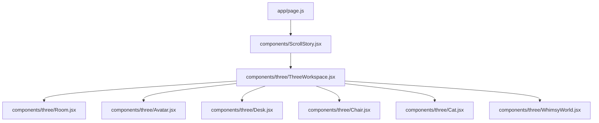
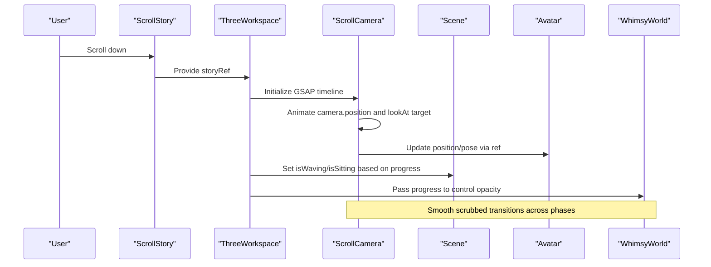
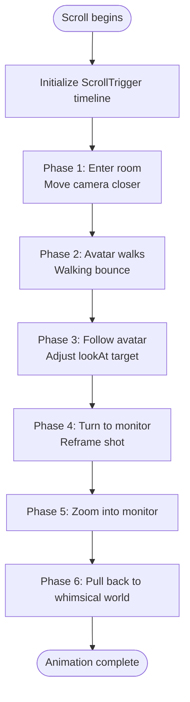
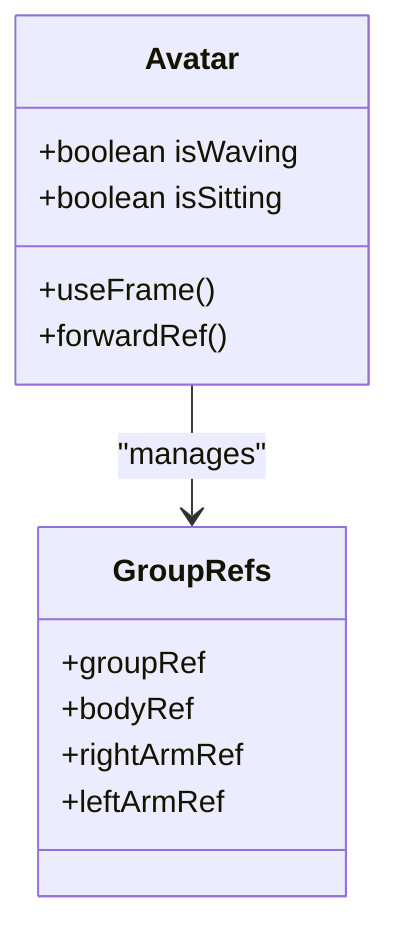
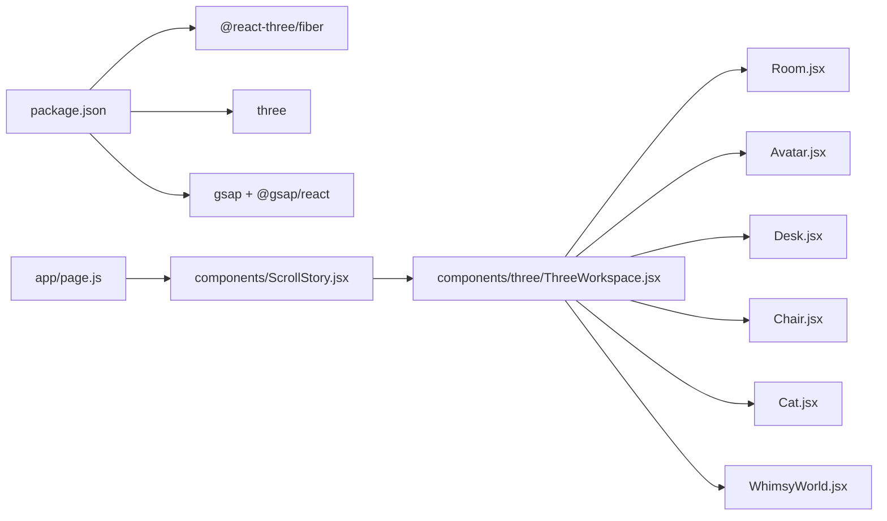

# 3D Scene System

<cite>
**Referenced Files in This Document**
- [ThreeWorkspace.jsx](file://components/three/ThreeWorkspace.jsx)
- [Avatar.jsx](file://components/three/Avatar.jsx)
- [Room.jsx](file://components/three/Room.jsx)
- [Desk.jsx](file://components/three/Desk.jsx)
- [Chair.jsx](file://components/three/Chair.jsx)
- [Cat.jsx](file://components/three/Cat.jsx)
- [WhimsyWorld.jsx](file://components/three/WhimsyWorld.jsx)
- [ScrollStory.jsx](file://components/ScrollStory.jsx)
- [page.js](file://app/page.js)
- [package.json](file://package.json)
</cite>

## Table of Contents
1. [Introduction](#introduction)
2. [Project Structure](#project-structure)
3. [Core Components](#core-components)
4. [Architecture Overview](#architecture-overview)
5. [Detailed Component Analysis](#detailed-component-analysis)
6. [Dependency Analysis](#dependency-analysis)
7. [Performance Considerations](#performance-considerations)
8. [Troubleshooting Guide](#troubleshooting-guide)
9. [Conclusion](#conclusion)
10. [Appendices](#appendices)

## Introduction
This document explains the 3D scene system built with Three.js and React Three Fiber (R3F). It focuses on how the ThreeWorkspace component initializes the scene, manages camera controls and lighting, and composes objects such as the Avatar, Room, Desk, Chair, Cat, and WhimsyWorld. It also covers scroll-driven animations using GSAP ScrollTrigger, performance optimizations, and guidance for extending the scene with new objects and environments.

## Project Structure
The 3D experience is composed of modular R3F components under a dedicated folder, orchestrated by a scroll-based container that binds user interactions to scene changes. The application entry renders a loading screen and then mounts the scroll story which includes the 3D canvas.

**Diagram sources**
- [page.js:1-60](file://app/page.js#L1-L60)
- [ScrollStory.jsx:1-70](file://components/ScrollStory.jsx#L1-L70)
- [ThreeWorkspace.jsx:1-186](file://components/three/ThreeWorkspace.jsx#L1-L186)

**Section sources**
- [page.js:1-60](file://app/page.js#L1-L60)
- [ScrollStory.jsx:1-70](file://components/ScrollStory.jsx#L1-L70)
- [ThreeWorkspace.jsx:1-186](file://components/three/ThreeWorkspace.jsx#L1-L186)

## Core Components
- ThreeWorkspace: Initializes the R3F Canvas, sets up lighting, composes scene objects, and drives scroll-based camera animation and object state transitions via GSAP ScrollTrigger.
- Avatar: A blocky character with animated arms and breathing; supports waving and sitting states.
- Room: Environment primitives forming floor, walls, baseboards, window frame, shelf, and plant.
- Desk: Desk surface, legs, monitor, keyboard, books, mug with steam, and desk plant.
- Chair: Office chair with backrest, seat, pole, base, crochet blanket, and heart detail.
- Cat: Small animated cat with tail wag and head turn.
- WhimsyWorld: Dream-like floating platforms, orbs, and voxel trees that fade in during the final scroll phase.

**Section sources**
- [ThreeWorkspace.jsx:104-186](file://components/three/ThreeWorkspace.jsx#L104-L186)
- [Avatar.jsx:1-164](file://components/three/Avatar.jsx#L1-L164)
- [Room.jsx:1-64](file://components/three/Room.jsx#L1-L64)
- [Desk.jsx:1-129](file://components/three/Desk.jsx#L1-L129)
- [Chair.jsx:1-47](file://components/three/Chair.jsx#L1-L47)
- [Cat.jsx:1-59](file://components/three/Cat.jsx#L1-L59)
- [WhimsyWorld.jsx:1-76](file://components/three/WhimsyWorld.jsx#L1-L76)

## Architecture Overview
The scene uses a layered architecture:
- Presentation layer: R3F Canvas and scene graph (Room, Desk, Chair, Avatar, Cat, WhimsyWorld).
- Animation layer: GSAP ScrollTrigger drives camera movement, avatar pose changes, and whimsical world visibility.
- Integration layer: ScrollStory provides the scroll container and passes refs to coordinate UI and 3D.

**Diagram sources**
- [ScrollStory.jsx:13-66](file://components/ScrollStory.jsx#L13-L66)
- [ThreeWorkspace.jsx:23-98](file://components/three/ThreeWorkspace.jsx#L23-L98)
- [ThreeWorkspace.jsx:104-162](file://components/three/ThreeWorkspace.jsx#L104-L162)
- [WhimsyWorld.jsx:34-76](file://components/three/WhimsyWorld.jsx#L34-L76)

## Detailed Component Analysis

### ThreeWorkspace: Scene Initialization, Controls, Lighting, Object Management
- Canvas setup: Configures shadows, pixel density, and camera parameters (position, field of view, near/far planes).
- Lighting: Ambient light, directional light with shadow mapping, and two point lights for warm accents.
- Composition: Renders Room, Avatar, Desk, Chair, Cat, and WhimsyWorld.
- Scroll-driven animation:
  - A custom ScrollCamera component uses useFrame to continuously lookAt a target and GSAP ScrollTrigger to animate camera position and target through multiple phases: entering the room, avatar walking toward the desk, following the avatar, turning toward the monitor, zooming into the screen, and pulling back into the whimsical world.
  - The Scene component tracks scroll progress to toggle avatar states (waving/sitting) and pass progress to WhimsyWorld for fade-in.

**Diagram sources**
- [ThreeWorkspace.jsx:23-98](file://components/three/ThreeWorkspace.jsx#L23-L98)

**Section sources**
- [ThreeWorkspace.jsx:168-186](file://components/three/ThreeWorkspace.jsx#L168-L186)
- [ThreeWorkspace.jsx:104-162](file://components/three/ThreeWorkspace.jsx#L104-L162)
- [ThreeWorkspace.jsx:23-98](file://components/three/ThreeWorkspace.jsx#L23-L98)

### Avatar: Animation States and Character Interactions
- State machine:
  - Waving: Right arm rotates side-to-side with gentle sine wave motion while standing.
  - Sitting: Arms rest forward; leg groups rotate and reposition to simulate sitting posture.
  - Idle: Subtle arm resting positions and gentle body breathing animation.
- Imperative handle: Exposes group reference to allow external components (e.g., ScrollCamera) to update position during scroll.
- Visual details: Blocky character with hair, eyes, smile, shirt, jeans, shoes, and a small heart accent.

**Diagram sources**
- [Avatar.jsx:64-164](file://components/three/Avatar.jsx#L64-L164)

**Section sources**
- [Avatar.jsx:64-164](file://components/three/Avatar.jsx#L64-L164)

### Room: Environment Creation
- Floor: Large plane with receiveShadow enabled.
- Rug: Circular geometry under the desk area.
- Walls: Back and left wall planes with soft colors.
- Baseboards: Thin boxes along edges.
- Window frame: Layered boxes simulating glass and frame.
- Shelf and plant: Decorative elements on the left wall.

**Section sources**
- [Room.jsx:1-64](file://components/three/Room.jsx#L1-L64)

### Desk: Furniture Model
- Desk surface and legs: Box geometries with warm tones.
- Monitor: Bezel, emissive screen, stand neck and base.
- Keyboard: Grid of tiny keys.
- Books: Stacked colored boxes with spine labels.
- Mug with steam: Animated steam particles using useFrame.
- Desk plant: Pot and leaves.

**Section sources**
- [Desk.jsx:1-129](file://components/three/Desk.jsx#L1-L129)

### Chair: Furniture Model
- Backrest, seat, pole, and base: Simple box primitives.
- Crochet blanket: Patterned squares draped over the back.
- Heart detail: Small voxel heart on the seat.

**Section sources**
- [Chair.jsx:1-47](file://components/three/Chair.jsx#L1-L47)

### Cat: Decorative Element
- Body parts: Head, ears, eyes, nose, legs, and tail.
- Animations: Tail wagging and subtle head rotation driven by useFrame.

**Section sources**
- [Cat.jsx:1-59](file://components/three/Cat.jsx#L1-L59)

### WhimsyWorld: Visual Effects
- Sunset backdrop: Large plane behind the scene.
- Floating platforms: Colored boxes at various positions.
- Floating orbs: Animated cubes with transparency and rotation.
- Voxel trees/plants: Simple tree structures on platforms.
- Visibility: Controlled by scroll progress to fade in during the final phase.

**Section sources**
- [WhimsyWorld.jsx:1-76](file://components/three/WhimsyWorld.jsx#L1-L76)

## Dependency Analysis
- External libraries:
  - @react-three/fiber and three: 3D rendering and scene graph.
  - gsap and @gsap/react: Scroll-driven animations and timelines.
  - framer-motion and lenis: Additional UI animations and smooth scrolling (not directly used in 3D components but present in dependencies).
- Internal dependencies:
  - ScrollStory orchestrates mounting of ThreeWorkspace and passes a shared storyRef.
  - ThreeWorkspace composes all scene components and coordinates their behavior via props and refs.

**Diagram sources**
- [package.json:11-22](file://package.json#L11-L22)
- [page.js:1-60](file://app/page.js#L1-L60)
- [ScrollStory.jsx:1-70](file://components/ScrollStory.jsx#L1-L70)
- [ThreeWorkspace.jsx:1-186](file://components/three/ThreeWorkspace.jsx#L1-L186)

**Section sources**
- [package.json:11-22](file://package.json#L11-L22)
- [ScrollStory.jsx:1-70](file://components/ScrollStory.jsx#L1-L70)
- [ThreeWorkspace.jsx:1-186](file://components/three/ThreeWorkspace.jsx#L1-L186)

## Performance Considerations
- Rendering quality:
  - dpr set to a low range to balance clarity and performance on high-DPI displays.
  - Shadow maps configured on the directional light; consider reducing resolution or disabling shadows on mobile if needed.
- Geometry reuse:
  - Reuse simple Box helpers to minimize material and geometry overhead where possible.
  - Avoid excessive per-frame allocations inside useFrame; prefer refs and minimal math.
- Animation efficiency:
  - GSAP ScrollTrigger with scrub provides smooth, GPU-friendly transitions without heavy per-frame logic.
  - Limit number of animated meshes; keep particle counts low (e.g., steam uses a single mesh).
- Visibility culling:
  - WhimsyWorld toggles visibility based on progress to avoid unnecessary rendering when off-screen or not needed.
- Material choices:
  - Use MeshStandardMaterial sparingly; prefer MeshBasicMaterial for non-light-dependent elements (as seen in WhimsyWorld backdrop).
- Memory management:
  - Ensure no lingering event listeners or timers outside R3F lifecycle; rely on React cleanup patterns.

[No sources needed since this section provides general guidance]

## Troubleshooting Guide
- Camera jitter or snapping:
  - Verify that the ScrollTrigger trigger and scrub settings match the container height and that the storyRef points to the correct element.
- Avatar not moving:
  - Confirm that the avatar ref is passed correctly and that the ScrollCamera updates its position within the timeline.
- Shadows missing:
  - Ensure the Canvas has shadows enabled and that the directionalLight castShadow is true; check shadow map size and camera bounds.
- WhimsyWorld not appearing:
  - Check the progress threshold used to compute opacity; ensure the scroll reaches the intended end region.
- Steam not visible:
  - Confirm that the steam mesh material is transparent and that useFrame updates are running; verify that the mug group is rendered.

**Section sources**
- [ThreeWorkspace.jsx:23-98](file://components/three/ThreeWorkspace.jsx#L23-L98)
- [ThreeWorkspace.jsx:104-162](file://components/three/ThreeWorkspace.jsx#L104-L162)
- [Desk.jsx:77-94](file://components/three/Desk.jsx#L77-L94)
- [WhimsyWorld.jsx:34-76](file://components/three/WhimsyWorld.jsx#L34-L76)

## Conclusion
The 3D scene system combines a well-structured R3F component hierarchy with GSAP-driven scroll choreography to create an engaging narrative experience. The ThreeWorkspace component acts as the central coordinator, managing lighting, camera motion, and object states. Modular furniture and characters make it easy to extend the environment, while thoughtful performance choices keep the experience smooth across devices.

[No sources needed since this section summarizes without analyzing specific files]

## Appendices

### Adding a New 3D Object
- Create a new component under components/three using simple primitives and MeshStandardMaterial.
- Add a useFrame hook only if you need per-frame animation; otherwise keep it static.
- Export the component and import it into ThreeWorkspace’s Scene to include it in the composition.
- Position and scale relative to the existing scene units; test visibility and shadows.

**Section sources**
- [ThreeWorkspace.jsx:104-162](file://components/three/ThreeWorkspace.jsx#L104-L162)
- [Desk.jsx:1-129](file://components/three/Desk.jsx#L1-L129)

### Customizing the Scene Environment
- Adjust lighting intensities and colors in the Scene to change mood.
- Modify Room primitives to add more walls, decorations, or textures.
- Extend WhimsyWorld with additional floating platforms or orbs; adjust progress thresholds to control timing.
- Tweak ScrollCamera timeline phases to alter camera paths and pacing.

**Section sources**
- [ThreeWorkspace.jsx:126-162](file://components/three/ThreeWorkspace.jsx#L126-L162)
- [Room.jsx:1-64](file://components/three/Room.jsx#L1-L64)
- [WhimsyWorld.jsx:34-76](file://components/three/WhimsyWorld.jsx#L34-L76)
- [ThreeWorkspace.jsx:23-98](file://components/three/ThreeWorkspace.jsx#L23-L98)