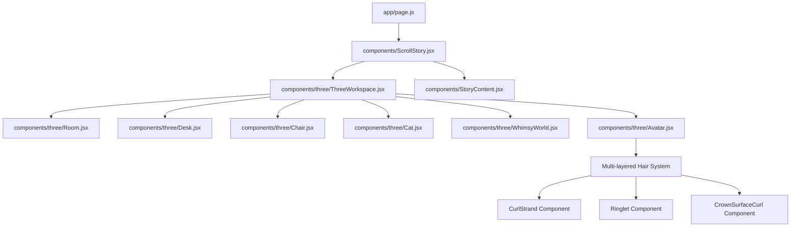
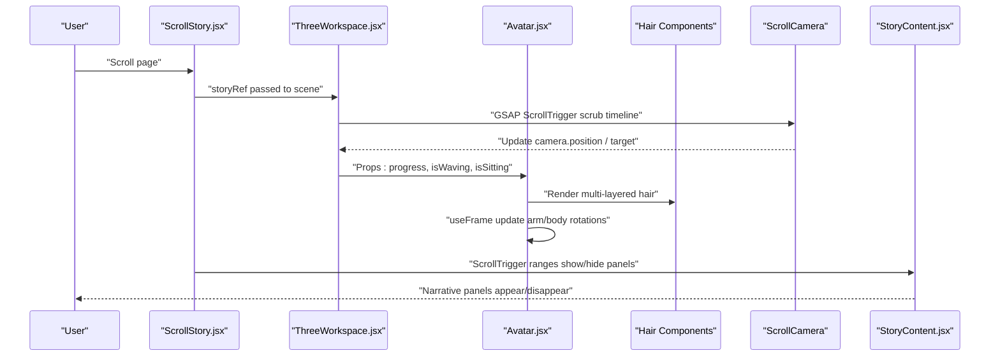
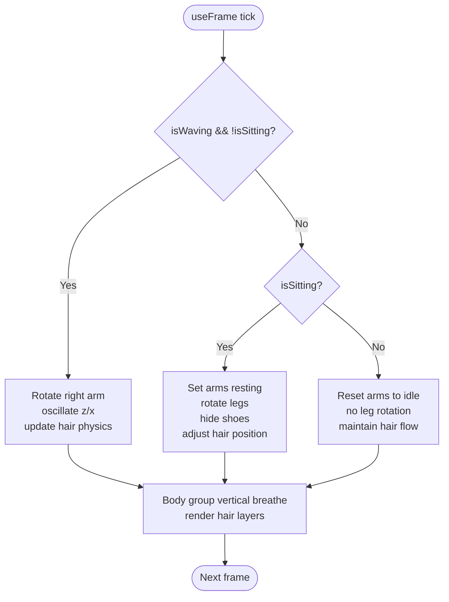
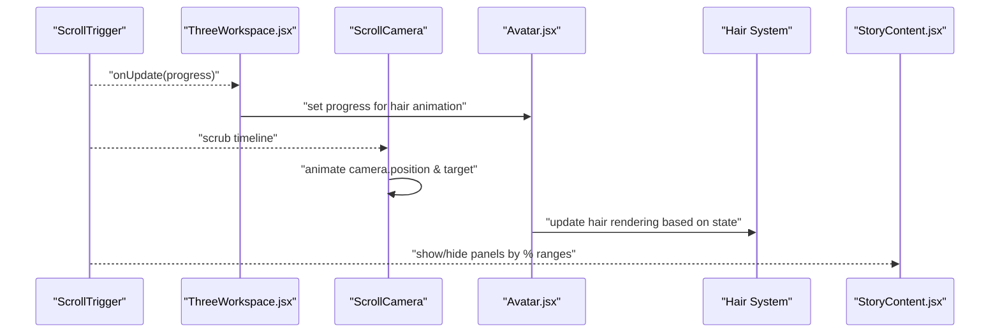
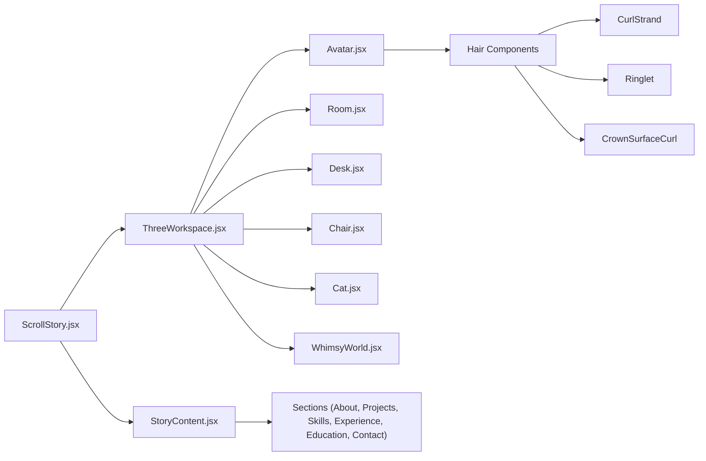

# Character System

<cite>
**Referenced Files in This Document**
- [Avatar.jsx](file://components/three/Avatar.jsx)
- [ThreeWorkspace.jsx](file://components/three/ThreeWorkspace.jsx)
- [ScrollStory.jsx](file://components/ScrollStory.jsx)
- [StoryContent.jsx](file://components/StoryContent.jsx)
- [Desk.jsx](file://components/three/Desk.jsx)
- [Chair.jsx](file://components/three/Chair.jsx)
- [Room.jsx](file://components/three/Room.jsx)
- [Cat.jsx](file://components/three/Cat.jsx)
- [WhimsyWorld.jsx](file://components/three/WhimsyWorld.jsx)
- [page.js](file://app/page.js)
</cite>

## Update Summary
**Changes Made**
- Updated Avatar component documentation to reflect sophisticated multi-layered hair system with CurlStrand, Ringlet, and CrownSurfaceCurl components
- Enhanced visual system documentation covering traditional South Asian attire colors and improved materials/lighting
- Added documentation for new decorative elements like TinyFlower components
- Updated performance optimizations section with useMemo hooks and Curve components usage
- Revised appearance customization section with new color palette and material properties

## Table of Contents
1. Introduction
2. Project Structure
3. Core Components
4. Architecture Overview
5. Detailed Component Analysis
6. Dependency Analysis
7. Performance Considerations
8. Troubleshooting Guide
9. Conclusion
10. Appendices

## Introduction
This document explains the Avatar character system that renders a 3D character with an enhanced multi-layered hair system and coordinates its animations with scroll-driven storytelling. The avatar transitions between waving, standing idle, and sitting poses as the user scrolls through the portfolio journey. It features sophisticated hair rendering with CurlStrand, Ringlet, and CrownSurfaceCurl components, traditional South Asian attire with enhanced materials, and improved lighting effects. The system integrates with a scene controller that moves the camera and synchronizes UI panels to create an immersive narrative experience.

## Project Structure
The character system is composed of:
- A 3D scene container that sets up lighting, environment, and the enhanced avatar
- An avatar component with sophisticated hair system that manages pose states and per-frame animation updates
- A scroll story layer that binds GSAP ScrollTrigger to progress through phases
- Supporting scene objects (desk, chair, room, cat, whimsical world) that frame the narrative

**Diagram sources**
- [page.js:17-58](file://app/page.js#L17-L58)
- [ScrollStory.jsx:36-66](file://components/ScrollStory.jsx#L36-L66)
- [ThreeWorkspace.jsx:168-185](file://components/three/ThreeWorkspace.jsx#L168-L185)

**Section sources**
- [page.js:17-58](file://app/page.js#L17-L58)
- [ScrollStory.jsx:36-66](file://components/ScrollStory.jsx#L36-L66)
- [ThreeWorkspace.jsx:168-185](file://components/three/ThreeWorkspace.jsx#L168-L185)

## Core Components
- **Enhanced Avatar**: Builds the character from primitives with sophisticated multi-layered hair system, exposes imperative ref, and animates arms and body based on props and time. Features traditional South Asian attire with kurta, dupatta, and enhanced facial features.
- **ThreeWorkspace**: Hosts the Canvas, enhanced lighting setup with multiple point lights, scene objects, and orchestrates scroll-driven state changes for the avatar and camera.
- **ScrollStory**: Provides the scrollable section and overlays intro text and content panels.
- **StoryContent**: Renders narrative panels synchronized to scroll progress.
- **Scene helpers**: Room, Desk, Chair, Cat, WhimsyWorld provide context and visual storytelling elements.

Key responsibilities:
- Avatar handles pose logic (waving, sitting, idle), breathing, arm rotations each frame, and manages complex hair rendering with multiple curl types.
- ThreeWorkspace tracks scroll progress to toggle avatar states and drives camera motion via GSAP timelines with enhanced lighting.
- ScrollStory and StoryContent coordinate UI overlays and panel transitions.

**Section sources**
- [Avatar.jsx:2901-3562](file://components/three/Avatar.jsx#L2901-L3562)
- [ThreeWorkspace.jsx:23-98](file://components/three/ThreeWorkspace.jsx#L23-L98)
- [ThreeWorkspace.jsx:104-162](file://components/three/ThreeWorkspace.jsx#L104-L162)
- [ScrollStory.jsx:13-66](file://components/ScrollStory.jsx#L13-L66)
- [StoryContent.jsx:17-89](file://components/StoryContent.jsx#L17-L89)

## Architecture Overview
The system uses a scroll-driven timeline to transition through narrative phases. Each phase adjusts the camera position and target look-at point while also updating avatar state (waving/sitting). UI panels fade in/out based on scroll percentage ranges. The enhanced avatar includes sophisticated hair rendering that responds to scroll-based animations.

**Diagram sources**
- [ThreeWorkspace.jsx:23-98](file://components/three/ThreeWorkspace.jsx#L23-L98)
- [ThreeWorkspace.jsx:104-162](file://components/three/ThreeWorkspace.jsx#L104-L162)
- [Avatar.jsx:2950-3043](file://components/three/Avatar.jsx#L2950-L3043)
- [StoryContent.jsx:30-75](file://components/StoryContent.jsx#L30-L75)

## Detailed Component Analysis

### Enhanced Avatar State Machine and Animation Loop
The avatar supports three primary states with sophisticated hair rendering:
- Waving: Right arm raises and oscillates; left arm remains neutral; hair strands respond to movement
- Sitting: Both arms rest forward; legs bend; shoes hidden; body shifts slightly; hair settles naturally
- Idle: Standing pose with subtle breathing motion applied to the body group; hair maintains natural flow

Per-frame behavior:
- Arms rotate based on current state flags with smooth interpolation
- Body group translates vertically with a gentle sine wave for breathing
- Leg rotation and positioning change when sitting
- Multi-layered hair system renders CurlStrand, Ringlet, and CrownSurfaceCurl components with optimized geometry

**Diagram sources**
- [Avatar.jsx:2950-3043](file://components/three/Avatar.jsx#L2950-L3043)
- [Avatar.jsx:3049-3065](file://components/three/Avatar.jsx#L3049-L3065)

**Section sources**
- [Avatar.jsx:2901-3562](file://components/three/Avatar.jsx#L2901-L3562)

### Sophisticated Multi-Layered Hair System
The enhanced avatar features a comprehensive hair system with multiple component types:

**CurlStrand Component**: Creates long blocky curls with wave patterns and alternating tones for realistic hair texture
**Ringlet Component**: Generates coiled ringlets with root connections that seamlessly attach to the scalp cap
**CrownSurfaceCurl Component**: Places curls that follow the curved surface of the crown for natural hair growth appearance
**BackCrownRinglet Component**: Adds smaller coily curls that lie flat against the back of the scalp cap

The hair system includes:
- Realistic scalp cap with proper coverage
- Multiple density rows for full head coverage
- Front face-framing curls and side main curls
- Back curls and neck gap fillers
- Optimized geometry using useMemo for performance

**Section sources**
- [Avatar.jsx:226-316](file://components/three/Avatar.jsx#L226-L316)
- [Avatar.jsx:322-586](file://components/three/Avatar.jsx#L322-L586)
- [Avatar.jsx:599-786](file://components/three/Avatar.jsx#L599-L786)
- [Avatar.jsx:796-1006](file://components/three/Avatar.jsx#L796-L1006)
- [Avatar.jsx:1012-2767](file://components/three/Avatar.jsx#L1012-L2767)

### Traditional South Asian Attire and Visual System
The avatar wears traditional South Asian clothing with enhanced visual quality:

**Kurta**: Long blue tunic with center embroidery featuring pink and cream decorative blocks
**Dupatta**: Light blue scarf with shadow variations for depth
**Pants**: Blue trousers with dark accents at the cuffs
**Shoes**: White footwear with blue accent details

**Enhanced Materials and Lighting**:
- Improved meshStandardMaterial properties with optimized roughness values
- Multiple point lights creating warm, welcoming atmosphere
- Directional light with high-quality shadows (2048x2048 map size)
- Ambient lighting for base illumination

**Decorative Elements**:
- TinyFlower components scattered across the kurta for floral embroidery effect
- Blue dangling earrings with metallic and colored components
- Enhanced facial features with blush, closed happy eyes, and detailed mouth

**Section sources**
- [Avatar.jsx:18-50](file://components/three/Avatar.jsx#L18-L50)
- [Avatar.jsx:156-220](file://components/three/Avatar.jsx#L156-L220)
- [Avatar.jsx:2772-2895](file://components/three/Avatar.jsx#L2772-L2895)
- [Avatar.jsx:3245-3427](file://components/three/Avatar.jsx#L3245-L3427)
- [ThreeWorkspace.jsx:131-147](file://components/three/ThreeWorkspace.jsx#L131-L147)

### Scroll-Driven Narrative Phases
The scene controller defines a multi-phase timeline tied to scroll progress:
- Phase 1: Enter the room (camera approaches)
- Phase 2: Avatar walks toward desk (position changes with bounce)
- Phase 3: Camera follows avatar (lookAt target moves)
- Phase 4: Camera turns toward monitor
- Phase 5: Zoom into monitor
- Phase 6: Pull back into whimsical world

Avatar state mapping:
- Early scroll (low progress): isWaving = true with active hair animation
- Mid-to-late scroll (higher progress): isSitting = true with settled hair position

UI panels are shown/hidden at specific scroll ranges to tell the story.

**Diagram sources**
- [ThreeWorkspace.jsx:31-95](file://components/three/ThreeWorkspace.jsx#L31-L95)
- [ThreeWorkspace.jsx:110-124](file://components/three/ThreeWorkspace.jsx#L110-L124)
- [StoryContent.jsx:30-75](file://components/StoryContent.jsx#L30-L75)

**Section sources**
- [ThreeWorkspace.jsx:23-98](file://components/three/ThreeWorkspace.jsx#L23-L98)
- [ThreeWorkspace.jsx:104-162](file://components/three/ThreeWorkspace.jsx#L104-L162)
- [StoryContent.jsx:17-89](file://components/StoryContent.jsx#L17-L89)

### Scene Composition and Environment
- Room: Floor, walls, baseboards, window frame, shelf, and plant establish the workspace
- Desk: Monitor, keyboard, books, mug with animated steam, and a small plant
- Chair: Office-style chair with decorative blanket and heart detail
- Cat: Animated tail and head movement for ambient life
- WhimsyWorld: Floating platforms, orbs, and voxel trees that fade in during later scroll phases

These components do not directly control the avatar but provide spatial context and narrative framing with enhanced lighting integration.

**Section sources**
- [Room.jsx:12-63](file://components/three/Room.jsx#L12-L63)
- [Desk.jsx:110-128](file://components/three/Desk.jsx#L110-L128)
- [Chair.jsx:12-46](file://components/three/Chair.jsx#L12-L46)
- [Cat.jsx:15-58](file://components/three/Cat.jsx#L15-L58)
- [WhimsyWorld.jsx:34-75](file://components/three/WhimsyWorld.jsx#L34-L75)

## Dependency Analysis
- ThreeWorkspace depends on Avatar, Room, Desk, Chair, Cat, and WhimsyWorld to compose the scene with enhanced lighting
- ScrollStory composes ThreeWorkspace and StoryContent, passing a shared storyRef to synchronize animations and panels
- Avatar depends on React Fiber's useFrame for per-frame updates and exposes an imperative handle for external manipulation
- Enhanced hair system components (CurlStrand, Ringlet, CrownSurfaceCurl) depend on optimized geometry creation with useMemo
- StoryContent depends on individual section components and uses GSAP ScrollTrigger to animate panels based on scroll percentages

**Diagram sources**
- [ScrollStory.jsx:36-66](file://components/ScrollStory.jsx#L36-L66)
- [ThreeWorkspace.jsx:104-162](file://components/three/ThreeWorkspace.jsx#L104-L162)
- [StoryContent.jsx:17-89](file://components/StoryContent.jsx#L17-L89)

**Section sources**
- [ScrollStory.jsx:36-66](file://components/ScrollStory.jsx#L36-L66)
- [ThreeWorkspace.jsx:104-162](file://components/three/ThreeWorkspace.jsx#L104-L162)
- [StoryContent.jsx:17-89](file://components/StoryContent.jsx#L17-L89)

## Performance Considerations
- **Per-frame updates**: Avatar and ambient animations run every frame; keep math simple and avoid heavy allocations inside useFrame
- **Optimized Geometry**: Extensive use of useMemo hooks for hair component geometries to prevent recalculation on re-renders
- **Curve Components**: Smooth facial features and hair curves using CatmullRomCurve3 with optimized segment counts
- **Shadow quality**: Directional light shadows are enabled with large map size (2048x2048); consider reducing resolution if performance drops on lower-end devices
- **DPR scaling**: Canvas DPR is capped to reduce GPU load on high-DPI screens
- **Visibility culling**: WhimsyWorld visibility toggles based on progress to avoid rendering unnecessary geometry early in the scroll
- **Material optimization**: Consistent roughness values across materials for consistent lighting performance

## Troubleshooting Guide
Common issues and resolutions:
- **Avatar not animating**: Ensure refs are available before useFrame runs; verify that rightArmRef exists and that props (progress) are being updated by ThreeWorkspace
- **Jittery or abrupt pose transitions**: Adjust thresholds for waveAmount and sitAmount based on scroll progress to smooth state changes
- **Camera not following timeline**: Confirm ScrollTrigger is registered and that storyRef.current is valid when creating triggers
- **Panels not appearing**: Verify panel start/end percentages align with intended scroll positions and that storyRef is correctly scoped
- **Hair rendering issues**: Check that useMemo dependencies are correct for geometry generation; ensure proper component hierarchy for hair layers
- **Performance degradation**: Monitor useMemo cache effectiveness; consider reducing geometry complexity or segment counts for hair components

**Section sources**
- [Avatar.jsx:2950-3043](file://components/three/Avatar.jsx#L2950-L3043)
- [ThreeWorkspace.jsx:31-95](file://components/three/ThreeWorkspace.jsx#L31-L95)
- [ThreeWorkspace.jsx:110-124](file://components/three/ThreeWorkspace.jsx#L110-L124)
- [StoryContent.jsx:30-75](file://components/StoryContent.jsx#L30-L75)

## Conclusion
The enhanced Avatar character system combines a sophisticated multi-layered hair system with traditional South Asian attire and scroll-driven state management to deliver an engaging narrative. The addition of CurlStrand, Ringlet, and CrownSurfaceCurl components creates realistic hair rendering, while optimized performance techniques like useMemo hooks ensure smooth operation. By linking GSAP timelines to both camera movement and avatar poses, the system creates a cohesive journey from entering the room to exploring a whimsical world. Extending the system involves adding new animation states, adjusting hair parameters, and integrating additional scene elements or UI panels.

## Appendices

### How to Add a New Animation State
Steps:
- Define new boolean props or extend existing state in the scene controller
- In the avatar's per-frame loop, add a branch to compute rotations for the new pose
- Map scroll progress to enable/disable the new state in the scene controller
- Optionally adjust leg/body transforms if the pose requires repositioning
- Consider adding corresponding hair animations for natural movement

Reference paths:
- [Avatar.jsx:2950-3043](file://components/three/Avatar.jsx#L2950-L3043)
- [ThreeWorkspace.jsx:110-124](file://components/three/ThreeWorkspace.jsx#L110-L124)

### How to Modify Character Behavior
Examples:
- Change wave intensity or speed by adjusting the amplitude and frequency used in the arm rotation calculations
- Modify idle breathing by changing the sine wave parameters applied to the body group
- Alter sitting pose by tweaking leg rotation and arm resting angles
- Adjust hair physics by modifying wave patterns and curl parameters in hair components

Reference paths:
- [Avatar.jsx:2950-3043](file://components/three/Avatar.jsx#L2950-L3043)
- [Avatar.jsx:3049-3065](file://components/three/Avatar.jsx#L3049-L3065)

### How to Customize Appearance or Movement Patterns
**Appearance Customization**:
- Update color constants to change skin, hair, kurta, pants, dupatta, shoes, and accessories
- Adjust geometry sizes or positions to alter proportions
- Modify material properties like roughness and color values
- Add or remove decorative elements like TinyFlower components

**Movement Pattern Customization**:
- Modify per-frame rotation values to change how limbs move
- Introduce new easing or timing functions in the scene controller's GSAP timeline for smoother transitions
- Adjust hair animation parameters for different curl styles and movement patterns
- Customize lighting setup for different moods and atmospheres

**Hair System Customization**:
- Modify Ringlet parameters (loops, length, radius, thickness) for different hair textures
- Adjust CurlStrand wave patterns and strand lengths
- Customize CrownSurfaceCurl placement and density
- Add new hair component types for specialized styling needs

Reference paths:
- [Avatar.jsx:18-50](file://components/three/Avatar.jsx#L18-L50)
- [ThreeWorkspace.jsx:31-95](file://components/three/ThreeWorkspace.jsx#L31-L95)
- [Avatar.jsx:322-586](file://components/three/Avatar.jsx#L322-L586)
- [ThreeWorkspace.jsx:131-147](file://components/three/ThreeWorkspace.jsx#L131-L147)