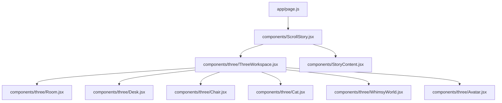
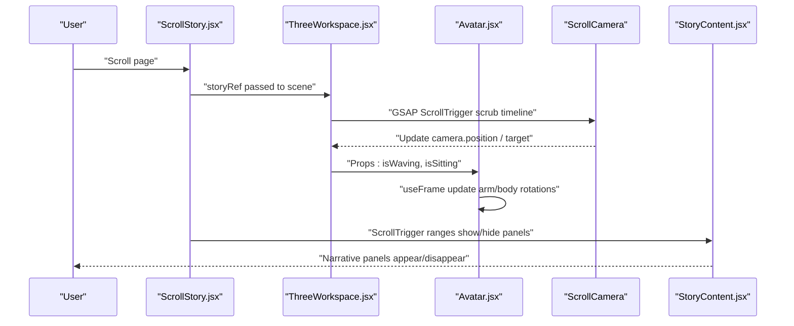
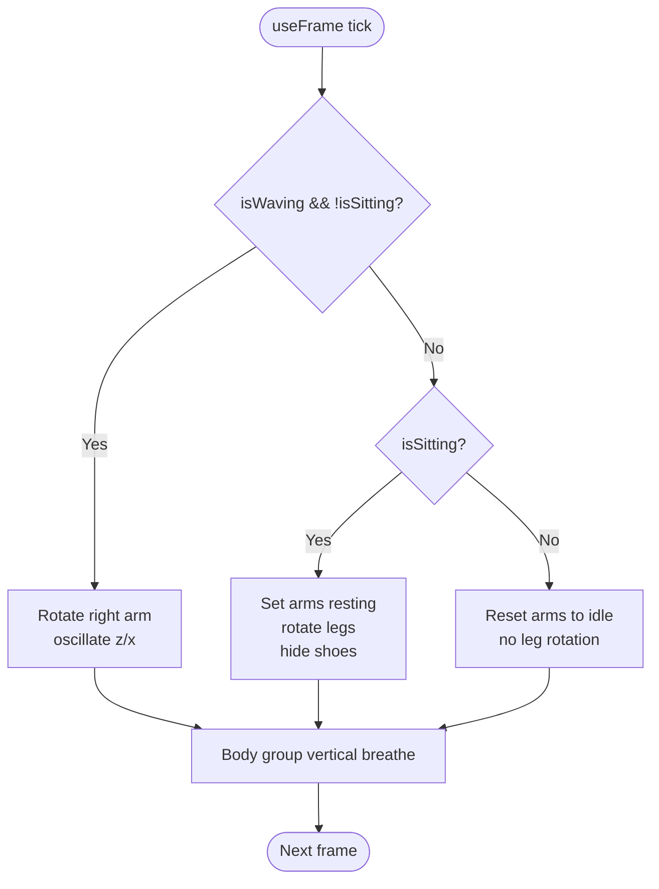
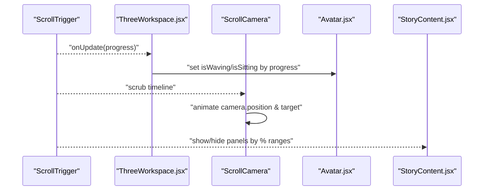
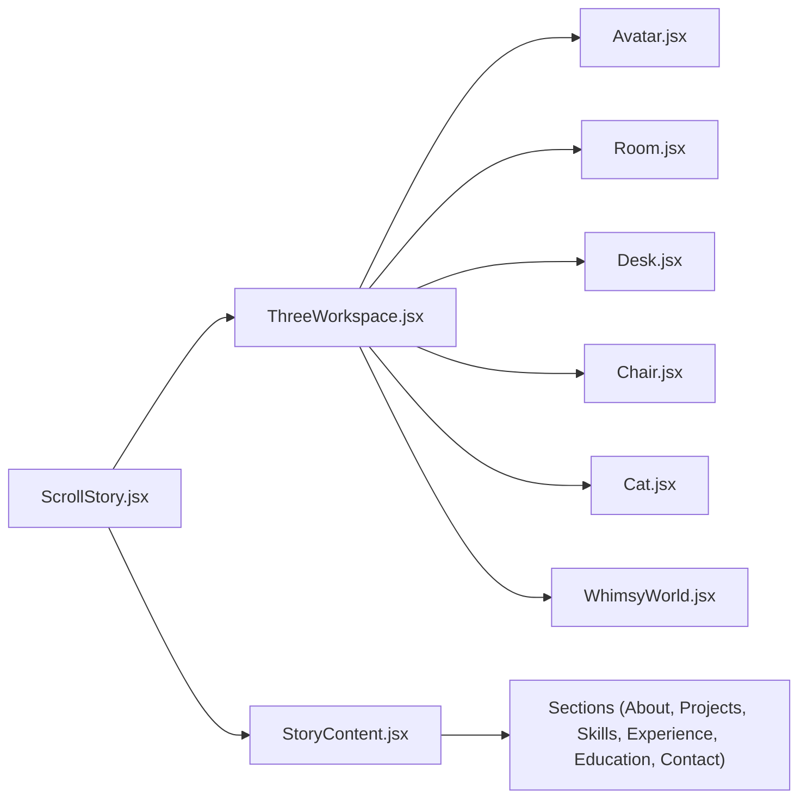

# Character System

<cite>
**Referenced Files in This Document**
- [Avatar.jsx](file://components/three/Avatar.jsx)
- [ThreeWorkspace.jsx](file://components/three/ThreeWorkspace.jsx)
- [ScrollStory.jsx](file://components/ScrollStory.jsx)
- [StoryContent.jsx](file://components/StoryContent.jsx)
- [Desk.jsx](file://components/three/Desk.jsx)
- [Chair.jsx](file://components/three/Chair.jsx)
- [Room.jsx](file://components/three/Room.jsx)
- [Cat.jsx](file://components/three/Cat.jsx)
- [WhimsyWorld.jsx](file://components/three/WhimsyWorld.jsx)
- [page.js](file://app/page.js)
</cite>

## Table of Contents
1. Introduction
2. Project Structure
3. Core Components
4. Architecture Overview
5. Detailed Component Analysis
6. Dependency Analysis
7. Performance Considerations
8. Troubleshooting Guide
9. Conclusion
10. Appendices

## Introduction
This document explains the Avatar character system that renders a 3D character and coordinates its animations with scroll-driven storytelling. The avatar transitions between waving, standing idle, and sitting poses as the user scrolls through the portfolio journey. It integrates with a scene controller that moves the camera and synchronizes UI panels to create an immersive narrative experience.

## Project Structure
The character system is composed of:
- A 3D scene container that sets up lighting, environment, and the avatar
- An avatar component that manages pose states and per-frame animation updates
- A scroll story layer that binds GSAP ScrollTrigger to progress through phases
- Supporting scene objects (desk, chair, room, cat, whimsical world) that frame the narrative

**Diagram sources**
- [page.js:17-58](file://app/page.js#L17-L58)
- [ScrollStory.jsx:36-66](file://components/ScrollStory.jsx#L36-L66)
- [ThreeWorkspace.jsx:168-185](file://components/three/ThreeWorkspace.jsx#L168-L185)

**Section sources**
- [page.js:17-58](file://app/page.js#L17-L58)
- [ScrollStory.jsx:36-66](file://components/ScrollStory.jsx#L36-L66)
- [ThreeWorkspace.jsx:168-185](file://components/three/ThreeWorkspace.jsx#L168-L185)

## Core Components
- Avatar: Builds the character from primitives, exposes imperative ref, and animates arms and body based on props and time.
- ThreeWorkspace: Hosts the Canvas, lights, scene objects, and orchestrates scroll-driven state changes for the avatar and camera.
- ScrollStory: Provides the scrollable section and overlays intro text and content panels.
- StoryContent: Renders narrative panels synchronized to scroll progress.
- Scene helpers: Room, Desk, Chair, Cat, WhimsyWorld provide context and visual storytelling elements.

Key responsibilities:
- Avatar handles pose logic (waving, sitting, idle), breathing, and arm rotations each frame.
- ThreeWorkspace tracks scroll progress to toggle avatar states and drives camera motion via GSAP timelines.
- ScrollStory and StoryContent coordinate UI overlays and panel transitions.

**Section sources**
- [Avatar.jsx:64-163](file://components/three/Avatar.jsx#L64-L163)
- [ThreeWorkspace.jsx:23-98](file://components/three/ThreeWorkspace.jsx#L23-L98)
- [ThreeWorkspace.jsx:104-162](file://components/three/ThreeWorkspace.jsx#L104-L162)
- [ScrollStory.jsx:13-66](file://components/ScrollStory.jsx#L13-L66)
- [StoryContent.jsx:17-89](file://components/StoryContent.jsx#L17-L89)

## Architecture Overview
The system uses a scroll-driven timeline to transition through narrative phases. Each phase adjusts the camera position and target look-at point while also updating avatar state (waving/sitting). UI panels fade in/out based on scroll percentage ranges.

**Diagram sources**
- [ThreeWorkspace.jsx:23-98](file://components/three/ThreeWorkspace.jsx#L23-L98)
- [ThreeWorkspace.jsx:104-162](file://components/three/ThreeWorkspace.jsx#L104-L162)
- [Avatar.jsx:76-106](file://components/three/Avatar.jsx#L76-L106)
- [StoryContent.jsx:30-75](file://components/StoryContent.jsx#L30-L75)

## Detailed Component Analysis

### Avatar State Machine and Animation Loop
The avatar supports three primary states:
- Waving: Right arm raises and oscillates; left arm remains neutral.
- Sitting: Both arms rest forward; legs bend; shoes hidden; body shifts slightly.
- Idle: Standing pose with subtle breathing motion applied to the body group.

Per-frame behavior:
- Arms rotate based on current state flags.
- Body group translates vertically with a gentle sine wave for breathing.
- Leg rotation and positioning change when sitting.

**Diagram sources**
- [Avatar.jsx:76-106](file://components/three/Avatar.jsx#L76-L106)
- [Avatar.jsx:108-118](file://components/three/Avatar.jsx#L108-L118)

**Section sources**
- [Avatar.jsx:64-163](file://components/three/Avatar.jsx#L64-L163)

### Scroll-Driven Narrative Phases
The scene controller defines a multi-phase timeline tied to scroll progress:
- Phase 1: Enter the room (camera approaches)
- Phase 2: Avatar walks toward desk (position changes with bounce)
- Phase 3: Camera follows avatar (lookAt target moves)
- Phase 4: Camera turns toward monitor
- Phase 5: Zoom into monitor
- Phase 6: Pull back into whimsical world

Avatar state mapping:
- Early scroll (low progress): isWaving = true
- Mid-to-late scroll (higher progress): isSitting = true

UI panels are shown/hidden at specific scroll ranges to tell the story.

**Diagram sources**
- [ThreeWorkspace.jsx:31-95](file://components/three/ThreeWorkspace.jsx#L31-L95)
- [ThreeWorkspace.jsx:110-124](file://components/three/ThreeWorkspace.jsx#L110-L124)
- [StoryContent.jsx:30-75](file://components/StoryContent.jsx#L30-L75)

**Section sources**
- [ThreeWorkspace.jsx:23-98](file://components/three/ThreeWorkspace.jsx#L23-L98)
- [ThreeWorkspace.jsx:104-162](file://components/three/ThreeWorkspace.jsx#L104-L162)
- [StoryContent.jsx:17-89](file://components/StoryContent.jsx#L17-L89)

### Scene Composition and Environment
- Room: Floor, walls, baseboards, window frame, shelf, and plant establish the workspace.
- Desk: Monitor, keyboard, books, mug with animated steam, and a small plant.
- Chair: Office-style chair with decorative blanket and heart detail.
- Cat: Animated tail and head movement for ambient life.
- WhimsyWorld: Floating platforms, orbs, and voxel trees that fade in during later scroll phases.

These components do not directly control the avatar but provide spatial context and narrative framing.

**Section sources**
- [Room.jsx:12-63](file://components/three/Room.jsx#L12-L63)
- [Desk.jsx:110-128](file://components/three/Desk.jsx#L110-L128)
- [Chair.jsx:12-46](file://components/three/Chair.jsx#L12-L46)
- [Cat.jsx:15-58](file://components/three/Cat.jsx#L15-L58)
- [WhimsyWorld.jsx:34-75](file://components/three/WhimsyWorld.jsx#L34-L75)

## Dependency Analysis
- ThreeWorkspace depends on Avatar, Room, Desk, Chair, Cat, and WhimsyWorld to compose the scene.
- ScrollStory composes ThreeWorkspace and StoryContent, passing a shared storyRef to synchronize animations and panels.
- Avatar depends on React Fiber’s useFrame for per-frame updates and exposes an imperative handle for external manipulation (e.g., camera or timeline targeting).
- StoryContent depends on individual section components and uses GSAP ScrollTrigger to animate panels based on scroll percentages.

**Diagram sources**
- [ScrollStory.jsx:36-66](file://components/ScrollStory.jsx#L36-L66)
- [ThreeWorkspace.jsx:104-162](file://components/three/ThreeWorkspace.jsx#L104-L162)
- [StoryContent.jsx:17-89](file://components/StoryContent.jsx#L17-L89)

**Section sources**
- [ScrollStory.jsx:36-66](file://components/ScrollStory.jsx#L36-L66)
- [ThreeWorkspace.jsx:104-162](file://components/three/ThreeWorkspace.jsx#L104-L162)
- [StoryContent.jsx:17-89](file://components/StoryContent.jsx#L17-L89)

## Performance Considerations
- Per-frame updates: Avatar and ambient animations run every frame; keep math simple and avoid heavy allocations inside useFrame.
- Shadow quality: Directional light shadows are enabled with a large map size; consider reducing resolution if performance drops on lower-end devices.
- DPR scaling: Canvas DPR is capped to reduce GPU load on high-DPI screens.
- Visibility culling: WhimsyWorld visibility toggles based on progress to avoid rendering unnecessary geometry early in the scroll.

[No sources needed since this section provides general guidance]

## Troubleshooting Guide
Common issues and resolutions:
- Avatar not animating: Ensure refs are available before useFrame runs; verify that rightArmRef exists and that props (isWaving, isSitting) are being updated by ThreeWorkspace.
- Jittery or abrupt pose transitions: Adjust thresholds for isWaving and isSitting based on scroll progress to smooth state changes.
- Camera not following timeline: Confirm ScrollTrigger is registered and that storyRef.current is valid when creating triggers.
- Panels not appearing: Verify panel start/end percentages align with intended scroll positions and that storyRef is correctly scoped.

**Section sources**
- [Avatar.jsx:76-106](file://components/three/Avatar.jsx#L76-L106)
- [ThreeWorkspace.jsx:31-95](file://components/three/ThreeWorkspace.jsx#L31-L95)
- [ThreeWorkspace.jsx:110-124](file://components/three/ThreeWorkspace.jsx#L110-L124)
- [StoryContent.jsx:30-75](file://components/StoryContent.jsx#L30-L75)

## Conclusion
The Avatar character system combines a lightweight procedural model with scroll-driven state management to deliver an engaging narrative. By linking GSAP timelines to both camera movement and avatar poses, the system creates a cohesive journey from entering the room to exploring a whimsical world. Extending the system involves adding new animation states, adjusting thresholds, and integrating additional scene elements or UI panels.

[No sources needed since this section summarizes without analyzing specific files]

## Appendices

### How to Add a New Animation State
Steps:
- Define a new boolean prop or extend existing state in the scene controller.
- In the avatar’s per-frame loop, add a branch to compute rotations for the new pose.
- Map scroll progress to enable/disable the new state in the scene controller.
- Optionally adjust leg/body transforms if the pose requires repositioning.

Reference paths:
- [Avatar.jsx:76-106](file://components/three/Avatar.jsx#L76-L106)
- [ThreeWorkspace.jsx:110-124](file://components/three/ThreeWorkspace.jsx#L110-L124)

### How to Modify Character Behavior
Examples:
- Change wave intensity or speed by adjusting the amplitude and frequency used in the arm rotation calculations.
- Modify idle breathing by changing the sine wave parameters applied to the body group.
- Alter sitting pose by tweaking leg rotation and arm resting angles.

Reference paths:
- [Avatar.jsx:76-106](file://components/three/Avatar.jsx#L76-L106)
- [Avatar.jsx:108-118](file://components/three/Avatar.jsx#L108-L118)

### How to Customize Appearance or Movement Patterns
Appearance:
- Update color constants to change skin, hair, shirt, jeans, shoes, and accents.
- Adjust geometry sizes or positions to alter proportions.

Movement patterns:
- Modify per-frame rotation values to change how limbs move.
- Introduce new easing or timing functions in the scene controller’s GSAP timeline for smoother transitions.

Reference paths:
- [Avatar.jsx:6-15](file://components/three/Avatar.jsx#L6-L15)
- [ThreeWorkspace.jsx:31-95](file://components/three/ThreeWorkspace.jsx#L31-L95)