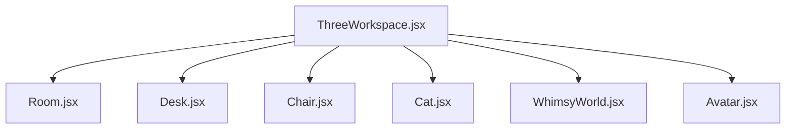
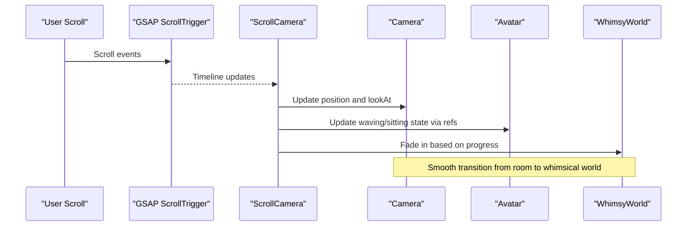
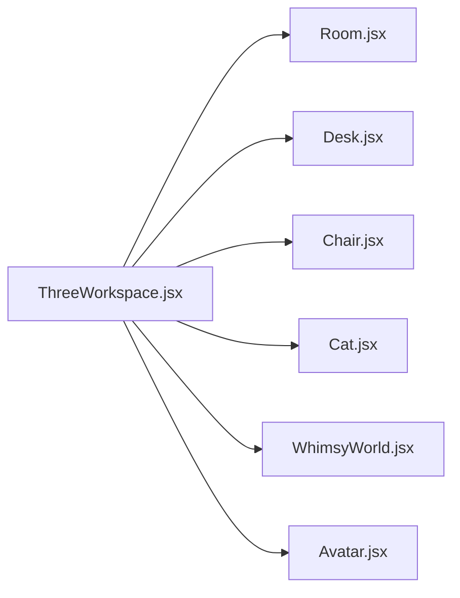

# Environment Components

<cite>
**Referenced Files in This Document**
- [ThreeWorkspace.jsx](file://components/three/ThreeWorkspace.jsx)
- [Room.jsx](file://components/three/Room.jsx)
- [Desk.jsx](file://components/three/Desk.jsx)
- [Chair.jsx](file://components/three/Chair.jsx)
- [Cat.jsx](file://components/three/Cat.jsx)
- [WhimsyWorld.jsx](file://components/three/WhimsyWorld.jsx)
- [Avatar.jsx](file://components/three/Avatar.jsx)
</cite>

## Table of Contents
1. [Introduction](#introduction)
2. [Project Structure](#project-structure)
3. [Core Components](#core-components)
4. [Architecture Overview](#architecture-overview)
5. [Detailed Component Analysis](#detailed-component-analysis)
6. [Dependency Analysis](#dependency-analysis)
7. [Performance Considerations](#performance-considerations)
8. [Troubleshooting Guide](#troubleshooting-guide)
9. [Conclusion](#conclusion)
10. [Appendices](#appendices)

## Introduction
This document explains the 3D environment that builds an immersive room scene for the portfolio. It focuses on how the Room defines spatial boundaries, how Desk and Chair furniture are modeled and positioned, and how the Cat decorative element contributes to a whimsical atmosphere. It also covers the coordinate system used across components, object placement strategies, material definitions, and guidance for extending or customizing the scene while maintaining visual consistency.

## Project Structure
The 3D scene is composed of React Three Fiber components under a single workspace:
- The workspace orchestrates lighting, camera animation, and composes all scene elements.
- The Room defines walls, floor, baseboards, window frame, shelf, and small plant.
- Furniture (Desk and Chair) includes props like monitor, keyboard, books, mug with animated steam, and plants.
- The Cat provides playful animations.
- WhimsyWorld adds floating platforms and orbs that fade in during scroll-driven transitions.
- Avatar integrates into the scene and participates in the scroll choreography.

**Diagram sources**
- [ThreeWorkspace.jsx:10-15](file://components/three/ThreeWorkspace.jsx#L10-L15)
- [ThreeWorkspace.jsx:144-159](file://components/three/ThreeWorkspace.jsx#L144-L159)

**Section sources**
- [ThreeWorkspace.jsx:10-15](file://components/three/ThreeWorkspace.jsx#L10-L15)
- [ThreeWorkspace.jsx:126-162](file://components/three/ThreeWorkspace.jsx#L126-L162)

## Core Components
- Room: Defines the room’s floor, back/left walls, baseboards, window frame, shelf, and a tiny plant. Uses simple primitives with standard materials and shadows.
- Desk: A desk with legs, a monitor (with emissive screen), keyboard with key rows, stacked books, a mug with animated steam, and a small potted plant.
- Chair: An office-style chair with backrest, seat, pole, base, a draped crochet blanket pattern, and a small heart detail.
- Cat: A stylized cat built from boxes with animated tail and head rotation for liveliness.
- WhimsyWorld: Floating platforms and orbs that appear as the user scrolls deeper into the experience.
- Avatar: A character that waves or sits depending on scroll progress and participates in camera choreography.

**Section sources**
- [Room.jsx:12-63](file://components/three/Room.jsx#L12-L63)
- [Desk.jsx:110-128](file://components/three/Desk.jsx#L110-L128)
- [Chair.jsx:12-46](file://components/three/Chair.jsx#L12-L46)
- [Cat.jsx:15-58](file://components/three/Cat.jsx#L15-L58)
- [WhimsyWorld.jsx:34-75](file://components/three/WhimsyWorld.jsx#L34-L75)
- [Avatar.jsx:64-160](file://components/three/Avatar.jsx#L64-L160)

## Architecture Overview
The scene is rendered inside a Canvas provided by React Three Fiber. Lighting is set up once in the Scene component, then all objects are composed. Camera movement is driven by GSAP ScrollTrigger, which updates both camera position and look-at target over time, creating a guided tour through the room and into the whimsical world.

**Diagram sources**
- [ThreeWorkspace.jsx:23-98](file://components/three/ThreeWorkspace.jsx#L23-L98)
- [ThreeWorkspace.jsx:110-124](file://components/three/ThreeWorkspace.jsx#L110-L124)
- [ThreeWorkspace.jsx:144-159](file://components/three/ThreeWorkspace.jsx#L144-L159)

**Section sources**
- [ThreeWorkspace.jsx:23-98](file://components/three/ThreeWorkspace.jsx#L23-L98)
- [ThreeWorkspace.jsx:104-162](file://components/three/ThreeWorkspace.jsx#L104-L162)

## Detailed Component Analysis

### Room: Walls, Floor, and Spatial Boundaries
- Floor: A large plane rotated to lie flat, providing the base surface.
- Back and left walls: Planes forming two sides of the room; dimensions define the room’s scale.
- Baseboards: Thin boxes along wall edges for detail.
- Window frame: A grouped assembly of boxes representing frame and glass.
- Shelf and plant: Small decorative elements placed on the left wall.

Coordinate system notes:
- Y-axis points upward; negative Y moves below the floor level.
- Z-axis extends forward/backward relative to the camera’s default orientation.
- X-axis spans left/right.

Placement strategy:
- Objects are grouped and positioned relative to the origin.
- Wall planes use rotations to align correctly with axes.
- Decorative items are offset slightly to avoid clipping and maintain depth.

Materials:
- Standard materials with soft colors; shadows enabled for realism.

**Section sources**
- [Room.jsx:3-10](file://components/three/Room.jsx#L3-L10)
- [Room.jsx:12-63](file://components/three/Room.jsx#L12-L63)

### Desk: Furniture Model, Positioning, Materials, and Interactivity
- Desk structure: Top and four legs with warm tones.
- Monitor: Bezel, emissive screen, stand neck and base.
- Keyboard: Base with rows of small key boxes.
- Books: Stacked colored boxes with spine details.
- Mug: Body and handle; includes animated steam particles using a per-frame update.
- Plant: Pot and leaves arranged around the pot.

Positioning:
- The entire desk group is translated to place it within the room.
- Subcomponents are positioned relative to the desk top.

Interactivity:
- Steam uses a per-frame hook to animate vertical motion, rotation, and opacity for a gentle effect.

Materials:
- Standard materials with color and emissive properties for the screen.

**Section sources**
- [Desk.jsx:6-13](file://components/three/Desk.jsx#L6-L13)
- [Desk.jsx:15-31](file://components/three/Desk.jsx#L15-L31)
- [Desk.jsx:33-50](file://components/three/Desk.jsx#L33-L50)
- [Desk.jsx:52-64](file://components/three/Desk.jsx#L52-L64)
- [Desk.jsx:66-75](file://components/three/Desk.jsx#L66-L75)
- [Desk.jsx:77-94](file://components/three/Desk.jsx#L77-L94)
- [Desk.jsx:96-108](file://components/three/Desk.jsx#L96-L108)
- [Desk.jsx:110-128](file://components/three/Desk.jsx#L110-L128)

### Chair: Model, Details, and Placement
- Backrest, seat, pole, and base form the chair structure.
- Crochet blanket draped over the back uses small squares to simulate a pattern.
- A small heart detail sits on the seat.

Positioning:
- The chair group is placed near the desk to suggest a natural seating arrangement.

Materials:
- Standard materials with distinct colors for parts and accents.

**Section sources**
- [Chair.jsx:3-10](file://components/three/Chair.jsx#L3-L10)
- [Chair.jsx:12-46](file://components/three/Chair.jsx#L12-L46)

### Cat: Decorative Element and Animation
- Built from boxes to represent body, head, ears, eyes, nose, legs, and tail.
- Tail and head rotate gently each frame to add life to the scene.

Role in atmosphere:
- Adds whimsy and personality; complements the cozy room setting.

Positioning:
- Placed at a fixed position within the room to be visible but not obstructive.

**Section sources**
- [Cat.jsx:6-13](file://components/three/Cat.jsx#L6-L13)
- [Cat.jsx:15-58](file://components/three/Cat.jsx#L15-L58)
- [ThreeWorkspace.jsx:155](file://components/three/ThreeWorkspace.jsx#L155)

### WhimsyWorld: Transition Elements
- Background plane sets a warm tone.
- Floating platforms and orbs provide a dreamlike backdrop.
- Opacity controlled by scroll progress to fade in/out smoothly.

Integration:
- Positioned behind the room to create depth during the final phase of the camera journey.

**Section sources**
- [WhimsyWorld.jsx:6-13](file://components/three/WhimsyWorld.jsx#L6-L13)
- [WhimsyWorld.jsx:15-32](file://components/three/WhimsyWorld.jsx#L15-L32)
- [WhimsyWorld.jsx:34-75](file://components/three/WhimsyWorld.jsx#L34-L75)
- [ThreeWorkspace.jsx:157](file://components/three/ThreeWorkspace.jsx#L157)

### Coordinate System and Object Placement Strategy
- Origin is centrally located; room elements are symmetrically placed around it.
- Floor at negative Y anchors the scene; walls extend upward in positive Y.
- Depth (Z) separates foreground (desk/chair/cat) from background (walls/whimsy world).
- Groups are used to keep local coordinates intuitive; global positions are applied at the parent group level.

Guidelines:
- Keep object sizes proportional to the room dimensions.
- Use consistent spacing and alignment for furniture.
- Apply subtle offsets to avoid overlapping geometry.

**Section sources**
- [Room.jsx:12-63](file://components/three/Room.jsx#L12-L63)
- [Desk.jsx:110-128](file://components/three/Desk.jsx#L110-L128)
- [Chair.jsx:12-46](file://components/three/Chair.jsx#L12-L46)
- [Cat.jsx:15-58](file://components/three/Cat.jsx#L15-L58)
- [WhimsyWorld.jsx:34-75](file://components/three/WhimsyWorld.jsx#L34-L75)

### Material Definitions and Visual Consistency
- Materials are primarily standard meshes with solid colors.
- Emissive materials highlight interactive or focal elements (e.g., monitor screen).
- Shadows are enabled on most objects to enhance depth perception.
- Color palette is cohesive: warm neutrals, soft pastels, and accent colors for highlights.

Best practices:
- Reuse a shared color palette across components.
- Limit emissive intensity to avoid washing out other elements.
- Ensure shadow casting/receiving is consistent to prevent visual artifacts.

**Section sources**
- [Room.jsx:12-63](file://components/three/Room.jsx#L12-L63)
- [Desk.jsx:15-31](file://components/three/Desk.jsx#L15-L31)
- [Desk.jsx:77-94](file://components/three/Desk.jsx#L77-L94)
- [ThreeWorkspace.jsx:128-143](file://components/three/ThreeWorkspace.jsx#L128-L143)

## Dependency Analysis
- ThreeWorkspace imports and composes Room, Desk, Chair, Cat, WhimsyWorld, and Avatar.
- It also manages lighting and camera animation, acting as the central controller for the scene.
- Components are loosely coupled; they rely on shared conventions (positioning, materials) rather than direct imports.

**Diagram sources**
- [ThreeWorkspace.jsx:10-15](file://components/three/ThreeWorkspace.jsx#L10-L15)
- [ThreeWorkspace.jsx:144-159](file://components/three/ThreeWorkspace.jsx#L144-L159)

**Section sources**
- [ThreeWorkspace.jsx:10-15](file://components/three/ThreeWorkspace.jsx#L10-L15)
- [ThreeWorkspace.jsx:144-159](file://components/three/ThreeWorkspace.jsx#L144-L159)

## Performance Considerations
- Geometry complexity: All objects use simple box and plane geometries, keeping draw calls low.
- Animations: Per-frame updates are minimal and targeted (steam, cat tail/head, floating orbs).
- Lighting: A single directional light with shadow mapping plus ambient and point lights balances quality and performance.
- Shadow settings: Shadow map size and camera frustum are tuned to reduce overhead while preserving quality.

Recommendations:
- Avoid excessive nested groups unless necessary for positioning.
- Reuse materials where possible to reduce state changes.
- Limit the number of animated objects if frame rate drops occur.

[No sources needed since this section provides general guidance]

## Troubleshooting Guide
Common issues and resolutions:
- Objects not visible: Check group positions and rotations; ensure Z-depth places them within the camera’s view.
- Shadows missing: Verify castShadow and receiveShadow flags and that the light source has shadows enabled.
- Animations jittering: Confirm refs exist before updating in per-frame hooks; guard against undefined references.
- Overlapping geometry: Adjust positions slightly to avoid clipping between nearby objects.
- Performance dips: Reduce animated object count or simplify geometry; adjust shadow map size.

**Section sources**
- [Desk.jsx:77-94](file://components/three/Desk.jsx#L77-L94)
- [Cat.jsx:15-26](file://components/three/Cat.jsx#L15-L26)
- [WhimsyWorld.jsx:15-32](file://components/three/WhimsyWorld.jsx#L15-L32)
- [ThreeWorkspace.jsx:128-143](file://components/three/ThreeWorkspace.jsx#L128-L143)

## Conclusion
The environment combines a well-structured room with thoughtfully placed furniture and playful decorations to create an engaging 3D space. The architecture leverages simple primitives, consistent materials, and targeted animations to deliver a smooth, immersive experience. By following the coordinate and placement guidelines, you can extend the scene with new objects while preserving visual coherence and performance.

[No sources needed since this section summarizes without analyzing specific files]

## Appendices

### Adding New Environmental Objects
Steps:
- Create a new component with a local Box helper or reuse existing patterns.
- Define geometry and materials consistent with the scene’s palette.
- Place the object within a group and set its global position relative to the origin.
- If interactive or animated, integrate per-frame updates carefully.
- Compose the new component in the Scene within ThreeWorkspace.

Guidance:
- Maintain proportions relative to the room scale.
- Use shadows consistently for depth.
- Test visibility and overlap with existing objects.

**Section sources**
- [Room.jsx:3-10](file://components/three/Room.jsx#L3-L10)
- [Desk.jsx:6-13](file://components/three/Desk.jsx#L6-L13)
- [ThreeWorkspace.jsx:144-159](file://components/three/ThreeWorkspace.jsx#L144-L159)

### Customizing Existing Furniture
Tips:
- Modify colors in the local Box helper or directly on mesh materials.
- Adjust dimensions in geometry args to change size.
- Reposition subcomponents within their groups to refine layout.
- For interactivity, add per-frame hooks similar to steam or cat animations.

**Section sources**
- [Desk.jsx:15-31](file://components/three/Desk.jsx#L15-L31)
- [Desk.jsx:66-75](file://components/three/Desk.jsx#L66-L75)
- [Chair.jsx:12-46](file://components/three/Chair.jsx#L12-L46)

### Maintaining Visual Consistency
- Use a shared color palette across components.
- Keep material types consistent (standard materials with optional emissive).
- Align objects to a grid-like spacing for orderliness.
- Ensure shadows and lighting are uniform across the scene.

**Section sources**
- [ThreeWorkspace.jsx:128-143](file://components/three/ThreeWorkspace.jsx#L128-L143)
- [Room.jsx:12-63](file://components/three/Room.jsx#L12-L63)
- [Desk.jsx:110-128](file://components/three/Desk.jsx#L110-L128)
- [Chair.jsx:12-46](file://components/three/Chair.jsx#L12-L46)