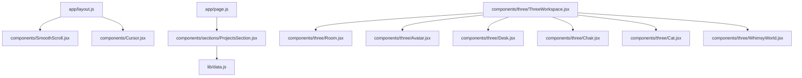
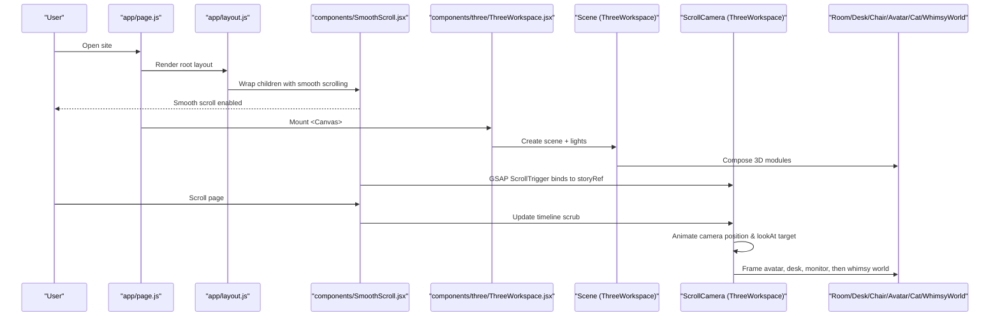
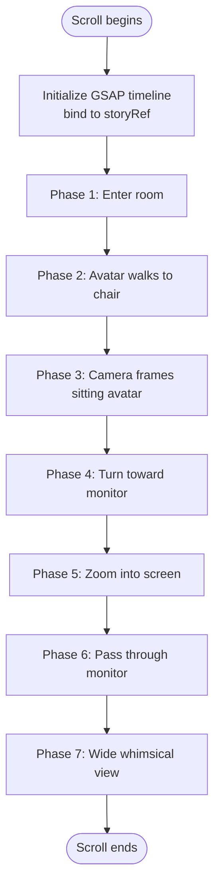
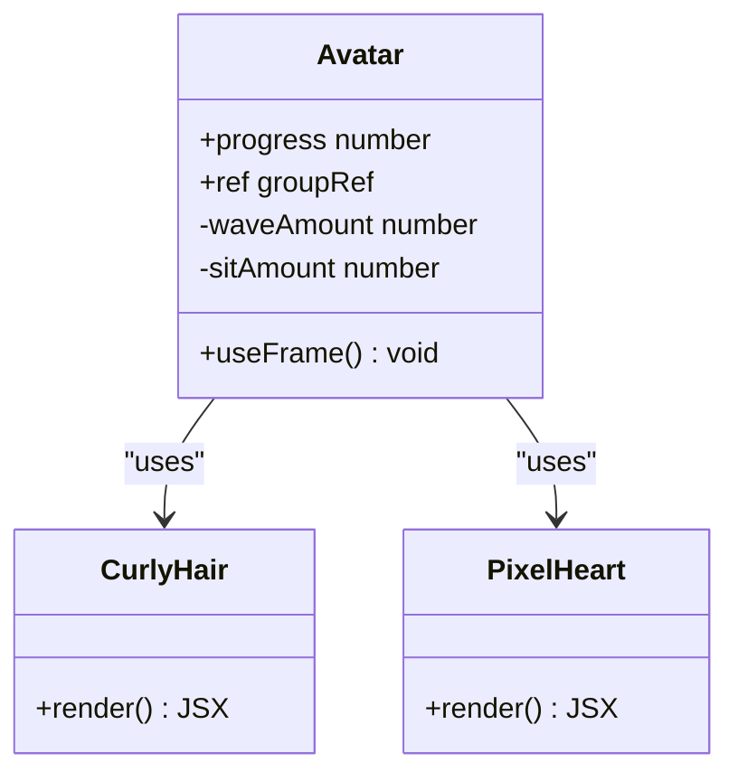
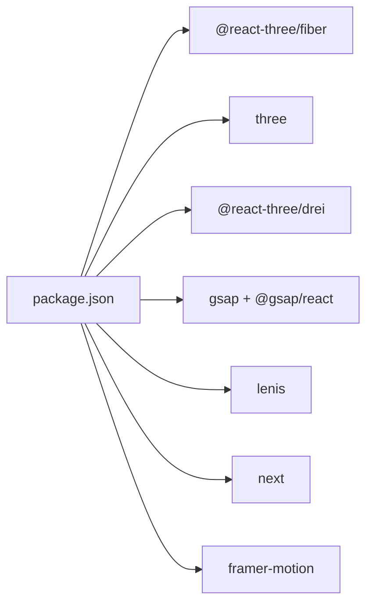

# Modular 3D Components Architecture

<cite>
**Referenced Files in This Document**
- [README.md](file://README.md)
- [package.json](file://package.json)
- [app/layout.js](file://app/layout.js)
- [app/page.js](file://app/page.js)
- [components/SmoothScroll.jsx](file://components/SmoothScroll.jsx)
- [components/Cursor.jsx](file://components/Cursor.jsx)
- [components/sections/ProjectsSection.jsx](file://components/sections/ProjectsSection.jsx)
- [lib/data.js](file://lib/data.js)
- [components/three/ThreeWorkspace.jsx](file://components/three/ThreeWorkspace.jsx)
- [components/three/Room.jsx](file://components/three/Room.jsx)
- [components/three/Avatar.jsx](file://components/three/Avatar.jsx)
- [components/three/Desk.jsx](file://components/three/Desk.jsx)
- [components/three/Chair.jsx](file://components/three/Chair.jsx)
- [components/three/Cat.jsx](file://components/three/Cat.jsx)
- [components/three/WhimsyWorld.jsx](file://components/three/WhimsyWorld.jsx)
</cite>

## Table of Contents
1. Introduction
2. Project Structure
3. Core Components
4. Architecture Overview
5. Detailed Component Analysis
6. Dependency Analysis
7. Performance Considerations
8. Troubleshooting Guide
9. Conclusion

## Introduction
This document explains the modular 3D components architecture of a Next.js portfolio that uses React Three Fiber to render an interactive, scroll-driven 3D workspace. The system composes reusable 3D modules (room, desk, chair, avatar, cat, whimsical world) and orchestrates them with GSAP ScrollTrigger for camera choreography and smooth scrolling via Lenis. The result is a cohesive narrative experience where scrolling guides the camera through a room, frames the avatar sitting at a desk, zooms into the monitor, and transitions into a whimsical world.

## Project Structure
The project follows a feature-based layout:
- App shell and global setup live under app/
- UI sections and shared UI components under components/
- 3D scene composition and modules under components/three/
- Data and content under lib/
- Dependencies and scripts under package.json

**Diagram sources**
- [app/layout.js:1-55](file://app/layout.js#L1-L55)
- [components/SmoothScroll.jsx:1-47](file://components/SmoothScroll.jsx#L1-L47)
- [components/Cursor.jsx:1-129](file://components/Cursor.jsx#L1-L129)
- [app/page.js:1-66](file://app/page.js#L1-L66)
- [components/sections/ProjectsSection.jsx:1-43](file://components/sections/ProjectsSection.jsx#L1-L43)
- [lib/data.js:1-181](file://lib/data.js#L1-L181)
- [components/three/ThreeWorkspace.jsx:1-175](file://components/three/ThreeWorkspace.jsx#L1-L175)
- [components/three/Room.jsx:1-154](file://components/three/Room.jsx#L1-L154)
- [components/three/Avatar.jsx:1-223](file://components/three/Avatar.jsx#L1-L223)
- [components/three/Desk.jsx:1-129](file://components/three/Desk.jsx#L1-L129)
- [components/three/Chair.jsx:1-47](file://components/three/Chair.jsx#L1-L47)
- [components/three/Cat.jsx:1-59](file://components/three/Cat.jsx#L1-L59)
- [components/three/WhimsyWorld.jsx:1-76](file://components/three/WhimsyWorld.jsx#L1-L76)

**Section sources**
- [README.md:1-37](file://README.md#L1-L37)
- [package.json:1-30](file://package.json#L1-L30)
- [app/layout.js:1-55](file://app/layout.js#L1-L55)
- [app/page.js:1-66](file://app/page.js#L1-L66)

## Core Components
- ThreeWorkspace: Orchestrates the 3D Canvas, lighting, scene composition, and scroll-driven camera animation using GSAP ScrollTrigger. It exposes a storyRef to bind scroll progress to animations.
- Room: Builds the environment (floor, walls, rug, window, posters, bookshelf, plants).
- Avatar: Character model with pose and animation driven by scroll progress (waving while standing, transitioning to sitting, breathing).
- Desk: Desk surface, monitor, keyboard, books, mug with animated steam, and a small plant.
- Chair: Office-style chair with decorative blanket and heart detail.
- Cat: Animated pet with tail and head motion.
- WhimsyWorld: Surreal post-monitor world with floating platforms, orbs, and tiny trees; fades in based on scroll progress.

Key integration points:
- SmoothScroll wraps the app to provide Lenis-powered smooth scrolling and integrates with GSAP ScrollTrigger.
- Cursor adds a particle trail canvas overlay for mouse movement.
- ProjectsSection renders data from lib/data.js as project cards.

**Section sources**
- [components/three/ThreeWorkspace.jsx:1-175](file://components/three/ThreeWorkspace.jsx#L1-L175)
- [components/three/Room.jsx:1-154](file://components/three/Room.jsx#L1-L154)
- [components/three/Avatar.jsx:1-223](file://components/three/Avatar.jsx#L1-L223)
- [components/three/Desk.jsx:1-129](file://components/three/Desk.jsx#L1-L129)
- [components/three/Chair.jsx:1-47](file://components/three/Chair.jsx#L1-L47)
- [components/three/Cat.jsx:1-59](file://components/three/Cat.jsx#L1-L59)
- [components/three/WhimsyWorld.jsx:1-76](file://components/three/WhimsyWorld.jsx#L1-L76)
- [components/SmoothScroll.jsx:1-47](file://components/SmoothScroll.jsx#L1-L47)
- [components/Cursor.jsx:1-129](file://components/Cursor.jsx#L1-L129)
- [components/sections/ProjectsSection.jsx:1-43](file://components/sections/ProjectsSection.jsx#L1-L43)
- [lib/data.js:1-181](file://lib/data.js#L1-L181)

## Architecture Overview
The application composes a React page that mounts a 3D Canvas. A dedicated component manages the scene graph and lighting, while another drives camera motion tied to scroll position. Each 3D element is a self-contained module, promoting modularity and testability.

**Diagram sources**
- [app/page.js:1-66](file://app/page.js#L1-L66)
- [app/layout.js:1-55](file://app/layout.js#L1-L55)
- [components/SmoothScroll.jsx:1-47](file://components/SmoothScroll.jsx#L1-L47)
- [components/three/ThreeWorkspace.jsx:1-175](file://components/three/ThreeWorkspace.jsx#L1-L175)

## Detailed Component Analysis

### ThreeWorkspace: Scene Orchestration and Scroll-Driven Camera
Responsibilities:
- Provide Canvas configuration (shadows, DPR, camera settings).
- Build the scene with lighting and modules.
- Drive camera motion and avatar repositioning via GSAP timelines bound to scroll.

Key behaviors:
- Uses useFrame to continuously update camera lookAt target.
- Registers ScrollTrigger to map scroll progress to a multi-phase timeline:
  - Enter room
  - Move avatar toward chair
  - Frame avatar sitting
  - Turn toward monitor
  - Zoom into screen
  - Pass through monitor into whimsical world
  - Pull back to wide whimsical view

**Diagram sources**
- [components/three/ThreeWorkspace.jsx:23-91](file://components/three/ThreeWorkspace.jsx#L23-L91)
- [components/three/ThreeWorkspace.jsx:98-151](file://components/three/ThreeWorkspace.jsx#L98-L151)
- [components/three/ThreeWorkspace.jsx:157-175](file://components/three/ThreeWorkspace.jsx#L157-L175)

**Section sources**
- [components/three/ThreeWorkspace.jsx:1-175](file://components/three/ThreeWorkspace.jsx#L1-L175)

### Room: Environment Composition
Responsibilities:
- Construct floor, walls, rug, window with curtains, wall art, baseboards, bookshelf, and plants.
- Use simple Box primitives for consistent styling and shadow behavior.

Design notes:
- Reusable Box helper encapsulates geometry, material, and shadow flags.
- HangingPlant animates leaf sway using useFrame.

**Section sources**
- [components/three/Room.jsx:1-154](file://components/three/Room.jsx#L1-L154)

### Avatar: Pose and Animation Driven by Progress
Responsibilities:
- Expose imperative ref for external positioning (used by camera choreography).
- Compute waveAmount and sitAmount from scroll progress to blend between standing wave and sitting pose.
- Animate arms and subtle body breathing each frame.

Animation logic:
- Wave arm when standing early in scroll.
- Transition arms forward as avatar sits.
- Hide shoes during sitting phase.

**Diagram sources**
- [components/three/Avatar.jsx:98-223](file://components/three/Avatar.jsx#L98-L223)
- [components/three/Avatar.jsx:32-96](file://components/three/Avatar.jsx#L32-L96)

**Section sources**
- [components/three/Avatar.jsx:1-223](file://components/three/Avatar.jsx#L1-L223)

### Desk: Props and Micro-Animations
Responsibilities:
- Model desk surface, legs, monitor, keyboard, books, mug, and plant.
- Add subtle steam animation above the mug using useFrame.

Performance note:
- Keyboard keys are generated procedurally to avoid heavy assets.

**Section sources**
- [components/three/Desk.jsx:1-129](file://components/three/Desk.jsx#L1-L129)

### Chair: Simple Prop-Based Model
Responsibilities:
- Build chair with backrest, seat, pole, base, and decorative elements (blanket pattern, heart).

**Section sources**
- [components/three/Chair.jsx:1-47](file://components/three/Chair.jsx#L1-L47)

### Cat: Ambient Life
Responsibilities:
- Provide a small animated cat with tail wag and head turn using useFrame.

**Section sources**
- [components/three/Cat.jsx:1-59](file://components/three/Cat.jsx#L1-L59)

### WhimsyWorld: Post-Monitor Transition
Responsibilities:
- Fade in based on scroll progress.
- Render floating platforms, glowing orbs, and voxel-like trees.
- Animate orbs with gentle rotation and vertical oscillation.

**Section sources**
- [components/three/WhimsyWorld.jsx:1-76](file://components/three/WhimsyWorld.jsx#L1-L76)

### SmoothScroll: Global Scroll Integration
Responsibilities:
- Initialize Lenis with easing and touch multiplier.
- Sync Lenis scroll events with GSAP ScrollTrigger.
- Respect reduced motion preferences.

**Section sources**
- [components/SmoothScroll.jsx:1-47](file://components/SmoothScroll.jsx#L1-L47)

### Cursor: Particle Trail Overlay
Responsibilities:
- Draw a canvas overlay that spawns particles following the mouse.
- Disable on touch devices.

**Section sources**
- [components/Cursor.jsx:1-129](file://components/Cursor.jsx#L1-L129)

### ProjectsSection and Data
Responsibilities:
- Render project cards from centralized data.
- Link to dynamic routes per project id.

Data source:
- Profile, education, experience, projects, skills, tools are defined in lib/data.js.

**Section sources**
- [components/sections/ProjectsSection.jsx:1-43](file://components/sections/ProjectsSection.jsx#L1-L43)
- [lib/data.js:1-181](file://lib/data.js#L1-L181)

## Dependency Analysis
External libraries and their roles:
- @react-three/fiber and three: 3D rendering engine and React bindings.
- @react-three/drei: Utilities for 3D scenes (used indirectly via fiber ecosystem).
- gsap and @gsap/react: Timeline-based animations and ScrollTrigger integration.
- lenis: Smooth scrolling layer.
- framer-motion: Available for UI animations (not used in analyzed files).
- next: Framework runtime.

**Diagram sources**
- [package.json:11-22](file://package.json#L11-L22)

**Section sources**
- [package.json:1-30](file://package.json#L1-L30)

## Performance Considerations
- Rendering budget:
  - Limit geometry complexity; prefer box primitives for props and environment.
  - Keep shadow casting to essential objects to reduce GPU load.
- Animation efficiency:
  - Use useFrame sparingly; batch updates where possible.
  - Avoid creating new objects inside loops or per-frame callbacks.
- Scroll performance:
  - Ensure ScrollTrigger scrub values are tuned for smoothness without over-triggering.
  - Debounce heavy computations outside the render loop if needed.
- Asset strategy:
  - Procedural generation (e.g., keyboard keys) reduces asset size and loading time.
  - Consider lazy-loading non-critical 3D modules if the scene grows.

[No sources needed since this section provides general guidance]

## Troubleshooting Guide
Common issues and resolutions:
- Scroll not driving 3D animations:
  - Verify storyRef is passed correctly to ThreeWorkspace and used by ScrollTrigger.
  - Ensure SmoothScroll wraps the app and registers ScrollTrigger.update on scroll events.
- Camera jitter or snapping:
  - Check that target and camera positions are set before timeline starts.
  - Confirm that useFrame updates lookAt consistently without conflicting transforms.
- Avatar pose not updating:
  - Confirm progress prop is being updated by ScrollTrigger onUpdate.
  - Validate that refs are exposed via useImperativeHandle and accessed correctly.
- Performance drops on low-end devices:
  - Reduce shadow map sizes and light counts.
  - Lower DPR range in Canvas configuration.
  - Remove or simplify non-essential animations (steam, floating orbs).

**Section sources**
- [components/three/ThreeWorkspace.jsx:23-91](file://components/three/ThreeWorkspace.jsx#L23-L91)
- [components/three/ThreeWorkspace.jsx:98-151](file://components/three/ThreeWorkspace.jsx#L98-L151)
- [components/SmoothScroll.jsx:10-43](file://components/SmoothScroll.jsx#L10-L43)
- [components/three/Avatar.jsx:98-145](file://components/three/Avatar.jsx#L98-L145)

## Conclusion
The portfolio’s 3D architecture is modular and scroll-driven, leveraging React Three Fiber for scene composition and GSAP for precise timeline control. Each 3D module encapsulates its own geometry and micro-animations, enabling easy extension and maintenance. SmoothScroll ensures fluid user interactions, while the cursor overlay adds polish. This design balances visual storytelling with performance-conscious practices suitable for modern web experiences.

[No sources needed since this section summarizes without analyzing specific files]