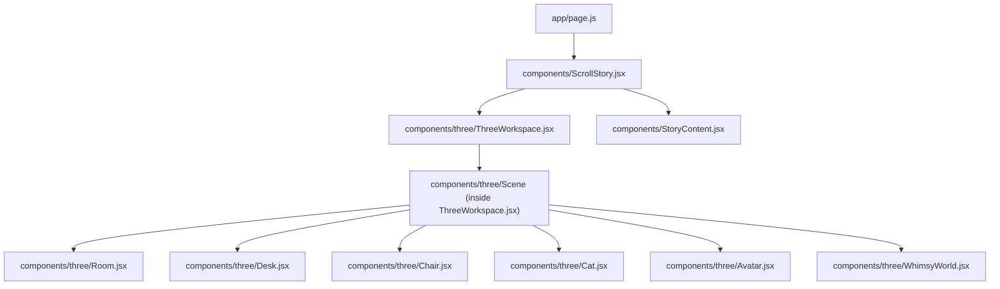
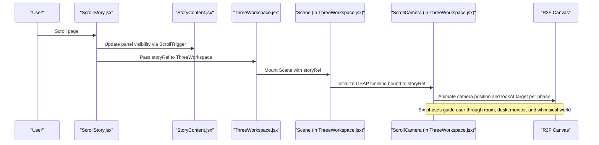
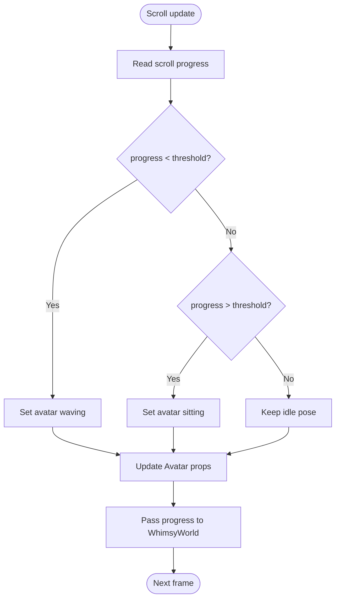
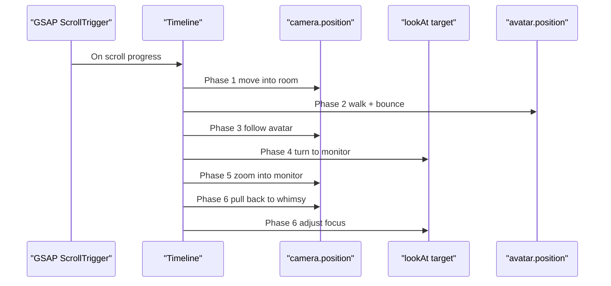
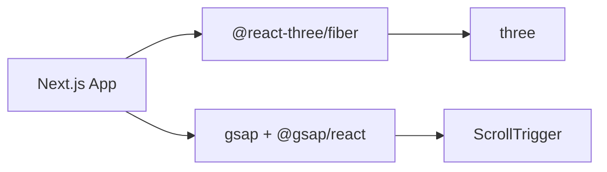

# Scene Management

<cite>
**Referenced Files in This Document**
- [page.js](file://app/page.js)
- [ScrollStory.jsx](file://components/ScrollStory.jsx)
- [ThreeWorkspace.jsx](file://components/three/ThreeWorkspace.jsx)
- [Room.jsx](file://components/three/Room.jsx)
- [Desk.jsx](file://components/three/Desk.jsx)
- [Chair.jsx](file://components/three/Chair.jsx)
- [Cat.jsx](file://components/three/Cat.jsx)
- [Avatar.jsx](file://components/three/Avatar.jsx)
- [WhimsyWorld.jsx](file://components/three/WhimsyWorld.jsx)
- [StoryContent.jsx](file://components/StoryContent.jsx)
- [package.json](file://package.json)
</cite>

## Table of Contents
1. [Introduction](#introduction)
2. [Project Structure](#project-structure)
3. [Core Components](#core-components)
4. [Architecture Overview](#architecture-overview)
5. [Detailed Component Analysis](#detailed-component-analysis)
6. [Dependency Analysis](#dependency-analysis)
7. [Performance Considerations](#performance-considerations)
8. [Troubleshooting Guide](#troubleshooting-guide)
9. [Conclusion](#conclusion)
10. [Appendices](#appendices)

## Introduction
This document explains the Three.js scene management system built with React Three Fiber for a scroll-driven portfolio experience. It covers:
- The Canvas configuration and scene composition in ThreeWorkspace
- The Scene architecture, including lighting (ambient, directional, point lights)
- Camera choreography via ScrollCamera using GSAP ScrollTrigger
- A six-phase camera journey that guides users through the portfolio
- Performance optimizations such as DPR settings and shadow mapping
- Practical examples for adding objects, customizing lighting, and extending animations

## Project Structure
The 3D experience is composed of a few key layers:
- Page entry renders a loading screen then mounts the scroll story
- ScrollStory composes intro text, overlay panels, and the 3D workspace
- ThreeWorkspace provides the R3F Canvas and Scene
- Scene composes Room, Desk, Chair, Cat, Avatar, WhimsyWorld, and lighting
- StoryContent overlays UI panels synchronized to scroll progress

**Diagram sources**
- [page.js:1-60](file://app/page.js#L1-L60)
- [ScrollStory.jsx:1-70](file://components/ScrollStory.jsx#L1-L70)
- [ThreeWorkspace.jsx:1-186](file://components/three/ThreeWorkspace.jsx#L1-L186)
- [Room.jsx:1-64](file://components/three/Room.jsx#L1-L64)
- [Desk.jsx:1-129](file://components/three/Desk.jsx#L1-L129)
- [Chair.jsx:1-47](file://components/three/Chair.jsx#L1-L47)
- [Cat.jsx:1-59](file://components/three/Cat.jsx#L1-L59)
- [Avatar.jsx:1-164](file://components/three/Avatar.jsx#L1-L164)
- [WhimsyWorld.jsx:1-76](file://components/three/WhimsyWorld.jsx#L1-L76)
- [StoryContent.jsx:1-91](file://components/StoryContent.jsx#L1-L91)

**Section sources**
- [page.js:1-60](file://app/page.js#L1-L60)
- [ScrollStory.jsx:1-70](file://components/ScrollStory.jsx#L1-L70)
- [ThreeWorkspace.jsx:1-186](file://components/three/ThreeWorkspace.jsx#L1-L186)

## Core Components
- ThreeWorkspace: Renders the R3F Canvas with shadows enabled, sets DPR range, and configures the initial camera. It mounts the Scene component.
- Scene: Composes all 3D objects and lighting. It also drives avatar states based on scroll progress and wires up ScrollCamera.
- ScrollCamera: Uses GSAP ScrollTrigger to animate camera position and look-at target across a six-phase timeline tied to scroll.
- Room, Desk, Chair, Cat, Avatar, WhimsyWorld: Reusable scene elements that build the environment and characters.
- StoryContent: Overlays UI panels that fade/slide in sync with scroll progress.

Key responsibilities:
- ThreeWorkspace: Canvas setup and scene mounting
- Scene: Lighting, object composition, state synchronization with scroll
- ScrollCamera: Camera choreography via GSAP timeline
- StoryContent: Panel animations driven by scroll

**Section sources**
- [ThreeWorkspace.jsx:168-186](file://components/three/ThreeWorkspace.jsx#L168-L186)
- [ThreeWorkspace.jsx:104-162](file://components/three/ThreeWorkspace.jsx#L104-L162)
- [ThreeWorkspace.jsx:23-98](file://components/three/ThreeWorkspace.jsx#L23-L98)
- [StoryContent.jsx:17-24](file://components/StoryContent.jsx#L17-L24)
- [StoryContent.jsx:30-75](file://components/StoryContent.jsx#L30-L75)

## Architecture Overview
The system integrates React, React Three Fiber, and GSAP ScrollTrigger to create a scroll-driven 3D narrative.

**Diagram sources**
- [ScrollStory.jsx:13-34](file://components/ScrollStory.jsx#L13-L34)
- [StoryContent.jsx:30-75](file://components/StoryContent.jsx#L30-L75)
- [ThreeWorkspace.jsx:168-186](file://components/three/ThreeWorkspace.jsx#L168-L186)
- [ThreeWorkspace.jsx:104-162](file://components/three/ThreeWorkspace.jsx#L104-L162)
- [ThreeWorkspace.jsx:23-98](file://components/three/ThreeWorkspace.jsx#L23-L98)

## Detailed Component Analysis

### ThreeWorkspace: Canvas Configuration and Scene Composition
- Canvas enables shadows and sets DPR to a performance-friendly range.
- Initial camera is configured with field-of-view and near/far planes.
- Scene is mounted with a reference to the scroll container for GSAP integration.

Practical notes:
- DPR range limits pixel density for better performance on high-DPI screens.
- Shadows are enabled globally for the canvas; individual meshes can opt-in/out.

**Section sources**
- [ThreeWorkspace.jsx:168-186](file://components/three/ThreeWorkspace.jsx#L168-L186)

### Scene: Lighting, Objects, and State Sync
Lighting setup:
- Ambient light provides base illumination.
- Directional light casts shadows with a large map size and configured frustum bounds.
- Two point lights add warm and cool accents.

Object composition:
- Room, Desk, Chair, Cat, Avatar, and WhimsyWorld are placed into the scene.
- Avatar receives props to control waving and sitting states based on scroll progress.

State synchronization:
- A ScrollTrigger updates avatar states and a progress value used by WhimsyWorld.

**Diagram sources**
- [ThreeWorkspace.jsx:110-124](file://components/three/ThreeWorkspace.jsx#L110-L124)
- [ThreeWorkspace.jsx:126-162](file://components/three/ThreeWorkspace.jsx#L126-L162)
- [WhimsyWorld.jsx:34-43](file://components/three/WhimsyWorld.jsx#L34-L43)

**Section sources**
- [ThreeWorkspace.jsx:104-162](file://components/three/ThreeWorkspace.jsx#L104-L162)

### ScrollCamera: Six-Phase Camera Choreography
The camera moves through a carefully timed sequence linked to scroll:
- Phase 1: Enter the room
- Phase 2: Avatar walks toward desk with bounce
- Phase 3: Camera follows avatar
- Phase 4: Camera turns toward monitor
- Phase 5: Zoom into monitor
- Phase 6: Pull back into the whimsical world

Each phase animates camera position and/or look-at target with easing appropriate to the motion.

**Diagram sources**
- [ThreeWorkspace.jsx:23-98](file://components/three/ThreeWorkspace.jsx#L23-L98)

**Section sources**
- [ThreeWorkspace.jsx:23-98](file://components/three/ThreeWorkspace.jsx#L23-L98)

### Room, Desk, Chair, Cat, Avatar, WhimsyWorld
- Room: Floor, walls, baseboards, window frame, shelf, and small plant.
- Desk: Monitor with emissive screen, keyboard, books, mug with animated steam, and desk plant.
- Chair: Backrest, seat, pole, base, crochet blanket pattern, and heart detail.
- Cat: Animated tail and head movement.
- Avatar: Procedural character with waving and sitting poses, breathing animation.
- WhimsyWorld: Floating platforms, orbs, and voxel trees that fade in during later scroll phases.

These components use simple box primitives and standard materials to keep rendering efficient while maintaining visual clarity.

**Section sources**
- [Room.jsx:1-64](file://components/three/Room.jsx#L1-L64)
- [Desk.jsx:1-129](file://components/three/Desk.jsx#L1-L129)
- [Chair.jsx:1-47](file://components/three/Chair.jsx#L1-L47)
- [Cat.jsx:1-59](file://components/three/Cat.jsx#L1-L59)
- [Avatar.jsx:1-164](file://components/three/Avatar.jsx#L1-L164)
- [WhimsyWorld.jsx:1-76](file://components/three/WhimsyWorld.jsx#L1-L76)

### StoryContent: Overlay Panels
- Defines panels for About, Projects, Skills, Experience, Education, Contact.
- Each panel fades in and out at specific scroll ranges using GSAP ScrollTrigger.
- Provides a layered storytelling experience alongside the 3D scene.

**Section sources**
- [StoryContent.jsx:17-24](file://components/StoryContent.jsx#L17-L24)
- [StoryContent.jsx:30-75](file://components/StoryContent.jsx#L30-L75)

## Dependency Analysis
External libraries and their roles:
- @react-three/fiber: Declarative 3D scene graph and hooks
- three: Underlying 3D engine
- gsap + @gsap/react: Animation and ScrollTrigger integration
- @react-three/drei: Utilities (installed; not directly used in analyzed files)
- next, react, react-dom: Framework and runtime

**Diagram sources**
- [package.json:11-22](file://package.json#L11-L22)

**Section sources**
- [package.json:11-22](file://package.json#L11-L22)

## Performance Considerations
- DPR settings: The Canvas uses a DPR range to cap pixel density, balancing sharpness and GPU load.
- Shadow mapping: Directional light uses a large shadow map size and bounded frustum to improve quality without excessive cost.
- Efficient rendering patterns:
  - Use simple geometries (boxes, planes, circles) and standard materials.
  - Limit heavy per-frame work; most animations are driven by GSAP or lightweight useFrame loops.
  - Keep scene complexity reasonable; reuse geometry/materials where possible.
- Scroll-driven updates: GSAP scrubbing ensures smooth, frame-rate-friendly transitions.

Recommendations:
- Adjust DPR upper bound if you see stuttering on lower-end devices.
- Reduce shadow map size or disable shadows on less critical objects if needed.
- Batch similar materials to minimize draw calls.

[No sources needed since this section provides general guidance]

## Troubleshooting Guide
Common issues and fixes:
- Camera not moving with scroll:
  - Ensure the story ref is passed correctly from ScrollStory to ThreeWorkspace and used by ScrollCamera.
  - Verify GSAP ScrollTrigger is registered and the trigger element exists.
- Avatar states not updating:
  - Confirm the ScrollTrigger in Scene reads the same story ref and updates state.
  - Check that Avatar receives updated props and that refs are available before use.
- Performance drops:
  - Lower DPR range or reduce shadow map size.
  - Remove or simplify expensive effects (e.g., many transparent objects).
- Overlapping UI panels:
  - Adjust start/end percentages in StoryContent PANELS to avoid conflicts.

**Section sources**
- [ScrollStory.jsx:13-34](file://components/ScrollStory.jsx#L13-L34)
- [ThreeWorkspace.jsx:110-124](file://components/three/ThreeWorkspace.jsx#L110-L124)
- [ThreeWorkspace.jsx:23-98](file://components/three/ThreeWorkspace.jsx#L23-L98)
- [StoryContent.jsx:17-24](file://components/StoryContent.jsx#L17-L24)

## Conclusion
The scene management system combines React Three Fiber’s declarative 3D with GSAP ScrollTrigger to deliver an immersive, scroll-driven portfolio. The Canvas configuration balances quality and performance, while the six-phase camera choreography guides users through a cohesive narrative. The modular components make it straightforward to extend the scene with new objects, customize lighting, and expand the animation timeline.

[No sources needed since this section summarizes without analyzing specific files]

## Appendices

### How to Add a New Scene Object
Steps:
- Create a new component under components/three using simple primitives and meshStandardMaterial.
- Place it inside the Scene component within ThreeWorkspace.
- Position and rotate as needed; enable/disable shadows based on importance.
- If it should react to scroll, pass a prop derived from progress or attach a GSAP animation.

Example references:
- See how Desk, Chair, and Cat are structured and positioned.
- Follow the pattern used by WhimsyWorld for visibility toggling based on progress.

**Section sources**
- [Desk.jsx:110-129](file://components/three/Desk.jsx#L110-L129)
- [Chair.jsx:12-47](file://components/three/Chair.jsx#L12-L47)
- [Cat.jsx:15-59](file://components/three/Cat.jsx#L15-L59)
- [WhimsyWorld.jsx:34-43](file://components/three/WhimsyWorld.jsx#L34-L43)

### How to Customize Lighting
To adjust mood or emphasis:
- Increase ambient intensity for brighter base lighting.
- Reposition directional light to change shadow direction; adjust shadow-camera bounds to cover your scene area.
- Add or tweak point lights for accent colors and localized highlights.

Example references:
- Review the lighting block in Scene to modify intensities, positions, and colors.

**Section sources**
- [ThreeWorkspace.jsx:126-143](file://components/three/ThreeWorkspace.jsx#L126-L143)

### How to Extend the Animation Timeline
To add more phases or refine timing:
- Open ScrollCamera and locate the GSAP timeline.
- Insert new .to() calls for camera.position or target.current with appropriate durations and easings.
- Align new phases with StoryContent panel timings for cohesive storytelling.

Example references:
- Study the existing six-phase timeline structure and easing choices.

**Section sources**
- [ThreeWorkspace.jsx:31-95](file://components/three/ThreeWorkspace.jsx#L31-L95)
- [StoryContent.jsx:17-24](file://components/StoryContent.jsx#L17-L24)