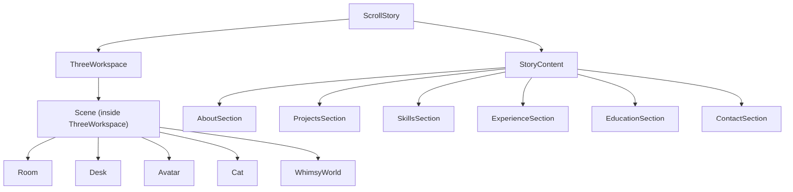
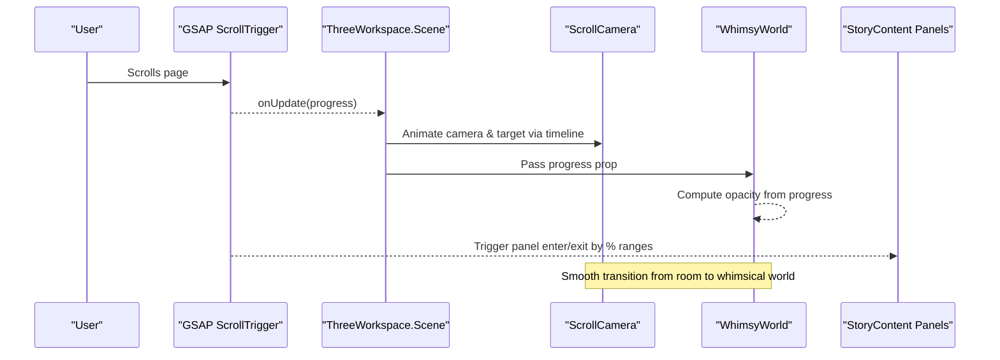
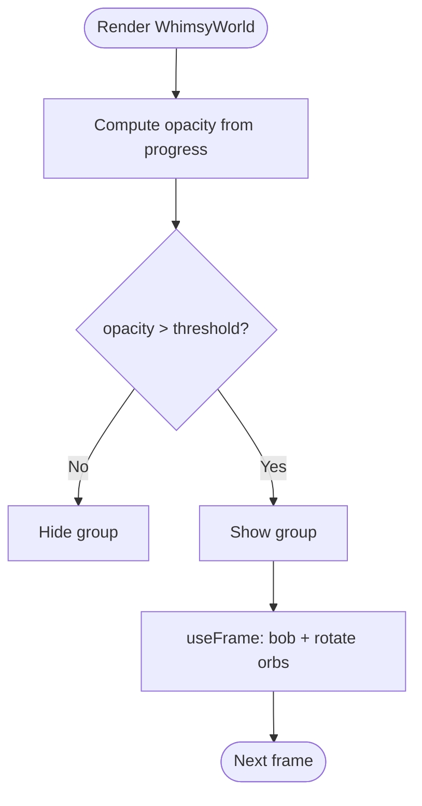
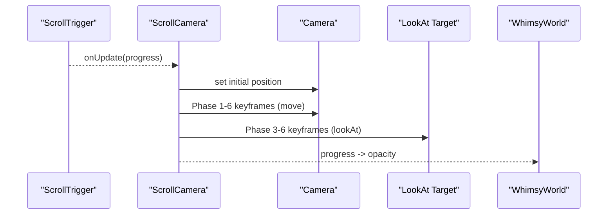
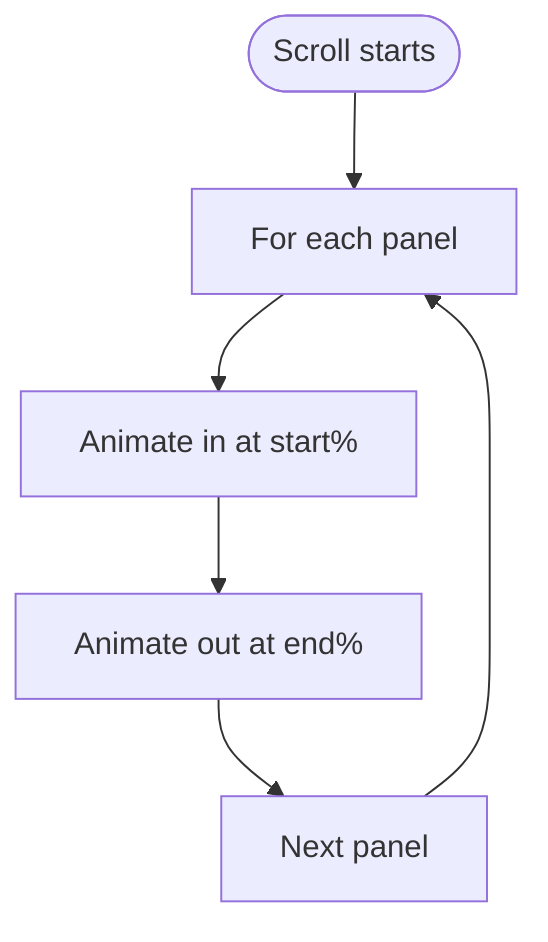
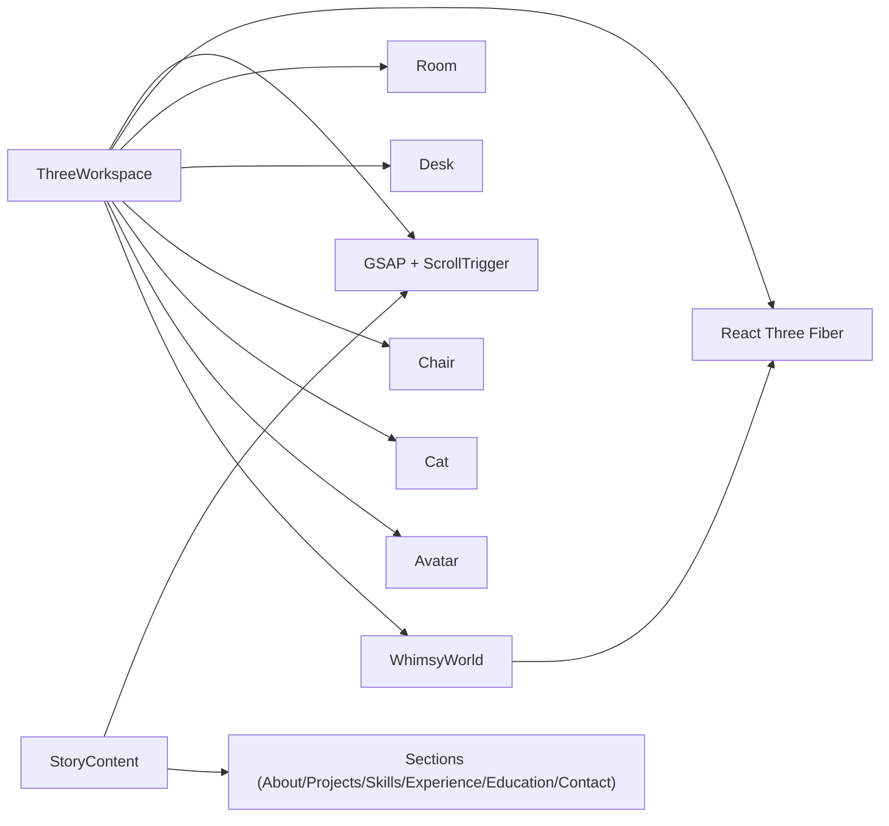

# Visual Effects

<cite>
**Referenced Files in This Document**
- [WhimsyWorld.jsx](file://components/three/WhimsyWorld.jsx)
- [ThreeWorkspace.jsx](file://components/three/ThreeWorkspace.jsx)
- [ScrollStory.jsx](file://components/ScrollStory.jsx)
- [StoryContent.jsx](file://components/StoryContent.jsx)
- [Avatar.jsx](file://components/three/Avatar.jsx)
- [Desk.jsx](file://components/three/Desk.jsx)
- [Cat.jsx](file://components/three/Cat.jsx)
- [Room.jsx](file://components/three/Room.jsx)
- [AboutSection.jsx](file://components/sections/AboutSection.jsx)
- [ProjectsSection.jsx](file://components/sections/ProjectsSection.jsx)
- [SkillsSection.jsx](file://components/sections/SkillsSection.jsx)
- [ExperienceSection.jsx](file://components/sections/ExperienceSection.jsx)
- [EducationSection.jsx](file://components/sections/EducationSection.jsx)
- [ContactSection.jsx](file://components/sections/ContactSection.jsx)
- [globals.css](file://app/globals.css)
</cite>

## Table of Contents
1. Introduction
2. Project Structure
3. Core Components
4. Architecture Overview
5. Detailed Component Analysis
6. Dependency Analysis
7. Performance Considerations
8. Troubleshooting Guide
9. Conclusion
10. Appendices

## Introduction
This document explains the WhimsyWorld visual effects system that creates magical, atmospheric elements within the 3D scene and enhances storytelling through scroll-driven transitions. It covers particle-like floating objects, subtle animations, and how these effects respond to scroll progress to create seamless transitions between content sections. It also provides performance guidance for real-time rendering and practical examples for extending or customizing effects.

## Project Structure
The visual effects are implemented as React components using React Three Fiber (R3F). The main entry orchestrates the 3D scene, GSAP-based scroll choreography, and layered UI panels:

- ScrollStory: Sets up the scroll container and overlays intro text and story panels.
- StoryContent: Manages panel visibility and transitions based on scroll progress.
- ThreeWorkspace: Hosts the R3F Canvas, lighting, scene objects, and the camera animation tied to scroll.
- WhimsyWorld: Provides whimsical background elements (floating platforms, orbs, tiny plants) and opacity control via scroll progress.
- Room, Desk, Avatar, Cat: Build the room environment and animated characters/props.
- Section components: Provide narrative content panels that fade/slide with scroll.

**Diagram sources**
- [ScrollStory.jsx:13-66](file://components/ScrollStory.jsx#L13-L66)
- [StoryContent.jsx:17-89](file://components/StoryContent.jsx#L17-L89)
- [ThreeWorkspace.jsx:104-182](file://components/three/ThreeWorkspace.jsx#L104-L182)
- [WhimsyWorld.jsx:34-75](file://components/three/WhimsyWorld.jsx#L34-L75)

**Section sources**
- [ScrollStory.jsx:13-66](file://components/ScrollStory.jsx#L13-L66)
- [StoryContent.jsx:17-89](file://components/StoryContent.jsx#L17-L89)
- [ThreeWorkspace.jsx:104-182](file://components/three/ThreeWorkspace.jsx#L104-L182)

## Core Components
- WhimsyWorld: Renders floating platforms, glowing orbs, and tiny voxel plants. It computes an opacity from scroll progress to fade in/out during transitions.
- FloatingOrb: A small animated mesh that gently bobs and rotates each frame.
- Box helper: Reusable geometry/material wrapper used across components for consistent styling and shadows.
- ThreeWorkspace Scene: Wires lights, scene objects, and a ScrollCamera controller that moves the camera and avatar over time as the user scrolls.
- StoryContent: Drives panel animations with GSAP ScrollTrigger, mapping start/end ranges to percentage-based triggers.

Key behaviors:
- Scroll progress drives both 3D camera movement and UI panel transitions.
- WhimsyWorld fades in when the camera pulls back into the “whimsical world” phase.
- Orbs and other meshes animate continuously using useFrame for smooth motion.

**Section sources**
- [WhimsyWorld.jsx:6-75](file://components/three/WhimsyWorld.jsx#L6-L75)
- [ThreeWorkspace.jsx:23-98](file://components/three/ThreeWorkspace.jsx#L23-L98)
- [ThreeWorkspace.jsx:104-182](file://components/three/ThreeWorkspace.jsx#L104-L182)
- [StoryContent.jsx:17-89](file://components/StoryContent.jsx#L17-L89)

## Architecture Overview
The system combines three layers:
- Scroll layer: GSAP ScrollTrigger maps scroll position to timeline animations.
- 3D layer: R3F renders the scene; useFrame updates per-frame transforms; ScrollCamera animates camera and target.
- UI layer: Panels fade/slide in response to scroll ranges.

**Diagram sources**
- [ThreeWorkspace.jsx:23-98](file://components/three/ThreeWorkspace.jsx#L23-L98)
- [ThreeWorkspace.jsx:104-182](file://components/three/ThreeWorkspace.jsx#L104-L182)
- [WhimsyWorld.jsx:34-75](file://components/three/WhimsyWorld.jsx#L34-L75)
- [StoryContent.jsx:17-89](file://components/StoryContent.jsx#L17-L89)

## Detailed Component Analysis

### WhimsyWorld: Magical Background and Transition Opacity
- Purpose: Adds floating islands, orbs, and tiny plants; controls visibility based on scroll progress.
- Key logic:
  - Opacity is derived from progress to fade in around the transition point.
  - Each FloatingOrb uses useFrame to bob vertically and rotate slowly.
  - A backdrop plane provides a warm gradient behind the scene.
- Customization:
  - Adjust positions, sizes, colors, and speeds of orbs.
  - Modify opacity curve thresholds to change when the effect appears.

**Diagram sources**
- [WhimsyWorld.jsx:15-32](file://components/three/WhimsyWorld.jsx#L15-L32)
- [WhimsyWorld.jsx:34-75](file://components/three/WhimsyWorld.jsx#L34-L75)

**Section sources**
- [WhimsyWorld.jsx:6-75](file://components/three/WhimsyWorld.jsx#L6-L75)

### ThreeWorkspace: Lighting, Scene Composition, and Scroll-Driven Camera
- Purpose: Composes the 3D scene, sets up lighting, and coordinates camera movement with scroll.
- Highlights:
  - Ambient, directional, and point lights for warmth and depth.
  - ScrollCamera uses GSAP timelines to move camera and look-at target through phases:
    - Enter room, follow avatar, focus on monitor, zoom, then pull back into the whimsical world.
  - Progress state passed to WhimsyWorld to drive its opacity.

**Diagram sources**
- [ThreeWorkspace.jsx:23-98](file://components/three/ThreeWorkspace.jsx#L23-L98)
- [ThreeWorkspace.jsx:104-182](file://components/three/ThreeWorkspace.jsx#L104-L182)

**Section sources**
- [ThreeWorkspace.jsx:23-98](file://components/three/ThreeWorkspace.jsx#L23-L98)
- [ThreeWorkspace.jsx:104-182](file://components/three/ThreeWorkspace.jsx#L104-L182)

### StoryContent: Panel Transitions Aligned to Scroll
- Purpose: Animates content panels to appear/disappear at specific scroll percentages.
- Behavior:
  - Each panel has start/end ranges mapped to percentages of the scroll container.
  - Panels fade in from below and scale up, then fade out upward near their end range.

**Diagram sources**
- [StoryContent.jsx:17-89](file://components/StoryContent.jsx#L17-L89)

**Section sources**
- [StoryContent.jsx:17-89](file://components/StoryContent.jsx#L17-L89)

### Animated Props and Characters
- Avatar: Idle breathing and waving/sitting states driven by props and useFrame.
- Cat: Tail wag and head tilt using sine functions over time.
- Desk: Includes a mug with a simple steam effect (animated opacity and rotation).

These add life to the scene without heavy GPU cost.

**Section sources**
- [Avatar.jsx:64-163](file://components/three/Avatar.jsx#L64-L163)
- [Cat.jsx:15-58](file://components/three/Cat.jsx#L15-L58)
- [Desk.jsx:66-94](file://components/three/Desk.jsx#L66-L94)

### Environment and Atmosphere
- Room: Floor, walls, baseboards, window frame, shelf, and plant provide context.
- CSS atmosphere: Global styles include gradients, sparkles, and sun glow that complement the 3D scene.

**Section sources**
- [Room.jsx:12-63](file://components/three/Room.jsx#L12-L63)
- [globals.css:3-12](file://app/globals.css#L3-L12)
- [globals.css:66-108](file://app/globals.css#L66-L108)
- [globals.css:210-252](file://app/globals.css#L210-L252)

## Dependency Analysis
- ThreeWorkspace depends on:
  - GSAP + ScrollTrigger for timeline-based camera and state updates.
  - R3F primitives and hooks (Canvas, useFrame, useThree).
  - Child components: Room, Desk, Chair, Cat, Avatar, WhimsyWorld.
- StoryContent depends on:
  - GSAP ScrollTrigger for panel animations.
  - Section components for content.
- WhimsyWorld depends on:
  - R3F useFrame for per-frame animation.
  - Progress prop from ThreeWorkspace.

**Diagram sources**
- [ThreeWorkspace.jsx:1-18](file://components/three/ThreeWorkspace.jsx#L1-L18)
- [ThreeWorkspace.jsx:104-182](file://components/three/ThreeWorkspace.jsx#L104-L182)
- [StoryContent.jsx:1-15](file://components/StoryContent.jsx#L1-L15)
- [WhimsyWorld.jsx:1-5](file://components/three/WhimsyWorld.jsx#L1-L5)

**Section sources**
- [ThreeWorkspace.jsx:1-18](file://components/three/ThreeWorkspace.jsx#L1-L18)
- [StoryContent.jsx:1-15](file://components/StoryContent.jsx#L1-L15)
- [WhimsyWorld.jsx:1-5](file://components/three/WhimsyWorld.jsx#L1-L5)

## Performance Considerations
- Frame budget:
  - useFrame runs every frame; keep math light (simple sin/cos, minimal allocations).
  - Avoid creating new objects inside useFrame; reuse refs and update existing properties.
- Geometry and materials:
  - Use shared geometries where possible; here, small boxes are fine but avoid excessive instances.
  - Transparent materials can increase overdraw; limit count and size.
- Lighting and shadows:
  - Directional shadow map size is set; consider reducing if needed on low-end devices.
  - Point lights are inexpensive but numerous lights can still impact performance.
- Scroll-driven animations:
  - GSAP scrubbing is smooth; ensure timelines are not overly complex.
  - Keep panel animations lightweight (opacity, transform).
- Visibility culling:
  - WhimsyWorld hides its group when opacity is near zero to reduce draw calls.
- Device pixel ratio:
  - dpr capped to reduce GPU load on high-DPI screens.

[No sources needed since this section provides general guidance]

## Troubleshooting Guide
- Effects do not appear:
  - Verify progress is being passed to WhimsyWorld and opacity calculation yields values above the visibility threshold.
  - Check that the group is visible only when opacity > threshold.
- Orbs not moving:
  - Ensure useFrame is attached and ref.current exists before updating transforms.
- Camera jumps or does not follow scroll:
  - Confirm ScrollTrigger is registered and the timeline is bound to the correct trigger element.
  - Validate that onUpdate updates progress and that the timeline is created once.
- Panel animations not triggering:
  - Ensure panel refs are populated and ScrollTrigger scopes are correct.
  - Check start/end percentages align with the scroll container height.

**Section sources**
- [WhimsyWorld.jsx:34-75](file://components/three/WhimsyWorld.jsx#L34-L75)
- [ThreeWorkspace.jsx:23-98](file://components/three/ThreeWorkspace.jsx#L23-L98)
- [StoryContent.jsx:17-89](file://components/StoryContent.jsx#L17-L89)

## Conclusion
The WhimsyWorld system blends lightweight 3D elements with scroll-driven storytelling. By computing opacity from scroll progress and animating camera and panels with GSAP, it creates a cohesive transition from a grounded workspace to a whimsical, magical atmosphere. With careful attention to frame costs and transparency, the system maintains smooth performance while delivering an engaging experience.

[No sources needed since this section summarizes without analyzing specific files]

## Appendices

### How to Add a New Visual Effect
- Create a small component using R3F primitives and useFrame for animation.
- Place it inside WhimsyWorld’s group so it participates in the same visibility logic.
- Optionally accept props for position, color, size, and speed to customize behavior.

**Section sources**
- [WhimsyWorld.jsx:15-32](file://components/three/WhimsyWorld.jsx#L15-L32)
- [WhimsyWorld.jsx:34-75](file://components/three/WhimsyWorld.jsx#L34-L75)

### How to Modify Existing Particles
- FloatingOrb: Adjust vertical bob amplitude, rotation speed, and size.
- Steam effect: Increase/decrease opacity oscillation and vertical drift.
- Tiny plants: Change dimensions and placement to alter density.

**Section sources**
- [WhimsyWorld.jsx:15-32](file://components/three/WhimsyWorld.jsx#L15-L32)
- [Desk.jsx:77-94](file://components/three/Desk.jsx#L77-L94)

### How to Integrate Additional Atmospheric Elements
- Add more floating orbs or platforms in WhimsyWorld.
- Introduce CSS-based sparkles or glows to complement 3D elements.
- Tie new elements to progress thresholds for synchronized reveals.

**Section sources**
- [WhimsyWorld.jsx:50-72](file://components/three/WhimsyWorld.jsx#L50-L72)
- [globals.css:210-252](file://app/globals.css#L210-L252)

### Customization Options Summary
- Effect intensity:
  - Orb speed and bob amplitude.
  - Opacity curves and thresholds in WhimsyWorld.
- Timing:
  - Adjust opacity thresholds to show/hide earlier or later.
  - Tune GSAP timeline durations and easing for smoother transitions.
- Visual style:
  - Colors and sizes of orbs and platforms.
  - Light intensities and colors in ThreeWorkspace.

**Section sources**
- [WhimsyWorld.jsx:34-75](file://components/three/WhimsyWorld.jsx#L34-L75)
- [ThreeWorkspace.jsx:126-142](file://components/three/ThreeWorkspace.jsx#L126-L142)