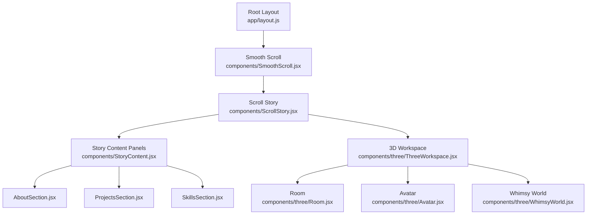
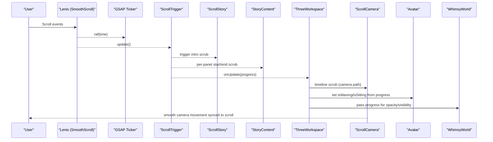
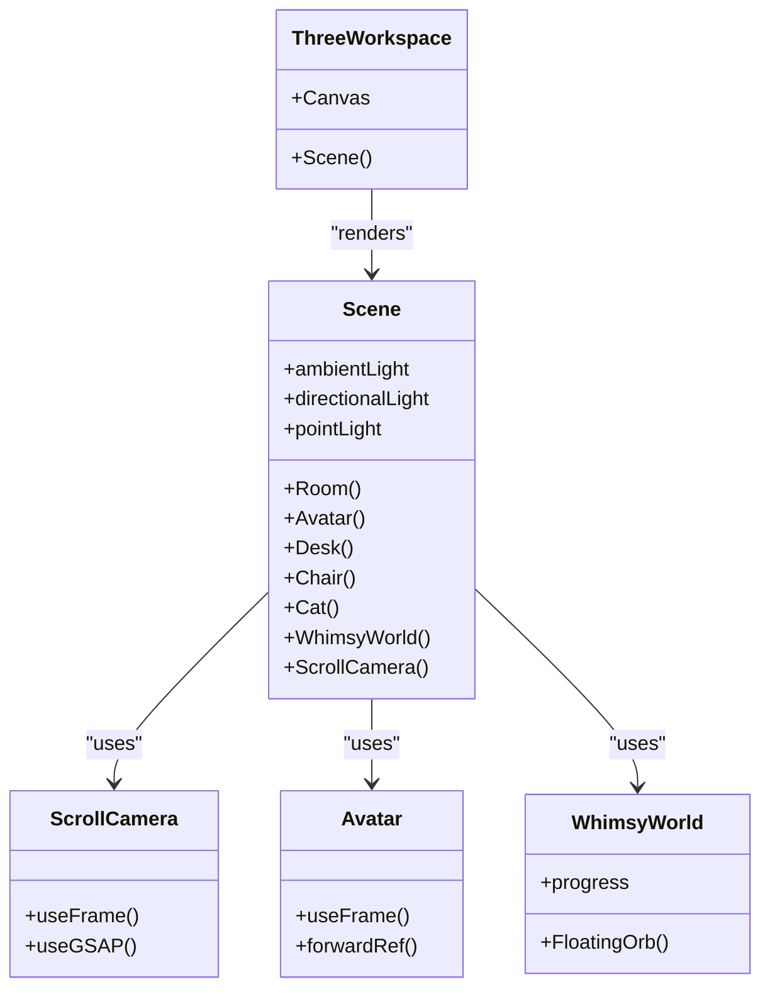
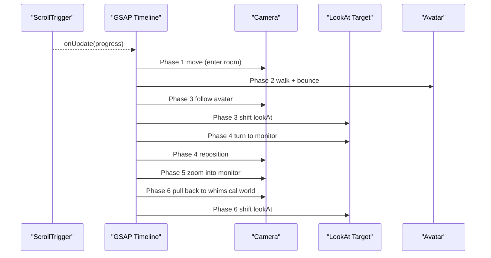
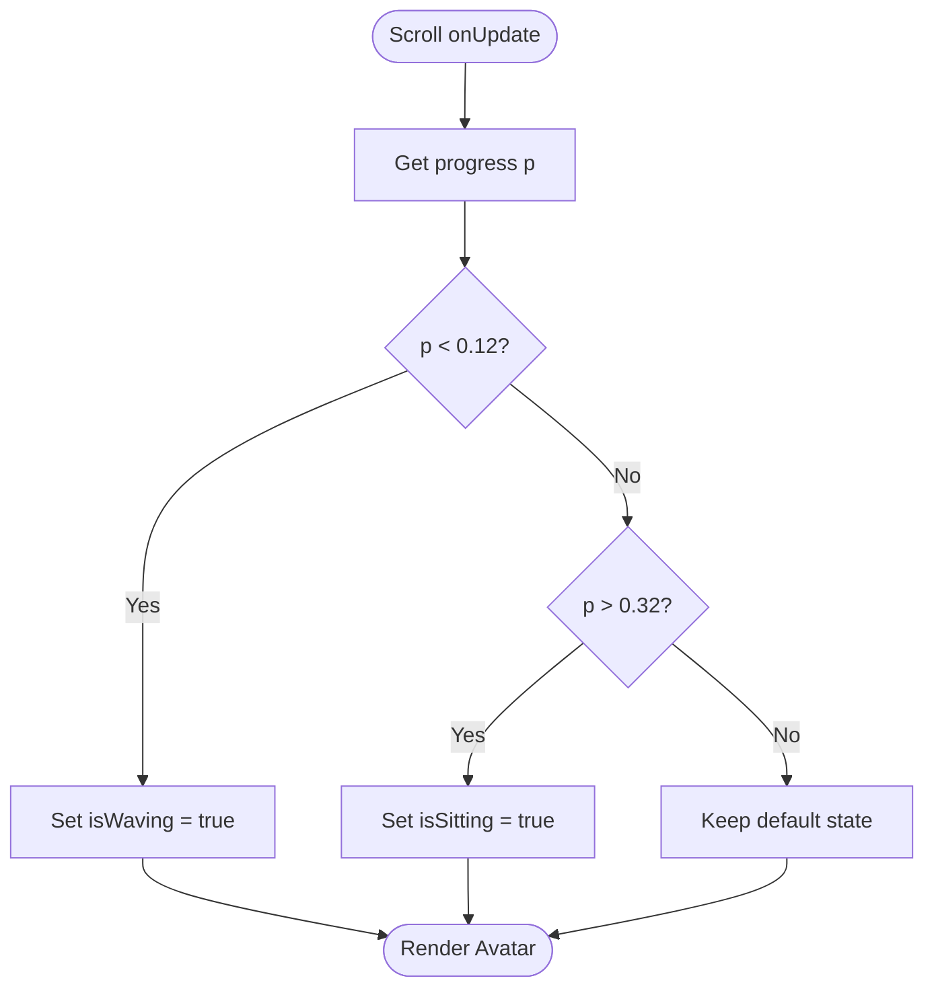
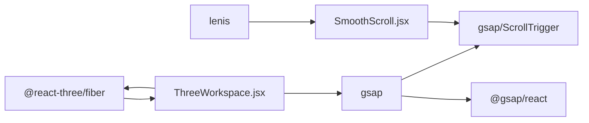

# Animation System

<cite>
**Referenced Files in This Document**
- [ScrollStory.jsx](file://components/ScrollStory.jsx)
- [SmoothScroll.jsx](file://components/SmoothScroll.jsx)
- [StoryContent.jsx](file://components/StoryContent.jsx)
- [ThreeWorkspace.jsx](file://components/three/ThreeWorkspace.jsx)
- [Room.jsx](file://components/three/Room.jsx)
- [Avatar.jsx](file://components/three/Avatar.jsx)
- [WhimsyWorld.jsx](file://components/three/WhimsyWorld.jsx)
- [AboutSection.jsx](file://components/sections/AboutSection.jsx)
- [ProjectsSection.jsx](file://components/sections/ProjectsSection.jsx)
- [SkillsSection.jsx](file://components/sections/SkillsSection.jsx)
- [layout.js](file://app/layout.js)
- [globals.css](file://app/globals.css)
- [package.json](file://package.json)
</cite>

## Table of Contents
1. [Introduction](#introduction)
2. [Project Structure](#project-structure)
3. [Core Components](#core-components)
4. [Architecture Overview](#architecture-overview)
5. [Detailed Component Analysis](#detailed-component-analysis)
6. [Dependency Analysis](#dependency-analysis)
7. [Performance Considerations](#performance-considerations)
8. [Troubleshooting Guide](#troubleshooting-guide)
9. [Conclusion](#conclusion)
10. [Appendices](#appendices)

## Introduction
This document explains the scroll-driven animation system built with GSAP and ScrollTrigger, integrated with a React Three Fiber 3D scene. It covers how scroll position drives camera movements, character animations, and content transitions between 2D panels and the 3D world. It also provides configuration guidance for timing and easing, performance optimization techniques, examples for customizing animations and triggers, debugging strategies, and notes on cross-browser compatibility and mobile considerations.

## Project Structure
The animation system is composed of:
- A smooth scrolling layer that integrates Lenis with GSAP’s ticker and ScrollTrigger.
- A scroll story container that coordinates intro animations, 2D content overlays, and the 3D workspace.
- A 3D scene that animates camera, avatar, and whimsical elements based on scroll progress.
- Section components that fade in/out as overlays synchronized to scroll.

**Diagram sources**
- [layout.js:40-55](file://app/layout.js#L40-L55)
- [SmoothScroll.jsx:10-46](file://components/SmoothScroll.jsx#L10-L46)
- [ScrollStory.jsx:13-69](file://components/ScrollStory.jsx#L13-L69)
- [StoryContent.jsx:26-90](file://components/StoryContent.jsx#L26-L90)
- [ThreeWorkspace.jsx:168-186](file://components/three/ThreeWorkspace.jsx#L168-L186)
- [Room.jsx:12-64](file://components/three/Room.jsx#L12-L64)
- [Avatar.jsx:64-164](file://components/three/Avatar.jsx#L64-L164)
- [WhimsyWorld.jsx:34-76](file://components/three/WhimsyWorld.jsx#L34-L76)

**Section sources**
- [layout.js:40-55](file://app/layout.js#L40-L55)
- [package.json:11-22](file://package.json#L11-L22)

## Core Components
- SmoothScroll: Wraps the app with Lenis for smooth scrolling and synchronizes it with GSAP’s ticker and ScrollTrigger updates. Respects reduced motion preferences.
- ScrollStory: Registers ScrollTrigger, animates the intro overlay, and composes StoryContent and ThreeWorkspace within a sticky container.
- StoryContent: Manages 2D panel overlays (About, Projects, Skills, etc.) with per-panel entrance and exit animations bound to scroll ranges.
- ThreeWorkspace: Hosts the R3F Canvas and orchestrates a multi-phase GSAP timeline driven by scroll to move the camera, animate the avatar, and transition into a whimsical world.
- Room, Avatar, WhimsyWorld: Build the 3D environment and characters; Avatar reacts to state changes driven by scroll progress.

Key integration points:
- ScrollTrigger is registered globally in multiple components.
- useGSAP hooks are used to create timelines scoped to refs.
- The 3D scene reads scroll progress via ScrollTrigger callbacks and updates component state to drive character behavior and scene visibility.

**Section sources**
- [SmoothScroll.jsx:10-46](file://components/SmoothScroll.jsx#L10-L46)
- [ScrollStory.jsx:13-69](file://components/ScrollStory.jsx#L13-L69)
- [StoryContent.jsx:17-90](file://components/StoryContent.jsx#L17-L90)
- [ThreeWorkspace.jsx:23-186](file://components/three/ThreeWorkspace.jsx#L23-L186)
- [Avatar.jsx:64-164](file://components/three/Avatar.jsx#L64-L164)
- [WhimsyWorld.jsx:34-76](file://components/three/WhimsyWorld.jsx#L34-L76)

## Architecture Overview
The architecture layers scroll input, animation orchestration, and rendering:

**Diagram sources**
- [SmoothScroll.jsx:13-43](file://components/SmoothScroll.jsx#L13-L43)
- [ScrollStory.jsx:17-34](file://components/ScrollStory.jsx#L17-L34)
- [StoryContent.jsx:30-75](file://components/StoryContent.jsx#L30-L75)
- [ThreeWorkspace.jsx:31-95](file://components/three/ThreeWorkspace.jsx#L31-L95)
- [ThreeWorkspace.jsx:110-124](file://components/three/ThreeWorkspace.jsx#L110-L124)
- [WhimsyWorld.jsx:34-76](file://components/three/WhimsyWorld.jsx#L34-L76)

## Detailed Component Analysis

### SmoothScroll (Lenis + GSAP Integration)
- Initializes Lenis with duration, easing, orientation, touch multiplier, and smooth wheel.
- Binds Lenis scroll events to ScrollTrigger.update so ScrollTrigger sees Lenis’ virtual scroll.
- Integrates Lenis with GSAP’s ticker using gsap.ticker.add for frame-synced updates.
- Disables lag smoothing to keep scroll and animation tightly coupled.
- Respects prefers-reduced-motion to adjust duration.

Configuration highlights:
- Duration and easing can be tuned for desired scroll feel.
- TouchMultiplier affects mobile scroll sensitivity.
- Use matchMedia to disable or reduce motion for accessibility.

**Section sources**
- [SmoothScroll.jsx:13-43](file://components/SmoothScroll.jsx#L13-L43)
- [package.json:11-22](file://package.json#L11-L22)

### ScrollStory (Intro Animations and Composition)
- Registers ScrollTrigger once at module level.
- Uses useGSAP to animate the intro element with a scrubbed timeline tied to the story container.
- Composes StoryContent and ThreeWorkspace inside a sticky wrapper to ensure overlays and 3D render together during scroll.

Timeline characteristics:
- Intro fades out and moves up while scaling slightly as user scrolls into the story.
- Scrubbing ensures animations are directly driven by scroll position.

**Section sources**
- [ScrollStory.jsx:11-34](file://components/ScrollStory.jsx#L11-L34)
- [ScrollStory.jsx:36-69](file://components/ScrollStory.jsx#L36-L69)

### StoryContent (2D Panel Overlays)
- Defines PANELS with id, component, and start/end percentages relative to the story container.
- For each panel:
  - Creates an entrance animation (fade-in, slide-up, scale) triggered at a specific scroll range.
  - Creates an exit animation (fade-out, slide-up, slight scale-down) near the end of its range.
- All animations are scrubbed to scroll for precise synchronization.

Customization tips:
- Adjust start/end values to change when panels appear/disappear.
- Modify animation properties (opacity, y, scale) to change panel transitions.
- Add new panels by extending the PANELS array.

**Section sources**
- [StoryContent.jsx:17-24](file://components/StoryContent.jsx#L17-L24)
- [StoryContent.jsx:30-75](file://components/StoryContent.jsx#L30-L75)
- [AboutSection.jsx:5-29](file://components/sections/AboutSection.jsx#L5-L29)
- [ProjectsSection.jsx:6-43](file://components/sections/ProjectsSection.jsx#L6-L43)
- [SkillsSection.jsx:5-42](file://components/sections/SkillsSection.jsx#L5-L42)

### ThreeWorkspace (3D Scene and Scroll-Driven Timeline)
- Sets up a R3F Canvas with shadows and camera settings.
- ScrollCamera:
  - Creates a GSAP timeline bound to the entire story container with scrub enabled.
  - Defines phases:
    1) Enter room: camera moves forward.
    2) Avatar walks toward desk: avatar position changes; walking bounce added.
    3) Camera follows avatar: target lookAt shifts.
    4) Turn toward monitor: camera reorients.
    5) Zoom into monitor: close-up view.
    6) Pull back into whimsical world: wide shot transition.
- Scene:
  - Listens to ScrollTrigger onUpdate to compute progress.
  - Updates avatar state (waving/sitting) based on thresholds.
  - Passes progress to WhimsyWorld to control visibility and effects.

Timeline details:
- Easing varies per phase (none, power1.inOut, power2.inOut).
- Durations define pacing; scrub ties them to scroll distance.

**Section sources**
- [ThreeWorkspace.jsx:23-98](file://components/three/ThreeWorkspace.jsx#L23-L98)
- [ThreeWorkspace.jsx:104-162](file://components/three/ThreeWorkspace.jsx#L104-L162)
- [ThreeWorkspace.jsx:168-186](file://components/three/ThreeWorkspace.jsx#L168-L186)

#### Class Diagram: 3D Scene Components

**Diagram sources**
- [ThreeWorkspace.jsx:104-186](file://components/three/ThreeWorkspace.jsx#L104-L186)
- [Avatar.jsx:64-164](file://components/three/Avatar.jsx#L64-L164)
- [WhimsyWorld.jsx:34-76](file://components/three/WhimsyWorld.jsx#L34-L76)

#### Sequence Diagram: Scroll-Driven Camera Path

**Diagram sources**
- [ThreeWorkspace.jsx:31-95](file://components/three/ThreeWorkspace.jsx#L31-L95)

#### Flowchart: Avatar State Driven by Progress

**Diagram sources**
- [ThreeWorkspace.jsx:110-124](file://components/three/ThreeWorkspace.jsx#L110-L124)
- [Avatar.jsx:76-106](file://components/three/Avatar.jsx#L76-L106)

### Room, Avatar, WhimsyWorld
- Room: Builds the environment geometry (floor, walls, baseboards, window, shelf, plant).
- Avatar: Procedural character with animated arms and breathing; responds to waving/sitting states.
- WhimsyWorld: Floating platforms and orbs that become visible as scroll progresses beyond a threshold.

**Section sources**
- [Room.jsx:12-64](file://components/three/Room.jsx#L12-L64)
- [Avatar.jsx:64-164](file://components/three/Avatar.jsx#L64-L164)
- [WhimsyWorld.jsx:34-76](file://components/three/WhimsyWorld.jsx#L34-L76)

## Dependency Analysis
- GSAP and ScrollTrigger are imported and registered across multiple components.
- @gsap/react provides useGSAP hook for declarative timeline creation.
- React Three Fiber (Canvas, useFrame, useThree) powers the 3D scene.
- Lenis provides smooth scrolling and integrates with GSAP’s ticker.

**Diagram sources**
- [package.json:11-22](file://package.json#L11-L22)
- [SmoothScroll.jsx:1-8](file://components/SmoothScroll.jsx#L1-L8)
- [ScrollStory.jsx:1-11](file://components/ScrollStory.jsx#L1-L11)
- [StoryContent.jsx:1-15](file://components/StoryContent.jsx#L1-L15)
- [ThreeWorkspace.jsx:1-17](file://components/three/ThreeWorkspace.jsx#L1-L17)

**Section sources**
- [package.json:11-22](file://package.json#L11-L22)
- [SmoothScroll.jsx:1-8](file://components/SmoothScroll.jsx#L1-L8)
- [ScrollStory.jsx:1-11](file://components/ScrollStory.jsx#L1-L11)
- [StoryContent.jsx:1-15](file://components/StoryContent.jsx#L1-L15)
- [ThreeWorkspace.jsx:1-17](file://components/three/ThreeWorkspace.jsx#L1-L17)

## Performance Considerations
- Use scrub judiciously: high scrub values tie animations tightly to scroll but can increase recalculations.
- Limit heavy computations in useFrame; prefer GSAP timelines for most scroll-driven changes.
- Reduce shadow map size if needed; current setup uses 2048x2048 which may impact lower-end devices.
- Disable or reduce motion for users with prefers-reduced-motion to improve accessibility and performance.
- On mobile, tune touchMultiplier and consider lowering dpr for smoother interactions.
- Avoid excessive DOM nodes in overlays; keep panel content lightweight.
- Reuse refs and avoid unnecessary re-renders in tight loops.

[No sources needed since this section provides general guidance]

## Troubleshooting Guide
Common issues and resolutions:
- Animations not triggering:
  - Ensure ScrollTrigger is registered before creating timelines.
  - Verify trigger elements exist and refs are attached correctly.
- Stuttering or lag:
  - Check lenis initialization and ensure gsap.ticker.lagSmoothing is configured appropriately.
  - Reduce dpr or shadow quality on low-power devices.
- Misaligned panels:
  - Adjust start/end percentages in PANELS to match your layout height and spacing.
- Camera jumps:
  - Confirm timeline scrub ranges cover the full story container and that positions/targets are consistent.
- Mobile scroll feels off:
  - Adjust touchMultiplier and duration in Lenis config.
  - Test on actual devices; consider reducing animation complexity.

Debugging steps:
- Log ScrollTrigger progress in onUpdate to verify ranges.
- Temporarily remove scrub to isolate time-based vs scroll-based issues.
- Inspect DOM refs to ensure they point to correct elements.
- Use browser dev tools to check GPU usage and frame rates.

**Section sources**
- [SmoothScroll.jsx:13-43](file://components/SmoothScroll.jsx#L13-L43)
- [StoryContent.jsx:30-75](file://components/StoryContent.jsx#L30-L75)
- [ThreeWorkspace.jsx:31-95](file://components/three/ThreeWorkspace.jsx#L31-L95)
- [ThreeWorkspace.jsx:110-124](file://components/three/ThreeWorkspace.jsx#L110-L124)

## Conclusion
The animation system combines smooth scrolling with GSAP timelines and ScrollTrigger to synchronize 2D content panels and a 3D scene. The result is a cohesive narrative where scroll drives camera paths, character behaviors, and visual transitions. By tuning durations, easings, and scrub settings, you can craft precise experiences. The modular structure allows easy extension with new panels or scene phases, while respecting accessibility and performance best practices.

[No sources needed since this section summarizes without analyzing specific files]

## Appendices

### Configuration Options
- SmoothScroll:
  - duration: controls scroll inertia.
  - easing: function for scroll curve.
  - touchMultiplier: adjusts mobile scroll sensitivity.
  - prefers-reduced-motion: reduces motion for accessibility.
- StoryContent panels:
  - start/end: percentage ranges controlling panel visibility windows.
  - animation properties: opacity, y, scale for entrance/exit.
- ThreeWorkspace timeline:
  - Phase timings and easings determine camera and avatar motion.
  - LookAt target adjustments steer camera focus.
  - Progress thresholds control avatar states and whimsical world visibility.

**Section sources**
- [SmoothScroll.jsx:20-27](file://components/SmoothScroll.jsx#L20-L27)
- [StoryContent.jsx:17-24](file://components/StoryContent.jsx#L17-L24)
- [ThreeWorkspace.jsx:31-95](file://components/three/ThreeWorkspace.jsx#L31-L95)
- [ThreeWorkspace.jsx:110-124](file://components/three/ThreeWorkspace.jsx#L110-L124)

### Examples: Creating Custom Animations
- Add a new panel:
  - Extend PANELS with a new id, component, and start/end ranges.
  - The existing loop will automatically apply entrance and exit animations.
- Adjust scroll triggers:
  - Change start/end percentages to shift when panels appear/disappear.
- Customize 3D timeline:
  - Insert new tl.to calls with appropriate targets and easings.
  - Update lookAt target positions to guide camera focus.

**Section sources**
- [StoryContent.jsx:17-24](file://components/StoryContent.jsx#L17-L24)
- [StoryContent.jsx:30-75](file://components/StoryContent.jsx#L30-L75)
- [ThreeWorkspace.jsx:31-95](file://components/three/ThreeWorkspace.jsx#L31-L95)

### Cross-Browser Compatibility and Mobile Considerations
- Browser support:
  - GSAP and ScrollTrigger work across modern browsers; ensure polyfills if targeting older environments.
  - R3F and Three.js require WebGL-enabled browsers.
- Mobile:
  - Use touchMultiplier to fine-tune scroll feel.
  - Consider lowering dpr and disabling heavy shadows on low-end devices.
  - Respect prefers-reduced-motion for accessibility.
- Accessibility:
  - Provide alternatives for motion-heavy sequences.
  - Ensure keyboard navigation remains functional alongside scroll-driven experiences.

**Section sources**
- [SmoothScroll.jsx:16-27](file://components/SmoothScroll.jsx#L16-L27)
- [ThreeWorkspace.jsx:168-186](file://components/three/ThreeWorkspace.jsx#L168-L186)
- [package.json:11-22](file://package.json#L11-L22)