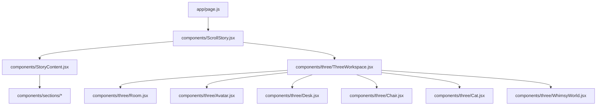
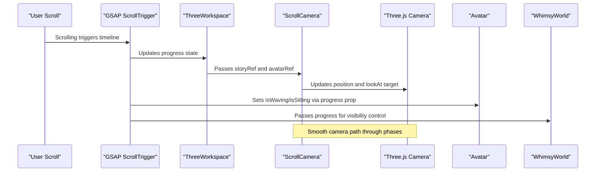
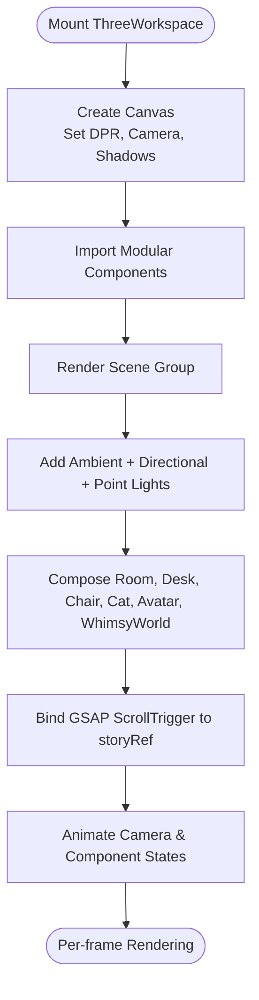
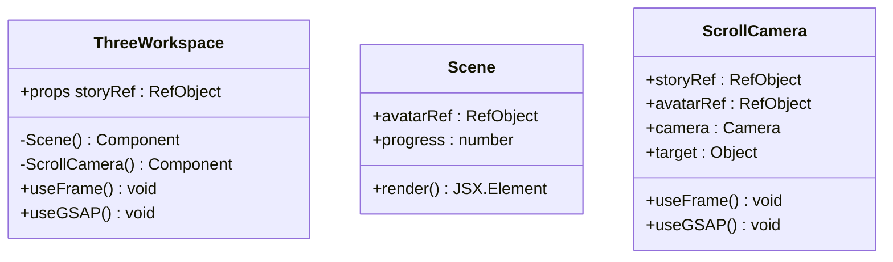

# 3D Scene Organization

<cite>
**Referenced Files in This Document**
- [ThreeWorkspace.jsx](file://components/three/ThreeWorkspace.jsx)
- [Room.jsx](file://components/three/Room.jsx)
- [Avatar.jsx](file://components/three/Avatar.jsx)
- [Desk.jsx](file://components/three/Desk.jsx)
- [Chair.jsx](file://components/three/Chair.jsx)
- [Cat.jsx](file://components/three/Cat.jsx)
- [WhimsyWorld.jsx](file://components/three/WhimsyWorld.jsx)
- [ScrollStory.jsx](file://components/ScrollStory.jsx)
- [StoryContent.jsx](file://components/StoryContent.jsx)
- [page.js](file://app/page.js)
</cite>

## Update Summary
**Changes Made**
- Enhanced Avatar component description to reflect new sophisticated hair rendering system using CatmullRom curves and TubeGeometry
- Updated visual details section to include comprehensive color palette and decorative elements
- Improved animation system documentation with better frame-based updates
- Added detailed breakdown of advanced hair components including Ringlet, BackCrownRinglet, and CrownSurfaceCurl
- Enhanced technical implementation details for realistic spiral hair effects

## Table of Contents
1. [Introduction](#introduction)
2. [Project Structure](#project-structure)
3. [Core Components](#core-components)
4. [Architecture Overview](#architecture-overview)
5. [Modular Component Design](#modular-component-design)
6. [Detailed Component Analysis](#detailed-component-analysis)
7. [Dependency Analysis](#dependency-analysis)
8. [Performance Considerations](#performance-considerations)
9. [Troubleshooting Guide](#troubleshooting-guide)
10. [Conclusion](#conclusion)
11. [Appendices](#appendices)

## Introduction
This document explains the 3D scene organization system built with React Three Fiber and GSAP ScrollTrigger. The system has been refactored from a monolithic implementation into a modular architecture where each 3D element (Room, Avatar, Desk, Chair, Cat, WhimsyWorld) is encapsulated in its own component file. This approach improves code maintainability, testability, and performance while maintaining the same scroll-driven narrative experience that transitions from a realistic room environment into a whimsical world.

The modular design enables better separation of concerns, making it easier to add new 3D objects, manage complex animations, and optimize performance through selective updates. Each component manages its own state, animations, and rendering logic while coordinating with the central ThreeWorkspace orchestrator.

## Project Structure
The 3D experience follows a hierarchical component structure where the top-level page mounts a scroll story containing both overlay content and the 3D workspace. The ThreeWorkspace component serves as the central coordinator, importing and composing all modular 3D components.



**Diagram sources**
- [page.js:1-66](file://app/page.js#L1-L66)
- [ScrollStory.jsx:1-70](file://components/ScrollStory.jsx#L1-L70)
- [ThreeWorkspace.jsx:1-175](file://components/three/ThreeWorkspace.jsx#L1-L175)

**Section sources**
- [page.js:1-66](file://app/page.js#L1-L66)
- [ScrollStory.jsx:1-70](file://components/ScrollStory.jsx#L1-L70)

## Core Components
The modular architecture consists of specialized components, each responsible for a specific aspect of the 3D scene:

- **ThreeWorkspace**: Central orchestrator that creates the Canvas, manages lighting, coordinates camera animation via GSAP ScrollTrigger, and composes all scene objects
- **Room**: Static environment geometry including floor, walls, baseboards, window frame, shelf, and decorative plants
- **Avatar**: Sophisticated animated character with advanced hair rendering system using CatmullRom curves and TubeGeometry, featuring realistic spiral effects and comprehensive state management
- **Desk**: Furniture piece with monitor, keyboard, books, mug with animated steam, and desk plant
- **Chair**: Office chair with backrest, seat, pole, base, crochet blanket pattern, and decorative heart detail
- **Cat**: Small animated companion with tail and head sway animations
- **WhimsyWorld**: Transition environment with floating platforms, orbs, and tiny trees that fade in during the final phase

Key responsibilities distributed across modules:
- Scene composition and hierarchy management under dedicated groups per component
- Animation loops using useFrame for per-frame updates within individual components
- State-driven behavior coordination between parent and child components
- Camera choreography centralized in ThreeWorkspace but affecting multiple components

**Section sources**
- [ThreeWorkspace.jsx:98-151](file://components/three/ThreeWorkspace.jsx#L98-L151)
- [Room.jsx:40-153](file://components/three/Room.jsx#L40-L153)
- [Avatar.jsx:98-223](file://components/three/Avatar.jsx#L98-L223)
- [Desk.jsx:110-129](file://components/three/Desk.jsx#L110-L129)
- [Chair.jsx:12-47](file://components/three/Chair.jsx#L12-L47)
- [Cat.jsx:15-59](file://components/three/Cat.jsx#L15-L59)
- [WhimsyWorld.jsx:34-76](file://components/three/WhimsyWorld.jsx#L34-L76)

## Architecture Overview
The modular architecture centers around a single Canvas hosting a Scene, with each 3D element encapsulated in its own component file. The ThreeWorkspace component imports and composes these modules, managing the overall scene graph, lighting configuration, and camera choreography. A dedicated ScrollCamera controller drives camera movement based on scroll position, while individual components handle their own internal animations and state management.



**Diagram sources**
- [ThreeWorkspace.jsx:23-92](file://components/three/ThreeWorkspace.jsx#L23-L92)
- [ThreeWorkspace.jsx:98-151](file://components/three/ThreeWorkspace.jsx#L98-L151)
- [ThreeWorkspace.jsx:157-175](file://components/three/ThreeWorkspace.jsx#L157-L175)

**Section sources**
- [ThreeWorkspace.jsx:23-92](file://components/three/ThreeWorkspace.jsx#L23-L92)
- [ThreeWorkspace.jsx:98-151](file://components/three/ThreeWorkspace.jsx#L98-L151)

## Modular Component Design
The refactoring introduces a clean separation of concerns where each 3D element is encapsulated in its own module. This design pattern provides several benefits:

### Component Isolation
Each component maintains its own namespace, props, and internal state. For example, the Room component contains all room-related geometry and animations without leaking implementation details to other components.

### Reusable Patterns
Common patterns like the Box helper component are defined locally within each file, reducing duplication while maintaining component independence. Each component can define its own styling conventions and animation approaches.

### Performance Optimization
Components only run useFrame loops when they need per-frame updates. Static elements like Room don't consume CPU cycles, while animated components like Avatar and Cat efficiently update only what's necessary.

### Testability and Maintenance
Individual components can be tested and debugged independently. Changes to one component (like updating the Avatar's appearance) don't require modifications to unrelated components.



**Diagram sources**
- [ThreeWorkspace.jsx:157-175](file://components/three/ThreeWorkspace.jsx#L157-L175)
- [ThreeWorkspace.jsx:98-151](file://components/three/ThreeWorkspace.jsx#L98-L151)
- [ThreeWorkspace.jsx:23-92](file://components/three/ThreeWorkspace.jsx#L23-L92)

## Detailed Component Analysis

### ThreeWorkspace: Central Orchestrator
The refactored ThreeWorkspace component serves as the main entry point, providing a clean interface for scene composition while delegating specific responsibilities to modular components.

**Updated** The component now focuses on orchestration rather than implementation, importing and composing modular components instead of containing all logic inline.

Key responsibilities:
- Initializes Canvas with shadows enabled and optimized DPR range [1, 1.5]
- Configures default perspective camera with appropriate field of view and near/far planes
- Composes scene by rendering imported modular components (Room, Avatar, Desk, Chair, Cat, WhimsyWorld)
- Adds comprehensive lighting setup: ambient light, directional light with shadow mapping, and three colored point lights
- Coordinates camera motion and avatar states via GSAP ScrollTrigger timelines bound to scroll container ref
- Uses imperative refs to access Avatar's root group for repositioning during scroll animations



**Diagram sources**
- [ThreeWorkspace.jsx:23-92](file://components/three/ThreeWorkspace.jsx#L23-L92)
- [ThreeWorkspace.jsx:98-151](file://components/three/ThreeWorkspace.jsx#L98-L151)
- [ThreeWorkspace.jsx:157-175](file://components/three/ThreeWorkspace.jsx#L157-L175)

**Section sources**
- [ThreeWorkspace.jsx:23-92](file://components/three/ThreeWorkspace.jsx#L23-L92)
- [ThreeWorkspace.jsx:98-151](file://components/three/ThreeWorkspace.jsx#L98-L151)
- [ThreeWorkspace.jsx:157-175](file://components/three/ThreeWorkspace.jsx#L157-L175)

### Room: Environment Geometry Module
The Room component encapsulates all static environment geometry in a single, well-organized module. It provides the foundational room structure with warm cream wood flooring, colorful patterned rug, soft peach and mint walls, baseboards, window frame with curtains, wall art, bookshelf with colorful books, and decorative plants.

**Updated** Now completely self-contained with no dependencies on other 3D components, making it easily reusable and testable.

Key features:
- Floor plane with warm cream color and circular patterned rug
- Back and left walls with soft pastel colors and polka dot decorations
- Window frame with pink curtains and yellow valance
- Wall art and posters with colorful abstract designs
- Bookshelf with organized colorful books and small potted plant
- Hanging plant near window with animated leaf movement
- Floor plant near desk area with detailed foliage

**Section sources**
- [Room.jsx:1-154](file://components/three/Room.jsx#L1-L154)

### Avatar: Advanced Character Module with Sophisticated Hair Rendering
The Avatar component represents a highly sophisticated character built from grouped primitives, featuring an advanced hair rendering system that replaces basic blocky curls with realistic spiral effects using CatmullRom curves and TubeGeometry. It exposes an imperative handle allowing parent components to access its root group for positioning during scroll animations.

**Updated** Enhanced with a revolutionary hair rendering system utilizing CatmullRom curves and TubeGeometry for realistic spiral hair effects, comprehensive color palette system, and improved animation framework with better frame-based updates.

#### Advanced Hair Rendering System
The Avatar now features a sophisticated multi-layered hair system composed of several specialized components:

- **Ringlet Component**: Creates realistic spiral curls using CatmullRomCurve3 paths with TubeGeometry, featuring smooth tapering and natural volume
- **BackCrownRinglet Component**: Generates curls that follow the curved surface of the scalp cap, positioned tangent to the surface for natural growth appearance
- **CrownSurfaceCurl Component**: Places curls directly on the crown surface, following the ellipsoid geometry for seamless integration
- **Hair Component**: Orchestrates the complete hair system with proper layering and positioning

#### Comprehensive Color Palette System
The Avatar implements a detailed color system with carefully selected hues:

- **Skin Tones**: Warm peach (#f4c5a5) with subtle shadow variations (#e8b492)
- **Hair Colors**: Rich dark brown (#3c302d) with highlight variations (#4d3d39)
- **Clothing**: Light blue kurta (#9fd8f5) with complementary shades and accents
- **Decorative Elements**: Pink (#ff70a6), cream (#fff4e8), and accent colors throughout

#### Enhanced Animation System
The Avatar features improved frame-based animations with better performance:

- **Wave Animation**: Sinusoidal arm movement during standing phase with smooth transitions
- **Sitting Animation**: Complex leg rotation and arm positioning with progressive state changes
- **Breathing Animation**: Continuous subtle body movement using clock-based timing
- **Hair Physics**: Realistic curl movement and interaction with character poses

Characteristics:
- Built from grouped primitives representing legs, shoes, body, arms, head, face, and sophisticated hair system
- Exposes imperative handle for parent component positioning control
- Animates arm rotations for waving or resting when sitting
- Applies gentle breathing animation to body group
- Supports props to toggle waving and sitting modes driven by scroll progress
- Features advanced curly hair with realistic spiral structures using CatmullRom curves
- Includes pixel-art style floral embroidery and decorative elements

Animation behaviors:
- Wave animation during initial standing phase with sinusoidal arm movement
- Smooth transition to sitting pose with leg rotation and arm positioning
- Continuous breathing animation using clock-based timing
- Progressive state changes based on scroll progress values
- Realistic hair physics with natural curl movement

**Section sources**
- [Avatar.jsx:1-3562](file://components/three/Avatar.jsx#L1-L3562)

### Desk: Furniture and Details Module
The Desk component provides a complete furniture setup including monitor with emissive screen, stand, keyboard with key grid, stacked books, mug with animated steam, and desk plant.

**Updated** Enhanced with more detailed keyboard representation and improved steam animation effects.

Components include:
- Monitor with glowing blue screen and realistic stand
- Keyboard with detailed key grid layout
- Stack of colorful books with spine labels
- Mug with animated steam particles using opacity and rotation changes
- Desk plant with pot and detailed foliage arrangement

Animation features:
- Steam particles with per-frame opacity and rotation changes for subtle motion
- Realistic monitor glow effect using emissive materials

**Section sources**
- [Desk.jsx:1-129](file://components/three/Desk.jsx#L1-L129)

### Chair: Seating Module
The Chair component provides office seating with backrest, seat, pole, base, crochet blanket pattern, and decorative heart detail positioned relative to the desk area.

**Updated** Enhanced with more detailed crochet blanket pattern and improved decorative elements.

Features:
- Blue backrest with comfortable proportions
- Orange seat with realistic padding
- Silver pole and base for stability
- Crochet blanket draped over back with square pattern details
- Small crochet heart decoration on seat surface

**Section sources**
- [Chair.jsx:1-47](file://components/three/Chair.jsx#L1-L47)

### Cat: Animated Companion Module
The Cat component provides a small animated companion with simple voxel-style design featuring animated tail and head sway movements positioned near the room to add life to the scene.

**Updated** Enhanced with more natural animation timing and improved visual details.

Characteristics:
- Simple white voxel-style cat design
- Animated tail with sinusoidal rotation
- Head with subtle swaying motion
- Pink nose and dark eyes for facial features
- Positioned near room entrance for natural interaction

Animation behaviors:
- Tail wagging with smooth sinusoidal motion
- Head turning with gentle rotational animation
- Natural timing using clock-based calculations

**Section sources**
- [Cat.jsx:1-59](file://components/three/Cat.jsx#L1-L59)

### WhimsyWorld: Transition Environment Module
The WhimsyWorld component creates a magical transition environment that fades in as scroll progresses beyond a threshold. It contains floating platforms, translucent orbs with independent motion, and tiny voxel trees.

**Updated** Enhanced with more dynamic floating animations and improved visibility controls.

Features:
- Sunset gradient backdrop using large plane geometry
- Floating islands/platforms in various colors and positions
- Translucent orbs with independent floating animations
- Tiny voxel trees and plants scattered throughout
- Progress-based visibility control for smooth transitions

Animation behaviors:
- Floating orbs with individual sine-wave vertical motion
- Rotational animations for dynamic visual interest
- Opacity-based visibility controlled by scroll progress
- Smooth fade-in effect during transition phase

**Section sources**
- [WhimsyWorld.jsx:1-76](file://components/three/WhimsyWorld.jsx#L1-L76)

## Dependency Analysis
The modular architecture establishes clear dependency relationships where ThreeWorkspace depends on ScrollStory via shared storyRef, while individual components have minimal external dependencies.

```mermaid
graph LR
SS["ScrollStory.jsx"] --> TW["ThreeWorkspace.jsx"]
TW --> RW["Room.jsx"]
TW --> AV["Avatar.jsx"]
TW --> DK["Desk.jsx"]
TW --> CH["Chair.jsx"]
TW --> CT["Cat.jsx"]
TW --> WW["WhimsyWorld.jsx"]
SC["ScrollCamera (in ThreeWorkspace.jsx)"] --> AV
AV --> ["Imperative Ref"]
WW --> ["Progress Prop"]
```

**Diagram sources**
- [ScrollStory.jsx:1-70](file://components/ScrollStory.jsx#L1-L70)
- [ThreeWorkspace.jsx:1-175](file://components/three/ThreeWorkspace.jsx#L1-L175)

**Section sources**
- [ScrollStory.jsx:1-70](file://components/ScrollStory.jsx#L1-L70)
- [ThreeWorkspace.jsx:1-175](file://components/three/ThreeWorkspace.jsx#L1-L175)

## Performance Considerations
The modular architecture provides several performance benefits through selective updates and efficient resource management:

### Selective Updates
- Only components requiring per-frame updates implement useFrame hooks (Avatar arms/body, Cat tail/head, Desk steam, WhimsyWorld orbs)
- Static geometry components like Room do not run update loops, reducing CPU overhead
- Individual components manage their own animation efficiency

### Appropriate DPR Settings
- DPR set to range [1, 1.5] to balance visual quality and GPU usage across different devices
- Prevents excessive pixel density on high-DPI screens while maintaining clarity

### Shadow Optimization
- Directional light casts shadows with reasonable 2048x2048 map size
- Shadow camera frustum configured appropriately for scene bounds
- Minimal shadow-casting meshes where possible

### Visibility Management
- WhimsyWorld toggles visibility based on progress to avoid unnecessary rendering during early phases
- Components hide non-essential elements when not needed (e.g., Avatar shoes when sitting)

### Efficient Materials
- Reuse meshStandardMaterial instances where possible
- Avoid excessive transparency unless specifically required
- Use appropriate material properties for optimal rendering performance

### Advanced Hair Rendering Optimization
- CatmullRom curves and TubeGeometry geometries are memoized using useMemo for performance
- Complex hair geometries are computed once and reused across renders
- Efficient curve generation with optimized point calculations
- Proper memory management for complex 3D geometries

## Troubleshooting Guide
The modular architecture simplifies debugging and troubleshooting by isolating issues to specific components:

### Camera Not Following Scroll
- Verify storyRef is correctly passed from ScrollStory to ThreeWorkspace
- Ensure ScrollTrigger is properly registered and bound to correct trigger element
- Check that timeline scrub is enabled and trigger ranges are configured correctly

### Avatar Position Not Updating
- Confirm imperative ref is properly exposed and assigned to Avatar's root group
- Verify ScrollCamera has valid reference before attempting position animation
- Check that progress prop is being passed correctly from parent component

### Performance Issues
- Identify which components are running unnecessary useFrame loops
- Reduce shadow map size or disable shadows on non-essential meshes
- Limit transparency and complex materials; consider disabling WhimsyWorld earlier if needed
- Monitor component render counts using React DevTools

### Animation Problems
- Ensure useFrame logic is lightweight and avoids heavy computations
- Use delta time consistently for smooth animations across different frame rates
- Check that component refs are properly initialized before accessing in animation loops
- Verify that animation timing functions are appropriate for the desired effect

### Component Communication Issues
- Verify prop drilling is working correctly between parent and child components
- Check that imperative refs are properly exposed using useImperativeHandle
- Ensure event handlers and callbacks are properly bound and scoped

### Advanced Hair Rendering Issues
- Verify CatmullRomCurve3 points are properly calculated and normalized
- Check TubeGeometry parameters for appropriate segment counts
- Ensure proper memoization of complex geometries to prevent performance issues
- Validate curve continuity and smoothness for realistic hair appearance

**Section sources**
- [ThreeWorkspace.jsx:23-92](file://components/three/ThreeWorkspace.jsx#L23-L92)
- [ThreeWorkspace.jsx:98-151](file://components/three/ThreeWorkspace.jsx#L98-L151)
- [Avatar.jsx:98-223](file://components/three/Avatar.jsx#L98-L223)
- [Desk.jsx:77-94](file://components/three/Desk.jsx#L77-L94)
- [WhimsyWorld.jsx:34-76](file://components/three/WhimsyWorld.jsx#L34-L76)

## Conclusion
The refactored 3D scene organization demonstrates how modular architecture improves code maintainability, performance, and developer experience. By separating concerns into focused components, each responsible for specific aspects of the 3D environment, the system becomes more scalable and easier to extend. The ThreeWorkspace component serves as an effective orchestrator, coordinating the interactions between modular components while maintaining clean separation of concerns.

The enhanced Avatar component with its sophisticated hair rendering system showcases the power of modern 3D graphics techniques, using CatmullRom curves and TubeGeometry to create realistic spiral hair effects that replace basic blocky curls. This advancement significantly improves the visual quality and realism of the character while maintaining performance through efficient geometry optimization.

This modular approach makes it straightforward to add new 3D objects, manage complex animations, and optimize performance through selective updates. The architecture supports future enhancements while maintaining the scroll-driven narrative experience that transitions from a realistic room environment into a whimsical world.

## Appendices

### How to Add a New 3D Object
Following the modular pattern established by the refactoring:

1. Create a new component file under `components/three/` with a group root and compose primitives
2. If the object needs per-frame animation, implement useFrame hook with minimal operations
3. Import and render the component inside the Scene function in ThreeWorkspace alongside existing objects
4. If it should react to scroll, pass a derived prop from progress or expose a ref for external control
5. Follow established patterns for Box helpers, materials, and animation techniques

**Section sources**
- [ThreeWorkspace.jsx:98-151](file://components/three/ThreeWorkspace.jsx#L98-L151)

### Managing Scene State
The modular architecture uses a combination of local component state and parent-controlled props:

- Use local state in individual components for internal state management
- Pass props from ThreeWorkspace to control component behavior based on scroll progress
- Update state in response to ScrollTrigger's progress to synchronize UI and 3D behavior
- Leverage imperative refs for direct manipulation when needed

**Section sources**
- [ThreeWorkspace.jsx:98-151](file://components/three/ThreeWorkspace.jsx#L98-L151)

### Coordinating Animations Across Multiple Elements
The modular design enables sophisticated animation coordination:

- Centralize timeline creation in ScrollCamera to sequence camera moves and object behaviors
- Use consistent easing and durations to maintain smooth transitions between phases
- For continuous effects (steam, orbs, tail sway), rely on useFrame with clock-based math
- Coordinate component animations through shared progress props and imperative refs

**Section sources**
- [ThreeWorkspace.jsx:23-92](file://components/three/ThreeWorkspace.jsx#L23-L92)
- [Desk.jsx:77-94](file://components/three/Desk.jsx#L77-L94)
- [WhimsyWorld.jsx:15-32](file://components/three/WhimsyWorld.jsx#L15-L32)
- [Cat.jsx:15-59](file://components/three/Cat.jsx#L15-L59)

### Component Composition Patterns
The refactoring establishes several useful patterns for component composition:

- **Group-based organization**: Each component returns a group containing related geometry
- **Helper components**: Local helper components (Box, etc.) for common operations
- **Prop-driven behavior**: External state control through props for animation and visibility
- **Ref-based interaction**: Imperative handles for direct component manipulation
- **Scoped animations**: useFrame hooks within components for self-contained animation logic

### Advanced Hair Rendering Implementation
The Avatar's sophisticated hair system demonstrates advanced 3D graphics techniques:

- **CatmullRom Curves**: Used for creating smooth, organic curves that form the basis of realistic hair strands
- **TubeGeometry**: Applied along curve paths to create volumetric hair with proper thickness and surface detail
- **Multi-layered Approach**: Combines different types of curls (ringlets, crown curls, surface curls) for natural appearance
- **Performance Optimization**: Memoizes complex geometries and uses efficient curve calculations
- **Realistic Physics**: Implements proper positioning and orientation relative to the character's head shape

These patterns ensure consistency across the codebase while maintaining flexibility for future enhancements.