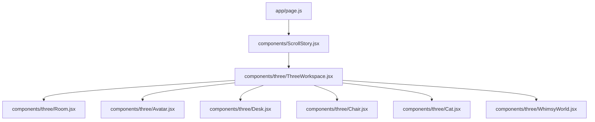
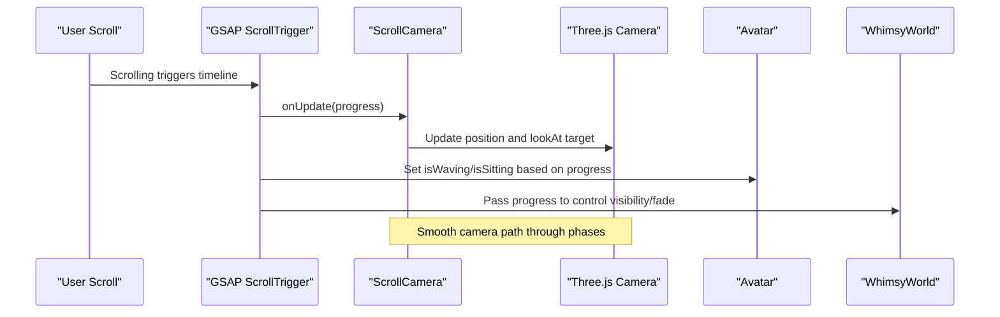
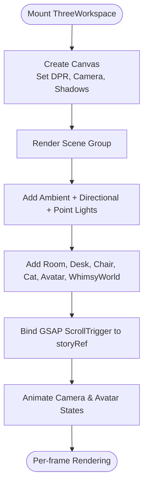
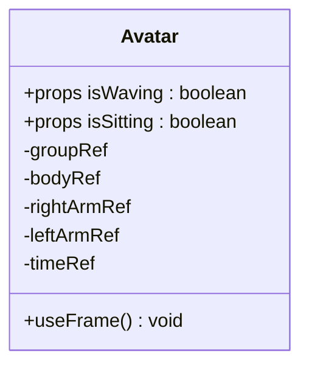
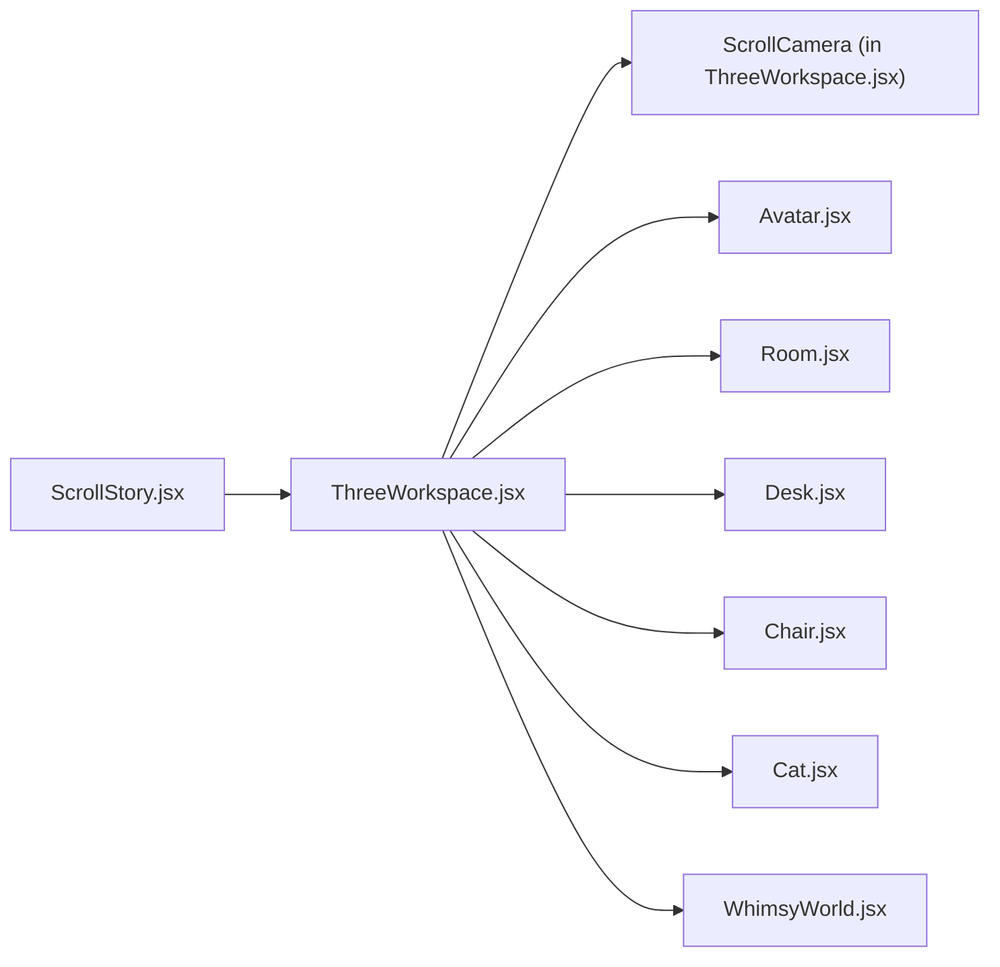

# 3D Scene Organization

<cite>
**Referenced Files in This Document**
- [ThreeWorkspace.jsx](file://components/three/ThreeWorkspace.jsx)
- [Room.jsx](file://components/three/Room.jsx)
- [Avatar.jsx](file://components/three/Avatar.jsx)
- [Desk.jsx](file://components/three/Desk.jsx)
- [Chair.jsx](file://components/three/Chair.jsx)
- [Cat.jsx](file://components/three/Cat.jsx)
- [WhimsyWorld.jsx](file://components/three/WhimsyWorld.jsx)
- [ScrollStory.jsx](file://components/ScrollStory.jsx)
- [page.js](file://app/page.js)
</cite>

## Table of Contents
1. [Introduction](#introduction)
2. [Project Structure](#project-structure)
3. [Core Components](#core-components)
4. [Architecture Overview](#architecture-overview)
5. [Detailed Component Analysis](#detailed-component-analysis)
6. [Dependency Analysis](#dependency-analysis)
7. [Performance Considerations](#performance-considerations)
8. [Troubleshooting Guide](#troubleshooting-guide)
9. [Conclusion](#conclusion)
10. [Appendices](#appendices)

## Introduction
This document explains the 3D scene organization system built with React Three Fiber and GSAP ScrollTrigger. It focuses on how ThreeWorkspace manages the Three.js scene graph, camera controls, lighting, and modular components (Room, Avatar, Desk, Chair, Cat), as well as how they are composed into a scroll-driven narrative that transitions into a whimsical world. You will learn about scene initialization, object lifecycle management, performance optimizations like selective updates and DPR settings, and practical examples for adding new objects, managing state, and coordinating animations across multiple elements.

## Project Structure
The 3D experience is embedded within a scroll-based story section. The top-level page renders a loading screen and then mounts the scroll story, which contains both overlay content and the 3D workspace.

**Diagram sources**
- [page.js:1-60](file://app/page.js#L1-L60)
- [ScrollStory.jsx:1-70](file://components/ScrollStory.jsx#L1-L70)
- [ThreeWorkspace.jsx:168-185](file://components/three/ThreeWorkspace.jsx#L168-L185)

**Section sources**
- [page.js:1-60](file://app/page.js#L1-L60)
- [ScrollStory.jsx:1-70](file://components/ScrollStory.jsx#L1-L70)

## Core Components
- ThreeWorkspace: Root component that creates the Canvas, sets up lighting, composes scene objects, and coordinates camera animation via GSAP ScrollTrigger.
- Room: Static environment geometry (floor, walls, baseboards, window frame, shelf, plant).
- Avatar: Character built from primitives with animated arms and breathing; supports waving and sitting states.
- Desk: Furniture with monitor, keyboard, books, mug with steam, and desk plant.
- Chair: Office chair with backrest, seat, pole, base, blanket, and small heart detail.
- Cat: Small character with animated tail and head.
- WhimsyWorld: Floating platforms, orbs, and tiny trees that fade in during the transition phase.

Key responsibilities:
- Scene composition and hierarchy under a single group per component.
- Animation loops using useFrame for per-frame updates.
- State-driven behavior (waving/sitting) passed from parent to child.
- Camera choreography tied to scroll progress.

**Section sources**
- [ThreeWorkspace.jsx:104-162](file://components/three/ThreeWorkspace.jsx#L104-L162)
- [Room.jsx:1-64](file://components/three/Room.jsx#L1-L64)
- [Avatar.jsx:64-163](file://components/three/Avatar.jsx#L64-L163)
- [Desk.jsx:110-129](file://components/three/Desk.jsx#L110-L129)
- [Chair.jsx:12-47](file://components/three/Chair.jsx#L12-L47)
- [Cat.jsx:15-59](file://components/three/Cat.jsx#L15-L59)
- [WhimsyWorld.jsx:34-76](file://components/three/WhimsyWorld.jsx#L34-L76)

## Architecture Overview
The architecture centers around a single Canvas that hosts a Scene. Within the Scene, modular components form a tree of groups and meshes. A dedicated ScrollCamera controller drives camera movement and target lookAt based on scroll position. Lighting is configured at the Scene level to provide ambient, directional, and point lights.

**Diagram sources**
- [ThreeWorkspace.jsx:23-98](file://components/three/ThreeWorkspace.jsx#L23-L98)
- [ThreeWorkspace.jsx:110-124](file://components/three/ThreeWorkspace.jsx#L110-L124)
- [ThreeWorkspace.jsx:168-185](file://components/three/ThreeWorkspace.jsx#L168-L185)

**Section sources**
- [ThreeWorkspace.jsx:23-98](file://components/three/ThreeWorkspace.jsx#L23-L98)
- [ThreeWorkspace.jsx:104-162](file://components/three/ThreeWorkspace.jsx#L104-L162)

## Detailed Component Analysis

### ThreeWorkspace: Scene Graph, Camera, Lighting, Composition
- Initializes a Canvas with shadows enabled and a DPR range to balance quality and performance.
- Configures a default perspective camera with field of view and near/far planes.
- Composes the scene by rendering Room, Avatar, Desk, Chair, Cat, and WhimsyWorld.
- Adds lighting: ambient, directional (with shadow map configuration), and two colored point lights.
- Coordinates camera motion and avatar states via GSAP ScrollTrigger timelines bound to a scroll container ref.
- Uses imperative refs to access Avatar’s root group for repositioning during scroll.

**Diagram sources**
- [ThreeWorkspace.jsx:168-185](file://components/three/ThreeWorkspace.jsx#L168-L185)
- [ThreeWorkspace.jsx:104-162](file://components/three/ThreeWorkspace.jsx#L104-L162)
- [ThreeWorkspace.jsx:23-98](file://components/three/ThreeWorkspace.jsx#L23-L98)

**Section sources**
- [ThreeWorkspace.jsx:168-185](file://components/three/ThreeWorkspace.jsx#L168-L185)
- [ThreeWorkspace.jsx:104-162](file://components/three/ThreeWorkspace.jsx#L104-L162)
- [ThreeWorkspace.jsx:23-98](file://components/three/ThreeWorkspace.jsx#L23-L98)

### Room: Environment Geometry
- Provides floor plane, soft rug, back/left walls, baseboards, window frame, shelf, and a small plant.
- Uses simple box and plane geometries with standard materials and receives shadows.

**Section sources**
- [Room.jsx:1-64](file://components/three/Room.jsx#L1-L64)

### Avatar: Animated Character with Stateful Behavior
- Built from grouped primitives representing legs, shoes, body, arms, head, face, and hair.
- Exposes imperative handle to allow parent to read its root group for positioning.
- Animates arm rotations for waving or resting when sitting; applies gentle breathing to the body group.
- Supports props to toggle waving and sitting modes, driven by scroll progress.

**Diagram sources**
- [Avatar.jsx:64-163](file://components/three/Avatar.jsx#L64-L163)

**Section sources**
- [Avatar.jsx:64-163](file://components/three/Avatar.jsx#L64-L163)

### Desk: Furniture and Details
- Includes monitor with emissive screen, stand, keyboard with key grid, stacked books, mug with animated steam, and a desk plant.
- Steam uses per-frame opacity and rotation changes for subtle motion.

**Section sources**
- [Desk.jsx:15-129](file://components/three/Desk.jsx#L15-L129)

### Chair: Seating with Decorative Elements
- Backrest, seat, pole, base, crochet blanket pattern, and a small heart detail.
- Positioned relative to the desk area for natural interaction.

**Section sources**
- [Chair.jsx:12-47](file://components/three/Chair.jsx#L12-L47)

### Cat: Small Animated Companion
- Simple voxel-style cat with animated tail and head sway.
- Positioned near the room to add life to the scene.

**Section sources**
- [Cat.jsx:15-59](file://components/three/Cat.jsx#L15-L59)

### WhimsyWorld: Transition Environment
- Fades in as scroll progresses beyond a threshold.
- Contains floating platforms, translucent orbs with independent motion, and tiny voxel trees.
- Receives a progress prop to control visibility and timing.

**Section sources**
- [WhimsyWorld.jsx:34-76](file://components/three/WhimsyWorld.jsx#L34-L76)

## Dependency Analysis
- ThreeWorkspace depends on ScrollStory via a shared storyRef to bind scroll events.
- ScrollCamera reads the Three.js camera from the context and manipulates it each frame.
- Avatar exposes an imperative ref to be moved by ScrollCamera during the walking phase.
- WhimsyWorld reacts to progress to become visible during the final camera move.

**Diagram sources**
- [ScrollStory.jsx:1-70](file://components/ScrollStory.jsx#L1-L70)
- [ThreeWorkspace.jsx:104-185](file://components/three/ThreeWorkspace.jsx#L104-L185)

**Section sources**
- [ScrollStory.jsx:1-70](file://components/ScrollStory.jsx#L1-L70)
- [ThreeWorkspace.jsx:104-185](file://components/three/ThreeWorkspace.jsx#L104-L185)

## Performance Considerations
- Selective Updates:
  - Only components that need per-frame updates use useFrame (e.g., Avatar arms/body, Cat tail/head, Desk steam, WhimsyWorld orbs). Static geometry like Room does not run update loops.
- Appropriate DPR Settings:
  - DPR is set to a range to cap pixel density on high-DPI screens, balancing visual fidelity and GPU usage.
- Shadow Costs:
  - Directional light casts shadows with a reasonable map size and camera frustum. Keep shadow-casting meshes minimal where possible.
- Visibility Optimization:
  - WhimsyWorld toggles visibility based on progress to avoid unnecessary rendering during early phases.
- Efficient Materials:
  - Reuse meshStandardMaterial instances where possible and avoid excessive transparency unless needed.

[No sources needed since this section provides general guidance]

## Troubleshooting Guide
- Camera Not Following Scroll:
  - Ensure the storyRef is correctly passed from ScrollStory to ThreeWorkspace and that ScrollTrigger is registered.
  - Verify that the timeline binds to the correct trigger element and that scrub is enabled.
- Avatar Position Not Updating:
  - Confirm that the imperative ref is exposed and assigned to the Avatar’s root group.
  - Check that ScrollCamera has a valid reference before animating position.
- Performance Drops:
  - Reduce shadow map size or disable shadows on non-essential meshes.
  - Limit transparency and complex materials; consider disabling WhimsyWorld earlier if needed.
- Animations Stutter:
  - Ensure useFrame logic is lightweight; avoid heavy computations inside the loop.
  - Use delta time consistently for smooth animations across devices.

**Section sources**
- [ThreeWorkspace.jsx:23-98](file://components/three/ThreeWorkspace.jsx#L23-L98)
- [ThreeWorkspace.jsx:104-162](file://components/three/ThreeWorkspace.jsx#L104-L162)
- [Avatar.jsx:64-163](file://components/three/Avatar.jsx#L64-L163)
- [Desk.jsx:77-94](file://components/three/Desk.jsx#L77-L94)
- [WhimsyWorld.jsx:34-76](file://components/three/WhimsyWorld.jsx#L34-L76)

## Conclusion
The 3D scene is organized as a modular, scroll-driven experience. ThreeWorkspace orchestrates the scene graph, lighting, and camera choreography while delegating visual details to focused components. Animations are selectively applied only where needed, and DPR is tuned for performance. This structure makes it straightforward to extend the scene with new objects, manage state, and coordinate multi-element animations.

[No sources needed since this section summarizes without analyzing specific files]

## Appendices

### How to Add a New 3D Object
- Create a new component under components/three with a group root and compose primitives.
- If it needs per-frame animation, use useFrame and keep operations minimal.
- Import and render it inside the Scene in ThreeWorkspace alongside existing objects.
- If it should react to scroll, pass a prop derived from progress or expose a ref for external control.

**Section sources**
- [ThreeWorkspace.jsx:104-162](file://components/three/ThreeWorkspace.jsx#L104-L162)

### Managing Scene State
- Use local state in the Scene component to drive props like isWaving and isSitting.
- Update state in response to ScrollTrigger’s progress to synchronize UI and 3D behavior.

**Section sources**
- [ThreeWorkspace.jsx:104-124](file://components/three/ThreeWorkspace.jsx#L104-L124)

### Coordinating Animations Across Multiple Elements
- Centralize timeline creation in ScrollCamera to sequence camera moves and object behaviors.
- Use consistent easing and durations to maintain smooth transitions between phases.
- For continuous effects (steam, orbs, tail sway), rely on useFrame with clock-based math.

**Section sources**
- [ThreeWorkspace.jsx:23-98](file://components/three/ThreeWorkspace.jsx#L23-L98)
- [Desk.jsx:77-94](file://components/three/Desk.jsx#L77-L94)
- [WhimsyWorld.jsx:15-32](file://components/three/WhimsyWorld.jsx#L15-L32)
- [Cat.jsx:15-59](file://components/three/Cat.jsx#L15-L59)