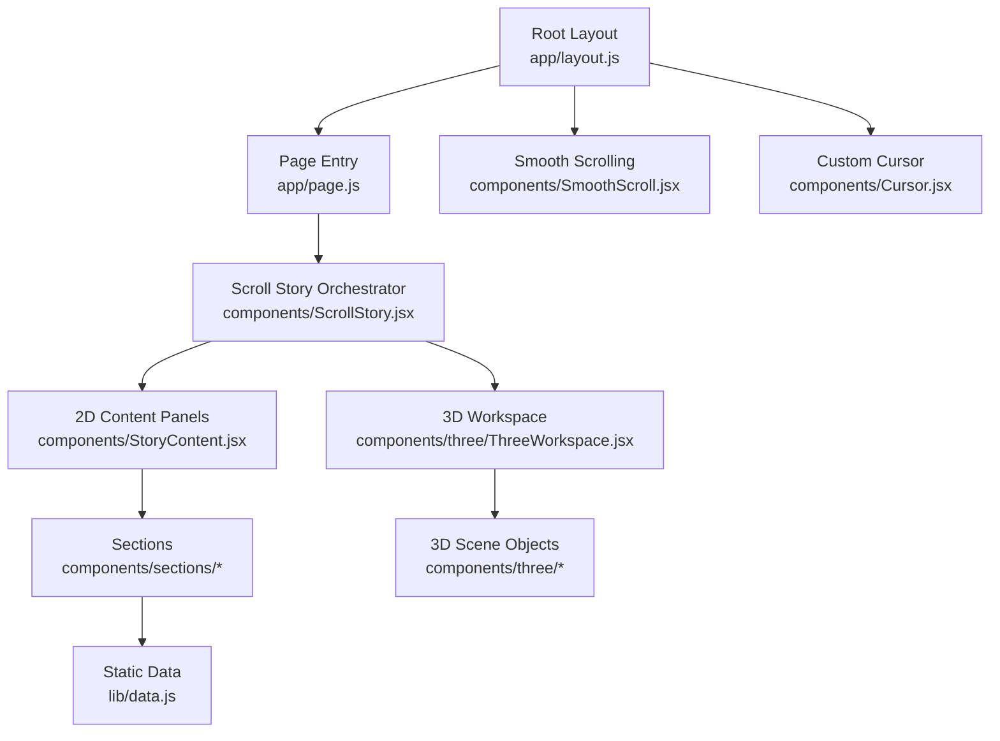
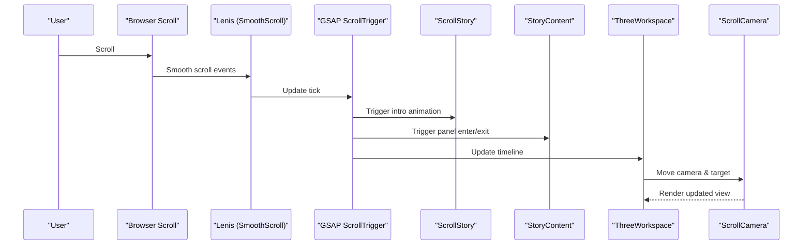
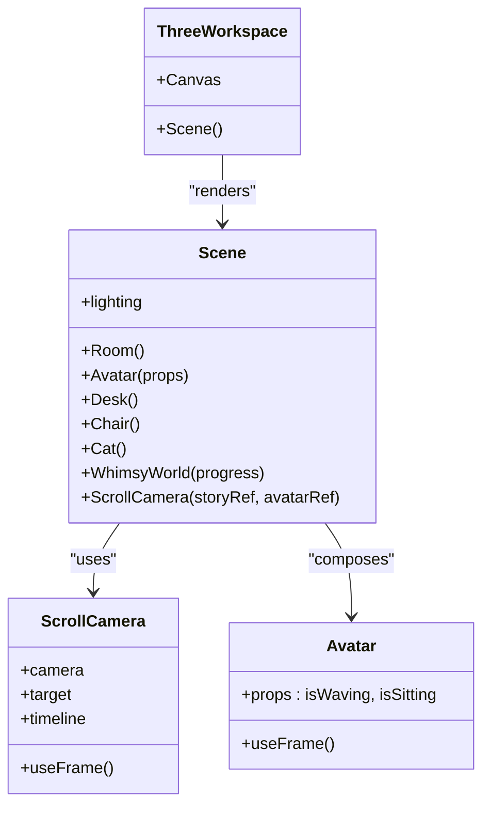
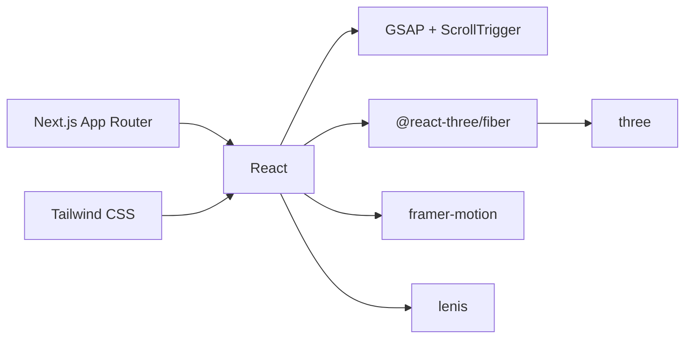

# Architecture Overview

<cite>
**Referenced Files in This Document**
- [layout.js](file://app/layout.js)
- [page.js](file://app/page.js)
- [template.js](file://app/template.js)
- [ScrollStory.jsx](file://components/ScrollStory.jsx)
- [StoryContent.jsx](file://components/StoryContent.jsx)
- [SmoothScroll.jsx](file://components/SmoothScroll.jsx)
- [Cursor.jsx](file://components/Cursor.jsx)
- [ThreeWorkspace.jsx](file://components/three/ThreeWorkspace.jsx)
- [Avatar.jsx](file://components/three/Avatar.jsx)
- [AboutSection.jsx](file://components/sections/AboutSection.jsx)
- [ProjectsSection.jsx](file://components/sections/ProjectsSection.jsx)
- [data.js](file://lib/data.js)
- [package.json](file://package.json)
</cite>

## Table of Contents
1. Introduction
2. Project Structure
3. Core Components
4. Architecture Overview
5. Detailed Component Analysis
6. Dependency Analysis
7. Performance Considerations
8. Troubleshooting Guide
9. Conclusion

## Introduction
This document describes the architecture of the Emaan Portfolio system built with Next.js App Router and React. It explains how page entry points compose a scroll-driven narrative that overlays 2D content panels on top of a Three.js scene, using GSAP ScrollTrigger to synchronize animations across both layers. The system separates concerns between UI panels (about, projects, skills, experience, education, contact), a whimsical 3D workspace (room, avatar, desk, chair, cat, ambient world effects), and a smooth scrolling engine that drives camera movement and panel transitions.

## Project Structure
The project follows a feature-oriented layout under Next.js App Router:
- app/: Root layout, global styles, page entry, and template for route transitions
- components/: Reusable UI and 3D components; sections are split into dedicated panels
- lib/: Static data layer for profile, education, experience, projects, and skills
- public/: Static assets
- Configuration files for Next.js, Tailwind, ESLint, and PostCSS

**Diagram sources**
- [layout.js:40-54](file://app/layout.js#L40-L54)
- [page.js:6-58](file://app/page.js#L6-L58)
- [ScrollStory.jsx:13-66](file://components/ScrollStory.jsx#L13-L66)
- [StoryContent.jsx:17-89](file://components/StoryContent.jsx#L17-L89)
- [ThreeWorkspace.jsx:168-185](file://components/three/ThreeWorkspace.jsx#L168-L185)
- [SmoothScroll.jsx:10-45](file://components/SmoothScroll.jsx#L10-L45)
- [Cursor.jsx:20-110](file://components/Cursor.jsx#L20-L110)

**Section sources**
- [layout.js:1-55](file://app/layout.js#L1-L55)
- [page.js:1-60](file://app/page.js#L1-L60)
- [template.js:1-20](file://app/template.js#L1-L20)

## Core Components
- RootLayout: Provides fonts, metadata, and wraps children with SmoothScroll and Cursor.
- Home Page: Renders a loading screen then mounts ScrollStory.
- ScrollStory: Registers GSAP ScrollTrigger and composes the intro text, 2D panels, and 3D workspace.
- StoryContent: Manages a list of 2D panels with per-panel scroll-triggered entrance and exit animations.
- ThreeWorkspace: Hosts the Three.js Canvas, scene composition, lighting, and a scroll-driven camera controller.
- Sections: Presentational components consuming static data from lib/data.js.
- SmoothScroll: Integrates Lenis for smooth scrolling and syncs it with GSAP’s ticker and ScrollTrigger.
- Cursor: Custom animated cursor with pointer state detection.

Key technical decisions:
- Use Next.js App Router for routing and layout composition.
- Separate 2D panels from 3D environment to keep UI logic independent of rendering performance constraints.
- Drive all scroll-based animations via GSAP ScrollTrigger for precise scrubbing control.
- Use @react-three/fiber for declarative 3D scene management within React.

**Section sources**
- [layout.js:40-54](file://app/layout.js#L40-L54)
- [page.js:6-58](file://app/page.js#L6-L58)
- [ScrollStory.jsx:13-66](file://components/ScrollStory.jsx#L13-L66)
- [StoryContent.jsx:17-89](file://components/StoryContent.jsx#L17-L89)
- [ThreeWorkspace.jsx:104-185](file://components/three/ThreeWorkspace.jsx#L104-L185)
- [SmoothScroll.jsx:10-45](file://components/SmoothScroll.jsx#L10-L45)
- [Cursor.jsx:20-110](file://components/Cursor.jsx#L20-L110)

## Architecture Overview
The system is organized around a scroll-driven narrative:
- The root layout injects global services (smooth scroll, custom cursor).
- The home page controls initial loading and mounts the story orchestrator.
- ScrollStory coordinates:
  - Intro text fade-out on scroll
  - 2D panels appearing/disappearing based on scroll position
  - 3D scene camera movement synchronized to scroll
- 2D panels consume static data from lib/data.js and render structured content.
- 3D scene composes room elements, an animated avatar, and ambient effects, driven by scroll progress.

**Diagram sources**
- [SmoothScroll.jsx:13-42](file://components/SmoothScroll.jsx#L13-L42)
- [ScrollStory.jsx:17-34](file://components/ScrollStory.jsx#L17-L34)
- [StoryContent.jsx:30-75](file://components/StoryContent.jsx#L30-L75)
- [ThreeWorkspace.jsx:23-98](file://components/three/ThreeWorkspace.jsx#L23-L98)

## Detailed Component Analysis

### Root Layout and Page Composition
- RootLayout sets up fonts, metadata, and wraps application content with SmoothScroll and Cursor.
- Home page shows a loading screen briefly, then renders ScrollStory.
- Template provides page transition animations via Framer Motion.

Design notes:
- Global services are injected at the root to avoid duplication.
- Client-side interactivity is enabled where needed ("use client").

**Section sources**
- [layout.js:1-55](file://app/layout.js#L1-L55)
- [page.js:1-60](file://app/page.js#L1-L60)
- [template.js:1-20](file://app/template.js#L1-L20)

### Scroll Story Orchestrator
- Registers GSAP ScrollTrigger once.
- Animates the intro section out as user scrolls.
- Composes StoryContent and ThreeWorkspace, passing a shared storyRef for synchronization.

Animation strategy:
- Uses GSAP timelines bound to scroll ranges for predictable scrubbing behavior.
- Keeps the 2D and 3D layers coordinated through a single scroll container reference.

**Section sources**
- [ScrollStory.jsx:1-70](file://components/ScrollStory.jsx#L1-L70)

### 2D Content Panels (StoryContent)
- Defines a PANELS array mapping each section component to its scroll start/end percentages.
- For each panel:
  - Entrance animation: fade-in, slide-up, scale-up
  - Exit animation: fade-out, slide-up, slight scale-down
- Uses refs to attach ScrollTrigger to the shared story container.

Data flow:
- Each section imports data from lib/data.js and renders accordingly.

**Section sources**
- [StoryContent.jsx:17-89](file://components/StoryContent.jsx#L17-L89)
- [AboutSection.jsx:1-30](file://components/sections/AboutSection.jsx#L1-L30)
- [ProjectsSection.jsx:1-43](file://components/sections/ProjectsSection.jsx#L1-L43)
- [data.js:1-181](file://lib/data.js#L1-L181)

### 3D Workspace and Scene
- ThreeWorkspace creates a Canvas with shadows and a configured camera.
- Scene composes lighting, Room, Avatar, Desk, Chair, Cat, WhimsyWorld, and ScrollCamera.
- ScrollCamera uses useFrame to continuously lookAt a target and a GSAP timeline to animate camera position and target based on scroll progress.
- Avatar responds to props controlling waving/sitting states derived from scroll progress.

Integration patterns:
- React state in Scene reflects scroll progress to drive avatar behavior.
- ScrollCamera encapsulates camera choreography, keeping scene composition clean.

**Section sources**
- [ThreeWorkspace.jsx:104-185](file://components/three/ThreeWorkspace.jsx#L104-L185)
- [Avatar.jsx:64-164](file://components/three/Avatar.jsx#L64-L164)

#### Class-like relationships in 3D components

**Diagram sources**
- [ThreeWorkspace.jsx:168-185](file://components/three/ThreeWorkspace.jsx#L168-L185)
- [ThreeWorkspace.jsx:104-162](file://components/three/ThreeWorkspace.jsx#L104-L162)
- [ThreeWorkspace.jsx:23-98](file://components/three/ThreeWorkspace.jsx#L23-L98)
- [Avatar.jsx:64-164](file://components/three/Avatar.jsx#L64-L164)

### Smooth Scrolling and GSAP Integration
- SmoothScroll initializes Lenis with easing and touch settings.
- Listens to Lenis scroll events to update GSAP ScrollTrigger.
- Adds a requestAnimationFrame loop to Lenis and disables GSAP lag smoothing for precision.

Accessibility:
- Honors prefers-reduced-motion to adjust duration.

**Section sources**
- [SmoothScroll.jsx:10-45](file://components/SmoothScroll.jsx#L10-L45)

### Custom Cursor
- Detects touch devices and hides itself on touch input.
- Tracks mouse position and animates a dot and ring with eased interpolation.
- Changes state when hovering over clickable elements.

**Section sources**
- [Cursor.jsx:20-110](file://components/Cursor.jsx#L20-L110)

### Data Layer
- Centralized static data exports for profile, education, experience, projects, and skills.
- Sections import this data directly to render content without additional fetching logic.

Benefits:
- Simple, predictable data source for a portfolio site.
- Easy to maintain and extend with new sections or projects.

**Section sources**
- [data.js:1-181](file://lib/data.js#L1-L181)

## Dependency Analysis
High-level dependencies and their roles:
- Next.js App Router: Routing and layout composition
- React: UI framework and hooks
- GSAP + ScrollTrigger: Scroll-driven animations
- @react-three/fiber + three: Declarative 3D scenes
- framer-motion: Page transitions
- lenis: Smooth scrolling
- tailwindcss: Styling

**Diagram sources**
- [package.json:11-28](file://package.json#L11-L28)

**Section sources**
- [package.json:1-30](file://package.json#L1-L30)

## Performance Considerations
- Rendering cost:
  - 3D scene runs in a separate Canvas; ensure geometry complexity stays reasonable.
  - Shadows are enabled; monitor draw calls and shadow map size.
- Animation cost:
  - GSAP timelines are scrubbed against scroll; prefer lightweight transforms and avoid heavy reflows.
  - useFrame loops should be minimal and efficient.
- Scroll integration:
  - Lenis reduces jank; ensure ScrollTrigger updates are throttled appropriately.
- Accessibility:
  - Respect prefers-reduced-motion to limit motion intensity.

[No sources needed since this section provides general guidance]

## Troubleshooting Guide
Common issues and resolutions:
- Panels not animating:
  - Ensure storyRef is passed correctly to StoryContent and ThreeWorkspace.
  - Verify ScrollTrigger is registered and the trigger element exists.
- 3D camera not moving:
  - Confirm ScrollCamera receives a valid storyRef and avatarRef.
  - Check that the GSAP timeline is created and scrub is enabled.
- Smooth scroll conflicts:
  - Ensure Lenis is initialized only once and ScrollTrigger.update is called on scroll.
- Custom cursor not visible:
  - On touch devices, the cursor is intentionally hidden; verify device detection.

**Section sources**
- [ScrollStory.jsx:17-34](file://components/ScrollStory.jsx#L17-L34)
- [StoryContent.jsx:30-75](file://components/StoryContent.jsx#L30-L75)
- [ThreeWorkspace.jsx:23-98](file://components/three/ThreeWorkspace.jsx#L23-L98)
- [SmoothScroll.jsx:13-42](file://components/SmoothScroll.jsx#L13-L42)
- [Cursor.jsx:29-70](file://components/Cursor.jsx#L29-L70)

## Conclusion
The Emaan Portfolio employs a modular, scroll-driven architecture that cleanly separates 2D content panels from a 3D environment while synchronizing them through GSAP ScrollTrigger. The Next.js App Router organizes routes and layouts, React manages component state and lifecycle, and Three.js delivers an immersive scene. This design enables scalable additions of new sections and 3D features while maintaining performance and accessibility.

[No sources needed since this section summarizes without analyzing specific files]