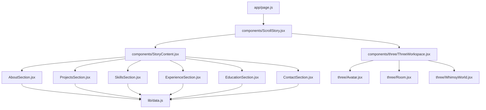
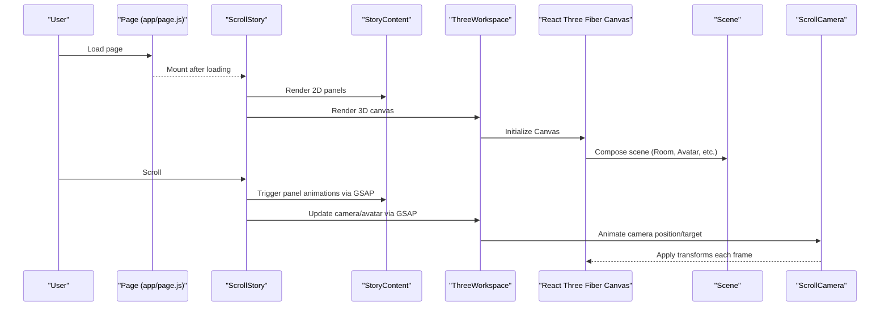
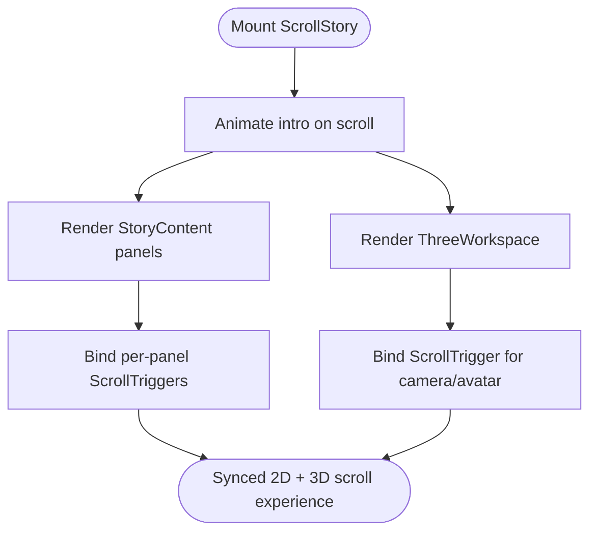
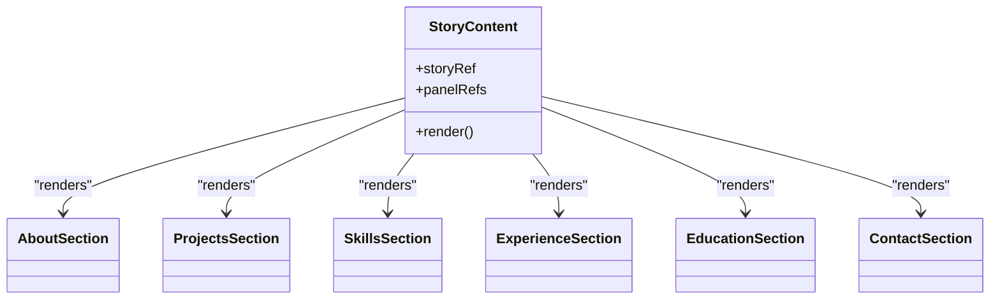
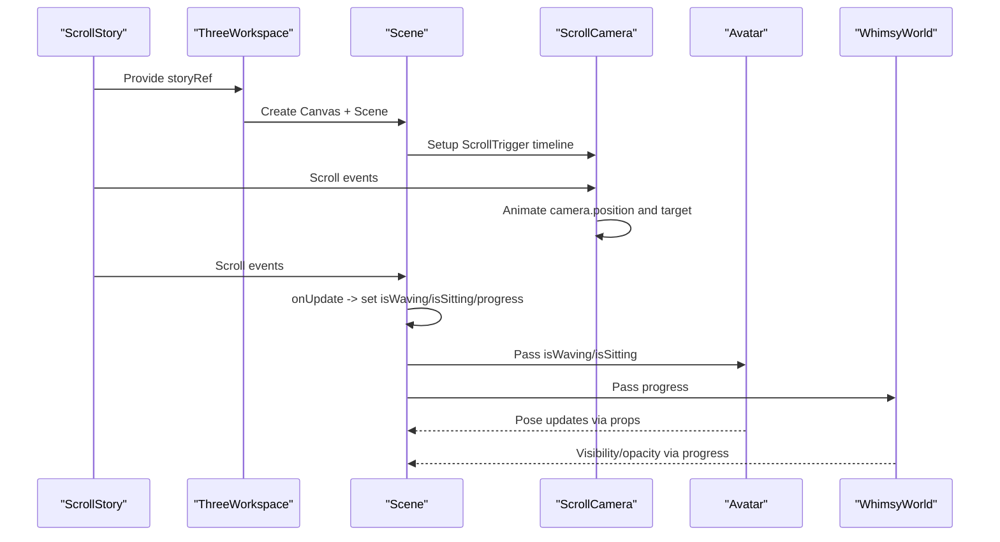
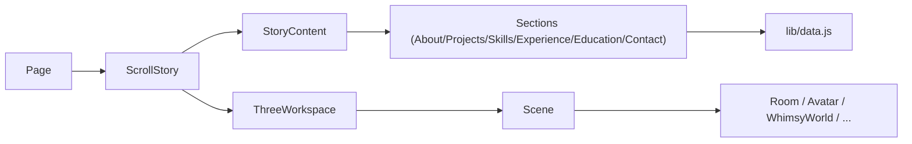

# Component Hierarchy

<cite>
**Referenced Files in This Document**
- [page.js](file://app/page.js)
- [ScrollStory.jsx](file://components/ScrollStory.jsx)
- [StoryContent.jsx](file://components/StoryContent.jsx)
- [ThreeWorkspace.jsx](file://components/three/ThreeWorkspace.jsx)
- [Avatar.jsx](file://components/three/Avatar.jsx)
- [Room.jsx](file://components/three/Room.jsx)
- [WhimsyWorld.jsx](file://components/three/WhimsyWorld.jsx)
- [AboutSection.jsx](file://components/sections/AboutSection.jsx)
- [ProjectsSection.jsx](file://components/sections/ProjectsSection.jsx)
- [SkillsSection.jsx](file://components/sections/SkillsSection.jsx)
- [ExperienceSection.jsx](file://components/sections/ExperienceSection.jsx)
- [EducationSection.jsx](file://components/sections/EducationSection.jsx)
- [ContactSection.jsx](file://components/sections/ContactSection.jsx)
- [data.js](file://lib/data.js)
</cite>

## Table of Contents
1. [Introduction](#introduction)
2. [Project Structure](#project-structure)
3. [Core Components](#core-components)
4. [Architecture Overview](#architecture-overview)
5. [Detailed Component Analysis](#detailed-component-analysis)
6. [Dependency Analysis](#dependency-analysis)
7. [Performance Considerations](#performance-considerations)
8. [Troubleshooting Guide](#troubleshooting-guide)
9. [Conclusion](#conclusion)

## Introduction
This document explains the component hierarchy and data flow in Emaan Portfolio, focusing on:
- The top-level page as the application entry point
- ScrollStory as the orchestrator for the overall scroll-driven experience
- StoryContent as the 2D panel renderer that overlays content panels with GSAP animations
- ThreeWorkspace as the bridge between React and Three.js for managing a 3D scene and camera choreography

It includes a complete component tree, parent-child relationships, data flow direction, and communication patterns between sibling components.

## Project Structure
At a high level:
- app/page.js is the Next.js client page that renders a loading screen and then mounts ScrollStory.
- ScrollStory composes the hero intro, StoryContent (2D panels), and ThreeWorkspace (3D scene).
- StoryContent renders multiple section panels and animates them via GSAP ScrollTrigger based on scroll progress.
- ThreeWorkspace sets up a React Three Fiber Canvas and manages scene composition, lighting, avatar state, and camera movement driven by scroll.

**Diagram sources**
- [page.js:1-60](file://app/page.js#L1-L60)
- [ScrollStory.jsx:1-70](file://components/ScrollStory.jsx#L1-L70)
- [StoryContent.jsx:1-91](file://components/StoryContent.jsx#L1-L91)
- [ThreeWorkspace.jsx:1-186](file://components/three/ThreeWorkspace.jsx#L1-L186)
- [AboutSection.jsx:1-30](file://components/sections/AboutSection.jsx#L1-L30)
- [ProjectsSection.jsx:1-43](file://components/sections/ProjectsSection.jsx#L1-L43)
- [SkillsSection.jsx:1-42](file://components/sections/SkillsSection.jsx#L1-L42)
- [ExperienceSection.jsx:1-36](file://components/sections/ExperienceSection.jsx#L1-L36)
- [EducationSection.jsx:1-42](file://components/sections/EducationSection.jsx#L1-L42)
- [ContactSection.jsx:1-60](file://components/sections/ContactSection.jsx#L1-L60)
- [data.js:1-181](file://lib/data.js#L1-L181)

**Section sources**
- [page.js:1-60](file://app/page.js#L1-L60)
- [ScrollStory.jsx:1-70](file://components/ScrollStory.jsx#L1-L70)
- [StoryContent.jsx:1-91](file://components/StoryContent.jsx#L1-L91)
- [ThreeWorkspace.jsx:1-186](file://components/three/ThreeWorkspace.jsx#L1-L186)

## Core Components
- Page (app/page.js): Renders a loading overlay and conditionally mounts ScrollStory once initialization completes. It is the single entry point for the interactive experience.
- ScrollStory (components/ScrollStory.jsx): Orchestrates the scroll-driven narrative. It registers GSAP ScrollTrigger, animates the intro text, and composes StoryContent and ThreeWorkspace within a sticky container.
- StoryContent (components/StoryContent.jsx): Defines ordered panels (About, Projects, Skills, Experience, Education, Contact) and uses GSAP to animate each panel’s entrance and exit based on scroll ranges.
- ThreeWorkspace (components/three/ThreeWorkspace.jsx): Bridges React and Three.js using React Three Fiber. It configures the Canvas, composes the Scene (lights, Room, Avatar, Desk, Chair, Cat, WhimsyWorld), and drives camera and avatar states from scroll via GSAP.

Key responsibilities:
- ScrollStory: Global scroll orchestration and composition of 2D and 3D layers.
- StoryContent: 2D panel rendering and per-panel scroll-triggered animations.
- ThreeWorkspace: 3D scene setup, lighting, model composition, and camera choreography tied to scroll.

**Section sources**
- [page.js:1-60](file://app/page.js#L1-L60)
- [ScrollStory.jsx:1-70](file://components/ScrollStory.jsx#L1-L70)
- [StoryContent.jsx:1-91](file://components/StoryContent.jsx#L1-L91)
- [ThreeWorkspace.jsx:1-186](file://components/three/ThreeWorkspace.jsx#L1-L186)

## Architecture Overview
The application follows a layered architecture:
- Presentation layer: Next.js page and React components.
- Orchestration layer: ScrollStory coordinates scroll-based transitions across UI and 3D.
- Rendering layers:
  - 2D: StoryContent renders HTML/CSS panels with GSAP animations.
  - 3D: ThreeWorkspace renders a Three.js scene via React Three Fiber, with camera and object states driven by scroll.

**Diagram sources**
- [page.js:1-60](file://app/page.js#L1-L60)
- [ScrollStory.jsx:1-70](file://components/ScrollStory.jsx#L1-L70)
- [StoryContent.jsx:1-91](file://components/StoryContent.jsx#L1-L91)
- [ThreeWorkspace.jsx:1-186](file://components/three/ThreeWorkspace.jsx#L1-L186)

## Detailed Component Analysis

### Top-Level Page (Entry Point)
- Responsibilities:
  - Show a loading screen until assets are ready.
  - Mount ScrollStory when loading completes.
- Data flow:
  - No props passed down; acts as a shell.
- Communication:
  - None with siblings; only controls visibility of ScrollStory.

**Section sources**
- [page.js:1-60](file://app/page.js#L1-L60)

### ScrollStory (Orchestrator)
- Responsibilities:
  - Register GSAP ScrollTrigger.
  - Animate the intro text fade/slide on scroll.
  - Compose StoryContent and ThreeWorkspace inside a sticky container.
- Props:
  - None received; provides storyRef to children for shared scroll context.
- Communication:
  - Passes storyRef to StoryContent and ThreeWorkspace so they can bind their own ScrollTrigger instances to the same scrollable root.

**Diagram sources**
- [ScrollStory.jsx:1-70](file://components/ScrollStory.jsx#L1-L70)
- [StoryContent.jsx:1-91](file://components/StoryContent.jsx#L1-L91)
- [ThreeWorkspace.jsx:1-186](file://components/three/ThreeWorkspace.jsx#L1-L186)

**Section sources**
- [ScrollStory.jsx:1-70](file://components/ScrollStory.jsx#L1-L70)

### StoryContent (2D Panel Renderer)
- Responsibilities:
  - Define ordered panels and their scroll windows.
  - Animate each panel’s entrance and exit using GSAP ScrollTrigger.
  - Provide refs to each panel wrapper for animation targets.
- Props:
  - storyRef: Shared reference to the scroll container used by ScrollStory.
- Data flow:
  - Reads static panel configuration and renders corresponding section components.
  - Section components read data from lib/data.js.
- Sibling communication:
  - Panels do not communicate directly; synchronization is achieved through shared scroll context via storyRef.

**Diagram sources**
- [StoryContent.jsx:1-91](file://components/StoryContent.jsx#L1-L91)
- [AboutSection.jsx:1-30](file://components/sections/AboutSection.jsx#L1-L30)
- [ProjectsSection.jsx:1-43](file://components/sections/ProjectsSection.jsx#L1-L43)
- [SkillsSection.jsx:1-42](file://components/sections/SkillsSection.jsx#L1-L42)
- [ExperienceSection.jsx:1-36](file://components/sections/ExperienceSection.jsx#L1-L36)
- [EducationSection.jsx:1-42](file://components/sections/EducationSection.jsx#L1-L42)
- [ContactSection.jsx:1-60](file://components/sections/ContactSection.jsx#L1-L60)

**Section sources**
- [StoryContent.jsx:1-91](file://components/StoryContent.jsx#L1-L91)
- [AboutSection.jsx:1-30](file://components/sections/AboutSection.jsx#L1-L30)
- [ProjectsSection.jsx:1-43](file://components/sections/ProjectsSection.jsx#L1-L43)
- [SkillsSection.jsx:1-42](file://components/sections/SkillsSection.jsx#L1-L42)
- [ExperienceSection.jsx:1-36](file://components/sections/ExperienceSection.jsx#L1-L36)
- [EducationSection.jsx:1-42](file://components/sections/EducationSection.jsx#L1-L42)
- [ContactSection.jsx:1-60](file://components/sections/ContactSection.jsx#L1-L60)
- [data.js:1-181](file://lib/data.js#L1-L181)

### ThreeWorkspace (Bridge to Three.js)
- Responsibilities:
  - Configure React Three Fiber Canvas with shadows and camera settings.
  - Compose the Scene with lights, Room, Avatar, Desk, Chair, Cat, and WhimsyWorld.
  - Drive camera movement and avatar state changes based on scroll progress.
- Internal structure:
  - ScrollCamera: Uses useFrame to continuously look at a target and GSAP timelines to animate camera position and target over scroll.
  - Scene: Manages global state like waving/sitting flags and progress; subscribes to ScrollTrigger updates to update state.
  - Child models:
    - Avatar: Animated arms and breathing; supports waving and sitting poses.
    - Room: Environment geometry (floor, walls, window, shelf, plant).
    - WhimsyWorld: Floating platforms and orbs that appear later in the scroll journey.
- Data flow:
  - Receives storyRef to bind ScrollTrigger to the same scroll container.
  - Updates local React state (isWaving, isSitting, progress) which re-renders Avatar and WhimsyWorld accordingly.

**Diagram sources**
- [ThreeWorkspace.jsx:1-186](file://components/three/ThreeWorkspace.jsx#L1-L186)
- [Avatar.jsx:1-164](file://components/three/Avatar.jsx#L1-L164)
- [Room.jsx:1-64](file://components/three/Room.jsx#L1-L64)
- [WhimsyWorld.jsx:1-76](file://components/three/WhimsyWorld.jsx#L1-L76)

**Section sources**
- [ThreeWorkspace.jsx:1-186](file://components/three/ThreeWorkspace.jsx#L1-L186)
- [Avatar.jsx:1-164](file://components/three/Avatar.jsx#L1-L164)
- [Room.jsx:1-64](file://components/three/Room.jsx#L1-L64)
- [WhimsyWorld.jsx:1-76](file://components/three/WhimsyWorld.jsx#L1-L76)

### Section Components (2D Panels)
Each section component is a presentational component responsible for rendering its panel layout and reading data from lib/data.js. They do not manage scroll logic themselves; ScrollStory and StoryContent handle timing and animations.

- AboutSection: Displays profile info and role tags.
- ProjectsSection: Lists project cards with links.
- SkillsSection: Shows technical skills and soft skills.
- ExperienceSection: Renders work experience timeline.
- EducationSection: Renders education cards with badges and focus tags.
- ContactSection: Provides contact actions and closing message.

Data source:
- All sections import structured data from lib/data.js and render it declaratively.

**Section sources**
- [AboutSection.jsx:1-30](file://components/sections/AboutSection.jsx#L1-L30)
- [ProjectsSection.jsx:1-43](file://components/sections/ProjectsSection.jsx#L1-L43)
- [SkillsSection.jsx:1-42](file://components/sections/SkillsSection.jsx#L1-L42)
- [ExperienceSection.jsx:1-36](file://components/sections/ExperienceSection.jsx#L1-L36)
- [EducationSection.jsx:1-42](file://components/sections/EducationSection.jsx#L1-L42)
- [ContactSection.jsx:1-60](file://components/sections/ContactSection.jsx#L1-L60)
- [data.js:1-181](file://lib/data.js#L1-L181)

## Dependency Analysis
- Parent-child relationships:
  - Page -> ScrollStory
  - ScrollStory -> StoryContent, ThreeWorkspace
  - StoryContent -> Section components (About, Projects, Skills, Experience, Education, Contact)
  - ThreeWorkspace -> Scene -> Room, Avatar, WhimsyWorld (and others like Desk, Chair, Cat)
- Data flow direction:
  - Downward props: storyRef flows from ScrollStory to StoryContent and ThreeWorkspace; progress and pose flags flow from Scene to Avatar and WhimsyWorld.
  - Event-driven sync: Both StoryContent and ThreeWorkspace subscribe to the same scroll container via GSAP ScrollTrigger, ensuring synchronized 2D and 3D animations without direct coupling.
- External dependencies:
  - GSAP + ScrollTrigger for scroll-driven animations.
  - React Three Fiber for 3D scene management.
  - Next.js routing and client-side directives.

**Diagram sources**
- [page.js:1-60](file://app/page.js#L1-L60)
- [ScrollStory.jsx:1-70](file://components/ScrollStory.jsx#L1-L70)
- [StoryContent.jsx:1-91](file://components/StoryContent.jsx#L1-L91)
- [ThreeWorkspace.jsx:1-186](file://components/three/ThreeWorkspace.jsx#L1-L186)
- [data.js:1-181](file://lib/data.js#L1-L181)

**Section sources**
- [page.js:1-60](file://app/page.js#L1-L60)
- [ScrollStory.jsx:1-70](file://components/ScrollStory.jsx#L1-L70)
- [StoryContent.jsx:1-91](file://components/StoryContent.jsx#L1-L91)
- [ThreeWorkspace.jsx:1-186](file://components/three/ThreeWorkspace.jsx#L1-L186)
- [data.js:1-181](file://lib/data.js#L1-L181)

## Performance Considerations
- GSAP ScrollTrigger usage:
  - Ensure triggers are scoped to the correct container (storyRef) to avoid unnecessary recalculations.
  - Use scrub sparingly; heavy scrubbing on many panels can impact performance.
- React Three Fiber:
  - Keep geometry simple where possible (box primitives are efficient).
  - Limit shadow map sizes and number of cast/receive shadow meshes to reduce GPU load.
  - Avoid excessive per-frame state updates; batch updates where feasible.
- State updates:
  - In Scene, updating isWaving/isSitting/progress on every scroll tick may cause frequent re-renders. Consider throttling or using refs for non-rendered values when possible.
- Asset loading:
  - The loading screen prevents interaction before readiness; ensure any heavy assets are preloaded or lazy-loaded to minimize initial bundle size.

[No sources needed since this section provides general guidance]

## Troubleshooting Guide
- Panels not animating:
  - Verify that storyRef is correctly passed from ScrollStory to StoryContent and that ScrollTrigger is registered with the same scope.
  - Check that panel elements have refs attached and are visible in the DOM during scroll.
- 3D scene not responding to scroll:
  - Confirm that ThreeWorkspace receives storyRef and that ScrollTrigger is created with the same trigger element.
  - Ensure the Canvas is mounted and that useFrame is running; check for errors in the console related to Three.js contexts.
- Avatar poses not updating:
  - Validate that Scene’s ScrollTrigger onUpdate is firing and setting isWaving/isSiting correctly.
  - Ensure Avatar receives the latest props and that forwardRef is properly exposed for camera targeting if needed.
- Data not rendering in sections:
  - Confirm that lib/data.js exports the expected keys and that sections import the correct names.
  - Check for typos in property names and array structures.

**Section sources**
- [ScrollStory.jsx:1-70](file://components/ScrollStory.jsx#L1-L70)
- [StoryContent.jsx:1-91](file://components/StoryContent.jsx#L1-L91)
- [ThreeWorkspace.jsx:1-186](file://components/three/ThreeWorkspace.jsx#L1-L186)
- [Avatar.jsx:1-164](file://components/three/Avatar.jsx#L1-L164)
- [data.js:1-181](file://lib/data.js#L1-L181)

## Conclusion
Emaan Portfolio’s component hierarchy is organized around a clear separation of concerns:
- Page serves as the entry point and lifecycle controller.
- ScrollStory orchestrates the unified scroll-driven experience across 2D and 3D layers.
- StoryContent handles 2D panel rendering and per-panel animations.
- ThreeWorkspace bridges React and Three.js, composing the scene and driving camera/object states via scroll.

This design enables synchronized storytelling between UI panels and a 3D environment while maintaining modular, testable components.

[No sources needed since this section summarizes without analyzing specific files]