# Core Architecture Patterns

<cite>
**Referenced Files in This Document**
- [app/layout.js](file://app/layout.js)
- [app/page.js](file://app/page.js)
- [app/template.js](file://app/template.js)
- [components/ScrollStory.jsx](file://components/ScrollStory.jsx)
- [components/StoryContent.jsx](file://components/StoryContent.jsx)
- [components/three/ThreeWorkspace.jsx](file://components/three/ThreeWorkspace.jsx)
- [components/three/Room.jsx](file://components/three/Room.jsx)
- [components/three/Avatar.jsx](file://components/three/Avatar.jsx)
- [components/SmoothScroll.jsx](file://components/SmoothScroll.jsx)
- [components/Cursor.jsx](file://components/Cursor.jsx)
- [lib/data.js](file://lib/data.js)
</cite>

## Table of Contents
1. Introduction
2. Project Structure
3. Core Components
4. Architecture Overview
5. Detailed Component Analysis
6. Dependency Analysis
7. Performance Considerations
8. Troubleshooting Guide
9. Conclusion

## Introduction
This document explains the core architecture patterns of Emaan Portfolio, focusing on:
- A component-based architecture built with React and Next.js App Router
- Clear separation between 2D UI panels and 3D scenes
- A scroll-driven narrative that choreographs camera movement, avatar behavior, and content overlays
- Parent-child relationships, state management via React hooks, and event handling across components
- Modular design enabling independent development of 3D scenes and content panels

The application uses a layered approach:
- Root layout provides global services (smooth scrolling, custom cursor)
- Page orchestrates loading and transitions to the main experience
- ScrollStory coordinates GSAP ScrollTrigger animations for intro text and content panels
- StoryContent composes modular content panels driven by scroll progress
- ThreeWorkspace renders a 3D scene with a scroll-driven camera and animated avatar

## Project Structure
At a high level:
- app/: Next.js App Router entry points and root layout
- components/: Reusable UI and 3D scene modules
- lib/: Centralized data model for sections and profile information

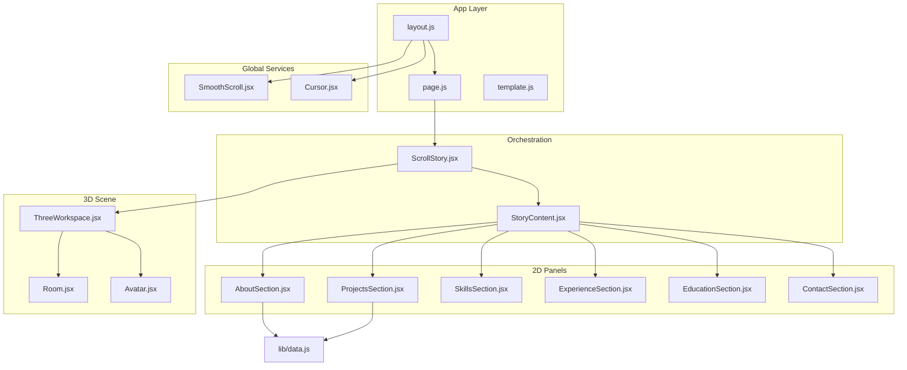

**Diagram sources**
- [app/layout.js:40-54](file://app/layout.js#L40-L54)
- [app/page.js:6-58](file://app/page.js#L6-L58)
- [components/ScrollStory.jsx:13-69](file://components/ScrollStory.jsx#L13-L69)
- [components/StoryContent.jsx:17-89](file://components/StoryContent.jsx#L17-L89)
- [components/three/ThreeWorkspace.jsx:168-185](file://components/three/ThreeWorkspace.jsx#L168-L185)
- [components/three/Room.jsx:12-63](file://components/three/Room.jsx#L12-L63)
- [components/three/Avatar.jsx:64-163](file://components/three/Avatar.jsx#L64-L163)
- [components/SmoothScroll.jsx:10-46](file://components/SmoothScroll.jsx#L10-L46)
- [components/Cursor.jsx:20-110](file://components/Cursor.jsx#L20-L110)
- [lib/data.js:1-181](file://lib/data.js#L1-L181)

**Section sources**
- [app/layout.js:40-54](file://app/layout.js#L40-L54)
- [app/page.js:6-58](file://app/page.js#L6-L58)
- [components/ScrollStory.jsx:13-69](file://components/ScrollStory.jsx#L13-L69)
- [components/StoryContent.jsx:17-89](file://components/StoryContent.jsx#L17-L89)
- [components/three/ThreeWorkspace.jsx:168-185](file://components/three/ThreeWorkspace.jsx#L168-L185)
- [components/SmoothScroll.jsx:10-46](file://components/SmoothScroll.jsx#L10-L46)
- [components/Cursor.jsx:20-110](file://components/Cursor.jsx#L20-L110)
- [lib/data.js:1-181](file://lib/data.js#L1-L181)

## Core Components
- RootLayout: Wraps the entire app with fonts, smooth scrolling, and a custom cursor. It ensures consistent global behavior and sets up the environment for all pages.
- Home page: Manages a brief loading screen using local state and transitions to the main ScrollStory once ready.
- ScrollStory: Orchestrates the scroll-driven narrative. It animates an intro overlay and composes StoryContent and ThreeWorkspace within a sticky container.
- StoryContent: Composes multiple content panels (About, Projects, Skills, Experience, Education, Contact). Each panel is animated into view and out of view based on scroll position using GSAP ScrollTrigger.
- ThreeWorkspace: Renders a 3D scene with lighting, room geometry, an animated avatar, and whimsical elements. It drives camera movement and avatar states from scroll progress.
- SmoothScroll: Integrates Lenis for smooth scrolling and synchronizes it with GSAP’s ScrollTrigger.
- Cursor: Provides a custom animated cursor with hover detection for interactive elements.

Key architectural principles:
- Separation of concerns: 2D panels are decoupled from the 3D scene; both are orchestrated by ScrollStory.
- Scroll as state: Scroll progress drives UI and 3D state changes without complex global stores.
- Composition over inheritance: Panels and 3D objects are composed declaratively.
- Data-driven panels: Content panels consume shared data from lib/data.js.

**Section sources**
- [app/layout.js:40-54](file://app/layout.js#L40-L54)
- [app/page.js:6-58](file://app/page.js#L6-L58)
- [components/ScrollStory.jsx:13-69](file://components/ScrollStory.jsx#L13-L69)
- [components/StoryContent.jsx:17-89](file://components/StoryContent.jsx#L17-L89)
- [components/three/ThreeWorkspace.jsx:104-185](file://components/three/ThreeWorkspace.jsx#L104-L185)
- [components/SmoothScroll.jsx:10-46](file://components/SmoothScroll.jsx#L10-L46)
- [components/Cursor.jsx:20-110](file://components/Cursor.jsx#L20-L110)
- [lib/data.js:1-181](file://lib/data.js#L1-L181)

## Architecture Overview
The application follows a layered, scroll-driven architecture:

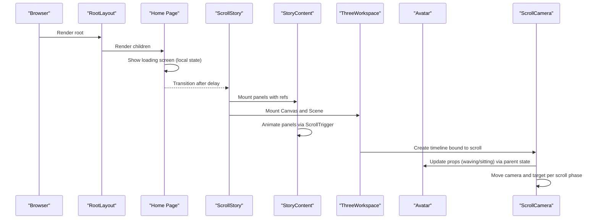

**Diagram sources**
- [app/layout.js:40-54](file://app/layout.js#L40-L54)
- [app/page.js:6-58](file://app/page.js#L6-L58)
- [components/ScrollStory.jsx:13-69](file://components/ScrollStory.jsx#L13-L69)
- [components/StoryContent.jsx:17-89](file://components/StoryContent.jsx#L17-L89)
- [components/three/ThreeWorkspace.jsx:23-98](file://components/three/ThreeWorkspace.jsx#L23-L98)
- [components/three/ThreeWorkspace.jsx:104-185](file://components/three/ThreeWorkspace.jsx#L104-L185)
- [components/three/Avatar.jsx:64-163](file://components/three/Avatar.jsx#L64-L163)

## Detailed Component Analysis

### RootLayout and Global Services
- RootLayout wraps the app with typography variables, global CSS, SmoothScroll, and Cursor.
- SmoothScroll initializes Lenis and bridges its scroll events to GSAP ScrollTrigger, ensuring consistent scroll behavior across the app.
- Cursor listens to mouse events and updates a dot and ring element with smooth interpolation; it detects pointer targets to change visual state.

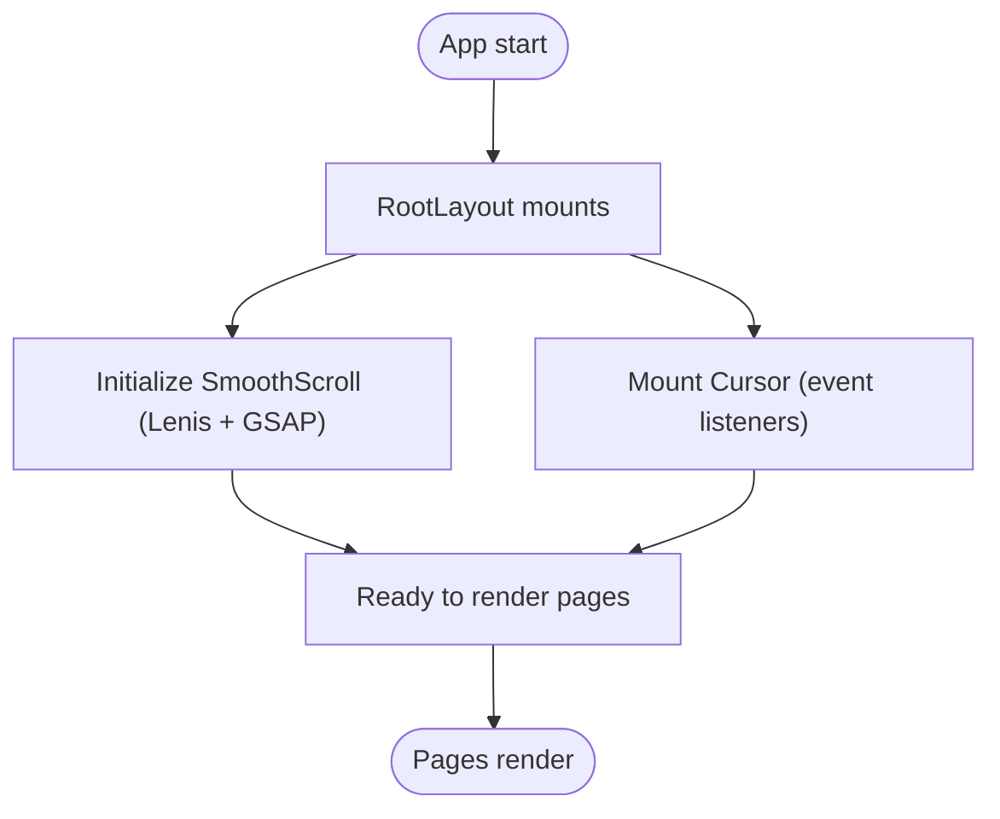

**Diagram sources**
- [app/layout.js:40-54](file://app/layout.js#L40-L54)
- [components/SmoothScroll.jsx:10-46](file://components/SmoothScroll.jsx#L10-L46)
- [components/Cursor.jsx:20-110](file://components/Cursor.jsx#L20-L110)

**Section sources**
- [app/layout.js:40-54](file://app/layout.js#L40-L54)
- [components/SmoothScroll.jsx:10-46](file://components/SmoothScroll.jsx#L10-L46)
- [components/Cursor.jsx:20-110](file://components/Cursor.jsx#L20-L110)

### Loading Screen and Transition to Main Application
- The Home page maintains a loading flag with useState and clears it after a timeout.
- While loading, a styled section displays animated sparkles and a progress bar.
- Once loaded, it renders ScrollStory, which begins the scroll-driven narrative.

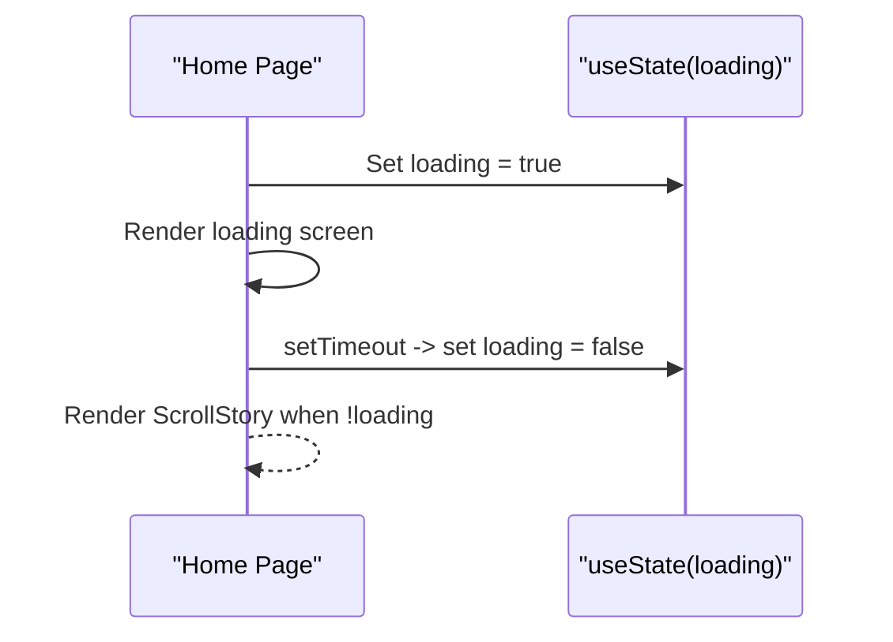

**Diagram sources**
- [app/page.js:6-58](file://app/page.js#L6-L58)

**Section sources**
- [app/page.js:6-58](file://app/page.js#L6-L58)

### Scroll-Driven Narrative Pattern
- ScrollStory registers GSAP ScrollTrigger and creates a timeline that fades and moves the intro overlay as the user scrolls.
- It composes StoryContent and ThreeWorkspace inside a sticky container so both layers animate together.
- StoryContent defines a PANELS array mapping each section to a percentage range and animates opacity, vertical offset, and scale based on scroll position.

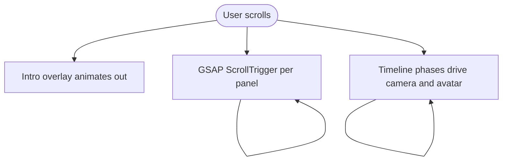

**Diagram sources**
- [components/ScrollStory.jsx:13-69](file://components/ScrollStory.jsx#L13-L69)
- [components/StoryContent.jsx:17-89](file://components/StoryContent.jsx#L17-L89)
- [components/three/ThreeWorkspace.jsx:23-98](file://components/three/ThreeWorkspace.jsx#L23-L98)

**Section sources**
- [components/ScrollStory.jsx:13-69](file://components/ScrollStory.jsx#L13-L69)
- [components/StoryContent.jsx:17-89](file://components/StoryContent.jsx#L17-L89)

### 2D UI vs 3D Scenes: Separation of Concerns
- 2D panels live under components/sections and are composed by StoryContent. They are purely presentational and consume data from lib/data.js.
- 3D scenes live under components/three and are encapsulated in ThreeWorkspace. They manage their own internal state (lighting, geometry, animation) and react to scroll through props and refs.
- ScrollStory acts as the conductor, passing a shared storyRef to both layers so they can synchronize animations.

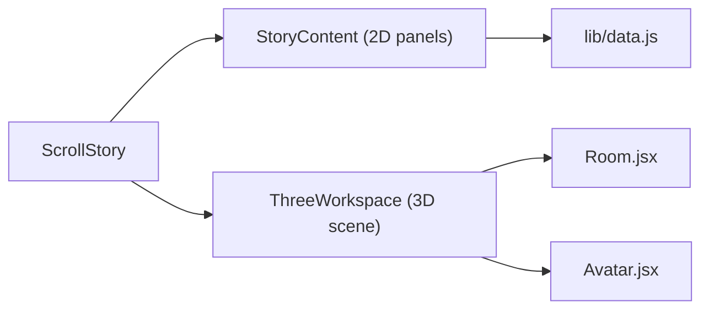

**Diagram sources**
- [components/ScrollStory.jsx:13-69](file://components/ScrollStory.jsx#L13-L69)
- [components/StoryContent.jsx:17-89](file://components/StoryContent.jsx#L17-L89)
- [components/three/ThreeWorkspace.jsx:104-185](file://components/three/ThreeWorkspace.jsx#L104-L185)
- [components/three/Room.jsx:12-63](file://components/three/Room.jsx#L12-L63)
- [components/three/Avatar.jsx:64-163](file://components/three/Avatar.jsx#L64-L163)
- [lib/data.js:1-181](file://lib/data.js#L1-L181)

**Section sources**
- [components/ScrollStory.jsx:13-69](file://components/ScrollStory.jsx#L13-L69)
- [components/StoryContent.jsx:17-89](file://components/StoryContent.jsx#L17-L89)
- [components/three/ThreeWorkspace.jsx:104-185](file://components/three/ThreeWorkspace.jsx#L104-L185)
- [components/three/Room.jsx:12-63](file://components/three/Room.jsx#L12-L63)
- [components/three/Avatar.jsx:64-163](file://components/three/Avatar.jsx#L64-L163)
- [lib/data.js:1-181](file://lib/data.js#L1-L181)

### Parent-Child Relationships and Prop Drilling Strategy
- ScrollStory is the parent of StoryContent and ThreeWorkspace. It passes a shared storyRef to both so they can bind ScrollTrigger timelines to the same scroll container.
- StoryContent maps PANELS to concrete section components, rendering them with a wrapper div and attaching refs for animation.
- ThreeWorkspace composes Room, Avatar, Desk, Chair, Cat, and WhimsyWorld inside a Canvas. It manages internal state (waving, sitting, progress) and exposes imperative access to the avatar via forwardRef and useImperativeHandle.
- Prop drilling is minimal and purposeful: only the scroll container reference flows down to coordinate cross-layer animations.

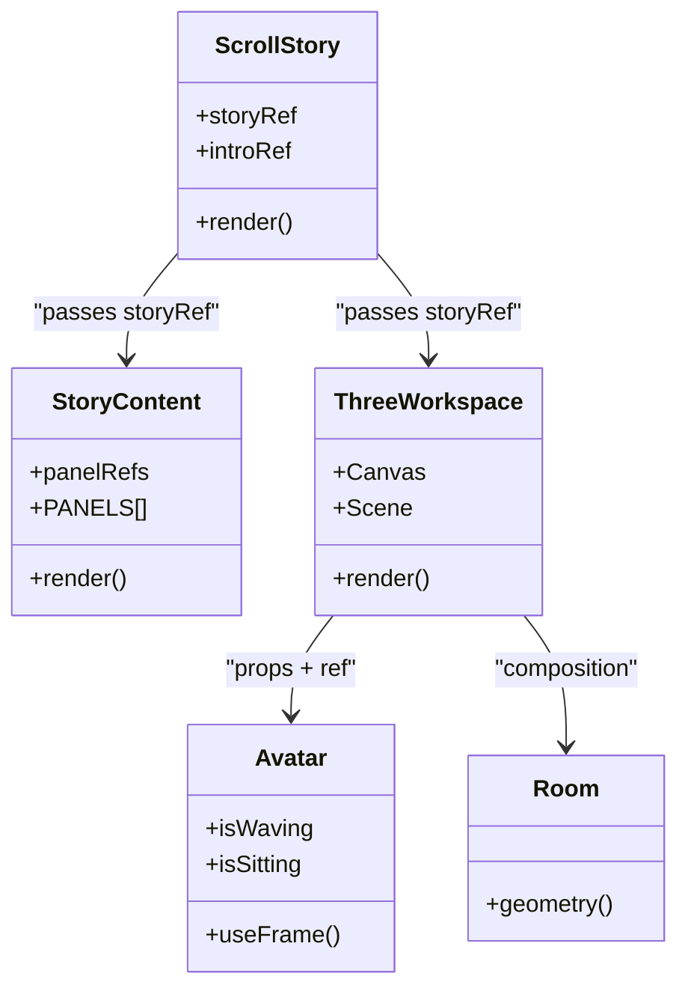

**Diagram sources**
- [components/ScrollStory.jsx:13-69](file://components/ScrollStory.jsx#L13-L69)
- [components/StoryContent.jsx:17-89](file://components/StoryContent.jsx#L17-L89)
- [components/three/ThreeWorkspace.jsx:104-185](file://components/three/ThreeWorkspace.jsx#L104-L185)
- [components/three/Avatar.jsx:64-163](file://components/three/Avatar.jsx#L64-L163)
- [components/three/Room.jsx:12-63](file://components/three/Room.jsx#L12-L63)

**Section sources**
- [components/ScrollStory.jsx:13-69](file://components/ScrollStory.jsx#L13-L69)
- [components/StoryContent.jsx:17-89](file://components/StoryContent.jsx#L17-L89)
- [components/three/ThreeWorkspace.jsx:104-185](file://components/three/ThreeWorkspace.jsx#L104-L185)
- [components/three/Avatar.jsx:64-163](file://components/three/Avatar.jsx#L64-L163)
- [components/three/Room.jsx:12-63](file://components/three/Room.jsx#L12-L63)

### State Management Approach Using React Hooks
- Local state in Home controls the loading screen lifecycle.
- ScrollStory uses useRef for DOM references and useGSAP for GSAP integration.
- StoryContent uses useRef for panel refs and useGSAP to create per-panel ScrollTrigger animations.
- ThreeWorkspace uses useState for avatar behaviors and progress, and useFrame for per-frame updates.
- Avatar uses forwardRef and useImperativeHandle to expose its group node to the parent for imperative control (e.g., moving the avatar during scroll).

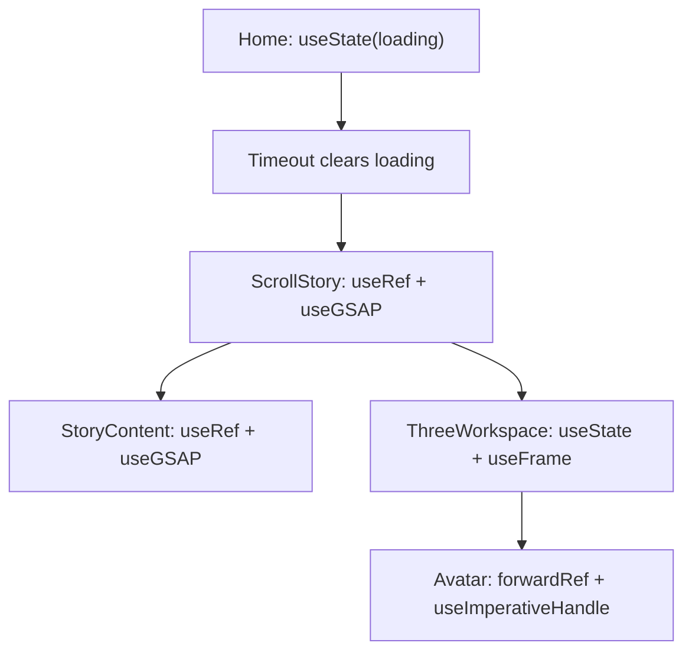

**Diagram sources**
- [app/page.js:6-58](file://app/page.js#L6-L58)
- [components/ScrollStory.jsx:13-69](file://components/ScrollStory.jsx#L13-L69)
- [components/StoryContent.jsx:17-89](file://components/StoryContent.jsx#L17-L89)
- [components/three/ThreeWorkspace.jsx:104-185](file://components/three/ThreeWorkspace.jsx#L104-L185)
- [components/three/Avatar.jsx:64-163](file://components/three/Avatar.jsx#L64-L163)

**Section sources**
- [app/page.js:6-58](file://app/page.js#L6-L58)
- [components/ScrollStory.jsx:13-69](file://components/ScrollStory.jsx#L13-L69)
- [components/StoryContent.jsx:17-89](file://components/StoryContent.jsx#L17-L89)
- [components/three/ThreeWorkspace.jsx:104-185](file://components/three/ThreeWorkspace.jsx#L104-L185)
- [components/three/Avatar.jsx:64-163](file://components/three/Avatar.jsx#L64-L163)

### Event Handling Between Components
- Custom Cursor listens to mousemove and mouseover to update positions and detect clickable elements via dataset attributes.
- SmoothScroll integrates Lenis with GSAP ScrollTrigger by updating ScrollTrigger on scroll events and syncing the requestAnimationFrame loop.
- ScrollStory and StoryContent use GSAP ScrollTrigger to respond to scroll events and animate UI elements.
- ThreeWorkspace uses GSAP ScrollTrigger to build a timeline that drives camera movement and avatar state changes.

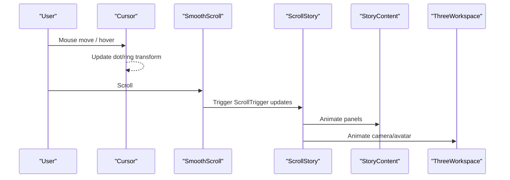

**Diagram sources**
- [components/Cursor.jsx:20-110](file://components/Cursor.jsx#L20-L110)
- [components/SmoothScroll.jsx:10-46](file://components/SmoothScroll.jsx#L10-L46)
- [components/ScrollStory.jsx:13-69](file://components/ScrollStory.jsx#L13-L69)
- [components/StoryContent.jsx:17-89](file://components/StoryContent.jsx#L17-L89)
- [components/three/ThreeWorkspace.jsx:23-98](file://components/three/ThreeWorkspace.jsx#L23-L98)

**Section sources**
- [components/Cursor.jsx:20-110](file://components/Cursor.jsx#L20-L110)
- [components/SmoothScroll.jsx:10-46](file://components/SmoothScroll.jsx#L10-L46)
- [components/ScrollStory.jsx:13-69](file://components/ScrollStory.jsx#L13-L69)
- [components/StoryContent.jsx:17-89](file://components/StoryContent.jsx#L17-L89)
- [components/three/ThreeWorkspace.jsx:23-98](file://components/three/ThreeWorkspace.jsx#L23-L98)

### Modular Design for Independent Development
- Content panels are isolated under components/sections and depend only on shared data from lib/data.js. Adding or editing a panel does not affect the 3D scene.
- 3D scene components are isolated under components/three. New objects (e.g., furniture, effects) can be added without changing panel logic.
- ScrollStory remains the single point of orchestration, making it easy to adjust timing and sequencing without touching individual modules.

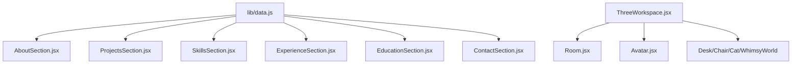

**Diagram sources**
- [lib/data.js:1-181](file://lib/data.js#L1-L181)
- [components/three/ThreeWorkspace.jsx:104-185](file://components/three/ThreeWorkspace.jsx#L104-L185)
- [components/three/Room.jsx:12-63](file://components/three/Room.jsx#L12-L63)
- [components/three/Avatar.jsx:64-163](file://components/three/Avatar.jsx#L64-L163)

**Section sources**
- [lib/data.js:1-181](file://lib/data.js#L1-L181)
- [components/three/ThreeWorkspace.jsx:104-185](file://components/three/ThreeWorkspace.jsx#L104-L185)
- [components/three/Room.jsx:12-63](file://components/three/Room.jsx#L12-L63)
- [components/three/Avatar.jsx:64-163](file://components/three/Avatar.jsx#L64-L163)

## Dependency Analysis
- RootLayout depends on SmoothScroll and Cursor to provide global UX features.
- Home depends on ScrollStory to render the main experience after loading.
- ScrollStory depends on StoryContent and ThreeWorkspace for layered presentation.
- StoryContent depends on section components and lib/data.js for content.
- ThreeWorkspace depends on 3D components (Room, Avatar, etc.) and uses GSAP ScrollTrigger for animation.
- SmoothScroll depends on Lenis and GSAP ScrollTrigger to unify scroll behavior.
- Cursor depends on window events and media queries for touch detection.

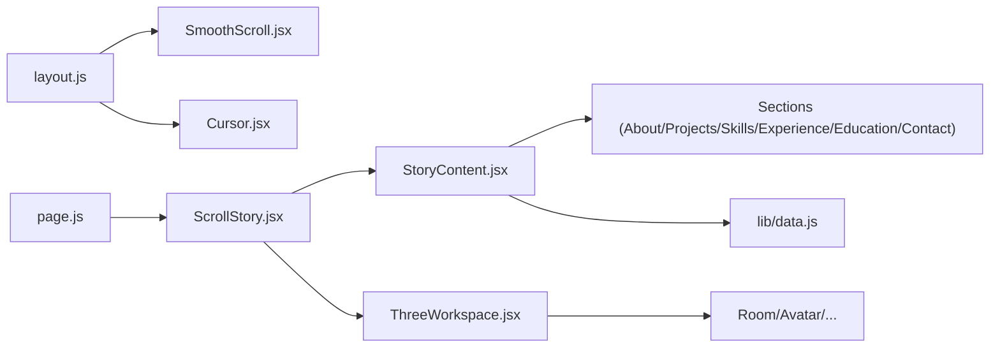

**Diagram sources**
- [app/layout.js:40-54](file://app/layout.js#L40-L54)
- [app/page.js:6-58](file://app/page.js#L6-L58)
- [components/ScrollStory.jsx:13-69](file://components/ScrollStory.jsx#L13-L69)
- [components/StoryContent.jsx:17-89](file://components/StoryContent.jsx#L17-L89)
- [components/three/ThreeWorkspace.jsx:104-185](file://components/three/ThreeWorkspace.jsx#L104-L185)
- [components/SmoothScroll.jsx:10-46](file://components/SmoothScroll.jsx#L10-L46)
- [components/Cursor.jsx:20-110](file://components/Cursor.jsx#L20-L110)
- [lib/data.js:1-181](file://lib/data.js#L1-L181)

**Section sources**
- [app/layout.js:40-54](file://app/layout.js#L40-L54)
- [app/page.js:6-58](file://app/page.js#L6-L58)
- [components/ScrollStory.jsx:13-69](file://components/ScrollStory.jsx#L13-L69)
- [components/StoryContent.jsx:17-89](file://components/StoryContent.jsx#L17-L89)
- [components/three/ThreeWorkspace.jsx:104-185](file://components/three/ThreeWorkspace.jsx#L104-L185)
- [components/SmoothScroll.jsx:10-46](file://components/SmoothScroll.jsx#L10-L46)
- [components/Cursor.jsx:20-110](file://components/Cursor.jsx#L20-L110)
- [lib/data.js:1-181](file://lib/data.js#L1-L181)

## Performance Considerations
- Use reduced motion preferences: SmoothScroll respects prefers-reduced-motion to adjust duration and easing.
- Limit re-renders: Prefer refs and imperative APIs (useImperativeHandle) for frequent updates like avatar positioning.
- Optimize 3D rendering: Adjust DPR and shadow settings in the Canvas to balance quality and performance.
- Defer heavy initialization: Keep the loading screen short and transition quickly to the main experience.
- Batch animations: Group GSAP ScrollTrigger timelines to minimize layout thrashing.

[No sources needed since this section provides general guidance]

## Troubleshooting Guide
- ScrollTrigger not firing: Ensure ScrollTrigger is registered and that the trigger element exists before creating timelines. Verify that the storyRef is available in useEffect/useGSAP callbacks.
- Smooth scroll conflicts: Confirm that Lenis is initialized only once and that ScrollTrigger.update is called on scroll events.
- Custom cursor not visible on touch devices: The Cursor component disables itself on coarse pointers; verify device detection logic.
- 3D scene not responding to scroll: Check that the ScrollCamera timeline is bound to the correct storyRef and that the Canvas is mounted before creating ScrollTrigger instances.
- Panel animations misaligned: Validate the start/end percentages in the PANELS configuration and ensure panel refs are attached correctly.

**Section sources**
- [components/ScrollStory.jsx:13-69](file://components/ScrollStory.jsx#L13-L69)
- [components/StoryContent.jsx:17-89](file://components/StoryContent.jsx#L17-L89)
- [components/three/ThreeWorkspace.jsx:23-98](file://components/three/ThreeWorkspace.jsx#L23-L98)
- [components/SmoothScroll.jsx:10-46](file://components/SmoothScroll.jsx#L10-L46)
- [components/Cursor.jsx:20-110](file://components/Cursor.jsx#L20-L110)

## Conclusion
Emaan Portfolio demonstrates a clean, modular architecture that separates 2D UI from 3D scenes while unifying them through a scroll-driven narrative. The pattern leverages React hooks for lightweight state, GSAP ScrollTrigger for choreography, and composition for extensibility. This design enables independent development of content panels and 3D scenes, smooth transitions from a loading screen to the main experience, and scalable event handling across layers.

[No sources needed since this section summarizes without analyzing specific files]