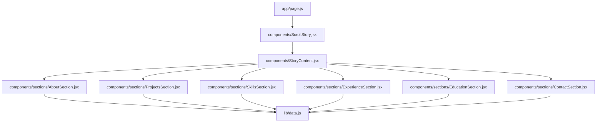
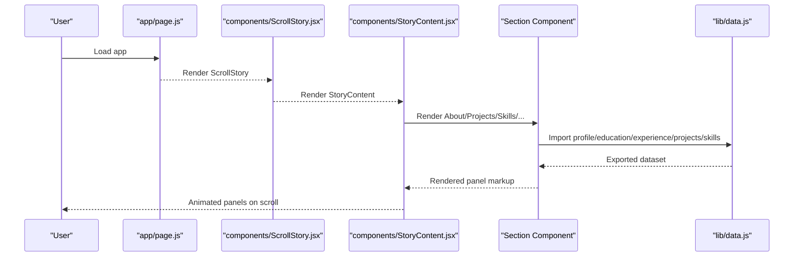
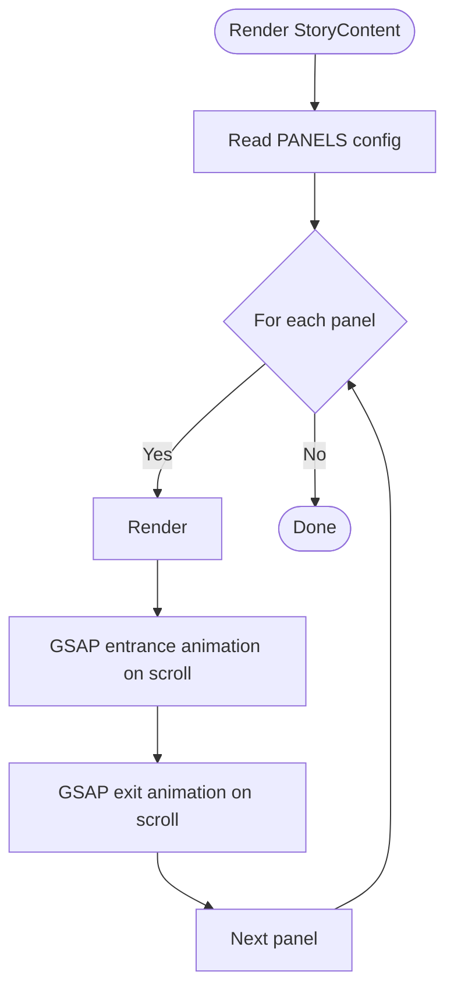
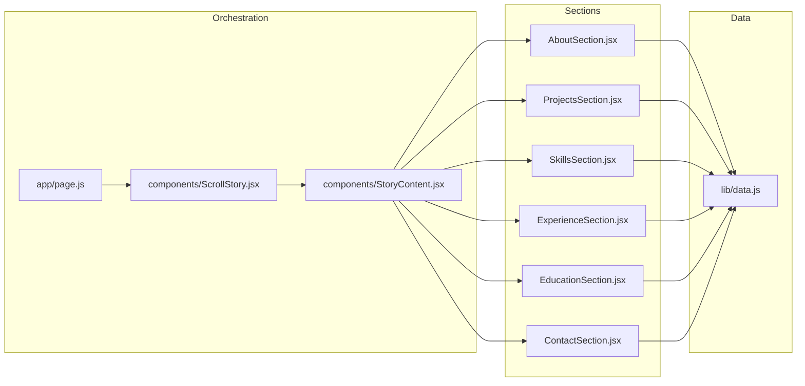

# Data Flow Architecture

<cite>
**Referenced Files in This Document**
- [data.js](file://lib/data.js)
- [page.js](file://app/page.js)
- [ScrollStory.jsx](file://components/ScrollStory.jsx)
- [StoryContent.jsx](file://components/StoryContent.jsx)
- [AboutSection.jsx](file://components/sections/AboutSection.jsx)
- [ProjectsSection.jsx](file://components/sections/ProjectsSection.jsx)
- [SkillsSection.jsx](file://components/sections/SkillsSection.jsx)
- [ExperienceSection.jsx](file://components/sections/ExperienceSection.jsx)
- [EducationSection.jsx](file://components/sections/EducationSection.jsx)
- [ContactSection.jsx](file://components/sections/ContactSection.jsx)
</cite>

## Table of Contents
1. [Introduction](#introduction)
2. [Project Structure](#project-structure)
3. [Core Components](#core-components)
4. [Architecture Overview](#architecture-overview)
5. [Detailed Component Analysis](#detailed-component-analysis)
6. [Dependency Analysis](#dependency-analysis)
7. [Performance Considerations](#performance-considerations)
8. [Troubleshooting Guide](#troubleshooting-guide)
9. [Conclusion](#conclusion)

## Introduction
This document explains how static data flows through the Emaan Portfolio application and how section components consume it to render content. The data layer is a single source of truth located in lib/data.js, exporting structured objects for profile, education, experience, projects, and skills. Section components import these exports directly and render them without intermediate state or API calls. The flow follows a unidirectional pattern: data is defined once and consumed by multiple presentational components that transform and display it according to their layout needs.

## Project Structure
At a high level:
- The root page renders a loading screen and then mounts ScrollStory.
- ScrollStory composes StoryContent (which orchestrates panels) and ThreeWorkspace.
- StoryContent defines the ordered list of panels and renders each panel component.
- Each panel component imports its relevant data from lib/data.js and renders it.

**Diagram sources**
- [page.js:1-60](file://app/page.js#L1-L60)
- [ScrollStory.jsx:1-70](file://components/ScrollStory.jsx#L1-L70)
- [StoryContent.jsx:1-91](file://components/StoryContent.jsx#L1-L91)
- [AboutSection.jsx:1-30](file://components/sections/AboutSection.jsx#L1-L30)
- [ProjectsSection.jsx:1-43](file://components/sections/ProjectsSection.jsx#L1-L43)
- [SkillsSection.jsx:1-42](file://components/sections/SkillsSection.jsx#L1-L42)
- [ExperienceSection.jsx:1-36](file://components/sections/ExperienceSection.jsx#L1-L36)
- [EducationSection.jsx:1-42](file://components/sections/EducationSection.jsx#L1-L42)
- [ContactSection.jsx:1-60](file://components/sections/ContactSection.jsx#L1-L60)
- [data.js:1-181](file://lib/data.js#L1-L181)

**Section sources**
- [page.js:1-60](file://app/page.js#L1-L60)
- [ScrollStory.jsx:1-70](file://components/ScrollStory.jsx#L1-L70)
- [StoryContent.jsx:1-91](file://components/StoryContent.jsx#L1-L91)

## Core Components
- Data layer (lib/data.js): Exports typed, static datasets for profile, education, experience, projects, and skills. It provides a clean interface for different content types used across sections.
- Page entry (app/page.js): Manages a simple loading state and renders ScrollStory after initialization.
- Scroll container (components/ScrollStory.jsx): Sets up scroll-based animations and composes StoryContent and ThreeWorkspace.
- Panel orchestrator (components/StoryContent.jsx): Declares the sequence of panels and renders each with GSAP-driven entrance/exit animations based on scroll position.
- Section components: Import data directly and render content using mapping, filtering, and conditional logic.

Key responsibilities:
- Data layer: Single source of truth; no side effects.
- Page: Mounting and basic UI state (loading).
- ScrollStory: Animation orchestration and composition.
- StoryContent: Panel ordering and animation triggers.
- Sections: Presentation and minor transformations (e.g., slicing arrays, conditionally rendering fields).

**Section sources**
- [data.js:1-181](file://lib/data.js#L1-L181)
- [page.js:1-60](file://app/page.js#L1-L60)
- [ScrollStory.jsx:1-70](file://components/ScrollStory.jsx#L1-L70)
- [StoryContent.jsx:1-91](file://components/StoryContent.jsx#L1-L91)
- [AboutSection.jsx:1-30](file://components/sections/AboutSection.jsx#L1-L30)
- [ProjectsSection.jsx:1-43](file://components/sections/ProjectsSection.jsx#L1-L43)
- [SkillsSection.jsx:1-42](file://components/sections/SkillsSection.jsx#L1-L42)
- [ExperienceSection.jsx:1-36](file://components/sections/ExperienceSection.jsx#L1-L36)
- [EducationSection.jsx:1-42](file://components/sections/EducationSection.jsx#L1-L42)
- [ContactSection.jsx:1-60](file://components/sections/ContactSection.jsx#L1-L60)

## Architecture Overview
The application follows a unidirectional data flow:
- Static data is defined in lib/data.js.
- Section components import only what they need.
- StoryContent composes panels in a fixed order and animates them via scroll.
- No component updates the shared data; changes would be made centrally in lib/data.js and re-rendered automatically by React when the module is re-imported.

**Diagram sources**
- [page.js:1-60](file://app/page.js#L1-L60)
- [ScrollStory.jsx:1-70](file://components/ScrollStory.jsx#L1-L70)
- [StoryContent.jsx:1-91](file://components/StoryContent.jsx#L1-L91)
- [AboutSection.jsx:1-30](file://components/sections/AboutSection.jsx#L1-L30)
- [ProjectsSection.jsx:1-43](file://components/sections/ProjectsSection.jsx#L1-L43)
- [SkillsSection.jsx:1-42](file://components/sections/SkillsSection.jsx#L1-L42)
- [ExperienceSection.jsx:1-36](file://components/sections/ExperienceSection.jsx#L1-L36)
- [EducationSection.jsx:1-42](file://components/sections/EducationSection.jsx#L1-L42)
- [ContactSection.jsx:1-60](file://components/sections/ContactSection.jsx#L1-L60)
- [data.js:1-181](file://lib/data.js#L1-L181)

## Detailed Component Analysis

### Data Layer: lib/data.js
- Provides a clean, typed interface for distinct content categories:
  - profile: object with personal details and about text
  - education: array of education entries with optional fields like focus and level
  - experience: array of work experiences with highlights
  - projects: array of project entries with metadata and links
  - skills: grouped into technical, soft, and tools
- Complexity: O(1) reads per import; iteration over arrays occurs in consuming components.
- Optimization opportunities:
  - If datasets grow large, consider memoizing derived views or lazy-loading heavy assets.
  - For very large lists, virtualization could be considered at the presentation layer.

**Section sources**
- [data.js:1-181](file://lib/data.js#L1-L181)

### Page Entry: app/page.js
- Manages a brief loading state and renders ScrollStory once loaded.
- Keeps data concerns out of the root page; delegates to ScrollStory.

**Section sources**
- [page.js:1-60](file://app/page.js#L1-L60)

### Scroll Container: components/ScrollStory.jsx
- Composes StoryContent and ThreeWorkspace.
- Uses GSAP ScrollTrigger to animate the intro overlay while scrolling.
- Does not handle data; purely presentational and animation-focused.

**Section sources**
- [ScrollStory.jsx:1-70](file://components/ScrollStory.jsx#L1-L70)

### Panel Orchestrator: components/StoryContent.jsx
- Defines PANELS as an ordered configuration of id, Component, and scroll start/end ranges.
- Renders each panel inside a wrapper and applies entrance/exit animations tied to scroll position.
- Acts as a stable composition layer; adding new panels requires updating this config.

**Diagram sources**
- [StoryContent.jsx:17-24](file://components/StoryContent.jsx#L17-L24)
- [StoryContent.jsx:30-75](file://components/StoryContent.jsx#L30-L75)
- [StoryContent.jsx:77-89](file://components/StoryContent.jsx#L77-L89)

**Section sources**
- [StoryContent.jsx:1-91](file://components/StoryContent.jsx#L1-L91)

### Section Components: Data Binding and Presentation Logic

#### AboutSection.jsx
- Imports profile and renders about text and labels.
- Transforms profile.labels into role tags via map.
- Demonstrates direct binding of a single object’s properties.

**Section sources**
- [AboutSection.jsx:1-30](file://components/sections/AboutSection.jsx#L1-L30)
- [data.js:1-15](file://lib/data.js#L1-L15)

#### ProjectsSection.jsx
- Imports projects and maps to project cards.
- Uses project.id to compute icons and routes to dynamic pages (/project/[slug]).
- Shows how a list is transformed into interactive UI elements.

**Section sources**
- [ProjectsSection.jsx:1-43](file://components/sections/ProjectsSection.jsx#L1-L43)
- [data.js:91-137](file://lib/data.js#L91-L137)

#### SkillsSection.jsx
- Imports skills and renders technical skills with color variables.
- Maps soft skills to tags.
- Demonstrates styling via CSS custom properties bound to data attributes.

**Section sources**
- [SkillsSection.jsx:1-42](file://components/sections/SkillsSection.jsx#L1-L42)
- [data.js:139-180](file://lib/data.js#L139-L180)

#### ExperienceSection.jsx
- Imports experience and maps to timeline cards.
- Applies filtering by slicing highlights to show only the first three items.
- Adds numbered badges using index + 1.

**Section sources**
- [ExperienceSection.jsx:1-36](file://components/sections/ExperienceSection.jsx#L1-L36)
- [data.js:44-89](file://lib/data.js#L44-L89)

#### EducationSection.jsx
- Imports education and maps to cards.
- Conditionally renders extra fields (level, focus) when present.
- Demonstrates handling optional fields gracefully.

**Section sources**
- [EducationSection.jsx:1-42](file://components/sections/EducationSection.jsx#L1-L42)
- [data.js:17-42](file://lib/data.js#L17-L42)

#### ContactSection.jsx
- Imports profile and uses email, LinkedIn, and GitHub links.
- Creates action buttons bound to contact information.

**Section sources**
- [ContactSection.jsx:1-60](file://components/sections/ContactSection.jsx#L1-L60)
- [data.js:1-15](file://lib/data.js#L1-L15)

### Data Transformation Examples
- Filtering: ExperienceSection slices highlights to limit visible items.
- Mapping: All list sections map arrays to UI elements.
- Conditional rendering: EducationSection checks for optional fields before rendering.
- Styling via data: SkillsSection binds colors to CSS variables for visual variety.

[No sources needed since this subsection summarizes patterns already cited above]

## Dependency Analysis
The dependency graph shows clear separation between data and presentation:

**Diagram sources**
- [page.js:1-60](file://app/page.js#L1-L60)
- [ScrollStory.jsx:1-70](file://components/ScrollStory.jsx#L1-L70)
- [StoryContent.jsx:1-91](file://components/StoryContent.jsx#L1-L91)
- [AboutSection.jsx:1-30](file://components/sections/AboutSection.jsx#L1-L30)
- [ProjectsSection.jsx:1-43](file://components/sections/ProjectsSection.jsx#L1-L43)
- [SkillsSection.jsx:1-42](file://components/sections/SkillsSection.jsx#L1-L42)
- [ExperienceSection.jsx:1-36](file://components/sections/ExperienceSection.jsx#L1-L36)
- [EducationSection.jsx:1-42](file://components/sections/EducationSection.jsx#L1-L42)
- [ContactSection.jsx:1-60](file://components/sections/ContactSection.jsx#L1-L60)
- [data.js:1-181](file://lib/data.js#L1-L181)

**Section sources**
- [StoryContent.jsx:17-24](file://components/StoryContent.jsx#L17-L24)
- [data.js:1-181](file://lib/data.js#L1-L181)

## Performance Considerations
- Static data: Since data is imported directly from a module, there are no network requests; rendering is synchronous and fast.
- List rendering: Each section maps small arrays; performance is negligible. If datasets grow, consider:
  - Memoizing expensive computations within sections.
  - Virtualizing long lists if necessary.
- Animations: GSAP ScrollTrigger runs on scroll events; ensure animations are lightweight and scoped to avoid layout thrashing.
- Re-renders: Because data is static and imported at module scope, changes to lib/data.js will cause affected components to re-render on next load. There is no runtime state mutation in this codebase.

[No sources needed since this section provides general guidance]

## Troubleshooting Guide
- Missing or incorrect data fields:
  - Symptoms: Undefined values or missing UI elements.
  - Action: Verify the corresponding export in lib/data.js matches the expected shape used by the section.
- Broken links or routing:
  - ProjectsSection links to /project/[slug]; ensure the slug matches project.id and the route exists.
- Animation issues:
  - If panels do not animate, confirm that StoryContent receives a valid storyRef and that GSAP plugins are registered.
- Contact actions not working:
  - Ensure profile.email and social links exist in lib/data.js.

**Section sources**
- [ProjectsSection.jsx:18-38](file://components/sections/ProjectsSection.jsx#L18-L38)
- [ContactSection.jsx:19-52](file://components/sections/ContactSection.jsx#L19-L52)
- [ScrollStory.jsx:17-34](file://components/ScrollStory.jsx#L17-L34)
- [StoryContent.jsx:30-75](file://components/StoryContent.jsx#L30-L75)

## Conclusion
Emaan Portfolio implements a clean, unidirectional data flow:
- lib/data.js serves as the single source of truth for all content.
- Section components import and render data directly, applying minimal transformation and presentation logic.
- StoryContent orchestrates panel order and animations, decoupled from data concerns.
- This architecture keeps components focused on presentation and makes it straightforward to update content by editing lib/data.js.

[No sources needed since this section summarizes without analyzing specific files]