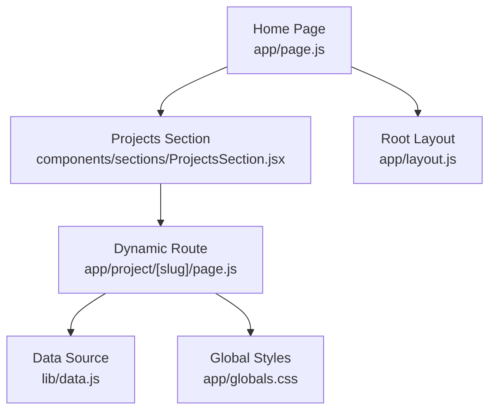
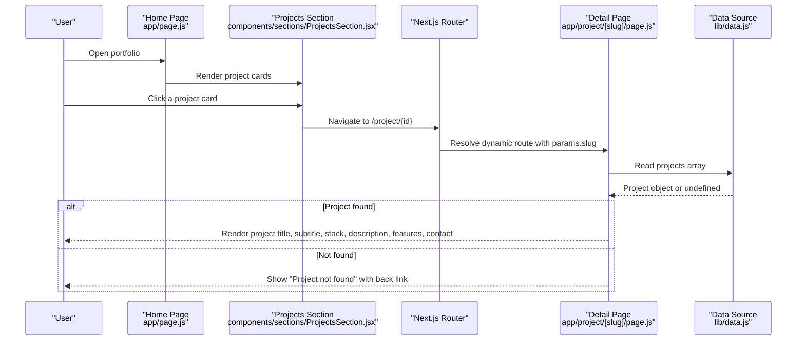
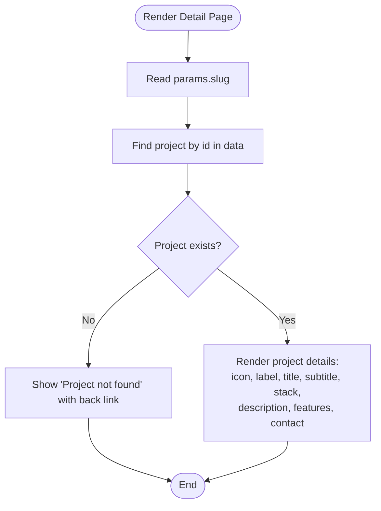
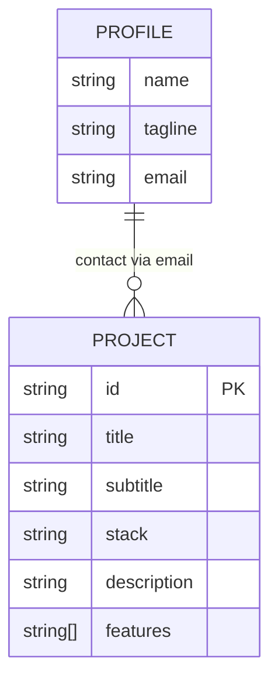
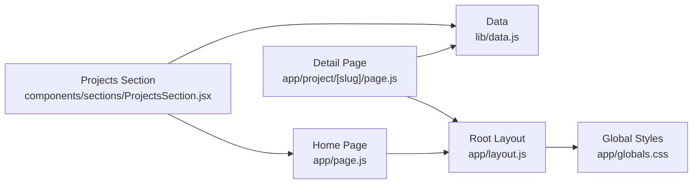

# Dynamic Project Detail Pages

<cite>
**Referenced Files in This Document**
- [page.js](file://app/project/[slug]/page.js)
- [data.js](file://lib/data.js)
- [ProjectsSection.jsx](file://components/sections/ProjectsSection.jsx)
- [layout.js](file://app/layout.js)
- [globals.css](file://app/globals.css)
- [page.js](file://app/page.js)
- [package.json](file://package.json)
</cite>

## Table of Contents
1. [Introduction](#introduction)
2. [Project Structure](#project-structure)
3. [Core Components](#core-components)
4. [Architecture Overview](#architecture-overview)
5. [Detailed Component Analysis](#detailed-component-analysis)
6. [Dependency Analysis](#dependency-analysis)
7. [Performance Considerations](#performance-considerations)
8. [Troubleshooting Guide](#troubleshooting-guide)
9. [Conclusion](#conclusion)

## Introduction
This document explains the implementation and behavior of the Dynamic Project Detail Pages feature in a Next.js portfolio application. It covers how project detail pages are generated, how data is sourced and rendered, navigation flow from the projects list to individual project details, error handling for missing projects, and styling considerations. The goal is to make the system understandable for both technical and non-technical readers.

## Project Structure
The dynamic project detail page is implemented using Next.js App Router with a catch-all route segment. Projects are listed on the home page’s scroll story and link to their respective detail pages. All project metadata is centralized in a data module.

**Diagram sources**
- [page.js:1-66](file://app/page.js#L1-L66)
- [ProjectsSection.jsx:1-43](file://components/sections/ProjectsSection.jsx#L1-L43)
- [page.js:1-71](file://app/project/[slug]/page.js#L1-L71)
- [data.js:91-137](file://lib/data.js#L91-L137)
- [layout.js:1-55](file://app/layout.js#L1-L55)
- [globals.css:1-800](file://app/globals.css#L1-L800)

**Section sources**
- [page.js:1-66](file://app/page.js#L1-L66)
- [ProjectsSection.jsx:1-43](file://components/sections/ProjectsSection.jsx#L1-L43)
- [page.js:1-71](file://app/project/[slug]/page.js#L1-L71)
- [data.js:91-137](file://lib/data.js#L91-L137)
- [layout.js:1-55](file://app/layout.js#L1-L55)
- [globals.css:1-800](file://app/globals.css#L1-L800)

## Core Components
- Dynamic Project Detail Page: Renders a single project based on the URL slug, displays project metadata, features, and a contact call-to-action. Also handles not-found cases.
- Projects Section: Displays a grid of project cards that navigate to each project’s detail page via dynamic links.
- Data Module: Centralizes profile and project information used across components and pages.
- Root Layout: Provides global fonts, metadata, smooth scrolling, and custom cursor.
- Global Styles: Defines color tokens, animations, and base styles used by the app.

**Section sources**
- [page.js:1-71](file://app/project/[slug]/page.js#L1-L71)
- [ProjectsSection.jsx:1-43](file://components/sections/ProjectsSection.jsx#L1-L43)
- [data.js:1-181](file://lib/data.js#L1-L181)
- [layout.js:1-55](file://app/layout.js#L1-L55)
- [globals.css:1-800](file://app/globals.css#L1-L800)

## Architecture Overview
The user journey begins at the home page, where they can explore projects. Clicking a project card navigates to a dynamic route that renders the corresponding project detail page. The detail page fetches data from a central data module and renders it with consistent styling.

**Diagram sources**
- [page.js:1-66](file://app/page.js#L1-L66)
- [ProjectsSection.jsx:1-43](file://components/sections/ProjectsSection.jsx#L1-L43)
- [page.js:1-71](file://app/project/[slug]/page.js#L1-L71)
- [data.js:91-137](file://lib/data.js#L91-L137)

## Detailed Component Analysis

### Dynamic Project Detail Page
Responsibilities:
- Generate static parameters for all projects to enable pre-rendered routes.
- Resolve the project by matching the URL slug against the projects data.
- Render project details including icon, label, title, subtitle, stack, description, and key features.
- Provide a contact call-to-action using profile email.
- Handle missing projects gracefully with a “not found” message and a back link.

Key behaviors:
- Static generation uses the projects array to produce one route per project id.
- Icon selection is based on project id for visual distinction.
- Navigation back to home is provided via a link component.

**Diagram sources**
- [page.js:1-71](file://app/project/[slug]/page.js#L1-L71)
- [data.js:91-137](file://lib/data.js#L91-L137)

**Section sources**
- [page.js:1-71](file://app/project/[slug]/page.js#L1-L71)

### Projects Section (Entry Point to Details)
Responsibilities:
- Display a grid of project cards.
- Link each card to its dynamic detail page using the project id.
- Show project icon, title, subtitle, and stack on each card.

Navigation:
- Each card wraps a link to /project/{id}, enabling client-side routing within the app.

**Section sources**
- [ProjectsSection.jsx:1-43](file://components/sections/ProjectsSection.jsx#L1-L43)

### Data Model and Relationships
Centralized data includes:
- Profile information used for contact links and about sections.
- Projects array containing id, title, subtitle, stack, description, and features.

Relationships:
- Detail page depends on projects and profile to render content and contact link.
- Projects section depends on projects to render cards and links.

**Diagram sources**
- [data.js:1-15](file://lib/data.js#L1-L15)
- [data.js:91-137](file://lib/data.js#L91-L137)

**Section sources**
- [data.js:1-181](file://lib/data.js#L1-L181)

### Root Layout and Global Styling
Layout:
- Sets up global fonts, metadata, smooth scrolling, and custom cursor.
- Wraps all pages with shared UI elements.

Styling:
- Global CSS defines color tokens, base typography, and animations used throughout the app, including loading screen and hero placeholders.

**Section sources**
- [layout.js:1-55](file://app/layout.js#L1-L55)
- [globals.css:1-800](file://app/globals.css#L1-L800)

## Dependency Analysis
High-level dependencies:
- Detail page depends on Next.js Link and data module.
- Projects section depends on Next.js Link and data module.
- Root layout imports global CSS and UI utilities.
- Home page composes scroll-based UI and progress indicators.

**Diagram sources**
- [page.js:1-71](file://app/project/[slug]/page.js#L1-L71)
- [ProjectsSection.jsx:1-43](file://components/sections/ProjectsSection.jsx#L1-L43)
- [layout.js:1-55](file://app/layout.js#L1-L55)
- [page.js:1-66](file://app/page.js#L1-L66)
- [globals.css:1-800](file://app/globals.css#L1-L800)

**Section sources**
- [page.js:1-71](file://app/project/[slug]/page.js#L1-L71)
- [ProjectsSection.jsx:1-43](file://components/sections/ProjectsSection.jsx#L1-L43)
- [layout.js:1-55](file://app/layout.js#L1-L55)
- [page.js:1-66](file://app/page.js#L1-L66)
- [globals.css:1-800](file://app/globals.css#L1-L800)

## Performance Considerations
- Static Generation: The detail page generates static parameters for all projects, enabling pre-rendered routes for fast initial loads and better SEO.
- Data Access: Reading from a local data module avoids runtime network calls for project details, reducing latency.
- Routing: Using Next.js App Router with dynamic segments ensures efficient client-side navigation after initial load.
- Styling: Global CSS and Tailwind integration keep styles modular and reusable without heavy runtime overhead.

[No sources needed since this section provides general guidance]

## Troubleshooting Guide
Common issues and resolutions:
- Missing project details: If a project id does not exist in the data module, the detail page shows a “Project not found” message. Ensure the project id in the URL matches an entry in the projects array.
- Broken navigation: Verify that project cards link to /project/{id} and that the id values match those in the data module.
- Contact link not working: Confirm that the profile email is correctly set in the data module so the mailto link functions properly.
- Styling anomalies: Check global CSS classes used by the detail page and ensure Tailwind is configured and imported.

**Section sources**
- [page.js:1-71](file://app/project/[slug]/page.js#L1-L71)
- [data.js:91-137](file://lib/data.js#L91-L137)
- [ProjectsSection.jsx:1-43](file://components/sections/ProjectsSection.jsx#L1-L43)
- [globals.css:1-800](file://app/globals.css#L1-L800)

## Conclusion
The Dynamic Project Detail Pages feature leverages Next.js App Router to provide fast, statically generated project detail routes. Data is centralized for maintainability, and navigation flows cleanly from the projects section to individual detail pages. Error handling ensures a robust user experience when projects are missing. The design integrates smoothly with global styles and layout, supporting a cohesive portfolio experience.

[No sources needed since this section summarizes without analyzing specific files]