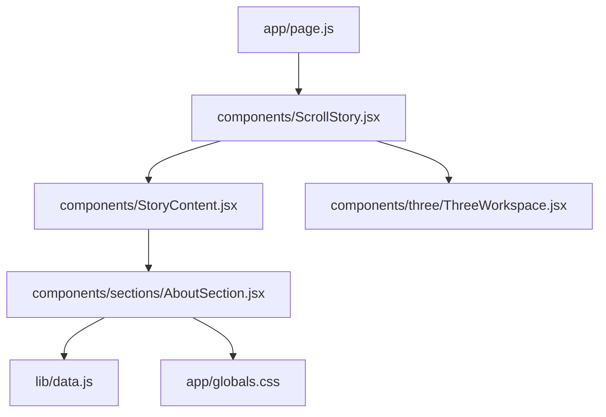
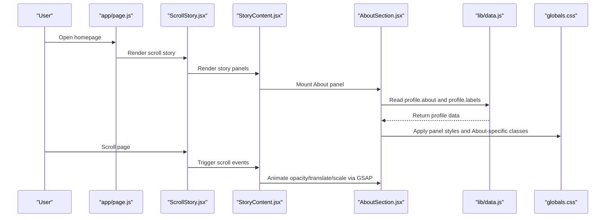
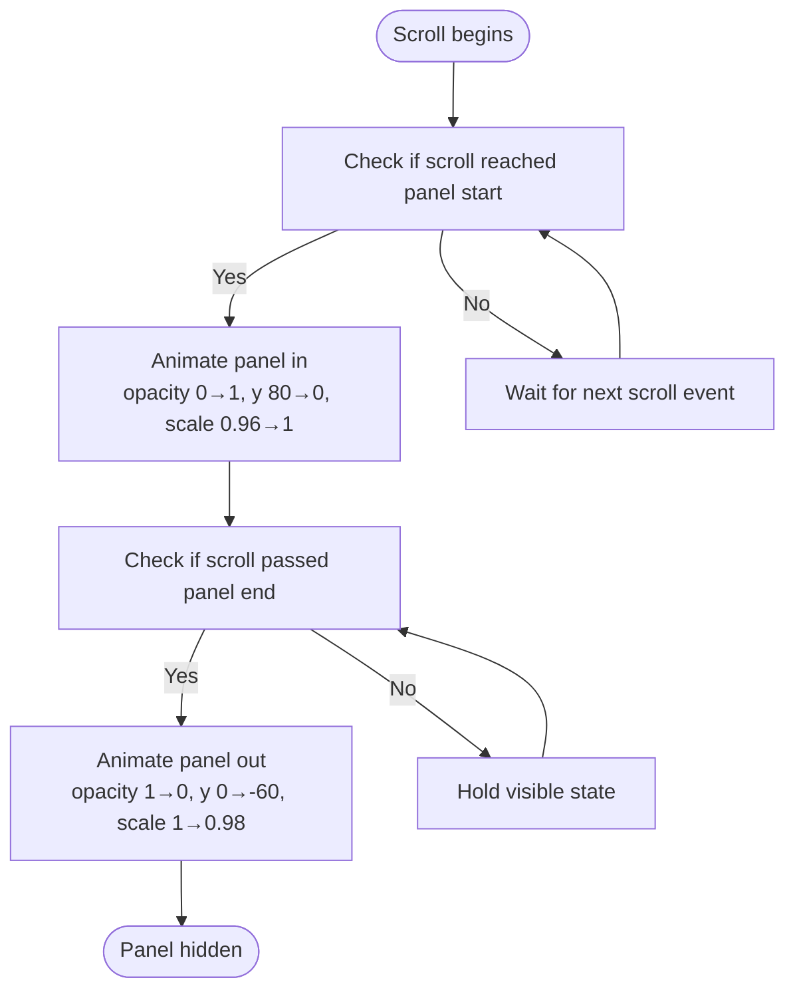
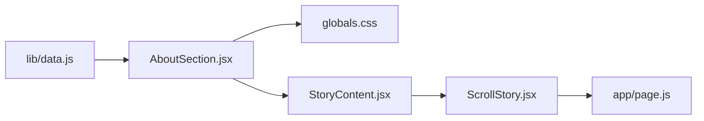

# About Section Component

<cite>
**Referenced Files in This Document**
- [AboutSection.jsx](file://components/sections/AboutSection.jsx)
- [data.js](file://lib/data.js)
- [StoryContent.jsx](file://components/StoryContent.jsx)
- [ScrollStory.jsx](file://components/ScrollStory.jsx)
- [page.js](file://app/page.js)
- [globals.css](file://app/globals.css)
</cite>

## Table of Contents
1. [Introduction](#introduction)
2. [Project Structure](#project-structure)
3. [Core Components](#core-components)
4. [Architecture Overview](#architecture-overview)
5. [Detailed Component Analysis](#detailed-component-analysis)
6. [Dependency Analysis](#dependency-analysis)
7. [Performance Considerations](#performance-considerations)
8. [Troubleshooting Guide](#troubleshooting-guide)
9. [Conclusion](#conclusion)
10. [Appendices](#appendices)

## Introduction
This document explains the About section component that displays personal profile information within a scroll-driven storytelling interface. It covers how the component renders name, tagline, role labels, and bio content from the data layer, its layout structure, styling approach using Tailwind CSS and custom styles, and integration with the scroll-based animation system. It also provides guidance on customizing displayed information, modifying visual presentation, and extending the component to show additional profile details or social media links.

## Project Structure
The About section is part of a scroll story where multiple panels (About, Projects, Skills, Experience, Education, Contact) are animated into view as the user scrolls. The About panel is rendered by a dedicated component and integrated via a central story content manager that coordinates animations.

**Diagram sources**
- [page.js:1-60](file://app/page.js#L1-L60)
- [ScrollStory.jsx:1-70](file://components/ScrollStory.jsx#L1-L70)
- [StoryContent.jsx:1-91](file://components/StoryContent.jsx#L1-L91)
- [AboutSection.jsx:1-30](file://components/sections/AboutSection.jsx#L1-L30)
- [data.js:1-181](file://lib/data.js#L1-L181)
- [globals.css:2064-2169](file://app/globals.css#L2064-L2169)

**Section sources**
- [page.js:1-60](file://app/page.js#L1-L60)
- [ScrollStory.jsx:1-70](file://components/ScrollStory.jsx#L1-L70)
- [StoryContent.jsx:1-91](file://components/StoryContent.jsx#L1-L91)

## Core Components
- AboutSection: Renders the About panel UI and pulls profile data from the data layer.
- StoryContent: Registers and animates each panel’s entrance and exit based on scroll position.
- ScrollStory: Sets up the scroll container and initial intro animation.
- Data Layer: Provides profile object containing about text and role labels.
- Styles: Global CSS defines panel base styles and About-specific visuals; Tailwind is imported for utility classes.

Key responsibilities:
- AboutSection focuses on presenting profile info cleanly and accessibly.
- StoryContent orchestrates GSAP ScrollTrigger animations for smooth reveal and fade transitions.
- ScrollStory initializes the scroll context and intro effects.
- globals.css centralizes design tokens and reusable panel styles.

**Section sources**
- [AboutSection.jsx:1-30](file://components/sections/AboutSection.jsx#L1-L30)
- [StoryContent.jsx:17-91](file://components/StoryContent.jsx#L17-L91)
- [ScrollStory.jsx:13-67](file://components/ScrollStory.jsx#L13-L67)
- [data.js:1-15](file://lib/data.js#L1-L15)
- [globals.css:2064-2169](file://app/globals.css#L2064-L2169)

## Architecture Overview
The About panel is embedded in a layered scroll story. As the user scrolls, GSAP triggers animations that fade in the About panel, then fade it out as other panels appear. The panel reads static data from the data layer and renders it with consistent panel styling.

**Diagram sources**
- [page.js:1-60](file://app/page.js#L1-L60)
- [ScrollStory.jsx:13-67](file://components/ScrollStory.jsx#L13-L67)
- [StoryContent.jsx:17-91](file://components/StoryContent.jsx#L17-L91)
- [AboutSection.jsx:1-30](file://components/sections/AboutSection.jsx#L1-L30)
- [data.js:1-15](file://lib/data.js#L1-L15)
- [globals.css:2064-2169](file://app/globals.css#L2064-L2169)

## Detailed Component Analysis

### AboutSection: Rendering and Data Binding
- Purpose: Display a concise personal introduction with a title, bio paragraph, and role labels.
- Data binding:
  - Bio content comes from the profile object’s about field.
  - Role labels come from the profile object’s labels array and are mapped into individual tags.
- Layout structure:
  - Outer container uses a shared panel class for consistent card-like appearance.
  - Label at the top indicates the section purpose.
  - Title emphasizes key words with a highlighted span.
  - Body presents the bio text with comfortable line height and readable sizing.
  - Tags wrap horizontally with spacing and rounded pill shapes.
  - Optional mini-quote area adds a stylized accent.

Styling approach:
- Uses Tailwind CSS utilities for layout and typography where applicable.
- Relies on global CSS classes for panel base styling, label/title/body typography, and About-specific elements like role tags and mini quote.

Integration with scroll animations:
- The panel is wrapped by StoryContent which applies GSAP animations tied to scroll thresholds.
- Animations include fade-in, vertical translation, and subtle scaling during entry and exit phases.

Customization examples:
- Change bio text: Update the about field in the data layer.
- Add/remove role labels: Modify the labels array in the data layer.
- Adjust tag colors: Extend or override role-tag nth-child styles in global CSS.
- Replace mini-quote: Swap the hardcoded string with dynamic content from the data layer.

Extending to show additional profile details or social media links:
- Add new fields to the profile object (e.g., email, location, social links).
- Render them conditionally in AboutSection using JSX expressions.
- Style new elements consistently with existing panel classes or add new CSS classes.

**Section sources**
- [AboutSection.jsx:1-30](file://components/sections/AboutSection.jsx#L1-L30)
- [data.js:1-15](file://lib/data.js#L1-L15)
- [globals.css:2064-2169](file://app/globals.css#L2064-L2169)

### Scroll Integration: StoryContent and ScrollStory
- StoryContent registers each panel with start and end thresholds relative to the scroll container.
- For each panel:
  - Entry animation: fades in, moves up slightly, and scales to full size as the scroll reaches the start threshold.
  - Exit animation: fades out, moves up, and scales down slightly as the scroll passes the end threshold.
- ScrollStory sets up the scroll container and animates the intro header while scrolling.

Animation behavior specifics:
- Scrubbing ensures animations are tightly bound to scroll progress for smoothness.
- Each panel has unique start/end percentages to stagger reveals and avoid overlap.

**Diagram sources**
- [StoryContent.jsx:30-75](file://components/StoryContent.jsx#L30-L75)
- [ScrollStory.jsx:17-34](file://components/ScrollStory.jsx#L17-L34)

**Section sources**
- [StoryContent.jsx:17-91](file://components/StoryContent.jsx#L17-L91)
- [ScrollStory.jsx:13-67](file://components/ScrollStory.jsx#L13-L67)

### Styling System: Tailwind CSS and Global CSS
- Tailwind CSS is imported globally and can be used for quick utility styling within components.
- Global CSS defines:
  - Panel base style with rounded corners, backdrop blur, subtle border, and shadow.
  - Typography for panel label, title, and body with responsive font sizes and line heights.
  - About-specific styles for role tags with alternating color accents and a rotated mini-quote box.

Design tokens:
- Color variables define brand palette used across the site.
- Responsive sizing uses clamp() for fluid typography and spacing.

Best practices:
- Keep panel structure semantic and accessible (labels, headings, paragraphs).
- Use consistent spacing and alignment via global panel classes.
- Extend styles by adding new CSS classes rather than inline styles when possible.

**Section sources**
- [globals.css:1-28](file://app/globals.css#L1-L28)
- [globals.css:2064-2169](file://app/globals.css#L2064-L2169)

## Dependency Analysis
- AboutSection depends on:
  - Data layer for profile content.
  - Global CSS for panel and About-specific styles.
  - StoryContent wrapper for scroll-triggered animations.
- StoryContent depends on:
  - GSAP and ScrollTrigger for animations.
  - All section components including AboutSection.
- ScrollStory depends on:
  - GSAP and ScrollTrigger for intro animation.
  - StoryContent and ThreeWorkspace for layered composition.

**Diagram sources**
- [AboutSection.jsx:1-30](file://components/sections/AboutSection.jsx#L1-L30)
- [data.js:1-15](file://lib/data.js#L1-L15)
- [StoryContent.jsx:17-91](file://components/StoryContent.jsx#L17-L91)
- [ScrollStory.jsx:13-67](file://components/ScrollStory.jsx#L13-L67)
- [page.js:1-60](file://app/page.js#L1-L60)
- [globals.css:2064-2169](file://app/globals.css#L2064-L2169)

**Section sources**
- [AboutSection.jsx:1-30](file://components/sections/AboutSection.jsx#L1-L30)
- [StoryContent.jsx:17-91](file://components/StoryContent.jsx#L17-L91)
- [ScrollStory.jsx:13-67](file://components/ScrollStory.jsx#L13-L67)
- [page.js:1-60](file://app/page.js#L1-L60)
- [data.js:1-15](file://lib/data.js#L1-L15)
- [globals.css:2064-2169](file://app/globals.css#L2064-L2169)

## Performance Considerations
- GSAP ScrollTrigger animations are scrubbed to the scroll position, ensuring smooth interactions without heavy reflows.
- Panels are lightweight DOM nodes; keep content concise to minimize layout shifts.
- Avoid excessive nested transforms; rely on GSAP-managed properties for performance.
- Use CSS variables and minimal custom properties to reduce repaint costs.

[No sources needed since this section provides general guidance]

## Troubleshooting Guide
Common issues and resolutions:
- About panel not appearing:
  - Ensure StoryContent includes AboutSection in PANELS and that refs are attached correctly.
  - Verify scroll thresholds are within the scroll container bounds.
- Animations not triggering:
  - Confirm GSAP and ScrollTrigger are registered and useGSAP hook is applied with correct scope.
  - Check that the storyRef is provided and non-null before setting up animations.
- Content not updating:
  - Verify the data layer exports the expected fields and that AboutSection imports them correctly.
  - If adding new fields, ensure they are rendered in the component and styled appropriately.
- Styling conflicts:
  - Inspect computed styles in browser dev tools to identify overrides.
  - Prefer extending global CSS classes rather than adding conflicting inline styles.

**Section sources**
- [StoryContent.jsx:17-91](file://components/StoryContent.jsx#L17-L91)
- [ScrollStory.jsx:13-67](file://components/ScrollStory.jsx#L13-L67)
- [AboutSection.jsx:1-30](file://components/sections/AboutSection.jsx#L1-L30)
- [data.js:1-15](file://lib/data.js#L1-L15)
- [globals.css:2064-2169](file://app/globals.css#L2064-L2169)

## Conclusion
The About section component provides a clean, scroll-integrated presentation of personal profile information. It leverages a centralized data layer for content, consistent panel styling via global CSS, and GSAP-powered scroll animations orchestrated by StoryContent. Customization is straightforward through data updates and CSS extensions, and the component can be easily extended to display additional profile details or social media links while maintaining the project’s design system and interaction model.

[No sources needed since this section summarizes without analyzing specific files]

## Appendices

### How to Customize Displayed Information
- Update bio text: Edit the about field in the data layer.
- Modify role labels: Edit the labels array in the data layer.
- Add social links: Add new fields to the profile object and render them in AboutSection.

**Section sources**
- [data.js:1-15](file://lib/data.js#L1-L15)
- [AboutSection.jsx:1-30](file://components/sections/AboutSection.jsx#L1-L30)

### How to Modify Visual Presentation
- Adjust panel appearance: Modify global CSS classes for story-panel, panel-label, panel-title, and panel-body.
- Change tag colors: Extend role-tag nth-child selectors or add new variants in global CSS.
- Tweak mini-quote style: Adjust padding, background, and transform in the mini-quote class.

**Section sources**
- [globals.css:2064-2169](file://app/globals.css#L2064-L2169)

### How to Extend With Additional Profile Details or Social Links
- Add fields to profile object (e.g., email, location, LinkedIn, GitHub).
- In AboutSection, conditionally render new sections using JSX expressions.
- Style new elements with existing panel classes or create new CSS classes for consistency.

**Section sources**
- [data.js:1-15](file://lib/data.js#L1-L15)
- [AboutSection.jsx:1-30](file://components/sections/AboutSection.jsx#L1-L30)
- [globals.css:2064-2169](file://app/globals.css#L2064-L2169)