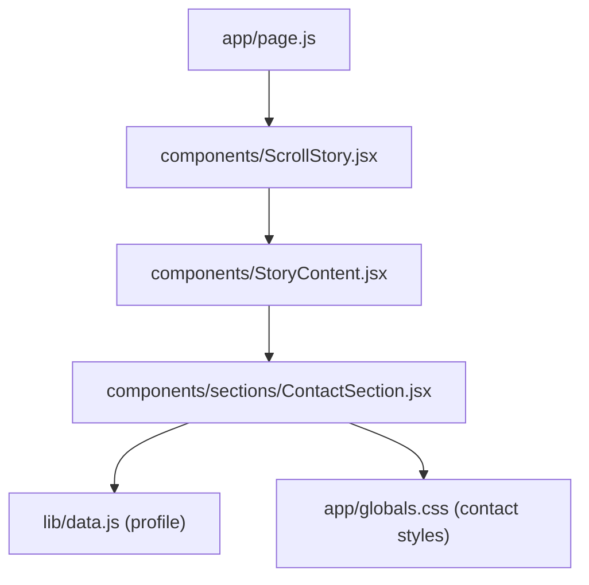
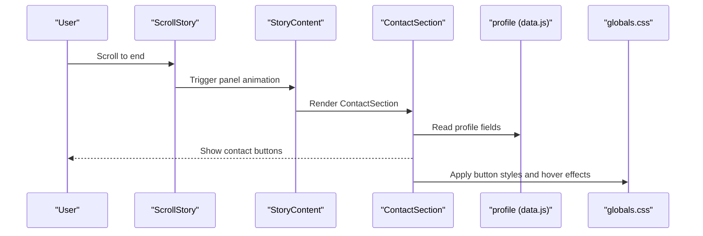
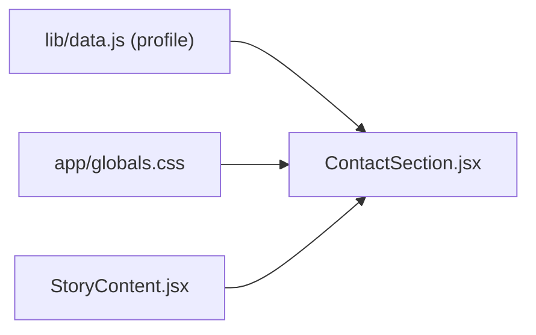

# Contact Section Component

<cite>
**Referenced Files in This Document**
- [ContactSection.jsx](file://components/sections/ContactSection.jsx)
- [data.js](file://lib/data.js)
- [globals.css](file://app/globals.css)
- [StoryContent.jsx](file://components/StoryContent.jsx)
</cite>

## Table of Contents
1. [Introduction](#introduction)
2. [Project Structure](#project-structure)
3. [Core Components](#core-components)
4. [Architecture Overview](#architecture-overview)
5. [Detailed Component Analysis](#detailed-component-analysis)
6. [Dependency Analysis](#dependency-analysis)
7. [Performance Considerations](#performance-considerations)
8. [Troubleshooting Guide](#troubleshooting-guide)
9. [Conclusion](#conclusion)
10. [Appendices](#appendices)

## Introduction
This document explains the Contact section component that renders contact information and social media links for a portfolio site. It covers how the component reads profile data, renders email and social links, handles external URLs, and applies styling per contact method. It also provides guidance on adding new contact methods, customizing link behavior, and extending the component to support additional communication channels or social profiles.

## Project Structure
The Contact section is implemented as a client-side React component that imports profile data from a central data module and uses global CSS classes for layout and styling. The component is integrated into the scroll-driven story via a panel registry.

**Diagram sources**
- [StoryContent.jsx:17-24](file://components/StoryContent.jsx#L17-L24)
- [ContactSection.jsx:1-59](file://components/sections/ContactSection.jsx#L1-L59)
- [data.js:1-15](file://lib/data.js#L1-L15)
- [globals.css:2511-2577](file://app/globals.css#L2511-L2577)

**Section sources**
- [StoryContent.jsx:17-24](file://components/StoryContent.jsx#L17-L24)
- [ContactSection.jsx:1-59](file://components/sections/ContactSection.jsx#L1-L59)
- [data.js:1-15](file://lib/data.js#L1-L15)
- [globals.css:2511-2577](file://app/globals.css#L2511-L2577)

## Core Components
- ContactSection: Renders the contact panel with action buttons for Email, LinkedIn, GitHub, and Résumé.
- Profile Data: Centralized object containing contact fields such as email, phone, WhatsApp, LinkedIn, GitHub, location, and date of birth.
- Global Styles: CSS classes define the visual appearance and hover effects for contact buttons and container.

Key responsibilities:
- Read contact-related fields from profile data.
- Render actionable links with appropriate hrefs and attributes.
- Apply consistent styling across different contact methods.

**Section sources**
- [ContactSection.jsx:1-59](file://components/sections/ContactSection.jsx#L1-L59)
- [data.js:1-15](file://lib/data.js#L1-L15)
- [globals.css:2511-2577](file://app/globals.css#L2511-L2577)

## Architecture Overview
The Contact section is part of a scroll-triggered story where each section is a “panel.” The Contact panel is registered in a configuration array and rendered when the user scrolls to its range. Styling is centralized in global CSS, while content comes from the shared profile data.

**Diagram sources**
- [StoryContent.jsx:17-24](file://components/StoryContent.jsx#L17-L24)
- [ContactSection.jsx:1-59](file://components/sections/ContactSection.jsx#L1-L59)
- [data.js:1-15](file://lib/data.js#L1-L15)
- [globals.css:2511-2577](file://app/globals.css#L2511-L2577)

## Detailed Component Analysis

### Rendering Logic and Data Binding
- The component imports the profile object and uses it to populate link destinations.
- Email link uses a mailto protocol constructed from profile.email.
- External social links (LinkedIn, GitHub) use their respective URLs from profile and open in a new tab using target="_blank" with rel="noreferrer".
- A placeholder Résumé link is included for future integration.

Notes:
- Phone, WhatsApp, location, and date of birth are present in profile but not currently rendered by this component. They can be added following the patterns below.

**Section sources**
- [ContactSection.jsx:1-59](file://components/sections/ContactSection.jsx#L1-L59)
- [data.js:1-15](file://lib/data.js#L1-L15)

### Layout Structure
- Container: Uses a panel wrapper class to integrate with the scroll story layout.
- Header: Label and title provide context and branding.
- Body text: A short message above the action buttons.
- Actions grid: A flex container wrapping multiple contact buttons with spacing and wrap behavior.
- Footer quote: A closing message at the bottom of the panel.

Styling highlights:
- Buttons are rounded pills with consistent padding and typography.
- Hover state includes subtle lift and shadow.
- Each button variant has a distinct background color tied to semantic classes.

**Section sources**
- [ContactSection.jsx:1-59](file://components/sections/ContactSection.jsx#L1-L59)
- [globals.css:2511-2577](file://app/globals.css#L2511-L2577)

### Link Handling for External URLs
- External links (LinkedIn, GitHub) open in a new tab and include rel="noreferrer" for security and performance best practices.
- Email link uses mailto scheme to trigger the default email client.
- Placeholder links (e.g., Résumé) can be updated later to point to actual assets or routes.

Best practices:
- Always set target="_blank" for external sites.
- Use rel="noreferrer" or rel="noopener noreferrer" for security.
- Validate URLs before rendering to avoid broken links.

**Section sources**
- [ContactSection.jsx:1-59](file://components/sections/ContactSection.jsx#L1-L59)

### Styling Approaches for Different Contact Methods
- Base button style: Shared class defines shape, spacing, typography, and hover effect.
- Variant classes: Distinct background colors for Email, LinkedIn, GitHub, and Résumé.
- Icons: Inline spans act as simple icons; they scale with font size and align with text.

Extensibility:
- Add a new variant class for a new channel (e.g., WhatsApp) and assign a suitable background color.
- Keep iconography consistent (emoji or SVG) and ensure adequate contrast.

**Section sources**
- [globals.css:2511-2577](file://app/globals.css#L2511-L2577)

### Adding New Contact Methods
To add a new contact method (for example, WhatsApp):
- Ensure the field exists in profile (e.g., whatsapp).
- Add a new anchor element inside the actions container:
  - Use an appropriate href format (e.g., https://wa.me/<number>).
  - Assign a unique variant class for styling.
  - Include a meaningful label and optional icon.
- Optionally, add a corresponding CSS variant if needed.

Example steps:
1. Confirm profile.whatsapp is available.
2. Insert a new button with href built from profile.whatsapp.
3. Create a .contact-btn--whatsapp class with a brand-appropriate background.
4. Test accessibility (label clarity, keyboard focus, screen reader).

**Section sources**
- [data.js:1-15](file://lib/data.js#L1-L15)
- [ContactSection.jsx:1-59](file://components/sections/ContactSection.jsx#L1-L59)
- [globals.css:2511-2577](file://app/globals.css#L2511-L2577)

### Customizing Link Behavior
- Open in same tab: Remove target="_blank" for internal links.
- Secure external links: Keep rel="noreferrer" or use rel="noopener noreferrer".
- Track clicks: Attach analytics events to onClick handlers if needed.
- Conditional rendering: Hide or show links based on whether values exist in profile.

Accessibility tips:
- Provide descriptive labels (e.g., “LinkedIn Profile”).
- Ensure sufficient color contrast for text and backgrounds.
- Verify keyboard navigation order and focus states.

**Section sources**
- [ContactSection.jsx:1-59](file://components/sections/ContactSection.jsx#L1-L59)
- [globals.css:2511-2577](file://app/globals.css#L2511-L2577)

### Extending to Additional Communication Channels or Social Profiles
Patterns to follow:
- Data-first: Add new fields to profile (e.g., twitter, instagram, telegram).
- UI-first: Add corresponding buttons in the actions container.
- Style-first: Define variant classes for consistent visuals.
- Validation: Guard against missing or invalid URLs to prevent broken links.

Considerations:
- Group related links (e.g., social vs. direct contact).
- Maintain responsive layout; the flex container already wraps gracefully.
- Keep the number of visible actions reasonable to avoid clutter.

**Section sources**
- [data.js:1-15](file://lib/data.js#L1-L15)
- [ContactSection.jsx:1-59](file://components/sections/ContactSection.jsx#L1-L59)
- [globals.css:2511-2577](file://app/globals.css#L2511-L2577)

## Dependency Analysis
- ContactSection depends on:
  - Profile data from lib/data.js for email and social URLs.
  - Global CSS for layout and button styling.
  - StoryContent registration to appear in the scroll story sequence.

**Diagram sources**
- [ContactSection.jsx:1-59](file://components/sections/ContactSection.jsx#L1-L59)
- [data.js:1-15](file://lib/data.js#L1-L15)
- [globals.css:2511-2577](file://app/globals.css#L2511-L2577)
- [StoryContent.jsx:17-24](file://components/StoryContent.jsx#L17-L24)

**Section sources**
- [ContactSection.jsx:1-59](file://components/sections/ContactSection.jsx#L1-L59)
- [data.js:1-15](file://lib/data.js#L1-L15)
- [globals.css:2511-2577](file://app/globals.css#L2511-L2577)
- [StoryContent.jsx:17-24](file://components/StoryContent.jsx#L17-L24)

## Performance Considerations
- Client-only component: Marked as a client component; ensure it remains lightweight.
- Minimal DOM: Only a few anchors and spans; negligible render cost.
- CSS transitions: Subtle hover animations; keep them short for responsiveness.
- Avoid heavy logic: No network calls or complex computations in this component.

[No sources needed since this section provides general guidance]

## Troubleshooting Guide
Common issues and resolutions:
- Links do not open externally:
  - Ensure target="_blank" and valid href for external sites.
  - Check rel attribute for security and performance.
- Email link does not trigger mail client:
  - Verify href starts with mailto: and contains a valid email address.
- Button styles not applied:
  - Confirm variant class names match CSS definitions.
  - Ensure global CSS is loaded and not overridden by local styles.
- Missing data fields:
  - If a profile field is undefined, guard rendering or provide fallbacks.
- Accessibility problems:
  - Add clear labels and ensure sufficient contrast.
  - Test keyboard navigation and screen reader announcements.

**Section sources**
- [ContactSection.jsx:1-59](file://components/sections/ContactSection.jsx#L1-L59)
- [globals.css:2511-2577](file://app/globals.css#L2511-L2577)

## Conclusion
The Contact section component provides a clean, accessible way to present contact and social links using centralized profile data and consistent styling. It is easy to extend with new channels by following established patterns for data binding, link handling, and styling variants. With careful attention to accessibility and security, it can evolve to support additional communication methods without compromising performance or maintainability.

[No sources needed since this section summarizes without analyzing specific files]

## Appendices

### Current Contact Methods Rendered
- Email: Opens default mail client via mailto.
- LinkedIn: Opens profile in a new tab.
- GitHub: Opens profile in a new tab.
- Résumé: Placeholder link for future asset integration.

**Section sources**
- [ContactSection.jsx:1-59](file://components/sections/ContactSection.jsx#L1-L59)

### Available Profile Fields (Not All Rendered Here)
- email, phone, whatsapp, linkedin, github, location, dateOfBirth, nationality, about

Use these fields to expand the Contact section as needed.

**Section sources**
- [data.js:1-15](file://lib/data.js#L1-L15)