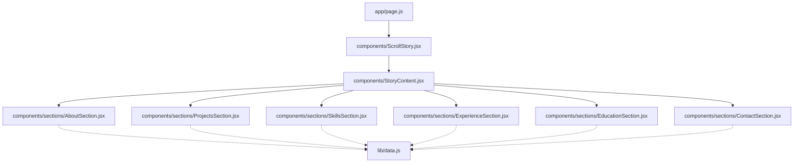
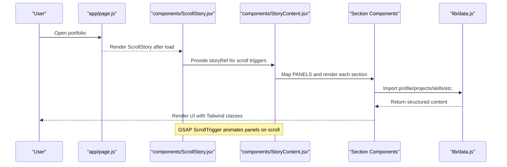
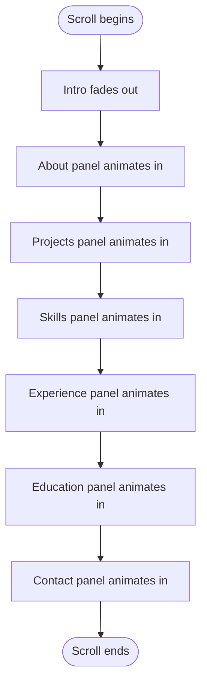
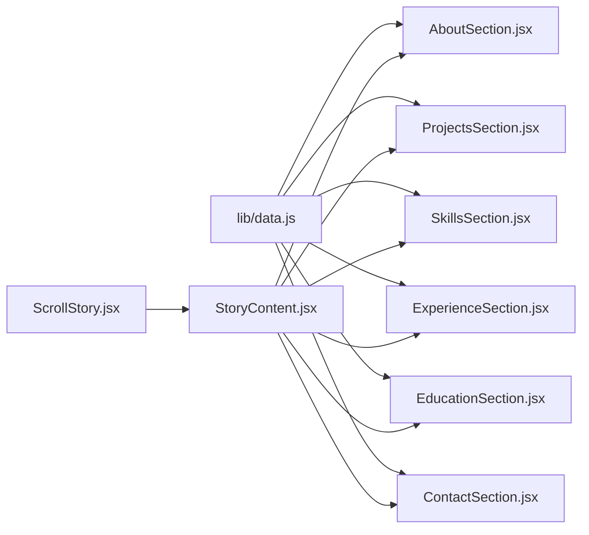

# Content Sections

<cite>
**Referenced Files in This Document**
- [data.js](file://lib/data.js)
- [AboutSection.jsx](file://components/sections/AboutSection.jsx)
- [ProjectsSection.jsx](file://components/sections/ProjectsSection.jsx)
- [SkillsSection.jsx](file://components/sections/SkillsSection.jsx)
- [ExperienceSection.jsx](file://components/sections/ExperienceSection.jsx)
- [EducationSection.jsx](file://components/sections/EducationSection.jsx)
- [ContactSection.jsx](file://components/sections/ContactSection.jsx)
- [StoryContent.jsx](file://components/StoryContent.jsx)
- [ScrollStory.jsx](file://components/ScrollStory.jsx)
- [page.js](file://app/page.js)
- [layout.js](file://app/layout.js)
</cite>

## Table of Contents
1. [Introduction](#introduction)
2. [Project Structure](#project-structure)
3. [Core Components](#core-components)
4. [Architecture Overview](#architecture-overview)
5. [Detailed Component Analysis](#detailed-component-analysis)
6. [Dependency Analysis](#dependency-analysis)
7. [Performance Considerations](#performance-considerations)
8. [Troubleshooting Guide](#troubleshooting-guide)
9. [Conclusion](#conclusion)
10. [Appendices](#appendices)

## Introduction
This document explains how the portfolio’s content sections are structured, styled, and bound to a centralized data layer. It covers each section component (About, Projects, Skills, Experience, Education, Contact), their layout approach, data binding patterns, styling strategies, and customization options. It also details the centralized data model in lib/data.js that manages profile information, education history, work experience, project details, skills categorization, and contact information, with examples for adding new content and extending the model.

## Project Structure
The portfolio is a Next.js application using client components for interactive panels. The main page renders a loading screen and then a scroll-driven story that overlays content panels on top of a 3D workspace. Each content panel is a dedicated React component under components/sections and consumes data from lib/data.js.

**Diagram sources**
- [page.js:1-60](file://app/page.js#L1-L60)
- [ScrollStory.jsx:1-70](file://components/ScrollStory.jsx#L1-L70)
- [StoryContent.jsx:1-91](file://components/StoryContent.jsx#L1-L91)
- [AboutSection.jsx:1-30](file://components/sections/AboutSection.jsx#L1-L30)
- [ProjectsSection.jsx:1-43](file://components/sections/ProjectsSection.jsx#L1-L43)
- [SkillsSection.jsx:1-42](file://components/sections/SkillsSection.jsx#L1-L42)
- [ExperienceSection.jsx:1-36](file://components/sections/ExperienceSection.jsx#L1-L36)
- [EducationSection.jsx:1-42](file://components/sections/EducationSection.jsx#L1-L42)
- [ContactSection.jsx:1-60](file://components/sections/ContactSection.jsx#L1-L60)
- [data.js:1-181](file://lib/data.js#L1-L181)

**Section sources**
- [page.js:1-60](file://app/page.js#L1-L60)
- [ScrollStory.jsx:1-70](file://components/ScrollStory.jsx#L1-L70)
- [StoryContent.jsx:1-91](file://components/StoryContent.jsx#L1-L91)

## Core Components
- AboutSection: Displays personal introduction text and role labels sourced from profile.
- ProjectsSection: Renders a grid of project cards linking to dynamic pages by project id.
- SkillsSection: Shows technical skills with color-coded indicators and soft skills tags.
- ExperienceSection: Presents work experience as a timeline with highlights.
- EducationSection: Lists education entries with optional level and focus areas.
- ContactSection: Provides contact actions (email, LinkedIn, GitHub, résumé).

All sections import data from lib/data.js and render via Tailwind CSS classes.

**Section sources**
- [AboutSection.jsx:1-30](file://components/sections/AboutSection.jsx#L1-L30)
- [ProjectsSection.jsx:1-43](file://components/sections/ProjectsSection.jsx#L1-L43)
- [SkillsSection.jsx:1-42](file://components/sections/SkillsSection.jsx#L1-L42)
- [ExperienceSection.jsx:1-36](file://components/sections/ExperienceSection.jsx#L1-L36)
- [EducationSection.jsx:1-42](file://components/sections/EducationSection.jsx#L1-L42)
- [ContactSection.jsx:1-60](file://components/sections/ContactSection.jsx#L1-L60)
- [data.js:1-181](file://lib/data.js#L1-L181)

## Architecture Overview
The application uses a layered architecture:
- Data Layer: lib/data.js exports profile, education, experience, projects, and skills.
- Presentation Layer: Section components consume this data and render UI.
- Orchestration Layer: StoryContent orchestrates panel rendering and GSAP ScrollTrigger animations; ScrollStory composes the intro, content overlay, and 3D workspace.

**Diagram sources**
- [page.js:1-60](file://app/page.js#L1-L60)
- [ScrollStory.jsx:1-70](file://components/ScrollStory.jsx#L1-L70)
- [StoryContent.jsx:1-91](file://components/StoryContent.jsx#L1-L91)
- [data.js:1-181](file://lib/data.js#L1-L181)

## Detailed Component Analysis

### AboutSection
- Layout: Uses a panel wrapper with label, title, body text, role tags, and a quote area.
- Data Binding: Reads profile.about and profile.labels from lib/data.js.
- Styling: Tailwind utility classes define typography, spacing, and tag styling.
- Customization: Update profile.about or profile.labels in lib/data.js to change content. Add new fields to profile and reference them in JSX if needed.

**Section sources**
- [AboutSection.jsx:1-30](file://components/sections/AboutSection.jsx#L1-L30)
- [data.js:1-15](file://lib/data.js#L1-L15)

### ProjectsSection
- Layout: Grid of project cards with icon, title, subtitle, stack, and link.
- Data Binding: Iterates projects array from lib/data.js; links to /project/[slug] using project.id.
- Styling: Tailwind classes for card layout, hover effects, and typography.
- Customization: Add new projects to lib/data.js with required fields (id, title, subtitle, stack, description, features, link). Ensure unique ids for routing.

**Section sources**
- [ProjectsSection.jsx:1-43](file://components/sections/ProjectsSection.jsx#L1-L43)
- [data.js:91-137](file://lib/data.js#L91-L137)

### SkillsSection
- Layout: Technical skills displayed as colored dots with names; soft skills shown as tags.
- Data Binding: Reads skills.technical (array of objects with name and color) and skills.soft (array of strings).
- Styling: Inline CSS variables set bloom colors per skill; Tailwind classes style tags and containers.
- Customization: Add new technical skills with a hex color; add soft skills to the array. Optionally extend skills object with new categories and render them in the component.

**Section sources**
- [SkillsSection.jsx:1-42](file://components/sections/SkillsSection.jsx#L1-L42)
- [data.js:139-180](file://lib/data.js#L139-L180)

### ExperienceSection
- Layout: Timeline-style cards with numbered badges, role, company, period, location, and highlights list.
- Data Binding: Maps experience array from lib/data.js; displays first three highlights per entry.
- Styling: Tailwind classes for timeline structure and typography.
- Customization: Add new experience entries with id, role, company, period, location, and highlights. Adjust slice(0,3) if you want more highlights visible.

**Section sources**
- [ExperienceSection.jsx:1-36](file://components/sections/ExperienceSection.jsx#L1-L36)
- [data.js:44-89](file://lib/data.js#L44-L89)

### EducationSection
- Layout: Cards with badge, degree, institution, period/location, optional level, and optional focus tags.
- Data Binding: Reads education array from lib/data.js; conditionally renders level and focus fields.
- Styling: Tailwind classes for card layout and tag styling.
- Customization: Add new education entries with id, degree, institution, period, location; optionally include level and focus arrays.

**Section sources**
- [EducationSection.jsx:1-42](file://components/sections/EducationSection.jsx#L1-L42)
- [data.js:17-42](file://lib/data.js#L17-L42)

### ContactSection
- Layout: Title, message, action buttons (email, LinkedIn, GitHub, résumé), and closing quote.
- Data Binding: Uses profile.email, profile.linkedin, profile.github for links.
- Styling: Tailwind classes for button groups and typography.
- Customization: Update profile contact fields in lib/data.js; add new buttons by referencing additional profile properties.

**Section sources**
- [ContactSection.jsx:1-60](file://components/sections/ContactSection.jsx#L1-L60)
- [data.js:1-15](file://lib/data.js#L1-L15)

### StoryContent and ScrollStory Orchestration
- StoryContent defines PANELS mapping each section to its animation start/end points and renders them within a container. GSAP ScrollTrigger drives fade-in/out and vertical transitions based on scroll position.
- ScrollStory composes the intro header, StoryContent overlay, and ThreeWorkspace background, providing a unified scroll context.

**Diagram sources**
- [StoryContent.jsx:17-24](file://components/StoryContent.jsx#L17-L24)
- [StoryContent.jsx:30-75](file://components/StoryContent.jsx#L30-L75)
- [ScrollStory.jsx:17-34](file://components/ScrollStory.jsx#L17-L34)

**Section sources**
- [StoryContent.jsx:1-91](file://components/StoryContent.jsx#L1-L91)
- [ScrollStory.jsx:1-70](file://components/ScrollStory.jsx#L1-L70)

## Dependency Analysis
- Data dependency: All section components depend exclusively on lib/data.js for content.
- UI orchestration: StoryContent depends on GSAP and ScrollTrigger to animate panels; ScrollStory provides the scroll context and integrates 3D background.
- Routing: ProjectsSection links to app/project/[slug] using project.id.

**Diagram sources**
- [data.js:1-181](file://lib/data.js#L1-L181)
- [StoryContent.jsx:1-91](file://components/StoryContent.jsx#L1-L91)
- [ScrollStory.jsx:1-70](file://components/ScrollStory.jsx#L1-L70)

**Section sources**
- [data.js:1-181](file://lib/data.js#L1-L181)
- [StoryContent.jsx:1-91](file://components/StoryContent.jsx#L1-L91)
- [ScrollStory.jsx:1-70](file://components/ScrollStory.jsx#L1-L70)

## Performance Considerations
- Client-side rendering: All sections use "use client", enabling interactivity but requiring hydration. Keep data small and avoid heavy computations in render paths.
- Animation performance: GSAP ScrollTrigger animations are scoped to the story container; ensure minimal DOM reflows by keeping panel structures stable.
- Image/media assets: If adding images or 3D models, lazy-load or optimize assets to reduce initial bundle size.
- Routing: Dynamic routes for projects should be pre-rendered or generated efficiently to avoid runtime overhead.

[No sources needed since this section provides general guidance]

## Troubleshooting Guide
- Missing data fields: If a section expects a field not present in lib/data.js, it may render undefined values. Validate data shapes before updating.
- Duplicate project ids: ProjectsSection uses project.id for routing; duplicates will cause navigation conflicts. Ensure unique ids.
- Animation glitches: If panels do not animate, verify that StoryContent receives a valid storyRef and that GSAP plugins are registered.
- Link targets: ContactSection relies on profile.contact fields; ensure they are non-empty to avoid broken links.

**Section sources**
- [ProjectsSection.jsx:18-38](file://components/sections/ProjectsSection.jsx#L18-L38)
- [ContactSection.jsx:19-52](file://components/sections/ContactSection.jsx#L19-L52)
- [StoryContent.jsx:30-75](file://components/StoryContent.jsx#L30-L75)

## Conclusion
The portfolio’s content sections are cleanly separated into focused components that bind to a single source of truth in lib/data.js. This design simplifies updates and extensions: modify data to change content, adjust styles via Tailwind classes, and extend functionality by adding new fields and corresponding UI logic. The orchestration layer ensures smooth, scroll-driven interactions while keeping presentation and data concerns decoupled.

[No sources needed since this section summarizes without analyzing specific files]

## Appendices

### Centralized Data Model Reference
- Profile: name, tagline, labels, email, phone, whatsapp, linkedin, github, location, dateOfBirth, nationality, about.
- Education: array of objects with id, degree, institution, period, location, optional level and focus.
- Experience: array of objects with id, role, company, period, location, highlights.
- Projects: array of objects with id, title, subtitle, stack, description, features, link.
- Skills: object with technical (array of {name, color}), soft (array of strings), tools (array of strings).

**Section sources**
- [data.js:1-181](file://lib/data.js#L1-L181)

### Examples: Adding New Content

- Add a new project
  - Update lib/data.js by appending an object to projects with required fields (id, title, subtitle, stack, description, features, link).
  - Ensure id is unique to support routing to /project/[slug].
  - ProjectsSection will automatically render the new card.

  **Section sources**
  - [data.js:91-137](file://lib/data.js#L91-L137)
  - [ProjectsSection.jsx:17-38](file://components/sections/ProjectsSection.jsx#L17-L38)

- Modify existing section content
  - Edit the relevant export in lib/data.js (e.g., profile.about, experience[], education[]).
  - No changes to components are required unless you introduce new fields.

  **Section sources**
  - [data.js:1-181](file://lib/data.js#L1-L181)

- Extend the data model to support additional portfolio elements
  - Example: Add a “Certifications” section
    - Define a certifications array in lib/data.js with fields like id, title, issuer, date, and optional link.
    - Create a new CertificationsSection component that maps over certifications and renders cards.
    - Register the new component in StoryContent’s PANELS array with appropriate start/end percentages for animation.
    - Style using Tailwind classes consistent with other panels.

  **Section sources**
  - [data.js:1-181](file://lib/data.js#L1-L181)
  - [StoryContent.jsx:17-24](file://components/StoryContent.jsx#L17-L24)

### Styling Approach
- All sections use Tailwind CSS utility classes for layout, typography, and visual effects.
- Some components use inline CSS variables (e.g., --bloom-color) to dynamically style elements based on data.
- To customize appearance, modify class names or add new utilities in your global stylesheet referenced by layout.js.

**Section sources**
- [SkillsSection.jsx:16-26](file://components/sections/SkillsSection.jsx#L16-L26)
- [layout.js:1-55](file://app/layout.js#L1-L55)