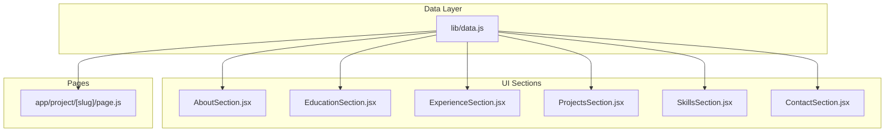
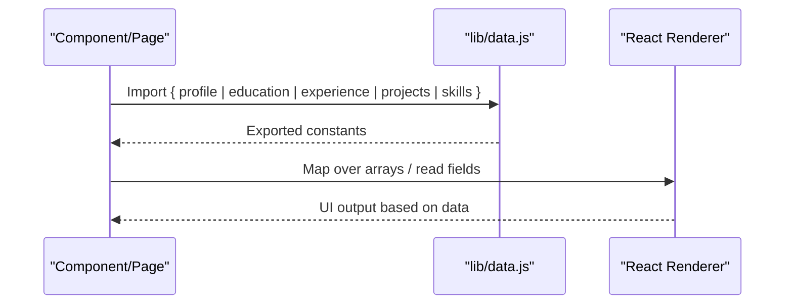
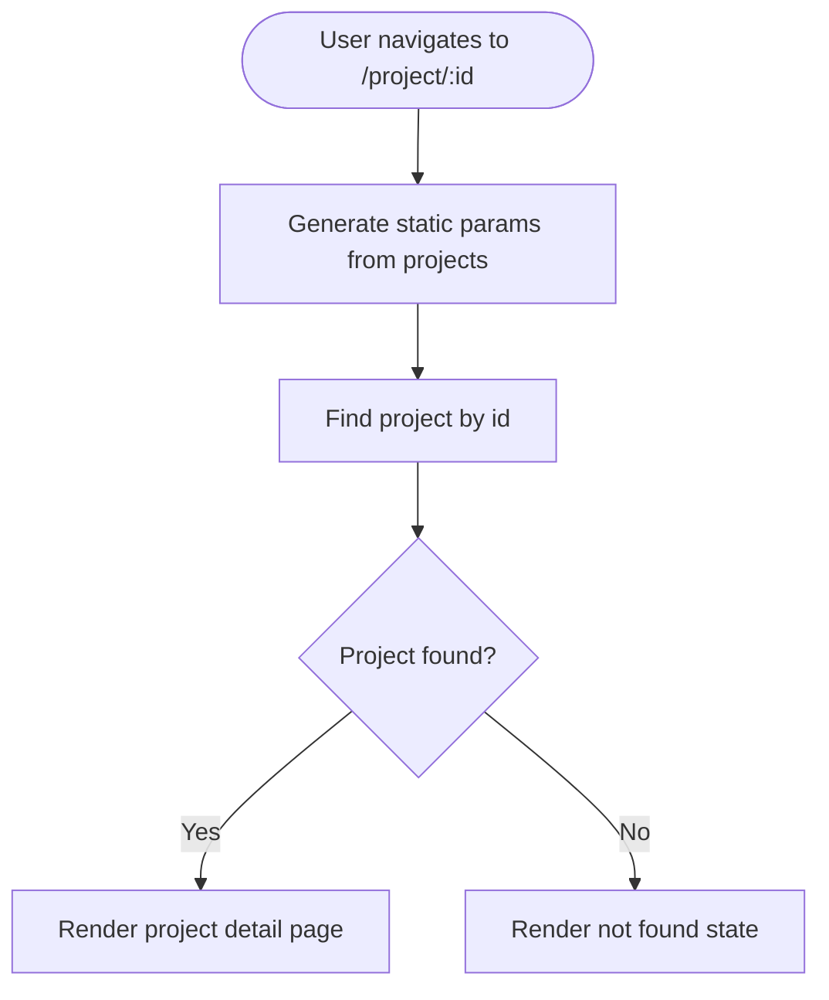
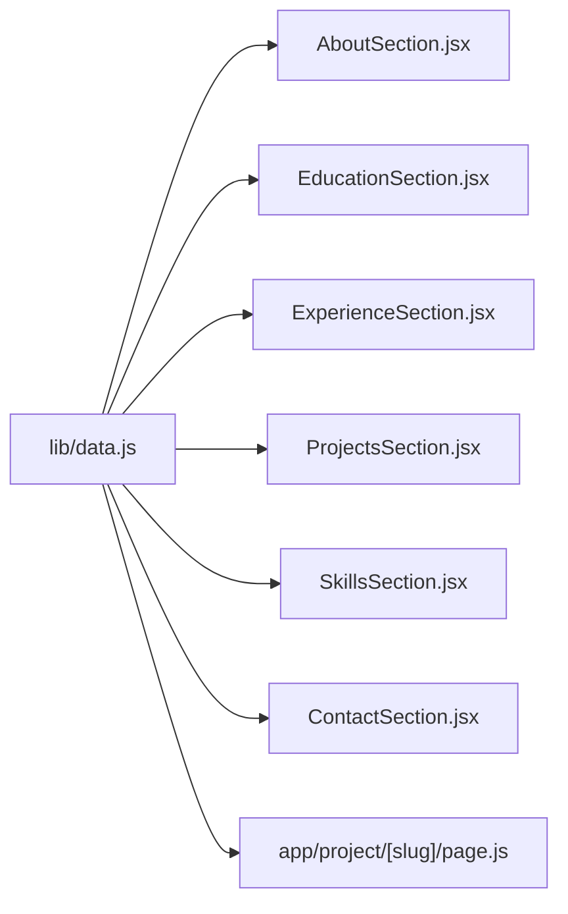

# Data Layer Architecture

<cite>
**Referenced Files in This Document**
- [lib/data.js](file://lib/data.js)
- [AboutSection.jsx](file://components/sections/AboutSection.jsx)
- [EducationSection.jsx](file://components/sections/EducationSection.jsx)
- [ExperienceSection.jsx](file://components/sections/ExperienceSection.jsx)
- [ProjectsSection.jsx](file://components/sections/ProjectsSection.jsx)
- [ContactSection.jsx](file://components/sections/ContactSection.jsx)
- [Project Detail Page](file://app/project/[slug]/page.js)
</cite>

## Table of Contents
1. [Introduction](#introduction)
2. [Project Structure](#project-structure)
3. [Core Components](#core-components)
4. [Architecture Overview](#architecture-overview)
5. [Detailed Component Analysis](#detailed-component-analysis)
6. [Dependency Analysis](#dependency-analysis)
7. [Performance Considerations](#performance-considerations)
8. [Troubleshooting Guide](#troubleshooting-guide)
9. [Conclusion](#conclusion)
10. [Appendices](#appendices)

## Introduction
This document explains the centralized data layer architecture implemented in lib/data.js and how it powers the portfolio application. It covers the complete data model for profile information, education history, work experience, project details, skills categorization, and contact information. You will find TypeScript-like interface definitions, field descriptions, validation rules, examples for extending the data model, and guidance on export patterns and component consumption.

## Project Structure
The data layer is a single module that exports named constants consumed by UI components and pages. The structure is intentionally simple:
- A central data file defines all content as plain JavaScript objects and arrays.
- UI components import these exports to render sections like About, Education, Experience, Projects, Skills, and Contact.
- A dynamic project detail page uses the same data source to generate routes and display project details.

**Diagram sources**
- [lib/data.js:1-181](file://lib/data.js#L1-L181)
- [AboutSection.jsx:1-30](file://components/sections/AboutSection.jsx#L1-L30)
- [EducationSection.jsx:1-42](file://components/sections/EducationSection.jsx#L1-L42)
- [ExperienceSection.jsx:1-36](file://components/sections/ExperienceSection.jsx#L1-L36)
- [ProjectsSection.jsx:1-43](file://components/sections/ProjectsSection.jsx#L1-L43)
- [ContactSection.jsx:1-60](file://components/sections/ContactSection.jsx#L1-L60)
- [Project Detail Page:1-49](file://app/project/[slug]/page.js#L1-L49)

**Section sources**
- [lib/data.js:1-181](file://lib/data.js#L1-L181)
- [AboutSection.jsx:1-30](file://components/sections/AboutSection.jsx#L1-L30)
- [EducationSection.jsx:1-42](file://components/sections/EducationSection.jsx#L1-L42)
- [ExperienceSection.jsx:1-36](file://components/sections/ExperienceSection.jsx#L1-L36)
- [ProjectsSection.jsx:1-43](file://components/sections/ProjectsSection.jsx#L1-L43)
- [ContactSection.jsx:1-60](file://components/sections/ContactSection.jsx#L1-L60)
- [Project Detail Page:1-49](file://app/project/[slug]/page.js#L1-L49)

## Core Components
The data layer exposes five top-level exports:
- profile: Personal and contact information
- education: Array of educational entries
- experience: Array of work experiences
- projects: Array of project entries
- skills: Object with categorized skill lists

Each export is a stable contract used across multiple components. Below are TypeScript-like interfaces describing the shape and constraints of each model.

### Profile Model
- Purpose: Centralized personal and contact information rendered in About and Contact sections.
- Fields:
  - name: string (required)
  - tagline: string (optional)
  - labels: string[] (array of role or identity tags)
  - email: string (required; validated as an email format)
  - phone: string (optional; international format recommended)
  - whatsapp: string (optional; international format recommended)
  - linkedin: string (required if present; must be a valid URL)
  - github: string (required if present; must be a valid URL)
  - location: string (optional)
  - dateOfBirth: string (optional; human-readable date)
  - nationality: string (optional)
  - about: string (required; short biography)
- Validation Rules:
  - email must match a standard email pattern
  - linkedin and github, when provided, must be absolute URLs
  - labels should be non-empty strings
  - about should be a concise paragraph suitable for display

**Section sources**
- [lib/data.js:1-15](file://lib/data.js#L1-L15)
- [AboutSection.jsx:1-30](file://components/sections/AboutSection.jsx#L1-L30)
- [ContactSection.jsx:1-60](file://components/sections/ContactSection.jsx#L1-L60)

### Education Model
- Purpose: Represents formal education and certifications.
- Fields:
  - id: string (unique identifier; used as key and for conditional rendering)
  - degree: string (required)
  - institution: string (required)
  - period: string (required; e.g., “Sep 2023 – Current”)
  - location: string (optional)
  - level: string (optional; e.g., EQF level)
  - focus: string[] (optional; array of focus areas for certifications)
- Validation Rules:
  - id must be unique across the array
  - degree and institution are required
  - period should follow a consistent date range format
  - focus is optional but should contain meaningful keywords

**Section sources**
- [lib/data.js:17-42](file://lib/data.js#L17-L42)
- [EducationSection.jsx:1-42](file://components/sections/EducationSection.jsx#L1-L42)

### Experience Model
- Purpose: Captures professional roles and achievements.
- Fields:
  - id: string (unique identifier)
  - role: string (required)
  - company: string (required)
  - period: string (required; date range)
  - location: string (optional)
  - highlights: string[] (required; bullet points of responsibilities/achievements)
- Validation Rules:
  - id must be unique
  - role and company are required
  - period should use a consistent date range format
  - highlights should be concise and action-oriented

**Section sources**
- [lib/data.js:44-89](file://lib/data.js#L44-L89)
- [ExperienceSection.jsx:1-36](file://components/sections/ExperienceSection.jsx#L1-L36)

### Projects Model
- Purpose: Showcases portfolio projects with metadata and links.
- Fields:
  - id: string (unique identifier; used for routing)
  - title: string (required)
  - subtitle: string (required; short descriptor)
  - stack: string (required; technologies used)
  - description: string (required; project overview)
  - features: string[] (optional; key capabilities)
  - link: string | null (optional; external URL or null)
- Validation Rules:
  - id must be unique and URL-safe (used in route generation)
  - title, subtitle, stack, and description are required
  - features should be a list of concise capability statements
  - link, if present, must be a valid URL

**Section sources**
- [lib/data.js:91-137](file://lib/data.js#L91-L137)
- [ProjectsSection.jsx:1-43](file://components/sections/ProjectsSection.jsx#L1-L43)
- [Project Detail Page:1-49](file://app/project/[slug]/page.js#L1-L49)

### Skills Model
- Purpose: Categorizes technical, soft, and tool skills.
- Structure:
  - technical: object[] where each item has:
    - name: string (required)
    - color: string (required; hex color for visualization)
  - soft: string[] (soft skills listed as names)
  - tools: string[] (tools and platforms)
- Validation Rules:
  - technical items must have both name and color
  - soft and tools arrays can be empty but should remain relevant
  - colors should be valid hex codes for consistent styling

**Section sources**
- [lib/data.js:139-180](file://lib/data.js#L139-L180)
- [SkillsSection.jsx:1-42](file://components/sections/SkillsSection.jsx#L1-L42)

## Architecture Overview
The data layer follows a unidirectional flow: data is defined centrally and imported by UI components and pages. There is no runtime mutation; updates are made by editing the data file.

**Diagram sources**
- [lib/data.js:1-181](file://lib/data.js#L1-L181)
- [AboutSection.jsx:1-30](file://components/sections/AboutSection.jsx#L1-L30)
- [EducationSection.jsx:1-42](file://components/sections/EducationSection.jsx#L1-L42)
- [ExperienceSection.jsx:1-36](file://components/sections/ExperienceSection.jsx#L1-L36)
- [ProjectsSection.jsx:1-43](file://components/sections/ProjectsSection.jsx#L1-L43)
- [SkillsSection.jsx:1-42](file://components/sections/SkillsSection.jsx#L1-L42)
- [ContactSection.jsx:1-60](file://components/sections/ContactSection.jsx#L1-L60)
- [Project Detail Page:1-49](file://app/project/[slug]/page.js#L1-L49)

## Detailed Component Analysis

### Profile Consumption
- About section displays biography text and role labels from profile.
- Contact section renders email, LinkedIn, and GitHub links using profile fields.
- Validation expectations:
  - Ensure email is correct for mailto links
  - Validate external URLs for security and correctness

**Section sources**
- [lib/data.js:1-15](file://lib/data.js#L1-L15)
- [AboutSection.jsx:1-30](file://components/sections/AboutSection.jsx#L1-L30)
- [ContactSection.jsx:1-60](file://components/sections/ContactSection.jsx#L1-L60)

### Education Rendering
- Each education entry is mapped into cards showing degree, institution, period, location, optional level, and optional focus areas.
- Conditional rendering supports different badges and extra fields depending on the entry’s id or presence of optional fields.

**Section sources**
- [lib/data.js:17-42](file://lib/data.js#L17-L42)
- [EducationSection.jsx:1-42](file://components/sections/EducationSection.jsx#L1-L42)

### Experience Timeline
- Work experiences are displayed as a timeline with role, company, period, location, and up to three highlighted achievements per entry.
- Highlights are sliced to limit visible bullets while preserving full data integrity.

**Section sources**
- [lib/data.js:44-89](file://lib/data.js#L44-L89)
- [ExperienceSection.jsx:1-36](file://components/sections/ExperienceSection.jsx#L1-L36)

### Projects Grid and Detail Routing
- Projects are rendered as cards with title, subtitle, stack, and navigation to a dynamic route using project.id.
- The detail page generates static params from the projects array and finds the matching project by id.

**Diagram sources**
- [ProjectsSection.jsx:1-43](file://components/sections/ProjectsSection.jsx#L1-L43)
- [Project Detail Page:1-49](file://app/project/[slug]/page.js#L1-L49)

**Section sources**
- [lib/data.js:91-137](file://lib/data.js#L91-L137)
- [ProjectsSection.jsx:1-43](file://components/sections/ProjectsSection.jsx#L1-L43)
- [Project Detail Page:1-49](file://app/project/[slug]/page.js#L1-L49)

### Skills Garden
- Technical skills are visualized with colored dots derived from each skill’s color property.
- Soft skills and tools are shown as tag lists.

**Section sources**
- [lib/data.js:139-180](file://lib/data.js#L139-L180)
- [SkillsSection.jsx:1-42](file://components/sections/SkillsSection.jsx#L1-L42)

## Dependency Analysis
- All UI sections depend exclusively on lib/data.js for content.
- The project detail page depends on the projects array for route generation and lookup.
- No circular dependencies exist; data is immutable at runtime.

**Diagram sources**
- [lib/data.js:1-181](file://lib/data.js#L1-L181)
- [AboutSection.jsx:1-30](file://components/sections/AboutSection.jsx#L1-L30)
- [EducationSection.jsx:1-42](file://components/sections/EducationSection.jsx#L1-L42)
- [ExperienceSection.jsx:1-36](file://components/sections/ExperienceSection.jsx#L1-L36)
- [ProjectsSection.jsx:1-43](file://components/sections/ProjectsSection.jsx#L1-L43)
- [SkillsSection.jsx:1-42](file://components/sections/SkillsSection.jsx#L1-L42)
- [ContactSection.jsx:1-60](file://components/sections/ContactSection.jsx#L1-L60)
- [Project Detail Page:1-49](file://app/project/[slug]/page.js#L1-L49)

**Section sources**
- [lib/data.js:1-181](file://lib/data.js#L1-L181)
- [ProjectsSection.jsx:1-43](file://components/sections/ProjectsSection.jsx#L1-L43)
- [Project Detail Page:1-49](file://app/project/[slug]/page.js#L1-L49)

## Performance Considerations
- Static data: Since data is a constant module, there is minimal runtime overhead.
- Rendering efficiency:
  - Use stable keys (e.g., id for education/experience/projects) to optimize React reconciliation.
  - Slice large arrays (like highlights) to reduce DOM size where appropriate.
- Route generation:
  - Static params generation maps over projects once during build time, which is efficient for small-to-medium portfolios.
- Memory:
  - Avoid unnecessary recomputation; keep data structures flat and simple.

[No sources needed since this section provides general guidance]

## Troubleshooting Guide
Common issues and resolutions:
- Missing or invalid email:
  - Symptom: Broken mailto link or incorrect contact behavior.
  - Fix: Ensure profile.email is a valid email string.
- External links not opening:
  - Symptom: LinkedIn/GitHub links do not navigate.
  - Fix: Verify profile.linkedin and profile.github are absolute URLs.
- Duplicate IDs:
  - Symptom: React warnings or incorrect routing/detail resolution.
  - Fix: Ensure all ids in education, experience, and projects are unique.
- Missing required fields:
  - Symptom: UI renders undefined values or breaks layout.
  - Fix: Provide required fields per model (e.g., role/company/period for experience; title/subtitle/stack/description for projects).
- Color formatting errors:
  - Symptom: Incorrect skill dot colors.
  - Fix: Ensure technical skills’ color fields are valid hex codes.

**Section sources**
- [lib/data.js:1-181](file://lib/data.js#L1-L181)
- [ContactSection.jsx:1-60](file://components/sections/ContactSection.jsx#L1-L60)
- [ProjectsSection.jsx:1-43](file://components/sections/ProjectsSection.jsx#L1-L43)
- [Project Detail Page:1-49](file://app/project/[slug]/page.js#L1-L49)

## Conclusion
The centralized data layer in lib/data.js provides a clear, typed-like contract for all portfolio content. Its simplicity enables easy maintenance and straightforward extension. By following the documented models and validation rules, you can confidently add new entries, modify existing structures, and extend the data model to support additional portfolio elements without disrupting UI components.

[No sources needed since this section summarizes without analyzing specific files]

## Appendices

### How to Add New Content Entries
- Profile:
  - Update profile fields directly in the data module.
  - Ensure email and any external URLs are valid.
- Education:
  - Add a new object to the education array with required fields (id, degree, institution, period).
  - Optionally include location, level, and focus.
- Experience:
  - Add a new object to the experience array with required fields (id, role, company, period, highlights).
  - Keep highlights concise and action-oriented.
- Projects:
  - Add a new object to the projects array with required fields (id, title, subtitle, stack, description).
  - Optionally include features and link.
  - Ensure id is URL-safe because it is used in routing.
- Skills:
  - For technical skills, add an object with name and color.
  - For soft skills and tools, append strings to their respective arrays.

**Section sources**
- [lib/data.js:1-181](file://lib/data.js#L1-L181)

### How to Modify Existing Data Structures
- Field additions:
  - Introduce optional fields where appropriate (e.g., level in education, features in projects).
  - Update components to conditionally render new fields only when present.
- Field removals:
  - Remove usage in components before deleting from data to avoid undefined access.
- Validation:
  - Enforce required fields via component checks or linting rules.
  - Normalize formats (dates, URLs, colors) consistently.

**Section sources**
- [lib/data.js:1-181](file://lib/data.js#L1-L181)
- [EducationSection.jsx:1-42](file://components/sections/EducationSection.jsx#L1-L42)
- [ExperienceSection.jsx:1-36](file://components/sections/ExperienceSection.jsx#L1-L36)
- [ProjectsSection.jsx:1-43](file://components/sections/ProjectsSection.jsx#L1-L43)
- [SkillsSection.jsx:1-42](file://components/sections/SkillsSection.jsx#L1-L42)

### How to Extend the Data Model for Additional Portfolio Elements
- Example: Adding a Publications section
  - Define a publications array in lib/data.js with fields such as id, title, venue, year, and link.
  - Create a new component that imports and renders publications similarly to other sections.
  - If linking to detail pages, ensure ids are unique and URL-safe.
- Example: Adding Certifications
  - Extend the education model or create a separate certifications array with fields like id, name, issuer, date, and credentialId.
  - Update UI to render certification cards with optional verification links.

**Section sources**
- [lib/data.js:1-181](file://lib/data.js#L1-L181)
- [ProjectsSection.jsx:1-43](file://components/sections/ProjectsSection.jsx#L1-L43)
- [Project Detail Page:1-49](file://app/project/[slug]/page.js#L1-L49)

### Export Patterns and Component Consumption
- Exports:
  - Named exports for profile, education, experience, projects, and skills.
- Imports:
  - Components import only what they need from lib/data.js.
  - Pages import projects and profile for static param generation and detail rendering.
- Best practices:
  - Keep data immutable at runtime.
  - Use stable identifiers for keys and routing.
  - Maintain consistent field naming and types across the data module.

**Section sources**
- [lib/data.js:1-181](file://lib/data.js#L1-L181)
- [AboutSection.jsx:1-30](file://components/sections/AboutSection.jsx#L1-L30)
- [EducationSection.jsx:1-42](file://components/sections/EducationSection.jsx#L1-L42)
- [ExperienceSection.jsx:1-36](file://components/sections/ExperienceSection.jsx#L1-L36)
- [ProjectsSection.jsx:1-43](file://components/sections/ProjectsSection.jsx#L1-L43)
- [SkillsSection.jsx:1-42](file://components/sections/SkillsSection.jsx#L1-L42)
- [ContactSection.jsx:1-60](file://components/sections/ContactSection.jsx#L1-L60)
- [Project Detail Page:1-49](file://app/project/[slug]/page.js#L1-L49)