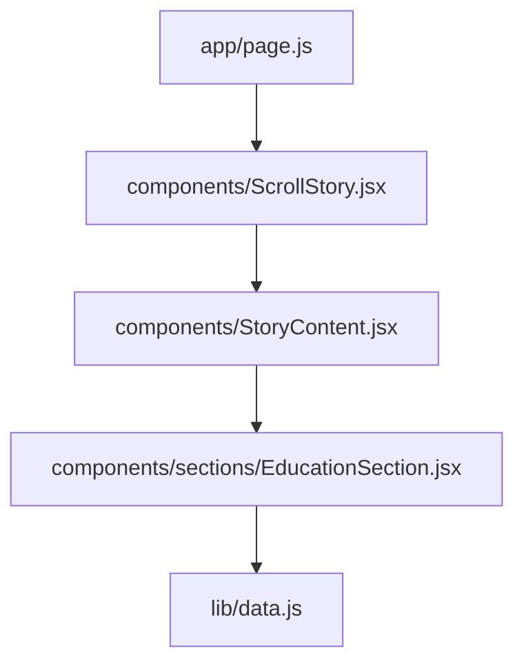
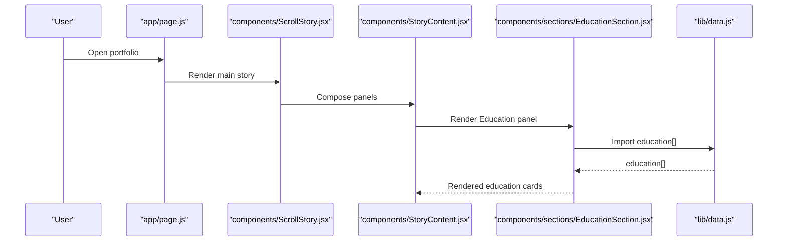
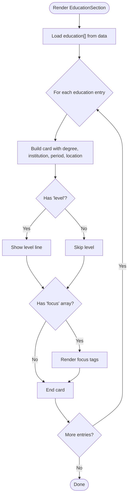
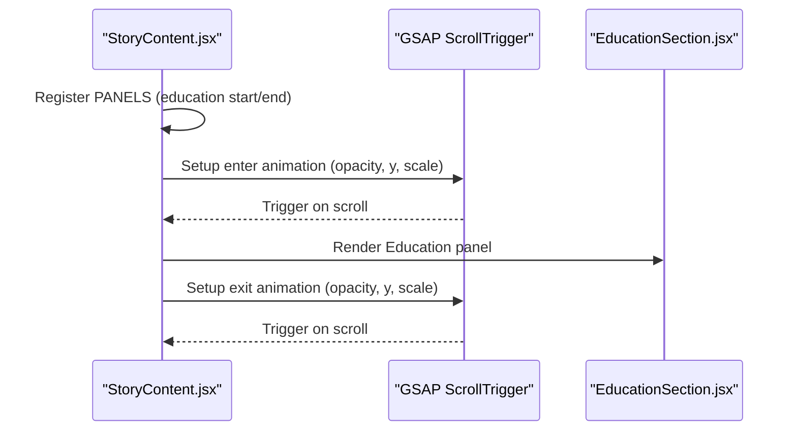
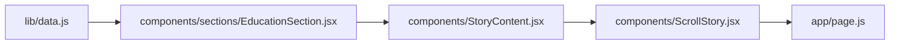

# Education Section Component

<cite>
**Referenced Files in This Document**
- [EducationSection.jsx](file://components/sections/EducationSection.jsx)
- [data.js](file://lib/data.js)
- [StoryContent.jsx](file://components/StoryContent.jsx)
- [ScrollStory.jsx](file://components/ScrollStory.jsx)
- [page.js](file://app/page.js)
</cite>

## Table of Contents
1. [Introduction](#introduction)
2. [Project Structure](#project-structure)
3. [Core Components](#core-components)
4. [Architecture Overview](#architecture-overview)
5. [Detailed Component Analysis](#detailed-component-analysis)
6. [Dependency Analysis](#dependency-analysis)
7. [Performance Considerations](#performance-considerations)
8. [Troubleshooting Guide](#troubleshooting-guide)
9. [Conclusion](#conclusion)
10. [Appendices](#appendices)

## Introduction
This document explains the Education section component that renders academic background and certifications. It covers how education entries are displayed, including degrees, institutions, periods, locations, optional level indicators, and focus areas. You will also find guidance on adding new qualifications, customizing layouts for different education types (degrees vs certifications), and extending the component to show additional academic details.

## Project Structure
The Education section is part of a scroll-driven story layout. The main page initializes the app, which then renders a ScrollStory container. StoryContent composes multiple panels, including the Education panel. The EducationSection component itself imports education data from a central data module and renders cards for each entry.

**Diagram sources**
- [page.js:17-58](file://app/page.js#L17-L58)
- [ScrollStory.jsx:36-66](file://components/ScrollStory.jsx#L36-L66)
- [StoryContent.jsx:17-24](file://components/StoryContent.jsx#L17-L24)
- [EducationSection.jsx:1-42](file://components/sections/EducationSection.jsx#L1-L42)
- [data.js:17-42](file://lib/data.js#L17-L42)

**Section sources**
- [page.js:17-58](file://app/page.js#L17-L58)
- [ScrollStory.jsx:36-66](file://components/ScrollStory.jsx#L36-L66)
- [StoryContent.jsx:17-24](file://components/StoryContent.jsx#L17-L24)
- [EducationSection.jsx:1-42](file://components/sections/EducationSection.jsx#L1-L42)
- [data.js:17-42](file://lib/data.js#L17-L42)

## Core Components
- EducationSection: Renders a list of education cards with degree, institution, period, location, optional level, and optional focus tags.
- Data module: Provides the education array used by the component.
- StoryContent: Registers the Education panel within the scroll story and controls its visibility via GSAP animations.
- ScrollStory and page: Provide the application shell and mounting point.

Key rendering behavior:
- Each education item is mapped into a card.
- A badge icon is chosen based on the id field to visually differentiate education types.
- Optional fields:
  - level: If present, displays an extra line indicating the level.
  - focus: If present, renders a set of tags summarizing focus areas.

**Section sources**
- [EducationSection.jsx:5-41](file://components/sections/EducationSection.jsx#L5-L41)
- [data.js:17-42](file://lib/data.js#L17-L42)
- [StoryContent.jsx:17-24](file://components/StoryContent.jsx#L17-L24)

## Architecture Overview
The Education section integrates into a scroll-based narrative. When the user scrolls to the education panel’s range, GSAP animates it into view and out of view. The component reads static data and renders UI accordingly.

**Diagram sources**
- [page.js:17-58](file://app/page.js#L17-L58)
- [ScrollStory.jsx:36-66](file://components/ScrollStory.jsx#L36-L66)
- [StoryContent.jsx:17-24](file://components/StoryContent.jsx#L17-L24)
- [EducationSection.jsx:1-42](file://components/sections/EducationSection.jsx#L1-L42)
- [data.js:17-42](file://lib/data.js#L17-L42)

## Detailed Component Analysis

### EducationSection Rendering Logic
- Entry mapping: Iterates over the education array and creates a card per entry.
- Badge selection: Uses the id field to choose a visual indicator for different education types.
- Fields rendered:
  - Degree: Displayed as the card title.
  - Institution: Displayed below the degree.
  - Period and Location: Combined into a metadata line.
  - Level: Conditionally shown when present.
  - Focus: Conditionally shown as tags when present.

**Diagram sources**
- [EducationSection.jsx:15-37](file://components/sections/EducationSection.jsx#L15-L37)

**Section sources**
- [EducationSection.jsx:15-37](file://components/sections/EducationSection.jsx#L15-L37)

### Data Model and Optional Fields
- Required fields used by the component:
  - id: Used to determine badge type.
  - degree: Card title.
  - institution: Subtitle.
  - period: Part of metadata.
  - location: Part of metadata.
- Optional fields:
  - level: Displays “Level: <value>” when provided.
  - focus: Array of strings; renders as tags when provided.

Example data structure references:
- Education entries with both level and focus arrays are included in the dataset.
- Entries without focus or level still render correctly due to conditional checks.

**Section sources**
- [data.js:17-42](file://lib/data.js#L17-L42)
- [EducationSection.jsx:26-35](file://components/sections/EducationSection.jsx#L26-L35)

### Integration and Animation
- Panel registration: The Education panel is registered in the PANELS array with start and end thresholds for scroll-triggered animations.
- Animations: GSAP fades the panel in and out as the user scrolls through the defined ranges.

**Diagram sources**
- [StoryContent.jsx:17-24](file://components/StoryContent.jsx#L17-L24)
- [StoryContent.jsx:30-70](file://components/StoryContent.jsx#L30-L70)

**Section sources**
- [StoryContent.jsx:17-24](file://components/StoryContent.jsx#L17-L24)
- [StoryContent.jsx:30-70](file://components/StoryContent.jsx#L30-L70)

### Customization Examples

- Adding a new educational qualification:
  - Add a new object to the education array with at least id, degree, institution, period, and location.
  - Optionally include level and/or focus to display additional details.

- Differentiating degrees vs certifications:
  - Use distinct ids to change the badge icon automatically.
  - Adjust styling via CSS classes already applied to the card elements.

- Extending to show additional academic details:
  - Add new fields to the data objects (e.g., gpa, honors, courses).
  - Update the component to conditionally render these fields when present.
  - Ensure keys remain stable for React lists.

[No sources needed since this subsection provides general customization guidance]

## Dependency Analysis
- EducationSection depends on:
  - lib/data.js for the education array.
  - CSS classes for layout and styling (not analyzed here).
- StoryContent depends on:
  - EducationSection as one of several panels.
  - GSAP ScrollTrigger for animations.
- ScrollStory and page provide the application shell and mounting points.

**Diagram sources**
- [data.js:17-42](file://lib/data.js#L17-L42)
- [EducationSection.jsx:1-42](file://components/sections/EducationSection.jsx#L1-L42)
- [StoryContent.jsx:17-24](file://components/StoryContent.jsx#L17-L24)
- [ScrollStory.jsx:36-66](file://components/ScrollStory.jsx#L36-L66)
- [page.js:17-58](file://app/page.js#L17-L58)

**Section sources**
- [data.js:17-42](file://lib/data.js#L17-L42)
- [EducationSection.jsx:1-42](file://components/sections/EducationSection.jsx#L1-L42)
- [StoryContent.jsx:17-24](file://components/StoryContent.jsx#L17-L24)
- [ScrollStory.jsx:36-66](file://components/ScrollStory.jsx#L36-L66)
- [page.js:17-58](file://app/page.js#L17-L58)

## Performance Considerations
- Static data: The education array is small and imported directly, resulting in minimal overhead.
- Conditional rendering: Optional fields are only rendered when present, avoiding unnecessary DOM nodes.
- Animations: GSAP ScrollTrigger handles reveal/hide efficiently; ensure not to add heavy computations inside the render loop.

[No sources needed since this section provides general guidance]

## Troubleshooting Guide
- Missing required fields:
  - If degree, institution, period, or location are missing, the card may render incomplete information. Ensure all required fields exist for each entry.
- Badge not changing:
  - The badge logic uses the id field. Verify that the id matches expected values to trigger the intended icon.
- Optional fields not showing:
  - level and focus are conditional. Confirm that these fields exist in the data object to see them rendered.
- Animation not triggering:
  - Ensure the Education panel is registered in the PANELS array with correct start/end values and that GSAP plugins are properly initialized.

**Section sources**
- [EducationSection.jsx:18-35](file://components/sections/EducationSection.jsx#L18-L35)
- [StoryContent.jsx:17-24](file://components/StoryContent.jsx#L17-L24)
- [StoryContent.jsx:30-70](file://components/StoryContent.jsx#L30-L70)

## Conclusion
The Education section component provides a clean, data-driven way to showcase academic background and certifications. It supports optional fields like level and focus, enabling flexible representation of both degrees and certifications. Integration with the scroll story ensures smooth presentation, while the simple data model makes it easy to extend with additional academic details.

[No sources needed since this section summarizes without analyzing specific files]

## Appendices

### Data Schema Reference
- id: string — Used to select badge type.
- degree: string — Card title.
- institution: string — Subtitle.
- period: string — Part of metadata line.
- location: string — Part of metadata line.
- level?: string — Optional; shows “Level: <value>”.
- focus?: string[] — Optional; renders as tags.

**Section sources**
- [data.js:17-42](file://lib/data.js#L17-L42)
- [EducationSection.jsx:21-35](file://components/sections/EducationSection.jsx#L21-L35)