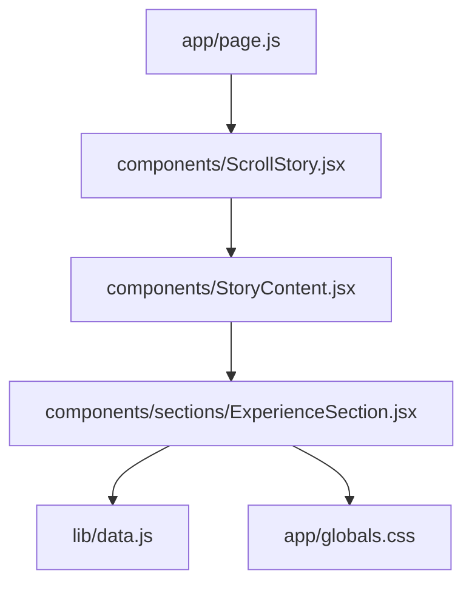
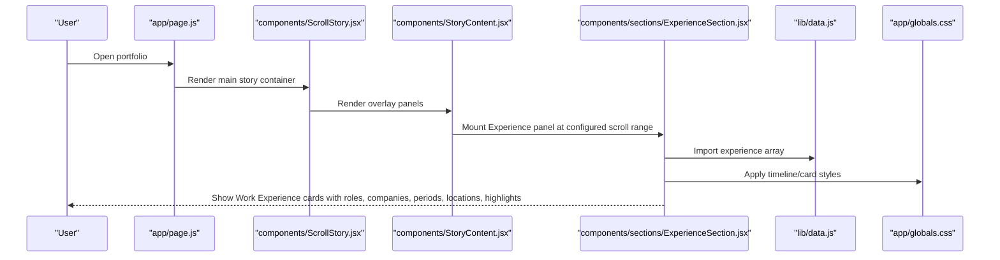
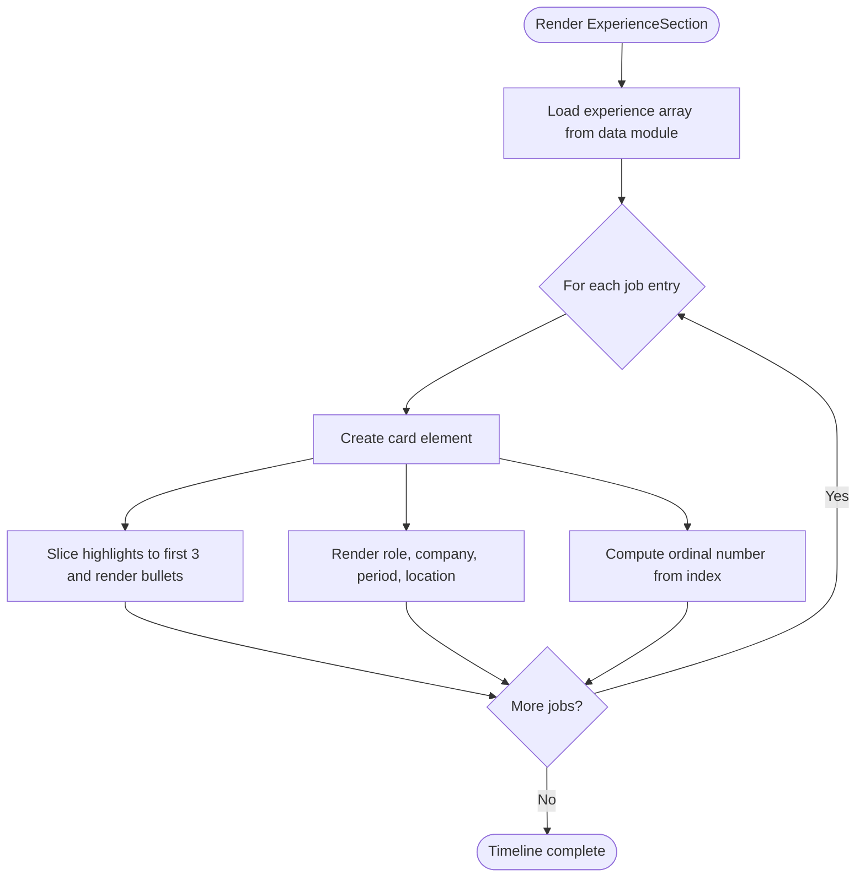
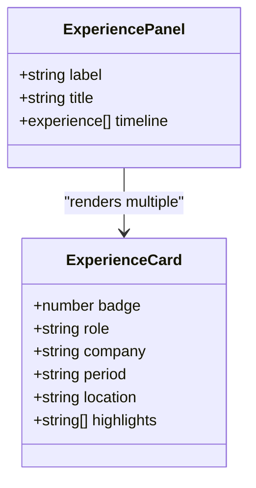
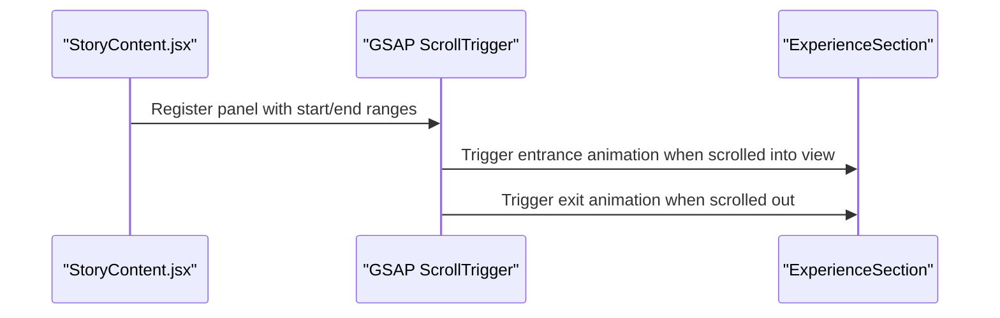
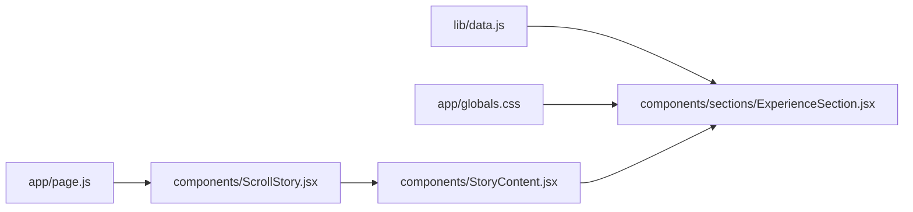

# Experience Section Component

<cite>
**Referenced Files in This Document**
- [ExperienceSection.jsx](file://components/sections/ExperienceSection.jsx)
- [data.js](file://lib/data.js)
- [StoryContent.jsx](file://components/StoryContent.jsx)
- [ScrollStory.jsx](file://components/ScrollStory.jsx)
- [page.js](file://app/page.js)
- [globals.css](file://app/globals.css)
</cite>

## Table of Contents
1. [Introduction](#introduction)
2. [Project Structure](#project-structure)
3. [Core Components](#core-components)
4. [Architecture Overview](#architecture-overview)
5. [Detailed Component Analysis](#detailed-component-analysis)
6. [Dependency Analysis](#dependency-analysis)
7. [Performance Considerations](#performance-considerations)
8. [Troubleshooting Guide](#troubleshooting-guide)
9. [Conclusion](#conclusion)
10. [Appendices](#appendices)

## Introduction
This document explains the Experience section component that displays work history and professional achievements. It covers how experience entries are rendered with roles, companies, periods, locations, and highlight bullet points; the timeline/card-based layout; styling approaches; and how it handles varying amounts of content per entry. It also includes examples for adding new experiences, customizing display format, and extending the component to show additional employment details.

## Project Structure
The Experience section is a client-side React component integrated into a scroll-driven story layout. The data for experience entries is centralized in a data module and consumed by the component. Styling is applied via CSS classes defined in the global stylesheet.

**Diagram sources**
- [page.js:1-60](file://app/page.js#L1-L60)
- [ScrollStory.jsx:1-70](file://components/ScrollStory.jsx#L1-L70)
- [StoryContent.jsx:1-91](file://components/StoryContent.jsx#L1-L91)
- [ExperienceSection.jsx:1-36](file://components/sections/ExperienceSection.jsx#L1-L36)
- [data.js:44-89](file://lib/data.js#L44-L89)
- [globals.css:2365-2432](file://app/globals.css#L2365-L2432)

**Section sources**
- [page.js:1-60](file://app/page.js#L1-L60)
- [ScrollStory.jsx:1-70](file://components/ScrollStory.jsx#L1-L70)
- [StoryContent.jsx:1-91](file://components/StoryContent.jsx#L1-L91)
- [ExperienceSection.jsx:1-36](file://components/sections/ExperienceSection.jsx#L1-L36)
- [data.js:44-89](file://lib/data.js#L44-L89)
- [globals.css:2365-2432](file://app/globals.css#L2365-L2432)

## Core Components
- ExperienceSection: Renders the Work Experience panel, mapping over experience entries to produce cards with role, company, period, location, and highlights.
- Data source: Centralized experience array containing structured objects for each job entry.
- Integration: StoryContent orchestrates panels (including Experience) within a scroll-triggered animation context.
- Styling: Global CSS defines card layout, typography, spacing, and responsive behavior.

Key responsibilities:
- Render a header and a vertical timeline of experience cards.
- Display up to three highlighted achievements per entry.
- Provide consistent visual structure across all entries.

**Section sources**
- [ExperienceSection.jsx:5-35](file://components/sections/ExperienceSection.jsx#L5-L35)
- [data.js:44-89](file://lib/data.js#L44-L89)
- [StoryContent.jsx:17-24](file://components/StoryContent.jsx#L17-L24)
- [globals.css:2365-2432](file://app/globals.css#L2365-L2432)

## Architecture Overview
The Experience section is part of a layered scroll story. Panels fade in and out as the user scrolls, driven by GSAP ScrollTrigger. The Experience panel appears between other sections and uses a card-based timeline layout.

**Diagram sources**
- [page.js:17-58](file://app/page.js#L17-L58)
- [ScrollStory.jsx:13-69](file://components/ScrollStory.jsx#L13-L69)
- [StoryContent.jsx:17-87](file://components/StoryContent.jsx#L17-L87)
- [ExperienceSection.jsx:5-35](file://components/sections/ExperienceSection.jsx#L5-L35)
- [data.js:44-89](file://lib/data.js#L44-L89)
- [globals.css:2365-2432](file://app/globals.css#L2365-L2432)

## Detailed Component Analysis

### Rendering Logic and Layout
- Timeline container: A vertical stack of cards with consistent spacing.
- Card structure: Each card contains:
  - An ordinal number badge derived from the item index.
  - Role displayed as a heading.
  - Company, period, and location shown together on one line.
  - A bulleted list of highlights, limited to the first three items.

**Diagram sources**
- [ExperienceSection.jsx:15-32](file://components/sections/ExperienceSection.jsx#L15-L32)
- [data.js:44-89](file://lib/data.js#L44-L89)

**Section sources**
- [ExperienceSection.jsx:15-32](file://components/sections/ExperienceSection.jsx#L15-L32)
- [data.js:44-89](file://lib/data.js#L44-L89)

### Data Model and Fields
Each experience entry includes:
- id: Unique identifier for the entry.
- role: Job title or position.
- company: Organization name.
- period: Employment timeframe string.
- location: City/country or remote indicator.
- highlights: Array of achievement or responsibility statements.

These fields map directly to the UI elements described above.

**Section sources**
- [data.js:44-89](file://lib/data.js#L44-L89)

### Styling and Responsive Behavior
- Cards use a semi-transparent background with subtle borders and rounded corners.
- Number badges are styled with a distinct color and monospace font.
- Typography hierarchy emphasizes role, then secondary metadata, then bullet points.
- On mobile, cards switch to a column layout to improve readability.

**Diagram sources**
- [ExperienceSection.jsx:5-35](file://components/sections/ExperienceSection.jsx#L5-L35)
- [globals.css:2365-2432](file://app/globals.css#L2365-L2432)

**Section sources**
- [globals.css:2365-2432](file://app/globals.css#L2365-L2432)

### Handling Varying Content Lengths
- Highlights are sliced to a maximum of three items per entry to maintain consistent card height and readability.
- If more highlights exist, they are not shown by default; this can be extended to support “Show more” functionality if desired.
- The layout gracefully adapts to longer role/company/period/location strings due to flexible sizing and wrapping.

**Section sources**
- [ExperienceSection.jsx:24-28](file://components/sections/ExperienceSection.jsx#L24-L28)
- [globals.css:2969-2972](file://app/globals.css#L2969-L2972)

### Integration and Animation
- The Experience panel is registered in a panels configuration with start/end percentages for scroll-triggered animations.
- GSAP ScrollTrigger fades the panel in and out during scrolling, providing a smooth narrative flow.

**Diagram sources**
- [StoryContent.jsx:17-24](file://components/StoryContent.jsx#L17-L24)
- [StoryContent.jsx:30-70](file://components/StoryContent.jsx#L30-L70)

**Section sources**
- [StoryContent.jsx:17-24](file://components/StoryContent.jsx#L17-L24)
- [StoryContent.jsx:30-70](file://components/StoryContent.jsx#L30-L70)

## Dependency Analysis
- ExperienceSection depends on:
  - Data module for experience entries.
  - Global CSS for layout and styling.
  - StoryContent for mounting and scroll-triggered animations.
- StoryContent depends on:
  - GSAP and ScrollTrigger for animations.
  - Other sections for the full story sequence.

**Diagram sources**
- [ExperienceSection.jsx:3-35](file://components/sections/ExperienceSection.jsx#L3-L35)
- [StoryContent.jsx:1-91](file://components/StoryContent.jsx#L1-L91)
- [ScrollStory.jsx:1-70](file://components/ScrollStory.jsx#L1-L70)
- [page.js:1-60](file://app/page.js#L1-L60)
- [data.js:44-89](file://lib/data.js#L44-L89)
- [globals.css:2365-2432](file://app/globals.css#L2365-L2432)

**Section sources**
- [ExperienceSection.jsx:3-35](file://components/sections/ExperienceSection.jsx#L3-L35)
- [StoryContent.jsx:1-91](file://components/StoryContent.jsx#L1-L91)
- [ScrollStory.jsx:1-70](file://components/ScrollStory.jsx#L1-L70)
- [page.js:1-60](file://app/page.js#L1-L60)
- [data.js:44-89](file://lib/data.js#L44-L89)
- [globals.css:2365-2432](file://app/globals.css#L2365-L2432)

## Performance Considerations
- Rendering efficiency: Mapping over a small array of experience entries is lightweight.
- Highlight limiting: Slicing highlights to three reduces DOM nodes and keeps cards compact.
- Animations: Scroll-triggered animations are scoped to panels and should remain performant; avoid excessive re-renders by keeping panel content static.
- Styling: Use of CSS variables and minimal layout shifts helps maintain smooth scrolling.

[No sources needed since this section provides general guidance]

## Troubleshooting Guide
- Missing or incorrect data fields: Ensure each experience object includes id, role, company, period, location, and highlights.
- Unexpected layout issues: Verify CSS classes are present and not overridden; check responsive breakpoints for mobile stacking behavior.
- Animation not triggering: Confirm StoryContent registration ranges and that GSAP ScrollTrigger is initialized.
- Too many highlights: Adjust the slice limit if you want more or fewer highlights visible per card.

**Section sources**
- [data.js:44-89](file://lib/data.js#L44-L89)
- [ExperienceSection.jsx:15-32](file://components/sections/ExperienceSection.jsx#L15-L32)
- [StoryContent.jsx:17-24](file://components/StoryContent.jsx#L17-L24)
- [globals.css:2969-2972](file://app/globals.css#L2969-L2972)

## Conclusion
The Experience section provides a clean, card-based timeline that showcases professional roles, organizations, timeframes, locations, and key achievements. Its design balances information density with readability, using a fixed number of highlights per entry and responsive styling. Extending the component is straightforward through the centralized data model and modular styling.

[No sources needed since this section summarizes without analyzing specific files]

## Appendices

### How to Add a New Work Experience
- Update the experience array in the data module with a new object including id, role, company, period, location, and highlights.
- The component will automatically render the new entry in the timeline.

**Section sources**
- [data.js:44-89](file://lib/data.js#L44-L89)
- [ExperienceSection.jsx:15-32](file://components/sections/ExperienceSection.jsx#L15-L32)

### Customizing Display Format
- Change the number of visible highlights by adjusting the slice limit in the component’s rendering logic.
- Modify text formatting or separators (e.g., company · period · location) in the component’s JSX.
- Adjust card appearance, colors, spacing, and typography via the global CSS classes for the experience panel and cards.

**Section sources**
- [ExperienceSection.jsx:24-28](file://components/sections/ExperienceSection.jsx#L24-L28)
- [globals.css:2365-2432](file://app/globals.css#L2365-L2432)

### Extending to Show Additional Employment Details
- Add new fields to the experience data objects (for example, type of employment, technologies used, or achievements).
- Extend the card rendering to include these fields alongside existing metadata.
- Optionally add interactive features such as expandable highlights or links to projects associated with the role.

**Section sources**
- [data.js:44-89](file://lib/data.js#L44-L89)
- [ExperienceSection.jsx:15-32](file://components/sections/ExperienceSection.jsx#L15-L32)