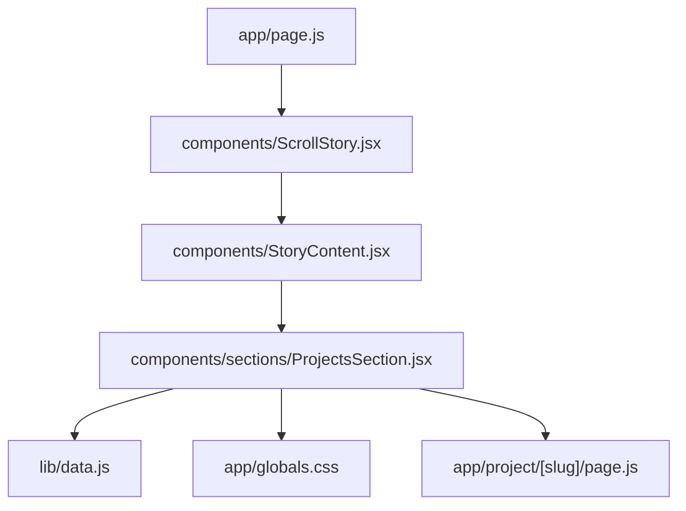
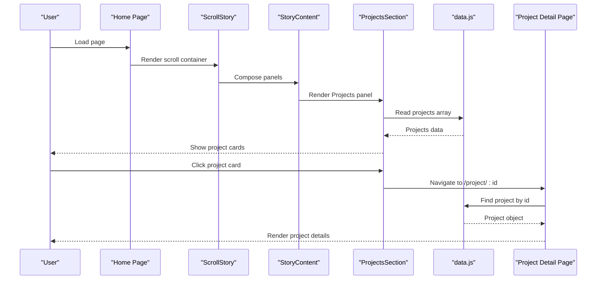
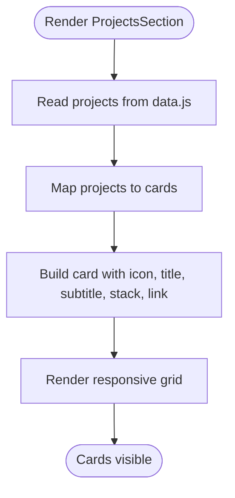
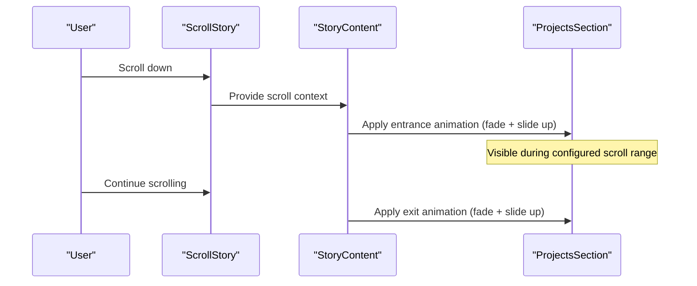
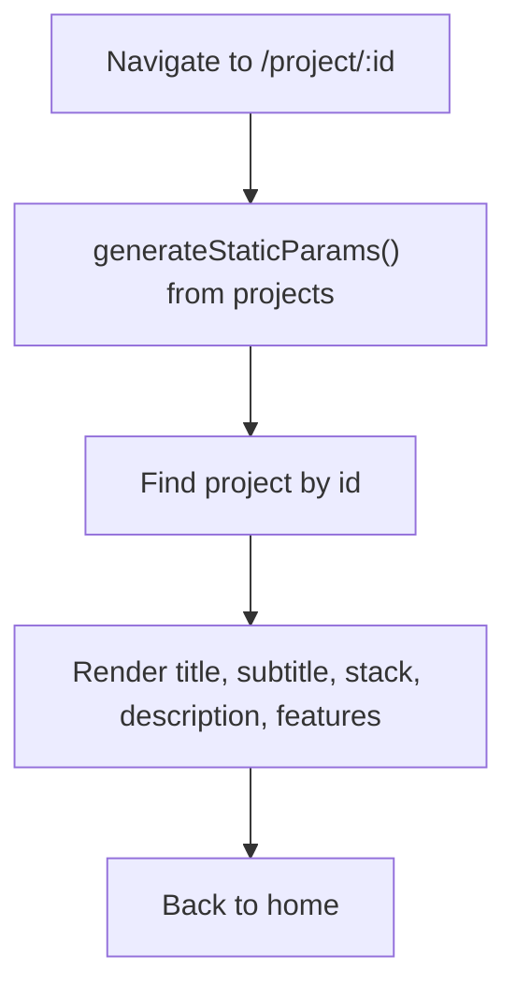
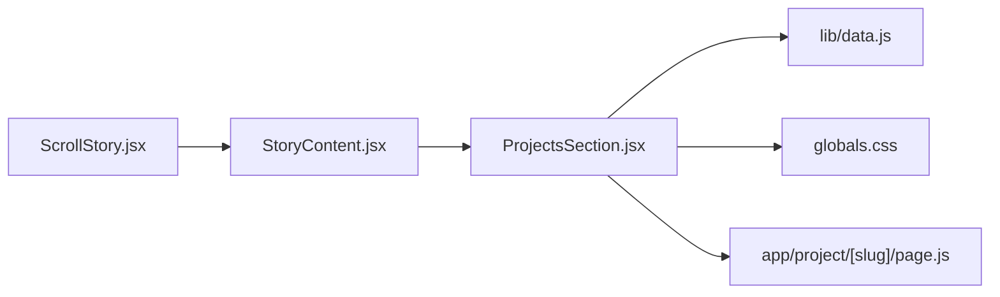

# Projects Section Component

<cite>
**Referenced Files in This Document**
- [ProjectsSection.jsx](file://components/sections/ProjectsSection.jsx)
- [data.js](file://lib/data.js)
- [StoryContent.jsx](file://components/StoryContent.jsx)
- [ScrollStory.jsx](file://components/ScrollStory.jsx)
- [page.js (Home)](file://app/page.js)
- [page.js (Project Detail)](file://app/project/[slug]/page.js)
- [globals.css](file://app/globals.css)
</cite>

## Table of Contents
1. Introduction
2. Project Structure
3. Core Components
4. Architecture Overview
5. Detailed Component Analysis
6. Dependency Analysis
7. Performance Considerations
8. Troubleshooting Guide
9. Conclusion
10. Appendices

## Introduction
This document explains the Projects section component that showcases portfolio projects. It covers how project cards are rendered from a centralized data array, the responsive grid layout, hover effects, and integration with scroll-triggered animations. It also provides guidance on adding new projects, customizing card appearance, and implementing project linking or external resources.

## Project Structure
The Projects section is part of a scroll-driven story experience:
- The home page renders a ScrollStory container.
- StoryContent composes multiple panels, including the Projects panel.
- ProjectsSection renders the project cards using data from lib/data.js.
- CSS in globals.css styles the panel, grid, and cards.
- A dynamic route displays detailed information for each project.

**Diagram sources**
- [page.js (Home):1-60](file://app/page.js#L1-L60)
- [ScrollStory.jsx:1-70](file://components/ScrollStory.jsx#L1-L70)
- [StoryContent.jsx:1-91](file://components/StoryContent.jsx#L1-L91)
- [ProjectsSection.jsx:1-43](file://components/sections/ProjectsSection.jsx#L1-L43)
- [data.js:91-137](file://lib/data.js#L91-L137)
- [globals.css:2064-2283](file://app/globals.css#L2064-L2283)
- [page.js (Project Detail):1-71](file://app/project/[slug]/page.js#L1-L71)

**Section sources**
- [page.js (Home):1-60](file://app/page.js#L1-L60)
- [ScrollStory.jsx:1-70](file://components/ScrollStory.jsx#L1-L70)
- [StoryContent.jsx:1-91](file://components/StoryContent.jsx#L1-L91)
- [ProjectsSection.jsx:1-43](file://components/sections/ProjectsSection.jsx#L1-L43)
- [data.js:91-137](file://lib/data.js#L91-L137)
- [globals.css:2064-2283](file://app/globals.css#L2064-L2283)
- [page.js (Project Detail):1-71](file://app/project/[slug]/page.js#L1-L71)

## Core Components
- ProjectsSection: Renders the “Project Lab” panel and maps over the projects array to display cards. Each card links to a detail page via Next.js Link.
- StoryContent: Registers GSAP ScrollTrigger animations for each panel, including the Projects panel, controlling entrance and exit as the user scrolls.
- ScrollStory: Sets up the scroll context and initial intro animation.
- data.js: Centralized source of truth for project metadata (id, title, subtitle, stack, description, features).
- globals.css: Defines the panel, grid, and card styles, including responsive grid and hover effects.
- Project Detail Page: Displays full details for a selected project, including description and feature list.

**Section sources**
- [ProjectsSection.jsx:1-43](file://components/sections/ProjectsSection.jsx#L1-L43)
- [StoryContent.jsx:17-24](file://components/StoryContent.jsx#L17-L24)
- [StoryContent.jsx:30-75](file://components/StoryContent.jsx#L30-L75)
- [ScrollStory.jsx:1-70](file://components/ScrollStory.jsx#L1-L70)
- [data.js:91-137](file://lib/data.js#L91-L137)
- [globals.css:2064-2283](file://app/globals.css#L2064-L2283)
- [page.js (Project Detail):1-71](file://app/project/[slug]/page.js#L1-L71)

## Architecture Overview
The Projects section integrates into a scroll-driven narrative:
- ScrollStory creates a sticky container and animates the intro text.
- StoryContent defines panel timings and applies GSAP animations to fade/slide panels in and out based on scroll position.
- ProjectsSection is one of these panels; it renders project cards bound to the projects data.
- Clicking a card navigates to a dynamic project detail page that reads the same data to render details.

**Diagram sources**
- [ScrollStory.jsx:1-70](file://components/ScrollStory.jsx#L1-L70)
- [StoryContent.jsx:17-24](file://components/StoryContent.jsx#L17-L24)
- [StoryContent.jsx:30-75](file://components/StoryContent.jsx#L30-L75)
- [ProjectsSection.jsx:1-43](file://components/sections/ProjectsSection.jsx#L1-L43)
- [data.js:91-137](file://lib/data.js#L91-L137)
- [page.js (Project Detail):1-71](file://app/project/[slug]/page.js#L1-L71)

## Detailed Component Analysis

### ProjectsSection Rendering Flow
- Reads the projects array from lib/data.js.
- Maps each project to a Link component styled as a card.
- Displays an icon, title, subtitle, technology stack, and a “View Project” link label.
- Links navigate to /project/{id}, which is handled by a dynamic route.

**Diagram sources**
- [ProjectsSection.jsx:6-42](file://components/sections/ProjectsSection.jsx#L6-L42)
- [data.js:91-137](file://lib/data.js#L91-L137)

**Section sources**
- [ProjectsSection.jsx:6-42](file://components/sections/ProjectsSection.jsx#L6-L42)
- [data.js:91-137](file://lib/data.js#L91-L137)

### Responsive Grid Layout
- The grid uses CSS Grid with auto-fit columns and a minimum column width, ensuring responsiveness across screen sizes.
- Cards have consistent spacing and adapt to available space without horizontal overflow.

Key behaviors:
- Auto-adjusts number of columns based on viewport width.
- Maintains readable card sizes and spacing.

**Section sources**
- [globals.css:2175-2181](file://app/globals.css#L2175-L2181)

### Hover Effects and Visual Feedback
- Cards lift slightly and gain a soft shadow on hover.
- A radial gradient glow fades in at the top of the card on hover for visual emphasis.
- The “View Project” link label remains accessible and visually distinct.

These effects improve discoverability and provide clear affordance for interactive elements.

**Section sources**
- [globals.css:2183-2226](file://app/globals.css#L2183-L2226)
- [globals.css:2274-2283](file://app/globals.css#L2274-L2283)

### Scroll-Triggered Animations Integration
- StoryContent registers GSAP ScrollTrigger animations for each panel, including the Projects panel.
- As the user scrolls, the panel fades in and slides up, then fades out and moves up as it leaves the viewport.
- The timing window for the Projects panel is defined within the PANELS configuration.

**Diagram sources**
- [ScrollStory.jsx:17-34](file://components/ScrollStory.jsx#L17-L34)
- [StoryContent.jsx:17-24](file://components/StoryContent.jsx#L17-L24)
- [StoryContent.jsx:30-75](file://components/StoryContent.jsx#L30-L75)

**Section sources**
- [StoryContent.jsx:17-24](file://components/StoryContent.jsx#L17-L24)
- [StoryContent.jsx:30-75](file://components/StoryContent.jsx#L30-L75)

### Project Detail Page
- Dynamic route /project/[slug] generates static params from the projects array.
- Finds the matching project by id and renders its title, subtitle, stack, description, and features list.
- Provides a back navigation link to the home page.

**Diagram sources**
- [page.js (Project Detail):4-8](file://app/project/[slug]/page.js#L4-L8)
- [page.js (Project Detail):10-71](file://app/project/[slug]/page.js#L10-L71)
- [data.js:91-137](file://lib/data.js#L91-L137)

**Section sources**
- [page.js (Project Detail):4-8](file://app/project/[slug]/page.js#L4-L8)
- [page.js (Project Detail):10-71](file://app/project/[slug]/page.js#L10-L71)
- [data.js:91-137](file://lib/data.js#L91-L137)

## Dependency Analysis
- ProjectsSection depends on:
  - Next.js Link for routing to project detail pages.
  - projects data from lib/data.js.
- StoryContent orchestrates panel visibility and animations using GSAP ScrollTrigger.
- ScrollStory provides the scroll container and intro animation context.
- globals.css styles all panels, grids, and cards.
- The dynamic project detail page depends on the same projects data to render details.

**Diagram sources**
- [ProjectsSection.jsx:1-43](file://components/sections/ProjectsSection.jsx#L1-L43)
- [data.js:91-137](file://lib/data.js#L91-L137)
- [StoryContent.jsx:1-91](file://components/StoryContent.jsx#L1-L91)
- [ScrollStory.jsx:1-70](file://components/ScrollStory.jsx#L1-L70)
- [globals.css:2064-2283](file://app/globals.css#L2064-L2283)
- [page.js (Project Detail):1-71](file://app/project/[slug]/page.js#L1-L71)

**Section sources**
- [ProjectsSection.jsx:1-43](file://components/sections/ProjectsSection.jsx#L1-L43)
- [StoryContent.jsx:1-91](file://components/StoryContent.jsx#L1-L91)
- [ScrollStory.jsx:1-70](file://components/ScrollStory.jsx#L1-L70)
- [globals.css:2064-2283](file://app/globals.css#L2064-L2283)
- [page.js (Project Detail):1-71](file://app/project/[slug]/page.js#L1-L71)

## Performance Considerations
- The grid uses CSS Grid with auto-fit, which is efficient and avoids heavy JS layout calculations.
- GSAP ScrollTrigger animations are scoped to the story container and use scrubbing for smooth performance.
- Card hover effects rely on CSS transitions and transforms, which are GPU-accelerated and performant.
- Static generation of project detail routes reduces runtime overhead.

[No sources needed since this section provides general guidance]

## Troubleshooting Guide
- If project cards do not appear:
  - Verify the projects array exists and contains valid entries in lib/data.js.
  - Ensure ProjectsSection imports the projects data correctly.
- If cards do not link to detail pages:
  - Confirm the dynamic route file exists under app/project/[slug]/page.js.
  - Check that project ids match between data and route parameters.
- If animations do not trigger:
  - Ensure StoryContent includes the Projects panel in the PANELS array with correct start/end values.
  - Verify GSAP plugins are registered and the scroll context is provided by ScrollStory.
- If hover effects are missing:
  - Confirm the relevant CSS classes exist in globals.css and are applied to the cards.

**Section sources**
- [data.js:91-137](file://lib/data.js#L91-L137)
- [ProjectsSection.jsx:17-38](file://components/sections/ProjectsSection.jsx#L17-L38)
- [page.js (Project Detail):4-8](file://app/project/[slug]/page.js#L4-L8)
- [StoryContent.jsx:17-24](file://components/StoryContent.jsx#L17-L24)
- [StoryContent.jsx:30-75](file://components/StoryContent.jsx#L30-L75)
- [globals.css:2183-2226](file://app/globals.css#L2183-L2226)

## Conclusion
The Projects section component provides a clean, responsive showcase of portfolio projects. It leverages a centralized data model, a flexible CSS Grid layout, subtle hover effects, and scroll-triggered animations to deliver an engaging user experience. The dynamic project detail pages extend the presentation with richer content while maintaining consistency with the shared data structure.

[No sources needed since this section summarizes without analyzing specific files]

## Appendices

### How to Add a New Project
- Open lib/data.js and add a new entry to the projects array with fields such as id, title, subtitle, stack, description, and features.
- Optionally set a link field if you plan to support external URLs later.
- The ProjectsSection will automatically render a new card based on the updated array.

**Section sources**
- [data.js:91-137](file://lib/data.js#L91-L137)
- [ProjectsSection.jsx:17-38](file://components/sections/ProjectsSection.jsx#L17-L38)

### Customizing Project Card Appearance
- Adjust grid spacing and column behavior by modifying the .projects-grid rules in globals.css.
- Tweak card styling (background, border, radius, typography) via .project-card and related classes.
- Modify hover effects by editing .project-card:hover and .project-card-glow styles.

**Section sources**
- [globals.css:2175-2226](file://app/globals.css#L2175-L2226)

### Implementing Project Linking or External Resources
- Current implementation links to internal detail pages using Next.js Link and a dynamic route.
- To support external resources:
  - Extend the project data model with a url field.
  - Update ProjectsSection to conditionally render either an internal Link or an anchor tag with target="_blank" when appropriate.
  - Ensure accessibility attributes (e.g., rel="noopener noreferrer") for external links.

**Section sources**
- [ProjectsSection.jsx:17-38](file://components/sections/ProjectsSection.jsx#L17-L38)
- [page.js (Project Detail):4-8](file://app/project/[slug]/page.js#L4-L8)