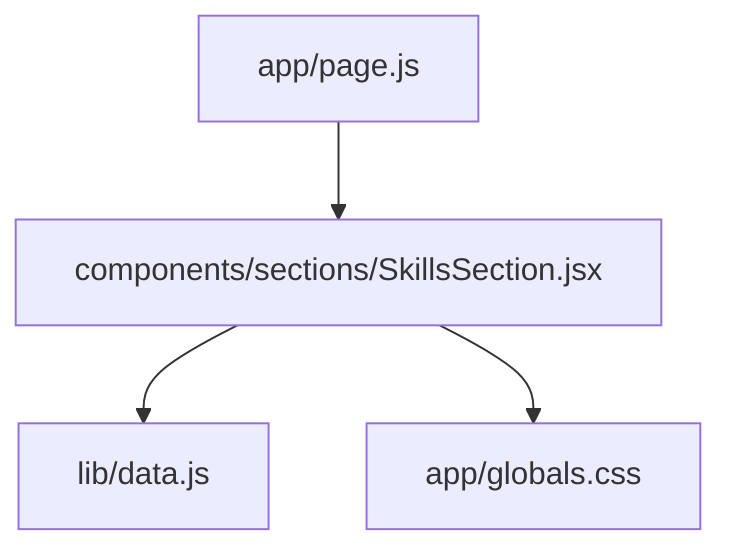
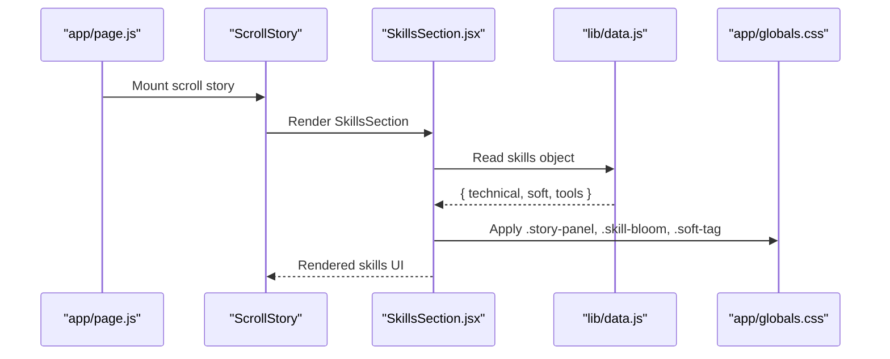
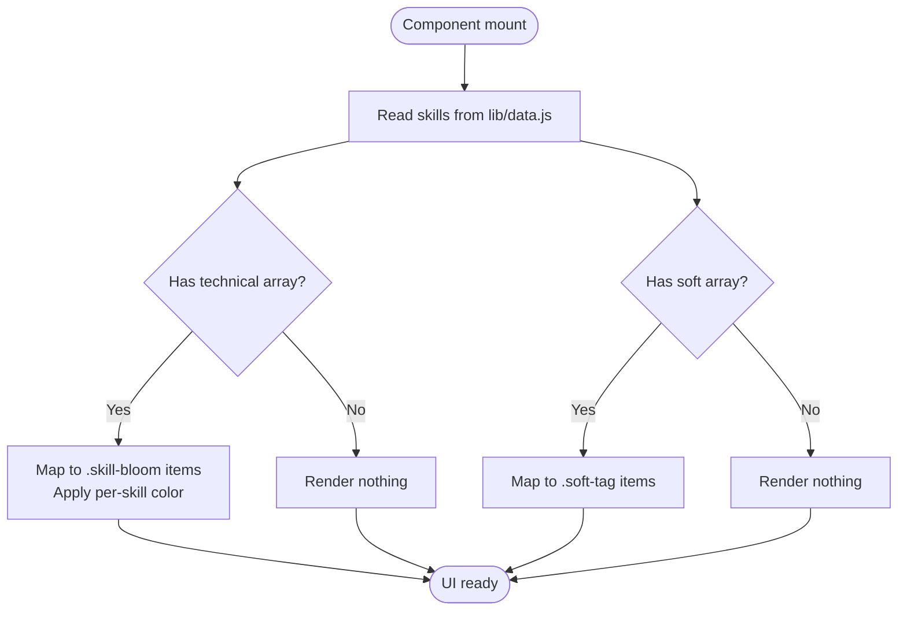
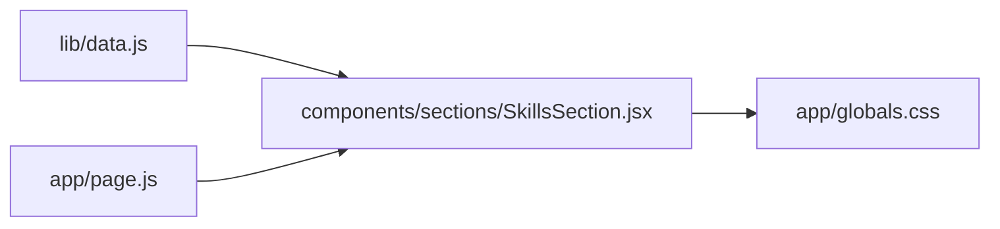

# Skills Section Component

<cite>
**Referenced Files in This Document**
- [SkillsSection.jsx](file://components/sections/SkillsSection.jsx)
- [data.js](file://lib/data.js)
- [globals.css](file://app/globals.css)
- [page.js](file://app/page.js)
</cite>

## Table of Contents
1. [Introduction](#introduction)
2. [Project Structure](#project-structure)
3. [Core Components](#core-components)
4. [Architecture Overview](#architecture-overview)
5. [Detailed Component Analysis](#detailed-component-analysis)
6. [Dependency Analysis](#dependency-analysis)
7. [Performance Considerations](#performance-considerations)
8. [Troubleshooting Guide](#troubleshooting-guide)
9. [Conclusion](#conclusion)
10. [Appendices](#appendices)

## Introduction
This document explains the Skills section component that renders technical skills, soft skills, and tools with distinct visual representations, color coding, and layout organization. It covers how the component consumes skill data, renders different categories, and how to extend or customize it for new skills and visual styles.

## Project Structure
The Skills section is implemented as a client-side React component that imports skill data from a centralized data module and applies global CSS for styling. The page mounts a scroll-based story container where this section appears.



**Diagram sources**
- [page.js:1-60](file://app/page.js#L1-L60)
- [SkillsSection.jsx:1-42](file://components/sections/SkillsSection.jsx#L1-L42)
- [data.js:139-180](file://lib/data.js#L139-L180)
- [globals.css:2064-2359](file://app/globals.css#L2064-L2359)

**Section sources**
- [page.js:1-60](file://app/page.js#L1-L60)
- [SkillsSection.jsx:1-42](file://components/sections/SkillsSection.jsx#L1-L42)
- [data.js:139-180](file://lib/data.js#L139-L180)
- [globals.css:2064-2359](file://app/globals.css#L2064-L2359)

## Core Components
- SkillsSection.jsx: Renders the “Circuit Garden” panel with a title, subtitle, technical skills grid, and soft skills tags.
- data.js: Provides the skills object containing arrays for technical, soft, and tools categories.
- globals.css: Defines the panel, skill blooms (technical), and soft tags styling.

Key responsibilities:
- Import and render skill data from lib/data.js.
- Render technical skills as colored “blooms” using per-skill colors.
- Render soft skills as text tags.
- Use consistent panel styling via global CSS classes.

**Section sources**
- [SkillsSection.jsx:1-42](file://components/sections/SkillsSection.jsx#L1-L42)
- [data.js:139-180](file://lib/data.js#L139-L180)
- [globals.css:2064-2359](file://app/globals.css#L2064-L2359)

## Architecture Overview
The Skills section follows a simple data-driven rendering pattern:
- Data source: lib/data.js exports a skills object with three categories.
- Component: components/sections/SkillsSection.jsx reads skills and maps them to UI elements.
- Styling: app/globals.css provides reusable classes for panels, blooms, and tags.
- Integration: app/page.js hosts the scroll story that includes this section.



**Diagram sources**
- [page.js:1-60](file://app/page.js#L1-L60)
- [SkillsSection.jsx:1-42](file://components/sections/SkillsSection.jsx#L1-L42)
- [data.js:139-180](file://lib/data.js#L139-L180)
- [globals.css:2064-2359](file://app/globals.css#L2064-L2359)

## Detailed Component Analysis

### Rendering Logic and Data Model
- Technical skills:
  - Consumed from skills.technical, an array of objects with name and color.
  - Each item renders as a pill-like bloom with a colored dot and label.
  - Color is applied via inline style bound to the skill’s color property.
- Soft skills:
  - Consumed from skills.soft, an array of strings.
  - Each string renders as a tag with uniform styling.
- Tools:
  - Defined in skills.tools but not currently rendered by the component.

Complexity:
- Rendering is O(n) over each category array; no heavy computations.

Error handling:
- If skills.technical or skills.soft are missing or empty, the loops will safely produce no output. Defensive checks can be added if needed.

**Section sources**
- [SkillsSection.jsx:16-38](file://components/sections/SkillsSection.jsx#L16-L38)
- [data.js:139-180](file://lib/data.js#L139-L180)

### Visual Representation and Layout
- Panel:
  - Uses .story-panel for glassmorphic background, rounded corners, and subtle borders.
  - Contains a small label, large title, and descriptive body text.
- Technical skills:
  - Container uses a flex-wrap layout with gaps.
  - Each .skill-bloom is a rounded pill with hover lift effect.
  - .skill-dot is a small circle whose background color comes from the skill object.
- Soft skills:
  - Container uses flex-wrap with gaps.
  - Each .soft-tag is a rounded tag with a light accent background.

Accessibility considerations:
- Ensure sufficient contrast between skill dot colors and backgrounds.
- Provide meaningful labels if interactive elements are added later.

**Section sources**
- [globals.css:2064-2115](file://app/globals.css#L2064-L2115)
- [globals.css:2298-2359](file://app/globals.css#L2298-L2359)

### Data Flow Diagram


**Diagram sources**
- [SkillsSection.jsx:16-38](file://components/sections/SkillsSection.jsx#L16-L38)
- [data.js:139-180](file://lib/data.js#L139-L180)

### Class and Data Relationships
```mermaid
classDiagram
class SkillsSection {
+render()
}
class DataSkills {
+technical : Array<{name,color}>
+soft : Array<string>
+tools : Array<string>
}
class Styles {
+".story-panel"
+".skill-bloom"
+".skill-dot"
+".soft-skills"
+".soft-tags"
+".soft-tag"
}
SkillsSection --> DataSkills : "imports"
SkillsSection --> Styles : "uses classes"
```

**Diagram sources**
- [SkillsSection.jsx:1-42](file://components/sections/SkillsSection.jsx#L1-L42)
- [data.js:139-180](file://lib/data.js#L139-L180)
- [globals.css:2064-2359](file://app/globals.css#L2064-L2359)

## Dependency Analysis
- Direct dependencies:
  - SkillsSection.jsx depends on lib/data.js for skill data.
  - Both rely on app/globals.css for presentation.
  - app/page.js hosts the scroll story that includes the Skills section.
- Coupling:
  - Low coupling: data is separated from presentation.
  - Styling is centralized in globals.css, promoting reuse across sections.
- Potential issues:
  - If skills structure changes, mapping logic must be updated accordingly.
  - Adding a new category (e.g., tools) requires both data and component updates.



**Diagram sources**
- [data.js:139-180](file://lib/data.js#L139-L180)
- [SkillsSection.jsx:1-42](file://components/sections/SkillsSection.jsx#L1-L42)
- [globals.css:2064-2359](file://app/globals.css#L2064-L2359)
- [page.js:1-60](file://app/page.js#L1-L60)

**Section sources**
- [SkillsSection.jsx:1-42](file://components/sections/SkillsSection.jsx#L1-L42)
- [data.js:139-180](file://lib/data.js#L139-L180)
- [globals.css:2064-2359](file://app/globals.css#L2064-L2359)
- [page.js:1-60](file://app/page.js#L1-L60)

## Performance Considerations
- Rendering:
  - Linear mapping over arrays; efficient for typical portfolio sizes.
- Styling:
  - CSS transitions on hover are lightweight.
  - Glassmorphism effects use backdrop-filter; ensure acceptable performance on target devices.
- Optimization opportunities:
  - Memoize lists if the dataset grows significantly.
  - Consider lazy loading additional categories if needed.

[No sources needed since this section provides general guidance]

## Troubleshooting Guide
Common issues and resolutions:
- Missing or empty skill arrays:
  - Symptom: No skills rendered.
  - Resolution: Verify skills.technical and skills.soft exist in lib/data.js and contain arrays.
- Incorrect color application:
  - Symptom: Skill dots appear black or invisible.
  - Resolution: Ensure each technical skill object has a valid color value used in inline styles.
- Styling not applied:
  - Symptom: Skills look unstyled.
  - Resolution: Confirm globals.css is imported and classes match exactly (.story-panel, .skill-bloom, .soft-tag).
- New category not visible:
  - Symptom: tools array exists but not shown.
  - Resolution: Add mapping logic in SkillsSection.jsx to render tools similarly to soft skills.

**Section sources**
- [SkillsSection.jsx:16-38](file://components/sections/SkillsSection.jsx#L16-L38)
- [data.js:139-180](file://lib/data.js#L139-L180)
- [globals.css:2298-2359](file://app/globals.css#L2298-L2359)

## Conclusion
The Skills section component cleanly separates data, rendering, and styling. Technical skills are displayed as colorful pills with per-skill colors, while soft skills are presented as uniform tags. The design leverages global CSS for consistent visuals and is easy to extend with new categories or customizations.

[No sources needed since this section summarizes without analyzing specific files]

## Appendices

### How to Add a New Technical Skill
- Steps:
  - Open lib/data.js and add a new object to skills.technical with name and color.
  - Save and refresh; the new skill will appear automatically due to mapping logic.
- Example reference:
  - See existing entries in skills.technical for format.

**Section sources**
- [data.js:139-163](file://lib/data.js#L139-L163)
- [SkillsSection.jsx:16-27](file://components/sections/SkillsSection.jsx#L16-L27)

### How to Add a New Soft Skill
- Steps:
  - Open lib/data.js and append a string to skills.soft.
  - Save; the new tag will render automatically.

**Section sources**
- [data.js:164-171](file://lib/data.js#L164-L171)
- [SkillsSection.jsx:29-38](file://components/sections/SkillsSection.jsx#L29-L38)

### How to Render Tools
- Steps:
  - In SkillsSection.jsx, add a new section similar to soft skills that maps skills.tools to styled tags.
  - Optionally create a new CSS class for tool tags if you want a distinct look.

**Section sources**
- [data.js:172-179](file://lib/data.js#L172-L179)
- [SkillsSection.jsx:29-38](file://components/sections/SkillsSection.jsx#L29-L38)

### Customizing Visual Presentation
- Change skill bloom appearance:
  - Modify .skill-bloom in globals.css for padding, border-radius, font size, or hover effects.
- Adjust soft tag style:
  - Modify .soft-tag in globals.css for background, color, or spacing.
- Update panel aesthetics:
  - Tweak .story-panel for background, blur, or shadow values.

**Section sources**
- [globals.css:2064-2115](file://app/globals.css#L2064-L2115)
- [globals.css:2298-2359](file://app/globals.css#L2298-L2359)