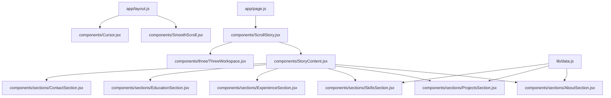
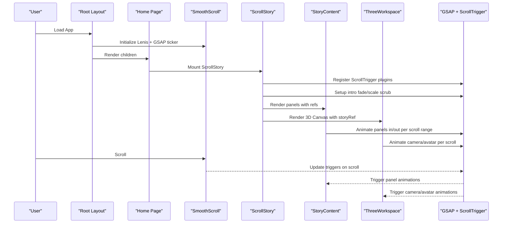
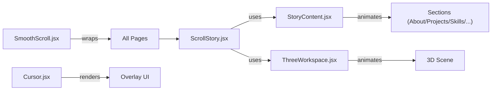

# Core Components

<cite>
**Referenced Files in This Document**
- [ScrollStory.jsx](file://components/ScrollStory.jsx)
- [StoryContent.jsx](file://components/StoryContent.jsx)
- [Cursor.jsx](file://components/Cursor.jsx)
- [SmoothScroll.jsx](file://components/SmoothScroll.jsx)
- [ThreeWorkspace.jsx](file://components/three/ThreeWorkspace.jsx)
- [AboutSection.jsx](file://components/sections/AboutSection.jsx)
- [ProjectsSection.jsx](file://components/sections/ProjectsSection.jsx)
- [SkillsSection.jsx](file://components/sections/SkillsSection.jsx)
- [data.js](file://lib/data.js)
- [layout.js](file://app/layout.js)
- [page.js](file://app/page.js)
</cite>

## Table of Contents
1. [Introduction](#introduction)
2. [Project Structure](#project-structure)
3. [Core Components](#core-components)
4. [Architecture Overview](#architecture-overview)
5. [Detailed Component Analysis](#detailed-component-analysis)
6. [Dependency Analysis](#dependency-analysis)
7. [Performance Considerations](#performance-considerations)
8. [Troubleshooting Guide](#troubleshooting-guide)
9. [Conclusion](#conclusion)

## Introduction
This document explains the core components that orchestrate the portfolio experience: ScrollStory for scroll-driven timeline coordination, StoryContent for panel-based section management, Cursor for custom pointer behavior, and SmoothScroll for enhanced scrolling. It covers how these pieces integrate to deliver a seamless, immersive navigation flow with 3D scene transitions and animated content panels.

## Project Structure
The portfolio is built as a Next.js application. The root layout wraps all pages with SmoothScroll and Cursor. The home page renders ScrollStory, which composes StoryContent (panel overlays) and ThreeWorkspace (3D scene). Section components render individual portfolio sections and are orchestrated by StoryContent based on scroll progress.

**Diagram sources**
- [layout.js:40-55](file://app/layout.js#L40-L55)
- [page.js:1-60](file://app/page.js#L1-L60)
- [ScrollStory.jsx:13-69](file://components/ScrollStory.jsx#L13-L69)
- [StoryContent.jsx:17-90](file://components/StoryContent.jsx#L17-L90)
- [ThreeWorkspace.jsx:168-186](file://components/three/ThreeWorkspace.jsx#L168-L186)

**Section sources**
- [layout.js:40-55](file://app/layout.js#L40-L55)
- [page.js:1-60](file://app/page.js#L1-L60)

## Core Components
- ScrollStory: Orchestrates the hero intro animation and coordinates the overall scroll timeline using GSAP ScrollTrigger. It mounts StoryContent and ThreeWorkspace within a sticky container so overlays and 3D scene animate together.
- StoryContent: Manages a set of panels (About, Projects, Skills, Experience, Education, Contact). Each panel animates in and out based on precise scroll ranges via GSAP ScrollTrigger.
- Cursor: Provides a custom cursor with a dot and a trailing ring. Detects touch devices and hides itself on touch. Changes appearance when hovering interactive elements.
- SmoothScroll: Wraps the app with Lenis smooth scrolling and integrates it with GSAP ScrollTrigger for consistent scroll-driven animations across browsers.

Key integration points:
- Root layout injects SmoothScroll and Cursor globally.
- Home page renders ScrollStory after a brief loading screen.
- ScrollStory passes its ref down to StoryContent and ThreeWorkspace to synchronize animations.

**Section sources**
- [ScrollStory.jsx:13-69](file://components/ScrollStory.jsx#L13-L69)
- [StoryContent.jsx:17-90](file://components/StoryContent.jsx#L17-L90)
- [Cursor.jsx:20-111](file://components/Cursor.jsx#L20-L111)
- [SmoothScroll.jsx:10-47](file://components/SmoothScroll.jsx#L10-L47)
- [layout.js:40-55](file://app/layout.js#L40-L55)
- [page.js:1-60](file://app/page.js#L1-L60)

## Architecture Overview
The system uses a layered approach:
- SmoothScroll normalizes scroll behavior and syncs with GSAP.
- ScrollStory sets up the top-level scroll timeline and mounts overlays and 3D.
- StoryContent drives panel animations per scroll segment.
- ThreeWorkspace controls camera and avatar motion tied to the same scroll timeline.
- Cursor enhances pointer interaction without interfering with scroll or canvas events.

**Diagram sources**
- [SmoothScroll.jsx:10-47](file://components/SmoothScroll.jsx#L10-L47)
- [ScrollStory.jsx:13-69](file://components/ScrollStory.jsx#L13-L69)
- [StoryContent.jsx:17-90](file://components/StoryContent.jsx#L17-L90)
- [ThreeWorkspace.jsx:23-98](file://components/three/ThreeWorkspace.jsx#L23-L98)

## Detailed Component Analysis

### ScrollStory
Responsibilities:
- Registers GSAP ScrollTrigger plugin.
- Animates the hero intro text fading and scaling as user scrolls.
- Composes StoryContent and ThreeWorkspace inside a sticky container to keep overlays aligned with the 3D scene.
- Passes its own ref down to coordinate timelines with child components.

Props: None (internal component).
Events: Uses GSAP ScrollTrigger internally; no React events exposed.
Lifecycle:
- useGSAP runs once on mount to set up intro animation scoped to the story container.
- Refs ensure correct DOM targets for animations.

Integration patterns:
- Acts as the root orchestrator for the entire scroll experience.
- Shares a single storyRef with StoryContent and ThreeWorkspace to synchronize animations.

Usage example:
- Rendered directly from the home page after a short loading state.

**Section sources**
- [ScrollStory.jsx:1-69](file://components/ScrollStory.jsx#L1-L69)
- [page.js:1-60](file://app/page.js#L1-L60)

### StoryContent
Responsibilities:
- Defines a fixed sequence of panels (About, Projects, Skills, Experience, Education, Contact).
- For each panel, creates two GSAP ScrollTrigger animations:
  - Entrance: fades in, moves up slightly, scales to full size over a narrow scroll window.
  - Exit: fades out, moves up, slight scale-down near the end of the panel’s window.
- Maintains an array of refs to target each panel DOM node.

Props:
- storyRef: Reference to the ScrollStory container used as the trigger element for all panel animations.

Events: None exposed; relies on GSAP ScrollTrigger.
Lifecycle:
- useGSAP initializes panel animations after mount.
- Refs are populated via callback refs during render.

Data model:
- PANELS array defines id, Component, start, and end positions as fractions of the scroll container.

Complexity:
- O(n) setup for n panels; each panel registers two ScrollTriggers.

Optimization opportunities:
- Ensure panelRefs are stable and avoid re-registering animations on re-renders.
- Consider lazy rendering off-screen panels if performance becomes an issue.

**Section sources**
- [StoryContent.jsx:1-91](file://components/StoryContent.jsx#L1-L91)

#### Panel Sections
Each section is a presentational component that renders content and styling classes. They receive no props and rely on shared data.

- AboutSection: Displays profile info and role tags sourced from data.
- ProjectsSection: Renders project cards with links and metadata.
- SkillsSection: Visualizes technical skills and soft skills.

These sections are mounted by StoryContent and animated via GSAP ScrollTrigger.

**Section sources**
- [AboutSection.jsx:1-30](file://components/sections/AboutSection.jsx#L1-L30)
- [ProjectsSection.jsx:1-43](file://components/sections/ProjectsSection.jsx#L1-L43)
- [SkillsSection.jsx:1-42](file://components/sections/SkillsSection.jsx#L1-L42)
- [data.js:1-181](file://lib/data.js#L1-L181)

### Cursor
Responsibilities:
- Renders a small dot and a larger ring that follows the mouse with easing.
- Detects touch devices and disables itself on touch to preserve native UX.
- Changes ring style when hovering interactive elements (links, buttons, or elements with a specific attribute).

Props: None.
Events:
- Listens to mousemove and mouseover at the window level.
- Uses requestAnimationFrame for smooth updates.

Lifecycle:
- useEffect attaches event listeners and starts the animation loop.
- Cleanup removes listeners and cancels animation frame.

Behavior details:
- Touch detection uses a media query hook to react to device capability changes.
- Hover detection checks for anchor/button tags or closest matches, plus a data attribute for custom targeting.

Accessibility considerations:
- Disabled on touch devices to avoid overlapping native cursors.
- Non-interactive (pointer-events: none) to not block clicks.

**Section sources**
- [Cursor.jsx:1-111](file://components/Cursor.jsx#L1-L111)

### SmoothScroll
Responsibilities:
- Initializes Lenis for smooth scrolling with configurable duration and easing.
- Respects reduced motion preferences by adjusting duration.
- Integrates Lenis with GSAP ScrollTrigger by updating triggers on scroll and syncing the GSAP ticker with Lenis’ RAF loop.

Props:
- children: Any nested components will benefit from smooth scrolling.

Events:
- Subscribes to Lenis “scroll” events to update GSAP ScrollTrigger.

Lifecycle:
- useEffect initializes Lenis on mount and returns a cleanup function that destroys Lenis and removes ticker callbacks.

Configuration highlights:
- Vertical orientation and gesture handling.
- Smooth wheel mode and touch multiplier for mobile feel.
- Ticker lag smoothing disabled for precise timing.

**Section sources**
- [SmoothScroll.jsx:1-47](file://components/SmoothScroll.jsx#L1-L47)

### ThreeWorkspace (Supporting 3D Integration)
Responsibilities:
- Renders a Three.js scene using React Three Fiber.
- Controls camera movement and avatar actions synchronized to the same scroll timeline via GSAP ScrollTrigger.
- Coordinates with StoryContent through a shared storyRef to ensure overlays and 3D animations stay in sync.

Key behaviors:
- Camera path phases: enter room, follow avatar walking, focus on monitor, zoom into screen, pull back into whimsical world.
- Avatar states change based on scroll progress (waving, sitting).
- Lighting and scene composition create a cohesive environment.

Props:
- storyRef: Shared reference to the ScrollStory container used as the ScrollTrigger source.

Integration:
- Mounted alongside StoryContent inside ScrollStory’s sticky container.
- Animations are driven by the same scroll timeline, ensuring perfect alignment between overlays and 3D.

**Section sources**
- [ThreeWorkspace.jsx:1-186](file://components/three/ThreeWorkspace.jsx#L1-L186)

## Dependency Analysis
High-level dependencies:
- GSAP + ScrollTrigger: Used across ScrollStory, StoryContent, and ThreeWorkspace for scroll-driven animations.
- Lenis: Used by SmoothScroll to normalize scrolling and integrate with GSAP.
- React Three Fiber: Used by ThreeWorkspace for declarative 3D.
- Data module: Supplies content for section components.

Coupling:
- ScrollStory is the central coordinator; both StoryContent and ThreeWorkspace depend on its ref for synchronization.
- SmoothScroll is a global wrapper applied at the layout level.
- Cursor is independent but coexists with other components without interfering with scroll or canvas interactions.

Potential circular dependencies:
- None observed; components communicate via refs and shared context rather than direct imports.

External integrations:
- GSAP ecosystem for animations.
- Lenis for smooth scrolling.
- React Three Fiber for 3D rendering.

**Diagram sources**
- [ScrollStory.jsx:13-69](file://components/ScrollStory.jsx#L13-L69)
- [StoryContent.jsx:17-90](file://components/StoryContent.jsx#L17-L90)
- [ThreeWorkspace.jsx:168-186](file://components/three/ThreeWorkspace.jsx#L168-L186)
- [SmoothScroll.jsx:10-47](file://components/SmoothScroll.jsx#L10-L47)
- [Cursor.jsx:20-111](file://components/Cursor.jsx#L20-L111)

**Section sources**
- [ScrollStory.jsx:13-69](file://components/ScrollStory.jsx#L13-L69)
- [StoryContent.jsx:17-90](file://components/StoryContent.jsx#L17-L90)
- [ThreeWorkspace.jsx:23-98](file://components/three/ThreeWorkspace.jsx#L23-L98)
- [SmoothScroll.jsx:10-47](file://components/SmoothScroll.jsx#L10-L47)
- [Cursor.jsx:20-111](file://components/Cursor.jsx#L20-L111)

## Performance Considerations
- Animation batching: GSAP ScrollTrigger handles efficient updates; ensure animations are scoped to minimal DOM nodes.
- Reduced motion: SmoothScroll adapts duration based on user preference to improve accessibility and performance.
- 3D rendering: ThreeWorkspace uses reasonable DPR and shadow settings; consider lowering quality on low-end devices if needed.
- Event listeners: Cursor uses passive listeners and requestAnimationFrame; ensure cleanup occurs on unmount.
- Panel count: StoryContent registers two ScrollTriggers per panel; keep the number of panels reasonable to avoid excessive animation overhead.

[No sources needed since this section provides general guidance]

## Troubleshooting Guide
Common issues and resolutions:
- Animations not triggering:
  - Verify that ScrollTrigger is registered and that the trigger element exists before setting up animations.
  - Ensure the storyRef is passed correctly to StoryContent and ThreeWorkspace.
- Smooth scroll conflicts:
  - Confirm SmoothScroll wraps the app and that GSAP ticker is synced with Lenis.
  - Check that ScrollTrigger.update is called on Lenis scroll events.
- Custom cursor not visible:
  - On touch devices, the cursor is intentionally hidden; verify device type detection.
  - Ensure CSS variables and z-index values do not hide the cursor behind other elements.
- 3D scene misalignment:
  - Confirm that the same storyRef is used for both overlays and 3D animations to keep them synchronized.
  - Validate camera paths and target positions in the scroll timeline.

**Section sources**
- [ScrollStory.jsx:17-34](file://components/ScrollStory.jsx#L17-L34)
- [StoryContent.jsx:30-75](file://components/StoryContent.jsx#L30-L75)
- [SmoothScroll.jsx:13-43](file://components/SmoothScroll.jsx#L13-L43)
- [Cursor.jsx:29-70](file://components/Cursor.jsx#L29-L70)
- [ThreeWorkspace.jsx:31-95](file://components/three/ThreeWorkspace.jsx#L31-L95)

## Conclusion
The portfolio’s scroll-driven experience is achieved through tight coordination among ScrollStory, StoryContent, ThreeWorkspace, SmoothScroll, and Cursor. ScrollStory acts as the conductor, aligning panel animations and 3D camera movements to a unified timeline. StoryContent manages section visibility and transitions, while ThreeWorkspace delivers an immersive 3D journey. SmoothScroll ensures fluid scrolling across devices, and Cursor enhances interactivity without disrupting core functionality. Together, they create a cohesive, engaging portfolio narrative that guides users seamlessly through the creator’s work.

[No sources needed since this section summarizes without analyzing specific files]