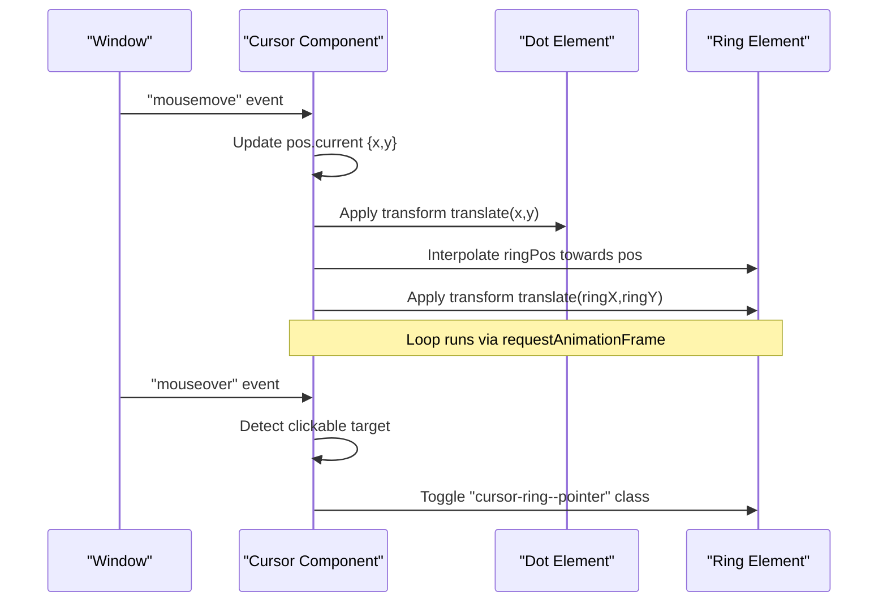
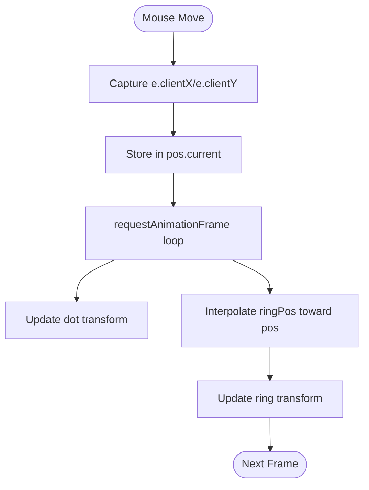
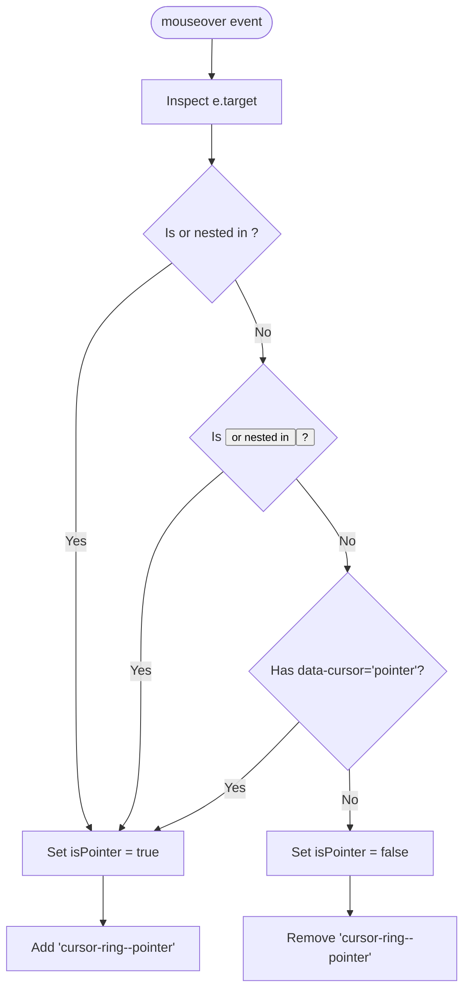
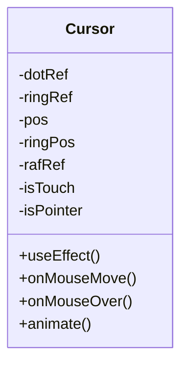
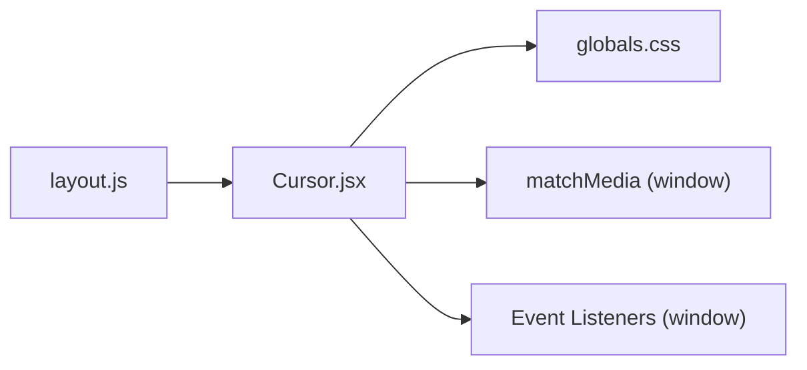

# Custom Cursor Component

<cite>
**Referenced Files in This Document**
- [Cursor.jsx](file://components/Cursor.jsx)
- [layout.js](file://app/layout.js)
- [globals.css](file://app/globals.css)
- [SmoothScroll.jsx](file://components/SmoothScroll.jsx)
- [ContactSection.jsx](file://components/sections/ContactSection.jsx)
- [ProjectsSection.jsx](file://components/sections/ProjectsSection.jsx)
- [page.js](file://app/project/[slug]/page.js)
</cite>

## Table of Contents
1. [Introduction](#introduction)
2. [Project Structure](#project-structure)
3. [Core Components](#core-components)
4. [Architecture Overview](#architecture-overview)
5. [Detailed Component Analysis](#detailed-component-analysis)
6. [Dependency Analysis](#dependency-analysis)
7. [Performance Considerations](#performance-considerations)
8. [Troubleshooting Guide](#troubleshooting-guide)
9. [Conclusion](#conclusion)
10. [Appendices](#appendices)

## Introduction
This document explains the Custom Cursor component that provides an enhanced pointer experience across the portfolio. It covers how mouse movement is tracked, how visual feedback changes over interactive elements, and how animations are optimized for smooth performance. It also documents special behaviors for 3D interactions, link hovers, and touch devices, along with guidance on customizing appearance and behavior for different contexts.

## Project Structure
The cursor is implemented as a client-side React component and rendered globally within the application layout. Its styles live in the global stylesheet, and it integrates with the smooth scrolling system to ensure consistent motion.

```mermaid
graph TB
A["Root Layout<br/>app/layout.js"] --> B["Custom Cursor<br/>components/Cursor.jsx"]
A --> C["Smooth Scroll Wrapper<br/>components/SmoothScroll.jsx"]
B --> D["Global Styles<br/>app/globals.css"]
E["Interactive Sections<br/>ContactSection.jsx, ProjectsSection.jsx, page.js"] --> |data-cursor="pointer"| B
```

**Diagram sources**
- [layout.js:40-54](file://app/layout.js#L40-L54)
- [Cursor.jsx:20-110](file://components/Cursor.jsx#L20-L110)
- [globals.css:2890-2902](file://app/globals.css#L2890-L2902)
- [SmoothScroll.jsx:10-46](file://components/SmoothScroll.jsx#L10-L46)

**Section sources**
- [layout.js:40-54](file://app/layout.js#L40-L54)
- [Cursor.jsx:20-110](file://components/Cursor.jsx#L20-L110)
- [globals.css:2890-2902](file://app/globals.css#L2890-L2902)
- [SmoothScroll.jsx:10-46](file://components/SmoothScroll.jsx#L10-L46)

## Core Components
- Custom Cursor (components/Cursor.jsx): Tracks mouse position, renders a dot and a ring, applies hover states, and animates using requestAnimationFrame.
- Global Styles (app/globals.css): Hides native cursors on interactive elements and defines the hover state class for the ring.
- Root Layout (app/layout.js): Renders the Cursor component globally so it is available on every page.
- Smooth Scroll (components/SmoothScroll.jsx): Provides smooth scrolling via Lenis; while not directly controlling the cursor, it ensures consistent motion context.

Key responsibilities:
- Mouse tracking: Captures client coordinates from window mousemove events.
- Visual feedback: Switches between default and pointer states based on element type or data attribute.
- Animation loop: Uses requestAnimationFrame to update positions smoothly.
- Touch handling: Disables the custom cursor on coarse pointer devices.

**Section sources**
- [Cursor.jsx:20-110](file://components/Cursor.jsx#L20-L110)
- [globals.css:2890-2902](file://app/globals.css#L2890-L2902)
- [layout.js:40-54](file://app/layout.js#L40-L54)
- [SmoothScroll.jsx:10-46](file://components/SmoothScroll.jsx#L10-L46)

## Architecture Overview
The cursor operates as a floating overlay fixed to the viewport. It listens to mouse events at the window level and updates two DOM nodes:
- Dot: Instantly follows the pointer.
- Ring: Smoothly interpolates toward the pointer for a trailing effect.

When hovering over interactive targets, the ring switches to a larger, highlighted style. On touch devices, the component renders nothing, preserving the native pointer.



**Diagram sources**
- [Cursor.jsx:29-70](file://components/Cursor.jsx#L29-L70)
- [globals.css:2897-2902](file://app/globals.css#L2897-L2902)

## Detailed Component Analysis

### Mouse Tracking and Positioning
- Event listeners: The component attaches passive mousemove and mouseover listeners to the window to avoid blocking scroll and improve performance.
- Coordinates: Stores current pointer coordinates in a ref to avoid re-renders and to read them inside the animation loop.
- Transform-based positioning: Both dot and ring use CSS transforms with translate() and centering offsets to position precisely without layout thrashing.



**Diagram sources**
- [Cursor.jsx:32-59](file://components/Cursor.jsx#L32-L59)

**Section sources**
- [Cursor.jsx:32-59](file://components/Cursor.jsx#L32-L59)

### Hover States and Interactive Detection
- Clickable detection: The component considers several indicators when determining if the cursor should switch to pointer mode:
  - Native anchor tags (<a>)
  - Native button tags (<button>)
  - Elements nested within anchors or buttons
  - Any element with data-cursor="pointer"
- State management: A boolean state toggles the presence of a modifier class on the ring to apply hover styling.
- Styling: The hover state increases size, changes border color, and adds a subtle background fill for emphasis.



**Diagram sources**
- [Cursor.jsx:36-45](file://components/Cursor.jsx#L36-L45)
- [globals.css:2897-2902](file://app/globals.css#L2897-L2902)

**Section sources**
- [Cursor.jsx:36-45](file://components/Cursor.jsx#L36-L45)
- [globals.css:2897-2902](file://app/globals.css#L2897-L2902)

### Animation Transitions and Performance
- Interpolation factor: The ring uses a smoothing factor to gradually approach the pointer position, creating a fluid trailing effect.
- Rendering strategy: Updates are applied via direct DOM style changes inside requestAnimationFrame, minimizing React re-renders.
- Cleanup: Event listeners and animation frames are removed on unmount to prevent memory leaks.



**Diagram sources**
- [Cursor.jsx:20-70](file://components/Cursor.jsx#L20-L70)

**Section sources**
- [Cursor.jsx:29-70](file://components/Cursor.jsx#L29-L70)

### Touch Device Considerations
- Coarse pointer detection: The component uses a media query hook to detect coarse pointers (touch devices).
- Behavior: On touch devices, the component returns null and does not render any overlay, preserving the native pointer and avoiding unnecessary work.

**Section sources**
- [Cursor.jsx:5-18](file://components/Cursor.jsx#L5-L18)
- [Cursor.jsx:72-72](file://components/Cursor.jsx#L72-L72)

### Integration with Smooth Scrolling
- While the cursor does not depend on smooth scrolling, the layout wraps content with a smooth scroll provider. This ensures consistent motion context and avoids jank when combined with the cursor’s requestAnimationFrame loop.

**Section sources**
- [layout.js:40-54](file://app/layout.js#L40-L54)
- [SmoothScroll.jsx:10-46](file://components/SmoothScroll.jsx#L10-L46)

### 3D Interactions
- No special 3D-specific logic is present in the cursor implementation. Since the cursor uses window-level mouse events and CSS transforms, it works consistently over Three.js canvases and other layered content.
- If you need 3D-aware behaviors (e.g., scaling on hover over 3D objects), extend the hover detection to include canvas intersections or integrate with your 3D library’s raycasting results.

[No sources needed since this section provides general guidance]

### Link Hovers and Navigation Patterns
- Links and buttons automatically trigger pointer mode due to tag checks.
- For custom interactive elements, add data-cursor="pointer" to enable the same hover behavior.
- The global stylesheet hides the native cursor on interactive elements to ensure only the custom cursor is visible.

**Section sources**
- [Cursor.jsx:36-45](file://components/Cursor.jsx#L36-L45)
- [globals.css:2890-2894](file://app/globals.css#L2890-L2894)
- [ContactSection.jsx:23-48](file://components/sections/ContactSection.jsx#L23-L48)
- [ProjectsSection.jsx:23-23](file://components/sections/ProjectsSection.jsx#L23-L23)
- [page.js:18-62](file://app/project/[slug]/page.js#L18-L62)

## Dependency Analysis
- The Cursor component depends on:
  - React hooks for refs, state, effects, and external store subscription.
  - Window APIs for mouse events and matchMedia.
  - Global CSS classes for hover styling.
- It is mounted once by the root layout, ensuring global availability.



**Diagram sources**
- [layout.js:40-54](file://app/layout.js#L40-L54)
- [Cursor.jsx:20-70](file://components/Cursor.jsx#L20-L70)
- [globals.css:2890-2902](file://app/globals.css#L2890-L2902)

**Section sources**
- [layout.js:40-54](file://app/layout.js#L40-L54)
- [Cursor.jsx:20-70](file://components/Cursor.jsx#L20-L70)
- [globals.css:2890-2902](file://app/globals.css#L2890-L2902)

## Performance Considerations
- Passive event listeners: Mouse events are registered with passive options to avoid blocking scroll performance.
- Refs for mutable values: Mouse coordinates and ring positions are stored in refs to prevent unnecessary React re-renders.
- requestAnimationFrame: Animation updates are batched per frame for smooth rendering.
- Conditional rendering: The component is disabled on touch devices to reduce overhead.
- Minimal DOM writes: Only transform properties are updated each frame, which are GPU-accelerated and cheap to compute.

[No sources needed since this section provides general guidance]

## Troubleshooting Guide
- Cursor not visible on mobile: Expected behavior; the component intentionally disables itself on coarse pointer devices.
- Hover state not triggering: Ensure interactive elements are anchors, buttons, or have data-cursor="pointer". Verify that no parent styles override pointer-events.
- Jittery movement: Confirm that no heavy computations run inside the animation loop and that passive listeners are used.
- Conflicts with native cursor: Ensure interactive elements hide the native cursor via the provided rules and that no inline styles force a different cursor.

**Section sources**
- [Cursor.jsx:5-18](file://components/Cursor.jsx#L5-L18)
- [Cursor.jsx:36-45](file://components/Cursor.jsx#L36-L45)
- [globals.css:2890-2894](file://app/globals.css#L2890-L2894)

## Conclusion
The Custom Cursor component delivers a smooth, responsive pointer experience with minimal performance impact. It tracks mouse movement, applies contextual hover states, and gracefully handles touch devices. By leveraging refs, passive listeners, and requestAnimationFrame, it maintains high frame rates. Extend its behavior by adding data attributes to custom elements or integrating with 3D libraries for advanced interactions.

[No sources needed since this section summarizes without analyzing specific files]

## Appendices

### Customization Guide
- Change colors: Modify CSS variables referenced by the cursor styles (for example, the pink and blue tokens used for the dot and ring).
- Adjust sizes: Update the width/height of the dot and ring in the component’s inline styles or via CSS classes.
- Control interpolation: Tune the smoothing factor in the animation loop to make the ring more or less responsive.
- Add new hover states: Introduce additional classes and conditions in the hover detection logic to support different interaction contexts.

[No sources needed since this section provides general guidance]