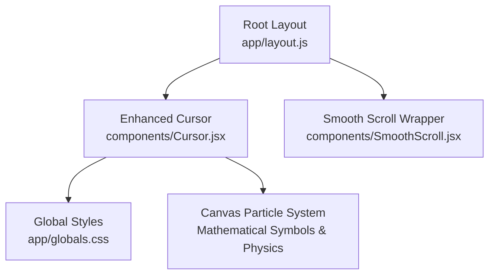
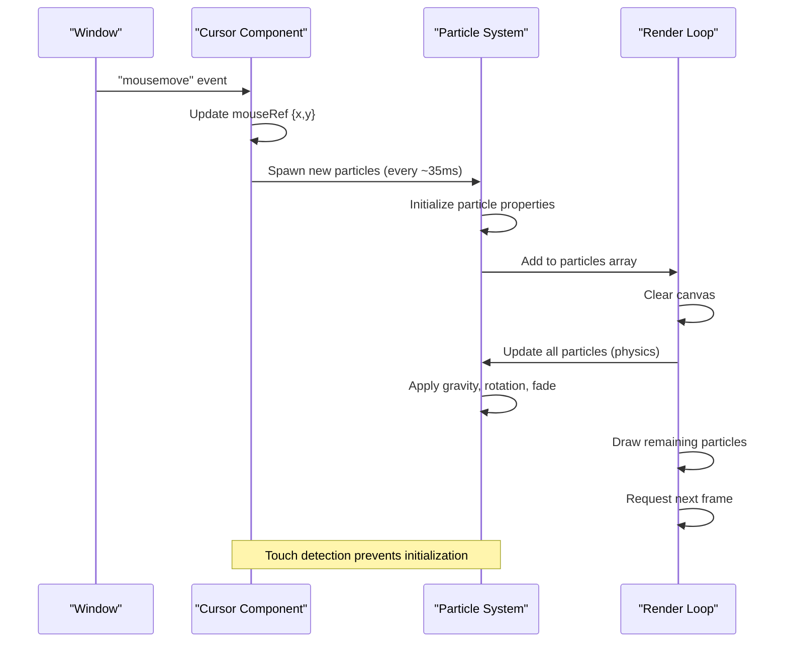
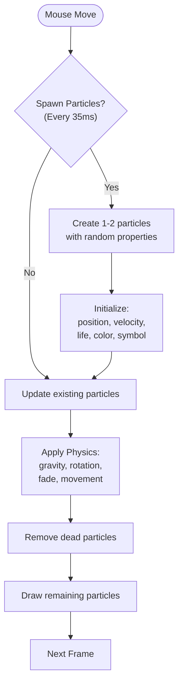
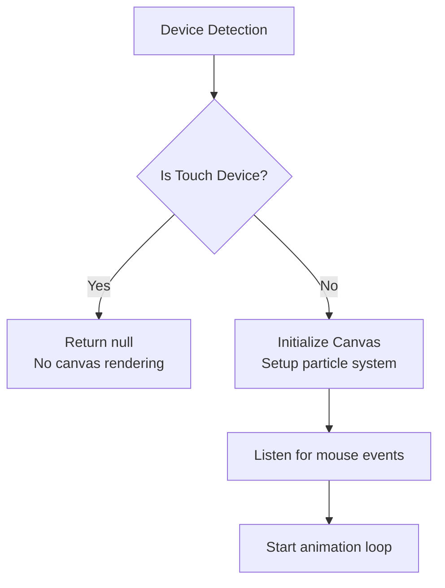
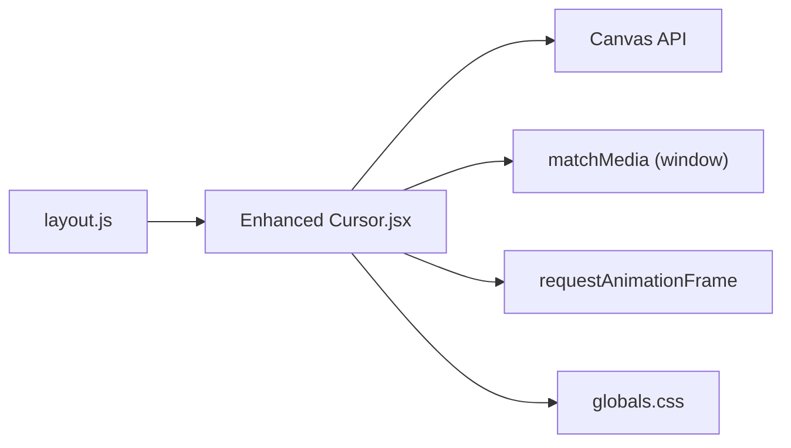

# Custom Cursor Component

<cite>
**Referenced Files in This Document**
- [Cursor.jsx](file://components/Cursor.jsx)
- [layout.js](file://app/layout.js)
- [globals.css](file://app/globals.css)
- [SmoothScroll.jsx](file://components/SmoothScroll.jsx)
</cite>

## Update Summary
**Changes Made**
- Updated cursor implementation from DOM-based dot/ring to canvas-based particle effects
- Added mathematical symbol particles with color variations and physics simulation
- Enhanced touch device detection with automatic disabling
- Removed hover state management for interactive elements
- Simplified component architecture while maintaining performance optimizations

## Table of Contents
1. [Introduction](#introduction)
2. [Project Structure](#project-structure)
3. [Core Components](#core-components)
4. [Architecture Overview](#architecture-overview)
5. [Detailed Component Analysis](#detailed-component-analysis)
6. [Dependency Analysis](#dependency-analysis)
7. [Performance Considerations](#performance-considerations)
8. [Troubleshooting Guide](#troubleshooting-guide)
9. [Conclusion](#conclusion)
10. [Appendices](#appendices)

## Introduction
This document explains the enhanced Custom Cursor component that provides a sophisticated particle-based cursor experience across the portfolio. The component now uses HTML5 Canvas to render mathematical symbol particles that follow mouse movement with realistic physics, including gravity, rotation, and fade-out effects. It automatically detects touch devices and disables itself on coarse pointer inputs while providing smooth animations optimized for performance.

## Project Structure
The cursor is implemented as a client-side React component using HTML5 Canvas API and rendered globally within the application layout. Touch device detection is handled through media queries, and the component integrates seamlessly with the smooth scrolling system.

**Diagram sources**
- [layout.js:40-54](file://app/layout.js#L40-L54)
- [Cursor.jsx:23-128](file://components/Cursor.jsx#L23-L128)
- [globals.css:2918-2933](file://app/globals.css#L2918-L2933)
- [SmoothScroll.jsx:10-46](file://components/SmoothScroll.jsx#L10-L46)

**Section sources**
- [layout.js:40-54](file://app/layout.js#L40-L54)
- [Cursor.jsx:23-128](file://components/Cursor.jsx#L23-L128)
- [globals.css:2918-2933](file://app/globals.css#L2918-L2933)
- [SmoothScroll.jsx:10-46](file://components/SmoothScroll.jsx#L10-L46)

## Core Components
- **Enhanced Cursor (components/Cursor.jsx)**: Canvas-based particle system with mathematical symbols, physics simulation, and automatic touch device detection.
- **Global Styles (app/globals.css)**: Hides native cursors on fine pointer devices and manages canvas visibility based on input type.
- **Root Layout (app/layout.js)**: Renders the enhanced Cursor component globally within the SmoothScroll wrapper.
- **Smooth Scroll (components/SmoothScroll.jsx)**: Provides smooth scrolling via Lenis; ensures consistent motion context for particle rendering.

Key responsibilities:
- **Particle Generation**: Creates mathematical symbol particles at mouse position with randomized properties
- **Physics Simulation**: Implements gravity, velocity, rotation, and fade-out effects
- **Touch Detection**: Automatically disables canvas rendering on touch devices
- **Performance Optimization**: Uses requestAnimationFrame and efficient canvas operations

**Section sources**
- [Cursor.jsx:23-128](file://components/Cursor.jsx#L23-L128)
- [globals.css:2918-2933](file://app/globals.css#L2918-L2933)
- [layout.js:40-54](file://app/layout.js#L40-L54)
- [SmoothScroll.jsx:10-46](file://components/SmoothScroll.jsx#L10-L46)

## Architecture Overview
The enhanced cursor operates as a full-screen canvas overlay that renders mathematical symbol particles following the mouse cursor. Each particle has individual properties including position, velocity, gravity, rotation, color, and lifecycle management. The system uses efficient canvas operations and requestAnimationFrame for smooth 60fps rendering.

**Diagram sources**
- [Cursor.jsx:31-111](file://components/Cursor.jsx#L31-L111)
- [Cursor.jsx:53-102](file://components/Cursor.jsx#L53-L102)

## Detailed Component Analysis

### Canvas-Based Particle System
The component now uses HTML5 Canvas to render mathematical symbol particles that follow mouse movement with realistic physics:

- **Particle Properties**: Each particle has position (x,y), velocity (vx,vy), life span, decay rate, size, color, symbol, rotation, and rotation speed
- **Symbol Set**: Mathematical and programming symbols including `{`, `}`, `<`, `>`, `/`, `;`, `0`, `1`, `*`, `+`
- **Color Palette**: Five vibrant colors (#70d6ff, #ff70a6, #ffd670, #e9ff70, #ff9770) randomly assigned to particles
- **Physics Simulation**: Gravity affects vertical velocity, particles rotate and fade out over time

**Diagram sources**
- [Cursor.jsx:53-102](file://components/Cursor.jsx#L53-L102)

**Section sources**
- [Cursor.jsx:53-102](file://components/Cursor.jsx#L53-L102)

### Automatic Touch Device Detection
The component implements sophisticated touch device detection using a custom hook:

- **Media Query Hook**: Uses `useSyncExternalStore` to subscribe to `matchMedia("(pointer: coarse)")` changes
- **Reactive Updates**: Automatically responds to device capability changes during runtime
- **Graceful Degradation**: Returns null on touch devices, preventing any canvas rendering
- **Event Cleanup**: Properly removes event listeners when component unmounts

**Diagram sources**
- [Cursor.jsx:8-21](file://components/Cursor.jsx#L8-L21)
- [Cursor.jsx:31-32](file://components/Cursor.jsx#L31-L32)

**Section sources**
- [Cursor.jsx:8-21](file://components/Cursor.jsx#L8-L21)
- [Cursor.jsx:31-32](file://components/Cursor.jsx#L31-L32)

### Performance Optimizations
The enhanced cursor implements several performance optimizations:

- **Passive Event Listeners**: Mouse move events use passive options to avoid blocking scroll performance
- **Efficient Rendering**: Canvas operations are batched per frame using requestAnimationFrame
- **Memory Management**: Dead particles are filtered out to prevent memory leaks
- **Conditional Rendering**: Complete component disabled on touch devices
- **Minimal State**: Uses refs instead of React state for mutable values to prevent re-renders

**Section sources**
- [Cursor.jsx:51](file://components/Cursor.jsx#L51)
- [Cursor.jsx:106-110](file://components/Cursor.jsx#L106-L110)

### Integration with Global Styles
The component works with global CSS to provide consistent behavior:

- **Cursor Hiding**: Native cursors are hidden on fine pointer devices using media queries
- **Canvas Visibility**: Additional CSS rules ensure proper display across different input types
- **Z-index Management**: Canvas positioned above most content but below critical UI elements

**Section sources**
- [globals.css:2918-2933](file://app/globals.css#L2918-L2933)

### Animation and Physics Engine
The particle system includes a complete physics engine:

- **Gravity**: Constant downward acceleration applied to vertical velocity
- **Velocity Decay**: Particles gradually slow down due to air resistance
- **Rotation**: Individual rotation speeds create dynamic visual effects
- **Lifecycle Management**: Particles have finite lifespans with gradual fade-out
- **Randomization**: Multiple random properties create organic, natural-looking particle trails

**Section sources**
- [Cursor.jsx:57-75](file://components/Cursor.jsx#L57-L75)
- [Cursor.jsx:78-99](file://components/Cursor.jsx#L78-L99)

## Dependency Analysis
The enhanced cursor component depends on:
- **React Hooks**: useEffect, useRef, useSyncExternalStore for side effects and external store subscription
- **Canvas API**: HTML5 Canvas for high-performance 2D rendering
- **Window APIs**: matchMedia for device detection, requestAnimationFrame for smooth animations
- **Global CSS**: Media query rules for cursor hiding and responsive behavior

**Diagram sources**
- [layout.js:40-54](file://app/layout.js#L40-L54)
- [Cursor.jsx:23-128](file://components/Cursor.jsx#L23-L128)
- [globals.css:2918-2933](file://app/globals.css#L2918-L2933)

**Section sources**
- [layout.js:40-54](file://app/layout.js#L40-L54)
- [Cursor.jsx:23-128](file://components/Cursor.jsx#L23-L128)
- [globals.css:2918-2933](file://app/globals.css#L2918-L2933)

## Performance Considerations
- **Canvas Rendering**: Hardware-accelerated 2D canvas operations for optimal performance
- **Efficient Memory**: Particle filtering removes dead objects to prevent memory accumulation
- **Passive Events**: Mouse event listeners use passive options to maintain scroll performance
- **Conditional Logic**: Complete component bypass on touch devices eliminates unnecessary overhead
- **Batched Updates**: All particle updates occur within single requestAnimationFrame cycle
- **Minimal DOM**: Only one canvas element created and managed throughout component lifecycle

## Troubleshooting Guide
- **Particles not visible**: Ensure browser supports HTML5 Canvas and JavaScript is enabled
- **Poor performance on low-end devices**: Consider reducing particle count or complexity
- **Touch devices still showing canvas**: Verify media query detection is working correctly
- **Memory leaks**: Check that particle cleanup is functioning properly in long sessions
- **Canvas not resizing**: Ensure window resize event listener is attached and firing

**Section sources**
- [Cursor.jsx:31-32](file://components/Cursor.jsx#L31-L32)
- [Cursor.jsx:106-110](file://components/Cursor.jsx#L106-L110)

## Conclusion
The enhanced Custom Cursor component delivers a visually engaging particle-based cursor experience using HTML5 Canvas and mathematical symbols. The implementation features realistic physics simulation, automatic touch device detection, and optimized performance through efficient canvas operations. The component gracefully degrades on touch devices while providing rich visual feedback on desktop systems. Its modular design allows for easy customization of particle properties, colors, and behavior patterns.

## Appendices

### Customization Guide
- **Modify symbols**: Update the `CONFETTI_SYMBOLS` array to change which mathematical symbols appear
- **Adjust colors**: Modify the `COLORS` array to customize the particle color palette
- **Tune physics**: Adjust gravity, velocity, decay rates, and rotation speeds in the particle initialization
- **Control density**: Change spawn timing (currently every 35ms) and particle count per spawn
- **Customize appearance**: Modify font size, opacity, and other rendering properties in the draw loop

### Technical Specifications
- **Canvas Size**: Full viewport coverage with automatic resize handling
- **Frame Rate**: Target 60fps using requestAnimationFrame
- **Particle Lifespan**: Variable duration based on individual decay rates
- **Memory Usage**: Efficient cleanup of dead particles to prevent accumulation
- **Browser Support**: Requires HTML5 Canvas support (modern browsers)

[No sources needed since this section provides general guidance]