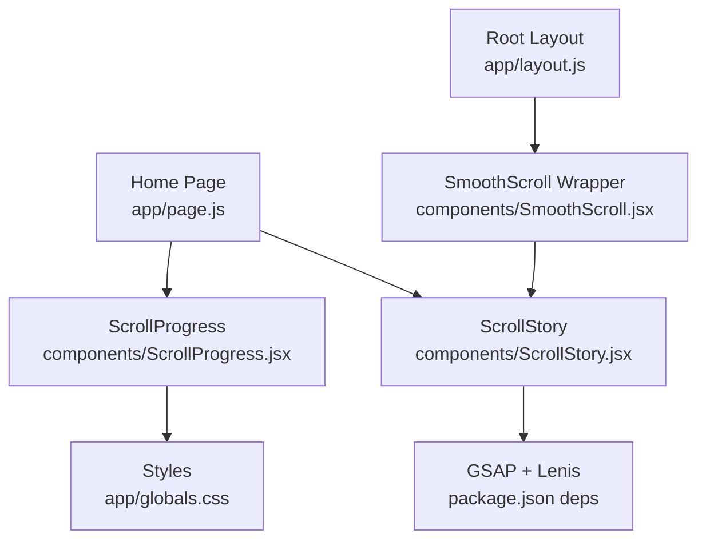
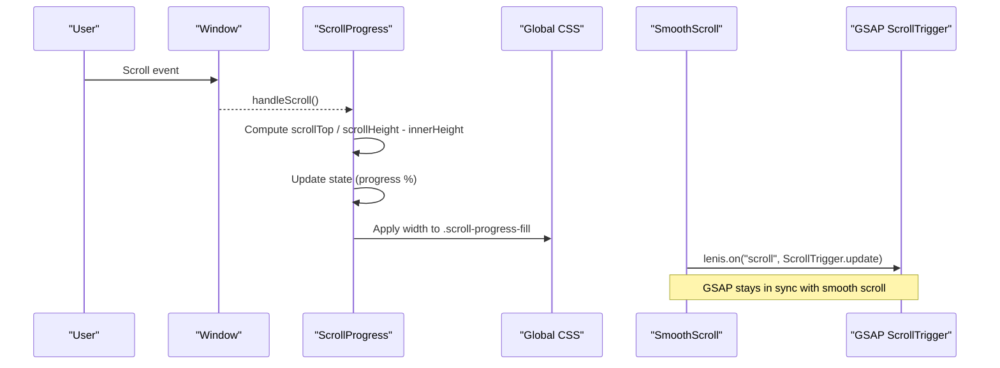
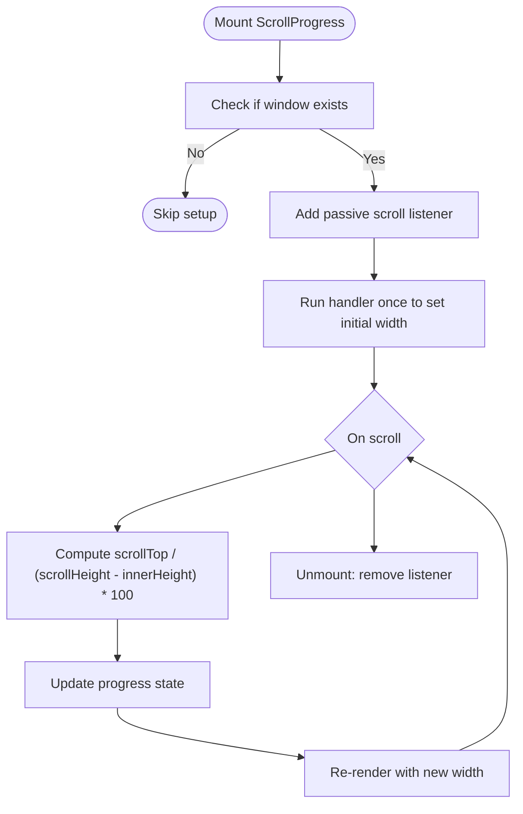
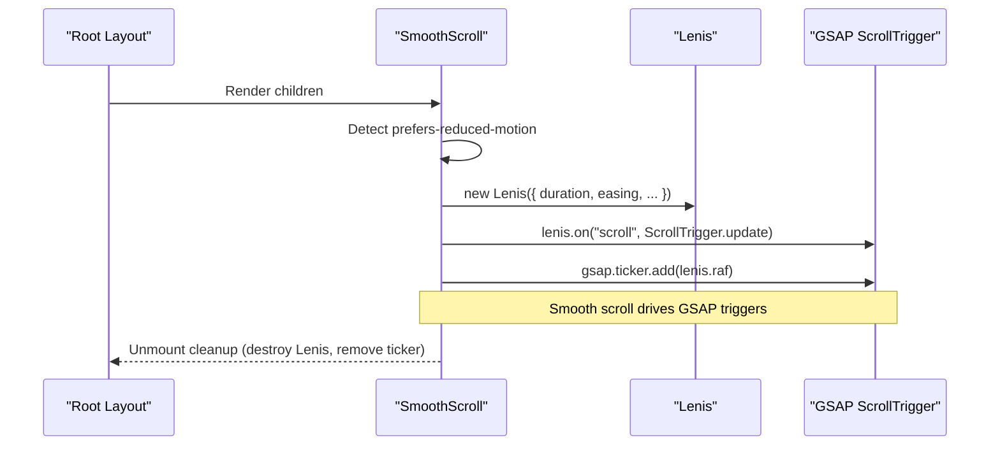
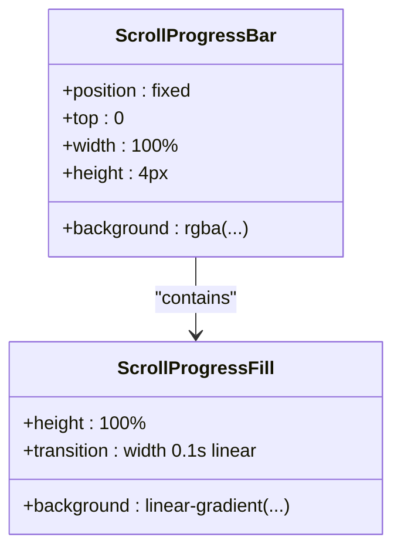
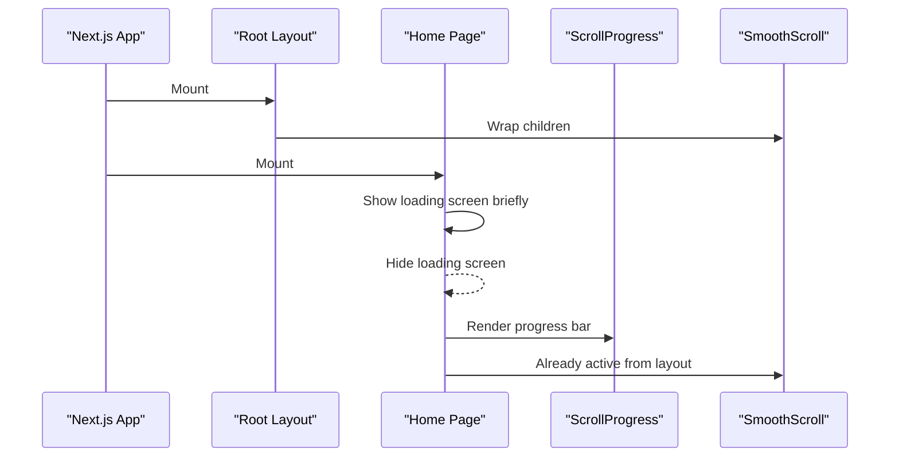
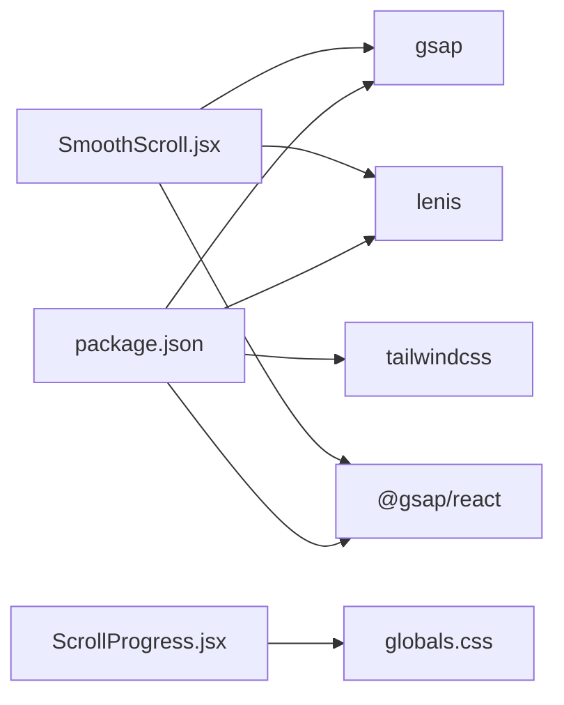

# Scroll Progress Indicator

<cite>
**Referenced Files in This Document**
- [ScrollProgress.jsx](file://components/ScrollProgress.jsx)
- [SmoothScroll.jsx](file://components/SmoothScroll.jsx)
- [page.js](file://app/page.js)
- [layout.js](file://app/layout.js)
- [globals.css](file://app/globals.css)
- [package.json](file://package.json)
</cite>

## Table of Contents
1. [Introduction](#introduction)
2. [Project Structure](#project-structure)
3. [Core Components](#core-components)
4. [Architecture Overview](#architecture-overview)
5. [Detailed Component Analysis](#detailed-component-analysis)
6. [Dependency Analysis](#dependency-analysis)
7. [Performance Considerations](#performance-considerations)
8. [Troubleshooting Guide](#troubleshooting-guide)
9. [Conclusion](#conclusion)

## Introduction
This document explains the Scroll Progress Indicator implemented in the portfolio application. It covers how the component calculates scroll position, renders a top-of-page progress bar, and integrates with smooth scrolling and GSAP-based animations. The goal is to provide both a high-level understanding and a code-level deep dive for developers who want to maintain or extend this feature.

## Project Structure
The scroll progress indicator is a small client-side React component that:
- Listens to window scroll events
- Computes the percentage scrolled based on viewport and document dimensions
- Renders a fixed-position progress bar at the top of the page
- Uses CSS variables and gradients for styling

It is rendered on the home page after an initial loading screen and works alongside a smooth scrolling wrapper and GSAP-driven scroll animations.

**Diagram sources**
- [page.js:1-66](file://app/page.js#L1-L66)
- [ScrollProgress.jsx:1-33](file://components/ScrollProgress.jsx#L1-L33)
- [SmoothScroll.jsx:1-47](file://components/SmoothScroll.jsx#L1-L47)
- [layout.js:1-55](file://app/layout.js#L1-L55)
- [globals.css:2880-2912](file://app/globals.css#L2880-L2912)
- [package.json:11-22](file://package.json#L11-L22)

**Section sources**
- [page.js:1-66](file://app/page.js#L1-L66)
- [layout.js:1-55](file://app/layout.js#L1-L55)
- [ScrollProgress.jsx:1-33](file://components/ScrollProgress.jsx#L1-L33)
- [globals.css:2880-2912](file://app/globals.css#L2880-L2912)
- [package.json:11-22](file://package.json#L11-L22)

## Core Components
- ScrollProgress: A client-side React component that tracks scroll position and updates a progress bar width.
- SmoothScroll: A wrapper that initializes Lenis for smooth scrolling and integrates with GSAP ScrollTrigger.
- Home Page: Renders the loading screen, then shows ScrollProgress and ScrollStory.
- Root Layout: Provides global fonts and wraps content with SmoothScroll.
- Styles: Global CSS defines the look of the progress bar using CSS variables and gradients.

Key responsibilities:
- ScrollProgress computes percentage scrolled and applies it to the fill element’s width.
- SmoothScroll ensures consistent scroll behavior across devices and keeps GSAP in sync.
- Home Page controls when the progress bar appears (after loading).
- Root Layout ensures smooth scrolling is active globally.

**Section sources**
- [ScrollProgress.jsx:1-33](file://components/ScrollProgress.jsx#L1-L33)
- [SmoothScroll.jsx:1-47](file://components/SmoothScroll.jsx#L1-L47)
- [page.js:1-66](file://app/page.js#L1-L66)
- [layout.js:1-55](file://app/layout.js#L1-L55)
- [globals.css:2880-2912](file://app/globals.css#L2880-L2912)

## Architecture Overview
The scroll progress indicator sits at the intersection of user interaction (scroll), state management (percentage), and presentation (CSS-styled bar). It integrates with the rest of the app via:
- Rendering order: Home page mounts ScrollProgress before ScrollStory.
- Smooth scrolling: The root layout wraps all content with SmoothScroll so scroll events are normalized and GSAP can track them accurately.
- Styling: Global CSS provides a fixed top bar with a gradient fill that transitions smoothly as the user scrolls.

**Diagram sources**
- [ScrollProgress.jsx:8-22](file://components/ScrollProgress.jsx#L8-L22)
- [SmoothScroll.jsx:13-43](file://components/SmoothScroll.jsx#L13-L43)
- [globals.css:2886-2912](file://app/globals.css#L2886-L2912)

## Detailed Component Analysis

### ScrollProgress Component
Responsibilities:
- Track scroll events efficiently using passive listeners.
- Calculate scroll percentage safely for SSR by checking window availability.
- Render a minimal DOM structure with two divs: a container and a fill element whose width reflects progress.

Implementation highlights:
- State: Holds current progress percentage.
- Effect: Adds/removes scroll listener; runs once on mount.
- Calculation: Uses window.scrollY and document.documentElement.scrollHeight minus window.innerHeight to compute percentage.
- Rendering: Applies inline style width to the fill element; relies on CSS classes for positioning and appearance.

**Diagram sources**
- [ScrollProgress.jsx:8-22](file://components/ScrollProgress.jsx#L8-L22)

**Section sources**
- [ScrollProgress.jsx:1-33](file://components/ScrollProgress.jsx#L1-L33)

### SmoothScroll Integration
Responsibilities:
- Initialize Lenis for smooth scrolling with appropriate duration and easing.
- Respect reduced motion preferences.
- Keep GSAP ScrollTrigger in sync with Lenis scroll events.
- Clean up resources on unmount.

Integration points:
- Root layout wraps all children with SmoothScroll to ensure consistent behavior site-wide.
- GSAP ScrollTrigger updates are triggered on each Lenis scroll tick.

**Diagram sources**
- [SmoothScroll.jsx:13-43](file://components/SmoothScroll.jsx#L13-L43)
- [layout.js:40-53](file://app/layout.js#L40-L53)

**Section sources**
- [SmoothScroll.jsx:1-47](file://components/SmoothScroll.jsx#L1-L47)
- [layout.js:1-55](file://app/layout.js#L1-L55)

### Styling and Visual Behavior
- Container: Fixed at the top, full width, subtle background.
- Fill: Full height of container, gradient background using CSS variables, width animated via transition.
- Accessibility: Respects reduced motion settings globally.

**Diagram sources**
- [globals.css:2886-2912](file://app/globals.css#L2886-L2912)

**Section sources**
- [globals.css:2880-2912](file://app/globals.css#L2880-L2912)

### Usage in Application
- Home page conditionally renders ScrollProgress after the loading screen completes.
- Root layout ensures smooth scrolling is active for the entire app.

**Diagram sources**
- [page.js:1-66](file://app/page.js#L1-L66)
- [layout.js:40-53](file://app/layout.js#L40-L53)

**Section sources**
- [page.js:1-66](file://app/page.js#L1-L66)
- [layout.js:1-55](file://app/layout.js#L1-L55)

## Dependency Analysis
External libraries involved:
- GSAP and ScrollTrigger: Used by SmoothScroll and other components to synchronize animations with scroll.
- Lenis: Provides smooth scrolling behavior integrated with GSAP.
- Tailwind CSS: Imported in global styles for utility-first styling.

**Diagram sources**
- [package.json:11-22](file://package.json#L11-L22)
- [SmoothScroll.jsx:1-47](file://components/SmoothScroll.jsx#L1-L47)
- [ScrollProgress.jsx:1-33](file://components/ScrollProgress.jsx#L1-L33)
- [globals.css:1-2](file://app/globals.css#L1-L2)

**Section sources**
- [package.json:11-22](file://package.json#L11-L22)
- [SmoothScroll.jsx:1-47](file://components/SmoothScroll.jsx#L1-L47)
- [ScrollProgress.jsx:1-33](file://components/ScrollProgress.jsx#L1-L33)
- [globals.css:1-2](file://app/globals.css#L1-L2)

## Performance Considerations
- Passive scroll listener: Improves scroll performance by not blocking the main thread.
- Minimal re-renders: Only the progress percentage changes; the DOM structure remains static.
- Transition smoothing: CSS transition on width provides visual smoothness without heavy JS animation loops.
- Reduced motion: Global media query reduces animations for accessibility; consider extending to disable progress bar transitions if needed.

Optimization opportunities:
- Debounce/throttle scroll handler if additional heavy work is added inside the listener.
- Use requestAnimationFrame if more frequent updates are required beyond native scroll events.
- Consider hiding the progress bar on very short pages where scroll range is negligible.

[No sources needed since this section provides general guidance]

## Troubleshooting Guide
Common issues and resolutions:
- Progress bar not updating:
  - Ensure the component is mounted after the loading screen hides.
  - Verify that the page has enough height to scroll; otherwise, docHeight may be zero.
- Incorrect percentages:
  - Confirm that SmoothScroll is wrapping content so scroll metrics align with GSAP expectations.
  - Check that no parent containers override overflow behaviors unexpectedly.
- Accessibility concerns:
  - Users with reduced motion preferences may prefer no animation; verify global media queries apply appropriately.
- SSR mismatches:
  - The component guards against server-side execution by checking window existence before adding listeners.

**Section sources**
- [ScrollProgress.jsx:8-22](file://components/ScrollProgress.jsx#L8-L22)
- [page.js:18-63](file://app/page.js#L18-L63)
- [globals.css:2939-2958](file://app/globals.css#L2939-L2958)

## Conclusion
The Scroll Progress Indicator is a lightweight, efficient component that enhances navigation feedback by visually indicating scroll position. It integrates seamlessly with smooth scrolling and GSAP-driven animations while maintaining good performance and accessibility practices. Its simple design makes it easy to customize or extend, such as adding color changes, thresholds, or visibility toggles based on sections.

[No sources needed since this section summarizes without analyzing specific files]