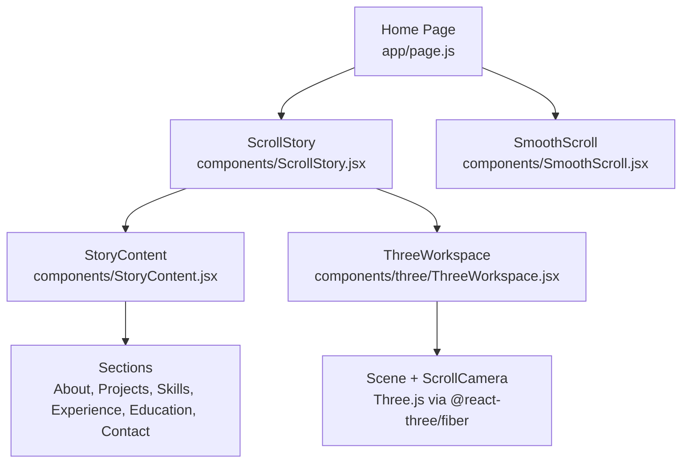
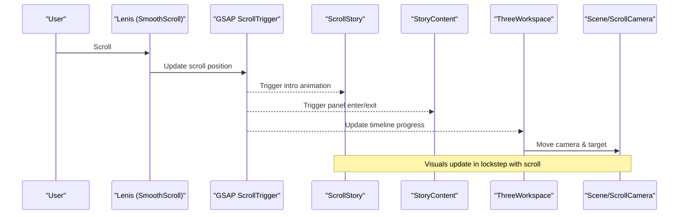
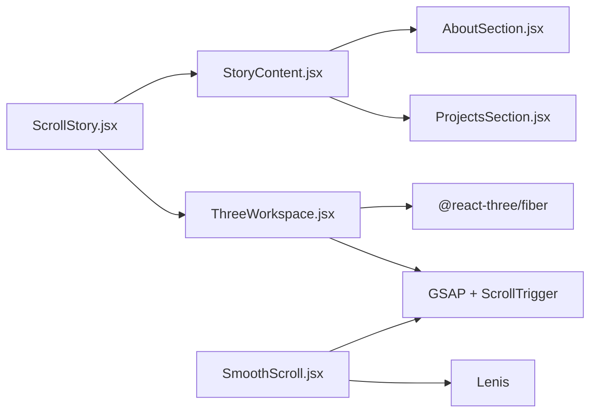

# ScrollStory Component

<cite>
**Referenced Files in This Document**
- [ScrollStory.jsx](file://components/ScrollStory.jsx)
- [StoryContent.jsx](file://components/StoryContent.jsx)
- [ThreeWorkspace.jsx](file://components/three/ThreeWorkspace.jsx)
- [SmoothScroll.jsx](file://components/SmoothScroll.jsx)
- [page.js](file://app/page.js)
- [AboutSection.jsx](file://components/sections/AboutSection.jsx)
- [ProjectsSection.jsx](file://components/sections/ProjectsSection.jsx)
</cite>

## Table of Contents
1. [Introduction](#introduction)
2. [Project Structure](#project-structure)
3. [Core Components](#core-components)
4. [Architecture Overview](#architecture-overview)
5. [Detailed Component Analysis](#detailed-component-analysis)
6. [Dependency Analysis](#dependency-analysis)
7. [Performance Considerations](#performance-considerations)
8. [Troubleshooting Guide](#troubleshooting-guide)
9. [Conclusion](#conclusion)
10. [Appendices](#appendices)

## Introduction
This document explains the ScrollStory component, which orchestrates a scroll-driven storytelling experience that blends 2D content overlays with a 3D scene. It coordinates GSAP ScrollTrigger animations for intro text fade and movement, manages panel transitions for story sections, and synchronizes camera and avatar motion inside a Three.js workspace. The result is an immersive scrolling journey where scroll progress drives visual effects across both DOM and WebGL layers.

## Project Structure
The scroll story is composed of:
- A top-level section that mounts the intro overlay, story panels, and 3D workspace
- A content layer that renders multiple story panels with per-section scroll-triggered animations
- A 3D workspace that animates camera and character based on scroll position
- A smooth scrolling provider that integrates Lenis with GSAP’s ScrollTrigger

**Diagram sources**
- [page.js:1-60](file://app/page.js#L1-L60)
- [ScrollStory.jsx:1-70](file://components/ScrollStory.jsx#L1-L70)
- [StoryContent.jsx:1-91](file://components/StoryContent.jsx#L1-L91)
- [ThreeWorkspace.jsx:1-186](file://components/three/ThreeWorkspace.jsx#L1-L186)
- [SmoothScroll.jsx:1-47](file://components/SmoothScroll.jsx#L1-L47)

**Section sources**
- [page.js:1-60](file://app/page.js#L1-L60)
- [ScrollStory.jsx:1-70](file://components/ScrollStory.jsx#L1-L70)
- [StoryContent.jsx:1-91](file://components/StoryContent.jsx#L1-L91)
- [ThreeWorkspace.jsx:1-186](file://components/three/ThreeWorkspace.jsx#L1-L186)
- [SmoothScroll.jsx:1-47](file://components/SmoothScroll.jsx#L1-L47)

## Core Components
- ScrollStory: Mounts the scroll container, sets up intro animation, and composes StoryContent and ThreeWorkspace.
- StoryContent: Renders a stack of story panels and triggers per-panel entrance/exit animations bound to scroll progress.
- ThreeWorkspace: Provides a 3D scene with lighting, models, and a ScrollCamera that moves through phases driven by scroll.
- SmoothScroll: Wraps the app with Lenis smooth scrolling and keeps GSAP ScrollTrigger in sync.

Key responsibilities:
- Ref management for scroll trigger targets and animated elements
- useGSAP hook usage to register ScrollTrigger timelines scoped to containers
- Mapping scroll progress to opacity, position, scale, and camera transforms
- Coordinating between DOM overlays and WebGL scene state

**Section sources**
- [ScrollStory.jsx:1-70](file://components/ScrollStory.jsx#L1-L70)
- [StoryContent.jsx:1-91](file://components/StoryContent.jsx#L1-L91)
- [ThreeWorkspace.jsx:1-186](file://components/three/ThreeWorkspace.jsx#L1-L186)
- [SmoothScroll.jsx:1-47](file://components/SmoothScroll.jsx#L1-L47)

## Architecture Overview
The architecture separates concerns into three cooperating layers:
- Presentation layer (DOM): Intro text and story panels animate via GSAP ScrollTrigger
- 3D layer (WebGL): Camera and avatar move along a choreographed timeline tied to scroll
- Scrolling layer: Lenis provides smooth scrolling and updates ScrollTrigger continuously

**Diagram sources**
- [SmoothScroll.jsx:10-47](file://components/SmoothScroll.jsx#L10-L47)
- [ScrollStory.jsx:17-34](file://components/ScrollStory.jsx#L17-L34)
- [StoryContent.jsx:30-75](file://components/StoryContent.jsx#L30-L75)
- [ThreeWorkspace.jsx:31-95](file://components/three/ThreeWorkspace.jsx#L31-L95)

## Detailed Component Analysis

### ScrollStory
Role:
- Defines the scroll container and refs for the root and intro element
- Registers GSAP ScrollTrigger once at module level
- Uses useGSAP to create a scrubbed animation that fades, lifts, and slightly scales the intro text as the user scrolls
- Composes StoryContent and ThreeWorkspace within a sticky container so overlays and 3D render together

Ref management:
- storyRef: used as the ScrollTrigger trigger for intro and other components
- introRef: target of the intro animation

ScrollTrigger configuration:
- Trigger: storyRef.current
- Start/end: relative to the container’s top edge
- Scrub: enables smooth scrubbing tied to scroll position

Visual effect mapping:
- Opacity decreases
- Vertical translation upward
- Scale reduces slightly

Extensibility:
- Add new intro elements by creating refs and animating them with similar ScrollTrigger configs
- Adjust start/end percentages to change when the intro fades

**Section sources**
- [ScrollStory.jsx:1-70](file://components/ScrollStory.jsx#L1-L70)

### StoryContent
Role:
- Renders a set of story panels (About, Projects, Skills, Experience, Education, Contact)
- Animates each panel’s entrance and exit using two ScrollTrigger instances per panel
- Coordinates timing via a PANELS array that defines percentage ranges for visibility

Data structure:
- PANELS: Array of objects with id, Component, start, end defining when each panel appears and disappears

Animation logic:
- Entrance: from invisible and offset downward to fully visible and centered
- Exit: back to invisible and offset upward
- Both are scrubbed to scroll progress

Ref management:
- containerRef: scope for useGSAP
- panelRefs: array of refs for each panel wrapper

Extensibility:
- Add a new section by adding an entry to PANELS with appropriate start/end percentages
- Create a new section component and import it into StoryContent

**Section sources**
- [StoryContent.jsx:1-91](file://components/StoryContent.jsx#L1-L91)
- [AboutSection.jsx:1-30](file://components/sections/AboutSection.jsx#L1-L30)
- [ProjectsSection.jsx:1-43](file://components/sections/ProjectsSection.jsx#L1-L43)

### ThreeWorkspace
Role:
- Provides a 3D scene with lighting, room, desk, chair, cat, avatar, and whimsical world elements
- Drives camera movement and avatar behavior based on scroll progress

Components:
- Scene: Sets up lights, mounts models, tracks scroll progress, and passes state to children
- ScrollCamera: Creates a GSAP timeline linked to scroll that moves the camera and look-at target through distinct phases

Timeline phases:
- Phase 1: Enter the room
- Phase 2: Avatar walks toward desk with bounce
- Phase 3: Camera follows avatar
- Phase 4: Camera turns toward monitor
- Phase 5: Zoom into monitor
- Phase 6: Pull back into whimsical world

State synchronization:
- Waving and sitting states derived from scroll progress
- Progress passed to WhimsyWorld for additional effects

Ref management:
- avatarRef: used to animate avatar position during walking phase
- storyRef: used as ScrollTrigger trigger

Extensibility:
- Add new phases by appending .to() calls to the timeline with appropriate easing and duration
- Introduce new scene objects and react to progress via props or context

**Section sources**
- [ThreeWorkspace.jsx:1-186](file://components/three/ThreeWorkspace.jsx#L1-L186)

### SmoothScroll
Role:
- Integrates Lenis for smooth scrolling
- Listens to scroll events and updates GSAP ScrollTrigger accordingly
- Respects reduced motion preferences

Integration points:
- Updates ScrollTrigger on every Lenis scroll event
- Runs Lenis RAF loop via GSAP ticker
- Cleans up on unmount

**Section sources**
- [SmoothScroll.jsx:1-47](file://components/SmoothScroll.jsx#L1-L47)

### Home Page Integration
The home page conditionally renders a loading screen and then mounts ScrollStory once loaded. This ensures the scroll story is only active after initial assets are ready.

**Section sources**
- [page.js:1-60](file://app/page.js#L1-L60)

## Dependency Analysis
High-level dependencies:
- ScrollStory depends on StoryContent and ThreeWorkspace
- StoryContent depends on individual section components
- ThreeWorkspace depends on React Three Fiber primitives and GSAP ScrollTrigger
- SmoothScroll depends on Lenis and GSAP ScrollTrigger

**Diagram sources**
- [ScrollStory.jsx:1-70](file://components/ScrollStory.jsx#L1-L70)
- [StoryContent.jsx:1-91](file://components/StoryContent.jsx#L1-L91)
- [ThreeWorkspace.jsx:1-186](file://components/three/ThreeWorkspace.jsx#L1-L186)
- [SmoothScroll.jsx:1-47](file://components/SmoothScroll.jsx#L1-L47)

**Section sources**
- [ScrollStory.jsx:1-70](file://components/ScrollStory.jsx#L1-L70)
- [StoryContent.jsx:1-91](file://components/StoryContent.jsx#L1-L91)
- [ThreeWorkspace.jsx:1-186](file://components/three/ThreeWorkspace.jsx#L1-L186)
- [SmoothScroll.jsx:1-47](file://components/SmoothScroll.jsx#L1-L47)

## Performance Considerations
- Use scrub values judiciously; too low can cause jank, too high can feel sluggish
- Keep ScrollTrigger scopes tight to avoid unnecessary re-renders
- Limit heavy WebGL operations in the frame loop; prefer GSAP-driven changes for performance
- Respect prefers-reduced-motion to provide accessible experiences
- Defer non-critical 3D assets until after initial load to improve perceived performance

[No sources needed since this section provides general guidance]

## Troubleshooting Guide
Common issues and resolutions:
- Animations not triggering: Ensure the trigger element ref exists before registering ScrollTrigger and that the correct container ref is passed
- Jittery animations: Verify Lenis is properly initialized and that ScrollTrigger.update is called on scroll events
- Overlapping panel animations: Adjust start/end percentages in the PANELS array to prevent conflicts
- Camera not moving: Confirm the ScrollCamera timeline uses the same trigger and that avatarRef is available before animating its position
- Reduced motion: Check that SmoothScroll respects system preferences and disables smoothing if requested

**Section sources**
- [ScrollStory.jsx:17-34](file://components/ScrollStory.jsx#L17-L34)
- [StoryContent.jsx:30-75](file://components/StoryContent.jsx#L30-L75)
- [ThreeWorkspace.jsx:31-95](file://components/three/ThreeWorkspace.jsx#L31-L95)
- [SmoothScroll.jsx:10-47](file://components/SmoothScroll.jsx#L10-L47)

## Conclusion
ScrollStory acts as the central coordinator for a rich, scroll-driven narrative that blends DOM-based overlays with a dynamic 3D environment. By leveraging GSAP ScrollTrigger and React’s ref system, it maps scroll progress to precise visual effects across both layers. The modular design makes it straightforward to extend with new sections, refine existing animations, or add new 3D behaviors while maintaining a smooth, cohesive user experience.

[No sources needed since this section summarizes without analyzing specific files]

## Appendices

### Extending the Scroll Story
- Add a new story panel:
  - Create a new section component
  - Import it into StoryContent
  - Add an entry to PANELS with appropriate start/end percentages
- Modify intro animation:
  - Extend the useGSAP block in ScrollStory to include additional properties or elements
- Add a 3D phase:
  - Append a new .to() call in the ScrollCamera timeline with suitable easing and timing offsets

[No sources needed since this section provides general guidance]