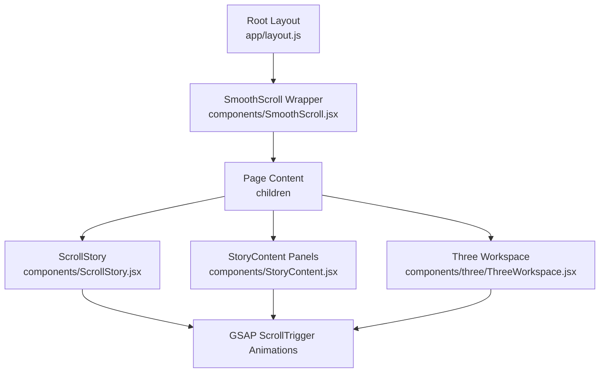
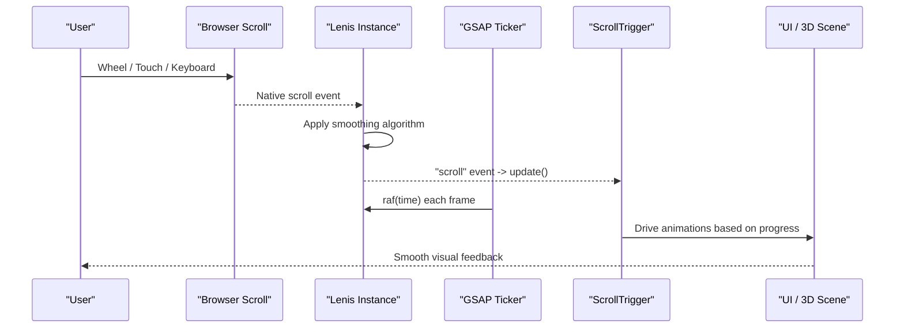
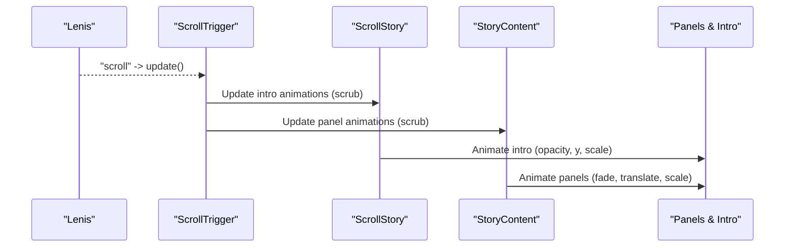
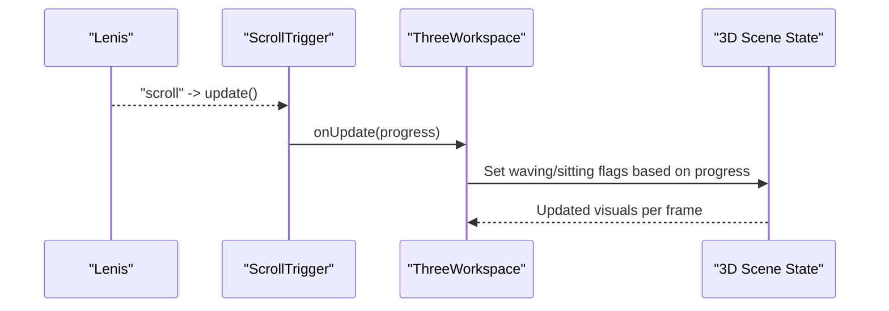
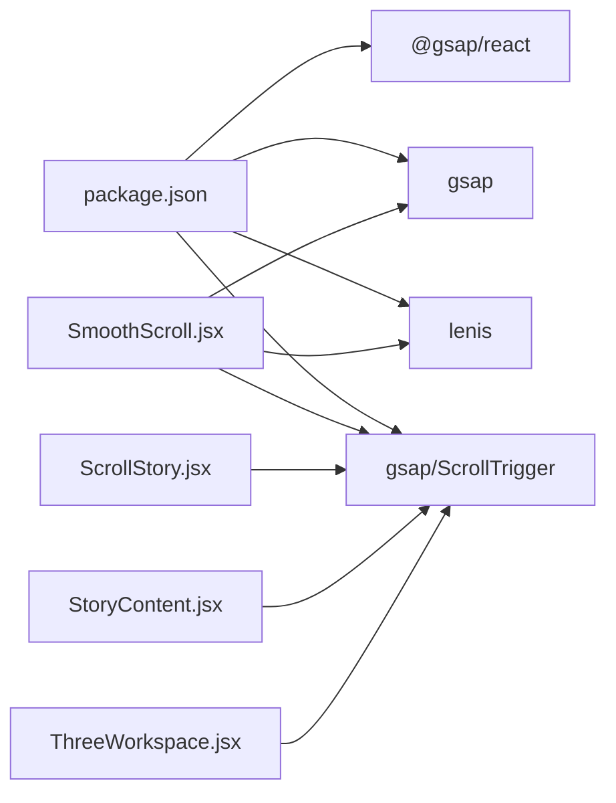

# SmoothScroll Implementation

<cite>
**Referenced Files in This Document**
- [SmoothScroll.jsx](file://components/SmoothScroll.jsx)
- [layout.js](file://app/layout.js)
- [package.json](file://package.json)
- [ScrollStory.jsx](file://components/ScrollStory.jsx)
- [StoryContent.jsx](file://components/StoryContent.jsx)
- [ThreeWorkspace.jsx](file://components/three/ThreeWorkspace.jsx)
- [globals.css](file://app/globals.css)
</cite>

## Table of Contents
1. [Introduction](#introduction)
2. [Project Structure](#project-structure)
3. [Core Components](#core-components)
4. [Architecture Overview](#architecture-overview)
5. [Detailed Component Analysis](#detailed-component-analysis)
6. [Dependency Analysis](#dependency-analysis)
7. [Performance Considerations](#performance-considerations)
8. [Troubleshooting Guide](#troubleshooting-guide)
9. [Conclusion](#conclusion)

## Introduction
This document explains the smooth scrolling implementation that enhances user experience by intercepting native scroll events, applying a smooth algorithm via Lenis, and synchronizing with GSAP ScrollTrigger for animations. It covers configuration options (duration, easing, touch sensitivity), performance optimizations, mobile considerations, and compatibility with GSAP-based scroll-driven animations throughout the portfolio.

## Project Structure
The smooth scrolling is enabled at the application root and used across components that rely on GSAP ScrollTrigger for scroll-linked animations.

**Diagram sources**
- [layout.js:40-54](file://app/layout.js#L40-L54)
- [SmoothScroll.jsx:10-46](file://components/SmoothScroll.jsx#L10-L46)
- [ScrollStory.jsx:13-34](file://components/ScrollStory.jsx#L13-L34)
- [StoryContent.jsx:26-75](file://components/StoryContent.jsx#L26-L75)
- [ThreeWorkspace.jsx:110-124](file://components/three/ThreeWorkspace.jsx#L110-L124)

**Section sources**
- [layout.js:40-54](file://app/layout.js#L40-L54)
- [SmoothScroll.jsx:10-46](file://components/SmoothScroll.jsx#L10-L46)

## Core Components
- SmoothScroll wrapper initializes Lenis, configures smoothing behavior, integrates with GSAP’s ticker, and updates ScrollTrigger on every scroll event.
- ScrollStory and StoryContent use GSAP ScrollTrigger to animate content based on scroll position; they rely on Lenis to provide a consistent, smooth scroll input.
- ThreeWorkspace uses ScrollTrigger to drive scene state changes as the user scrolls.

Key responsibilities:
- Intercept and smooth native scroll using Lenis
- Synchronize GSAP ScrollTrigger with Lenis scroll events
- Respect reduced motion preferences
- Provide mobile-friendly touch behavior

**Section sources**
- [SmoothScroll.jsx:10-46](file://components/SmoothScroll.jsx#L10-L46)
- [ScrollStory.jsx:13-34](file://components/ScrollStory.jsx#L13-L34)
- [StoryContent.jsx:26-75](file://components/StoryContent.jsx#L26-L75)
- [ThreeWorkspace.jsx:110-124](file://components/three/ThreeWorkspace.jsx#L110-L124)

## Architecture Overview
The system composes three layers:
- Input layer: Browser scroll events are intercepted by Lenis and smoothed.
- Sync layer: Lenis emits scroll events that update GSAP ScrollTrigger so animations stay in sync with the smoothed scroll.
- Animation layer: GSAP ScrollTrigger drives UI and 3D scene transitions.

**Diagram sources**
- [SmoothScroll.jsx:20-37](file://components/SmoothScroll.jsx#L20-L37)
- [ScrollStory.jsx:17-34](file://components/ScrollStory.jsx#L17-L34)
- [StoryContent.jsx:30-75](file://components/StoryContent.jsx#L30-L75)
- [ThreeWorkspace.jsx:110-124](file://components/three/ThreeWorkspace.jsx#L110-L124)

## Detailed Component Analysis

### SmoothScroll Component
Responsibilities:
- Initialize Lenis with duration, easing, orientation, wheel smoothing, and touch multiplier.
- Respect prefers-reduced-motion to adjust animation duration.
- Subscribe to Lenis “scroll” events to call ScrollTrigger.update.
- Integrate with GSAP’s ticker to drive Lenis’ requestAnimationFrame loop.
- Clean up on unmount to prevent memory leaks.

Configuration highlights:
- Duration: shorter when reduced motion is preferred.
- Easing: exponential ease-out curve for natural deceleration.
- Orientation: vertical-only scrolling.
- smoothWheel: true for smoother mousewheel input.
- touchMultiplier: increased for more responsive touch gestures.

Integration notes:
- ScrollTrigger.update is called on every Lenis scroll event to keep triggers accurate.
- gsap.ticker.lagSmoothing(0) ensures precise timing for animations.
- Cleanup removes Lenis instance and ticker listener.

**Diagram sources**
- [SmoothScroll.jsx:13-43](file://components/SmoothScroll.jsx#L13-L43)

**Section sources**
- [SmoothScroll.jsx:10-46](file://components/SmoothScroll.jsx#L10-L46)

### ScrollStory and StoryContent Integration
Both components register GSAP ScrollTrigger instances tied to a shared story container. They animate panels and overlays based on scroll progress, relying on Lenis to deliver smooth, consistent scroll values.

- ScrollStory animates intro elements with scrubbed transitions.
- StoryContent defines panel visibility windows and animates opacity, translation, and scale as users scroll through sections.

**Diagram sources**
- [ScrollStory.jsx:17-34](file://components/ScrollStory.jsx#L17-L34)
- [StoryContent.jsx:30-75](file://components/StoryContent.jsx#L30-L75)

**Section sources**
- [ScrollStory.jsx:13-34](file://components/ScrollStory.jsx#L13-L34)
- [StoryContent.jsx:26-75](file://components/StoryContent.jsx#L26-L75)

### ThreeWorkspace Integration
The 3D workspace listens to ScrollTrigger to update scene state (e.g., waving, sitting) and overall progress, ensuring the 3D narrative aligns with scroll position.

**Diagram sources**
- [ThreeWorkspace.jsx:110-124](file://components/three/ThreeWorkspace.jsx#L110-L124)

**Section sources**
- [ThreeWorkspace.jsx:110-124](file://components/three/ThreeWorkspace.jsx#L110-L124)

## Dependency Analysis
External dependencies relevant to smooth scrolling:
- Lenis: Provides smooth scrolling engine and events.
- GSAP + ScrollTrigger: Powers scroll-driven animations and synchronization.
- @gsap/react: Hook utilities for GSAP in React.

These are declared in the project dependencies and imported where needed.

**Diagram sources**
- [package.json:11-21](file://package.json#L11-L21)
- [SmoothScroll.jsx:3-8](file://components/SmoothScroll.jsx#L3-L8)
- [ScrollStory.jsx:4-6](file://components/ScrollStory.jsx#L4-L6)
- [StoryContent.jsx:4-6](file://components/StoryContent.jsx#L4-L6)
- [ThreeWorkspace.jsx:110-124](file://components/three/ThreeWorkspace.jsx#L110-L124)

**Section sources**
- [package.json:11-21](file://package.json#L11-L21)
- [SmoothScroll.jsx:3-8](file://components/SmoothScroll.jsx#L3-L8)

## Performance Considerations
- Reduced Motion Support: Automatically shortens duration when the user prefers reduced motion, improving accessibility and perceived performance.
- Ticker Integration: Using GSAP’s ticker to drive Lenis ensures frame-aligned updates and avoids jank from separate loops.
- Lag Smoothing: Disabling GSAP lag smoothing ensures animations remain tightly coupled to scroll position.
- Event Efficiency: Only one ScrollTrigger.update call per Lenis scroll event keeps overhead minimal.
- Mobile Touch: Increased touchMultiplier improves responsiveness on touch devices without over-sensitivity.
- CSS Overflow: Ensure containers do not introduce conflicting overflow behaviors that could interfere with Lenis’ virtualized scroll.

[No sources needed since this section provides general guidance]

## Troubleshooting Guide
Common issues and resolutions:

- Animations not updating while scrolling
  - Ensure Lenis is initialized before ScrollTrigger animations run.
  - Verify ScrollTrigger.update is subscribed to Lenis “scroll”.
  - Confirm GSAP ticker includes Lenis.raf and lag smoothing is disabled.

- Jitter or stutter during fast scrolls
  - Check for heavy layout thrashing in scroll callbacks.
  - Reduce complexity of animated elements or defer non-critical work off the main thread.
  - Validate that no other libraries override window scroll behavior.

- Inconsistent behavior on mobile
  - Adjust touchMultiplier if gestures feel too fast or sluggish.
  - Test on multiple devices; some browsers have quirks with overscroll or momentum.

- Accessibility concerns
  - Honor prefers-reduced-motion to reduce animation intensity.
  - Ensure keyboard navigation remains functional alongside smooth scrolling.

- Conflicts with third-party scroll libraries
  - Avoid running multiple smooth-scroll implementations simultaneously.
  - If integrating with other libraries, ensure they read from Lenis’ virtual scroll rather than native scroll.

- Build-time or hydration issues
  - Ensure Lenis initialization runs only in the browser (guarded by environment checks).
  - Keep client-side logic inside useEffect or hooks to avoid server mismatches.

**Section sources**
- [SmoothScroll.jsx:13-43](file://components/SmoothScroll.jsx#L13-L43)
- [ScrollStory.jsx:17-34](file://components/ScrollStory.jsx#L17-L34)
- [StoryContent.jsx:30-75](file://components/StoryContent.jsx#L30-L75)
- [ThreeWorkspace.jsx:110-124](file://components/three/ThreeWorkspace.jsx#L110-L124)

## Conclusion
The SmoothScroll implementation leverages Lenis to intercept and smooth native scroll events, then synchronizes GSAP ScrollTrigger to deliver fluid, scroll-driven animations across UI and 3D scenes. The setup respects accessibility preferences, optimizes performance via ticker integration, and provides mobile-friendly touch behavior. With careful configuration and attention to common pitfalls, it delivers a consistent and engaging scrolling experience across modern browsers.

[No sources needed since this section summarizes without analyzing specific files]