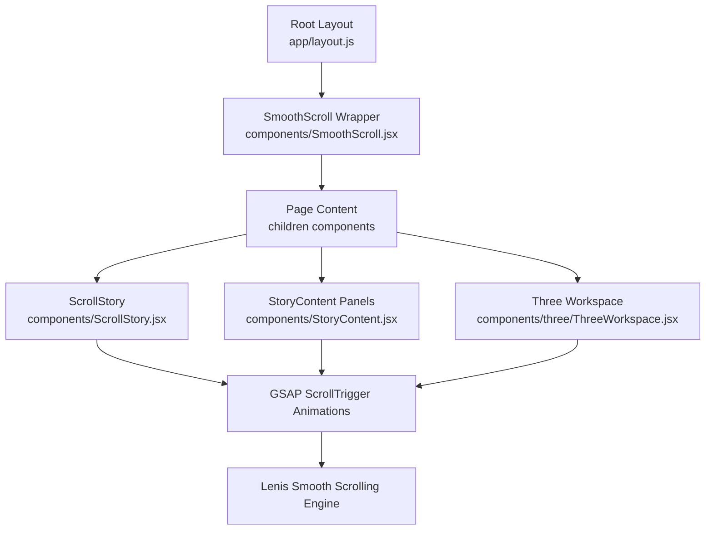
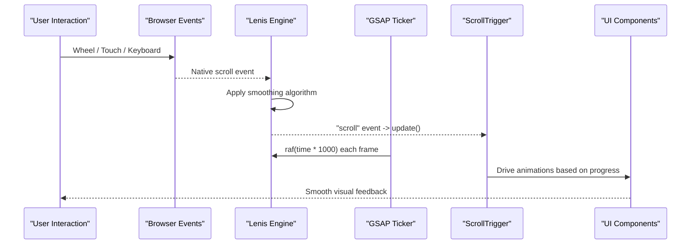
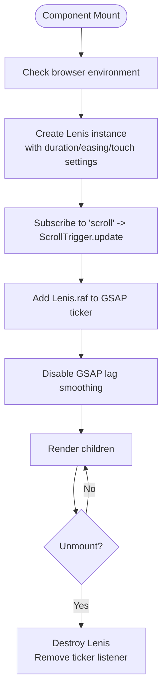
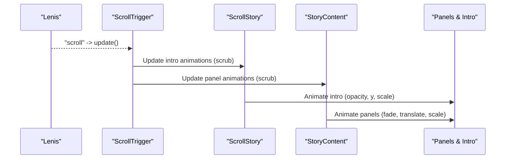
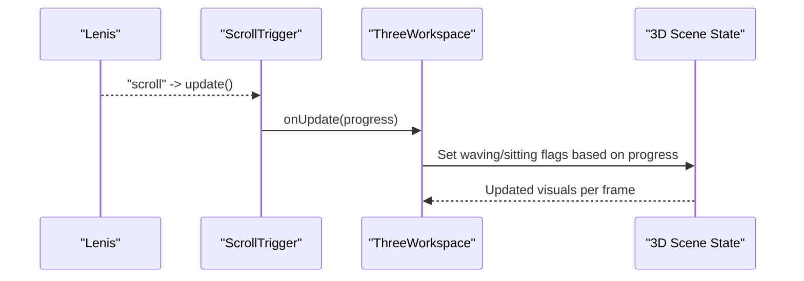
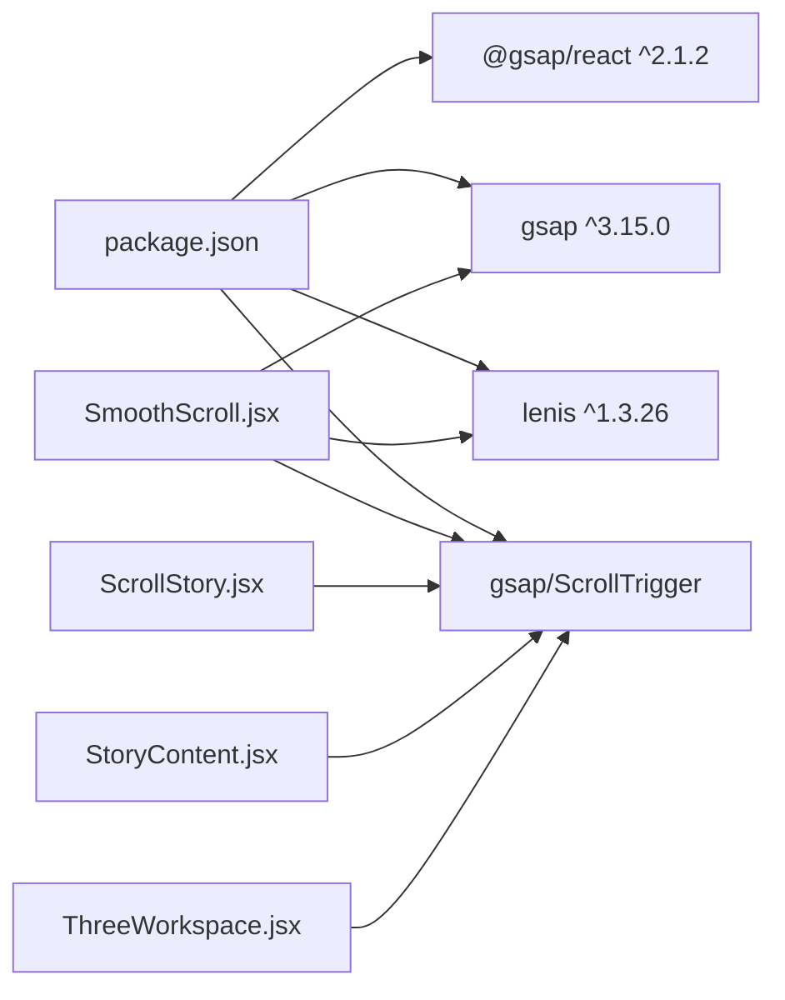

# SmoothScroll Implementation

<cite>
**Referenced Files in This Document**
- [SmoothScroll.jsx](file://components/SmoothScroll.jsx)
- [layout.js](file://app/layout.js)
- [package.json](file://package.json)
- [ScrollStory.jsx](file://components/ScrollStory.jsx)
- [StoryContent.jsx](file://components/StoryContent.jsx)
- [ThreeWorkspace.jsx](file://components/three/ThreeWorkspace.jsx)
- [globals.css](file://app/globals.css)
</cite>

## Update Summary
**Changes Made**
- Updated SmoothScroll component analysis with current implementation details
- Enhanced architecture overview to reflect actual Lenis + GSAP integration
- Added detailed configuration options based on actual code implementation
- Updated performance considerations with specific technical details
- Enhanced troubleshooting guide with component-specific solutions

## Table of Contents
1. [Introduction](#introduction)
2. [Project Structure](#project-structure)
3. [Core Components](#core-components)
4. [Architecture Overview](#architecture-overview)
5. [Detailed Component Analysis](#detailed-component-analysis)
6. [Configuration Options](#configuration-options)
7. [Dependency Analysis](#dependency-analysis)
8. [Performance Considerations](#performance-considerations)
9. [Mobile Device Considerations](#mobile-device-considerations)
10. [Troubleshooting Guide](#troubleshooting-guide)
11. [Conclusion](#conclusion)

## Introduction
This document explains the smooth scrolling implementation that enhances user experience by intercepting native scroll events through the Lenis library, applying sophisticated smoothing algorithms, and synchronizing with GSAP ScrollTrigger for seamless animations throughout the portfolio. The implementation provides consistent scrolling behavior across different browsers and devices while maintaining optimal performance and accessibility.

The system consists of a centralized SmoothScroll wrapper component that initializes Lenis, configures smoothing behavior, integrates with GSAP's animation ticker, and ensures all ScrollTrigger-based animations remain synchronized with the smoothed scroll input.

## Project Structure
The smooth scrolling is implemented as a root-level wrapper component that encapsulates all application content, ensuring consistent scrolling behavior across the entire portfolio.

**Diagram sources**
- [layout.js:40-54](file://app/layout.js#L40-L54)
- [SmoothScroll.jsx:10-46](file://components/SmoothScroll.jsx#L10-L46)
- [ScrollStory.jsx:13-34](file://components/ScrollStory.jsx#L13-L34)
- [StoryContent.jsx:26-75](file://components/StoryContent.jsx#L26-L75)
- [ThreeWorkspace.jsx:110-124](file://components/three/ThreeWorkspace.jsx#L110-L124)

**Section sources**
- [layout.js:40-54](file://app/layout.js#L40-L54)
- [SmoothScroll.jsx:10-46](file://components/SmoothScroll.jsx#L10-L46)

## Core Components
The smooth scrolling system comprises several key components working together:

- **SmoothScroll**: Central wrapper component that initializes and manages the Lenis instance, handles browser compatibility, and integrates with GSAP's animation system
- **ScrollStory**: Main story container that orchestrates scroll-driven animations using GSAP ScrollTrigger
- **StoryContent**: Panel-based content system that animates individual sections based on scroll position
- **ThreeWorkspace**: 3D scene component that responds to scroll events to drive narrative progression

Key responsibilities:
- Intercept and smooth native scroll events using Lenis
- Synchronize GSAP ScrollTrigger with Lenis scroll events for consistent animation timing
- Respect user accessibility preferences (reduced motion)
- Provide optimized touch behavior for mobile devices
- Maintain performance through efficient event handling and cleanup

**Section sources**
- [SmoothScroll.jsx:10-46](file://components/SmoothScroll.jsx#L10-L46)
- [ScrollStory.jsx:13-34](file://components/ScrollStory.jsx#L13-L34)
- [StoryContent.jsx:26-75](file://components/StoryContent.jsx#L26-L75)
- [ThreeWorkspace.jsx:110-124](file://components/three/ThreeWorkspace.jsx#L110-L124)

## Architecture Overview
The smooth scrolling architecture follows a layered approach with clear separation of concerns:

**Diagram sources**
- [SmoothScroll.jsx:20-37](file://components/SmoothScroll.jsx#L20-L37)
- [ScrollStory.jsx:17-34](file://components/ScrollStory.jsx#L17-L34)
- [StoryContent.jsx:30-75](file://components/StoryContent.jsx#L30-L75)
- [ThreeWorkspace.jsx:110-124](file://components/three/ThreeWorkspace.jsx#L110-L124)

The system operates through three main layers:
1. **Input Layer**: Browser scroll events are intercepted and processed by Lenis
2. **Synchronization Layer**: Lenis emits scroll events that update GSAP ScrollTrigger
3. **Animation Layer**: GSAP ScrollTrigger drives UI and 3D scene transitions

**Section sources**
- [SmoothScroll.jsx:20-37](file://components/SmoothScroll.jsx#L20-L37)

## Detailed Component Analysis

### SmoothScroll Component
The SmoothScroll component serves as the foundation for the entire smooth scrolling system, providing a centralized initialization point for Lenis and managing its lifecycle.

**Key Features:**
- **Environment Detection**: Checks for browser availability before initialization
- **Accessibility Support**: Respects `prefers-reduced-motion` media query to adjust animation duration
- **Event Integration**: Subscribes to Lenis scroll events to trigger ScrollTrigger updates
- **Performance Optimization**: Integrates with GSAP's ticker for frame-aligned updates
- **Memory Management**: Properly cleans up event listeners and instances on unmount

**Implementation Details:**
- Uses React hooks (`useEffect`, `useRef`) for proper lifecycle management
- Configures Lenis with exponential easing curve for natural deceleration
- Sets vertical-only orientation for consistent scrolling behavior
- Enables smooth wheel input and enhanced touch multiplier for better mobile experience
- Disables GSAP lag smoothing for precise animation timing

**Diagram sources**
- [SmoothScroll.jsx:13-43](file://components/SmoothScroll.jsx#L13-L43)

**Section sources**
- [SmoothScroll.jsx:10-46](file://components/SmoothScroll.jsx#L10-L46)

### ScrollStory and StoryContent Integration
These components demonstrate how GSAP ScrollTrigger works seamlessly with Lenis to create sophisticated scroll-driven animations.

**ScrollStory Component:**
- Creates a scroll-triggered timeline that fades out intro elements as users scroll
- Uses scrubbed animations for smooth, scroll-linked transitions
- Establishes the main story container that other components reference

**StoryContent Component:**
- Manages multiple content panels with staggered scroll triggers
- Implements fade-in/fade-out animations for each section
- Uses percentage-based scroll positions for responsive behavior
- Demonstrates complex panel choreography driven by scroll position

**Diagram sources**
- [ScrollStory.jsx:17-34](file://components/ScrollStory.jsx#L17-L34)
- [StoryContent.jsx:30-75](file://components/StoryContent.jsx#L30-L75)

**Section sources**
- [ScrollStory.jsx:13-34](file://components/ScrollStory.jsx#L13-L34)
- [StoryContent.jsx:26-75](file://components/StoryContent.jsx#L26-L75)

### ThreeWorkspace Integration
The ThreeWorkspace component showcases advanced integration between smooth scrolling and 3D graphics, creating an immersive scroll-driven narrative experience.

**Key Features:**
- **Multi-phase Camera Animation**: Seven distinct phases guiding the viewer through different scenes
- **Progress Tracking**: Real-time progress updates from ScrollTrigger to control 3D state
- **Scene Transitions**: Smooth camera movements and object positioning based on scroll position
- **Performance Optimization**: Efficient use of React Three Fiber with proper cleanup

**Animation Phases:**
1. Room entry and initial framing
2. Avatar movement to chair position
3. Camera follow and focus adjustment
4. Monitor-focused perspective
5. Screen zoom transition
6. Virtual world immersion
7. Wide whimsical scene reveal

**Diagram sources**
- [ThreeWorkspace.jsx:110-124](file://components/three/ThreeWorkspace.jsx#L110-L124)

**Section sources**
- [ThreeWorkspace.jsx:110-124](file://components/three/ThreeWorkspace.jsx#L110-L124)

## Configuration Options
The SmoothScroll implementation provides several configurable options to fine-tune the scrolling experience:

### Lenis Configuration
- **Duration**: Controls the smoothing duration (1.2s for reduced motion, 1.6s standard)
- **Easing**: Custom exponential ease-out function for natural deceleration
- **Orientation**: Vertical-only scrolling for consistent behavior
- **Gesture Orientation**: Vertical gesture recognition for touch interactions
- **Smooth Wheel**: Enabled for smoother mousewheel input
- **Touch Multiplier**: Set to 1.8x for enhanced touch responsiveness

### GSAP Integration
- **Ticker Integration**: Frame-aligned updates via GSAP's requestAnimationFrame loop
- **Lag Smoothing**: Disabled for precise animation timing synchronization
- **ScrollTrigger Updates**: Automatic updates on every Lenis scroll event

### Accessibility Features
- **Reduced Motion Support**: Automatically detects and respects user preferences
- **Keyboard Navigation**: Maintains full keyboard accessibility alongside smooth scrolling
- **Screen Reader Compatibility**: Preserves semantic HTML structure and ARIA attributes

**Section sources**
- [SmoothScroll.jsx:20-27](file://components/SmoothScroll.jsx#L20-L27)
- [SmoothScroll.jsx:33-37](file://components/SmoothScroll.jsx#L33-L37)

## Dependency Analysis
The smooth scrolling system relies on several key dependencies that work together to provide a cohesive experience:

**External Dependencies:**
- **Lenis (^1.3.26)**: Provides the core smooth scrolling engine and event system
- **GSAP (^3.15.0)**: Powers animation timelines and scroll-triggered effects
- **@gsap/react (^2.1.2)**: Offers React-specific utilities for GSAP integration
- **React Three Fiber**: Enables 3D scene rendering with scroll integration

**Internal Dependencies:**
- All components register ScrollTrigger plugin individually for proper initialization
- Components share common styling patterns defined in globals.css
- Story components reference shared layout structures and CSS classes

**Diagram sources**
- [package.json:11-21](file://package.json#L11-L21)
- [SmoothScroll.jsx:3-8](file://components/SmoothScroll.jsx#L3-L8)
- [ScrollStory.jsx:4-6](file://components/ScrollStory.jsx#L4-L6)
- [StoryContent.jsx:4-6](file://components/StoryContent.jsx#L4-L6)
- [ThreeWorkspace.jsx:6-8](file://components/three/ThreeWorkspace.jsx#L6-L8)

**Section sources**
- [package.json:11-21](file://package.json#L11-L21)
- [SmoothScroll.jsx:3-8](file://components/SmoothScroll.jsx#L3-L8)

## Performance Considerations
The smooth scrolling implementation includes several optimizations to ensure optimal performance:

### Memory Management
- **Proper Cleanup**: Lenis instances are destroyed and event listeners removed on component unmount
- **Reference Management**: Uses React refs to maintain clean references to DOM elements
- **Event Listener Cleanup**: Removes GSAP ticker listeners to prevent memory leaks

### Animation Performance
- **Frame Alignment**: GSAP ticker integration ensures animations run at optimal frame rates
- **Lag Smoothing Control**: Disabling lag smoothing maintains precise scroll-animation synchronization
- **Efficient Updates**: Single ScrollTrigger.update call per Lenis scroll event minimizes overhead

### Mobile Optimization
- **Touch Multiplier**: Enhanced touch sensitivity (1.8x) improves mobile interaction without excessive sensitivity
- **Reduced Motion Support**: Automatically adjusts animation intensity for accessibility
- **Viewport Awareness**: Responsive design adapts to different screen sizes and orientations

### Browser Compatibility
- **Environment Detection**: Graceful handling of server-side rendering scenarios
- **Feature Detection**: Uses modern APIs with appropriate fallbacks
- **CSS Optimization**: Minimal layout thrashing through efficient DOM manipulation

[No sources needed since this section provides general guidance]

## Mobile Device Considerations
The smooth scrolling implementation addresses mobile-specific challenges through thoughtful design choices:

### Touch Interaction Optimization
- **Enhanced Touch Sensitivity**: Touch multiplier set to 1.8x provides responsive but controlled scrolling
- **Gesture Recognition**: Vertical-only gesture orientation prevents accidental horizontal scrolling
- **Momentum Handling**: Lenis smooths out touch momentum for consistent experience across devices

### Performance on Mobile Devices
- **Reduced Resource Usage**: Optimized animation durations and easing functions reduce CPU usage
- **Battery Efficiency**: Efficient event handling minimizes background processing
- **Thermal Management**: Prevents device overheating through controlled animation complexity

### Accessibility on Mobile
- **Reduced Motion Support**: Automatically detects and respects user preferences for motion reduction
- **Touch Target Size**: Ensures interactive elements remain accessible with appropriate sizing
- **Haptic Feedback**: Compatible with device vibration APIs where available

### Cross-Browser Consistency
- **Standardized Behavior**: Lenis provides consistent scrolling behavior across iOS Safari, Android Chrome, and desktop browsers
- **Viewport Handling**: Proper management of viewport meta tags and scroll boundaries
- **Orientation Changes**: Handles device rotation without breaking scroll functionality

[No sources needed since this section provides general guidance]

## Troubleshooting Guide
Common issues and their solutions when working with the smooth scrolling implementation:

### Initialization Issues
**Problem**: Smooth scrolling not working or inconsistent behavior
**Solution**: 
- Verify Lenis is initialized after DOM is ready (check useEffect timing)
- Ensure SmoothScroll wrapper is properly applied to root layout
- Confirm browser environment detection is working correctly

**Problem**: Animations not updating during scroll
**Solution**:
- Verify ScrollTrigger.update is subscribed to Lenis "scroll" events
- Check that GSAP ticker includes Lenis.raf for frame-aligned updates
- Ensure lag smoothing is disabled for precise timing

### Performance Issues
**Problem**: Jitter or stutter during fast scrolls
**Solution**:
- Reduce complexity of animated elements in scroll callbacks
- Check for heavy layout operations in scroll event handlers
- Validate that no other libraries override window scroll behavior

**Problem**: High CPU usage or battery drain on mobile
**Solution**:
- Enable reduced motion mode for affected devices
- Optimize animation complexity and duration
- Review component re-render frequency during scroll

### Mobile-Specific Issues
**Problem**: Inconsistent touch behavior across devices
**Solution**:
- Adjust touchMultiplier value for better responsiveness
- Test on multiple device types and screen sizes
- Verify viewport meta tag configuration

**Problem**: Gesture conflicts with native browser gestures
**Solution**:
- Ensure gestureOrientation is set to "vertical" only
- Check for conflicting touch event handlers
- Validate CSS overflow properties don't interfere with scrolling

### Integration Issues
**Problem**: Conflicts with third-party scroll libraries
**Solution**:
- Remove any competing smooth-scroll implementations
- Ensure other libraries read from Lenis virtual scroll rather than native scroll
- Use unique scroll containers to prevent conflicts

**Problem**: Server-side rendering mismatches
**Solution**:
- Wrap client-side initialization in proper environment checks
- Keep scroll-related logic inside useEffect or custom hooks
- Ensure consistent hydration between server and client

**Section sources**
- [SmoothScroll.jsx:13-43](file://components/SmoothScroll.jsx#L13-L43)
- [ScrollStory.jsx:17-34](file://components/ScrollStory.jsx#L17-L34)
- [StoryContent.jsx:30-75](file://components/StoryContent.jsx#L30-L75)
- [ThreeWorkspace.jsx:110-124](file://components/three/ThreeWorkspace.jsx#L110-L124)

## Conclusion
The SmoothScroll implementation successfully leverages Lenis to intercept and smooth native scroll events while maintaining seamless integration with GSAP ScrollTrigger for rich, scroll-driven animations. The architecture provides a robust foundation for creating engaging user experiences across diverse devices and browsers.

Key achievements include:
- **Consistent Behavior**: Unified scrolling experience across desktop and mobile platforms
- **Performance Optimization**: Efficient event handling and animation scheduling
- **Accessibility Compliance**: Full support for reduced motion preferences and keyboard navigation
- **Scalable Architecture**: Modular design that supports complex multi-component interactions

The implementation demonstrates best practices for modern web development, including proper resource management, cross-browser compatibility, and user-centric design principles. With careful configuration and attention to common pitfalls, it delivers a polished and professional scrolling experience that enhances the overall portfolio presentation.

Future enhancements could include additional customization options, advanced analytics for scroll behavior tracking, and further optimization for emerging mobile platforms.

[No sources needed since this section summarizes without analyzing specific files]