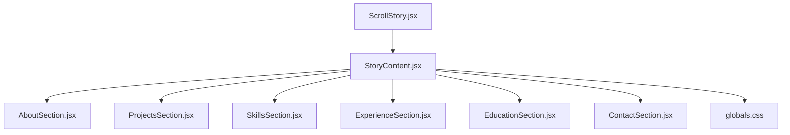
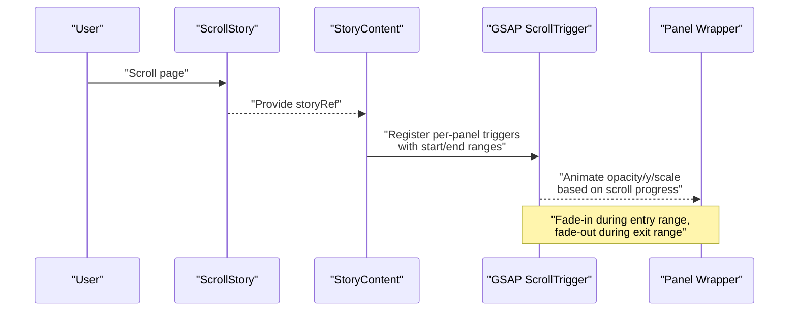
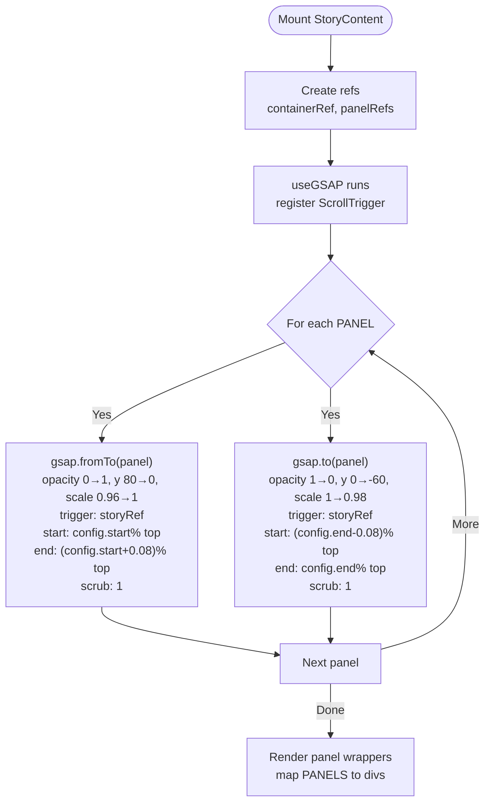
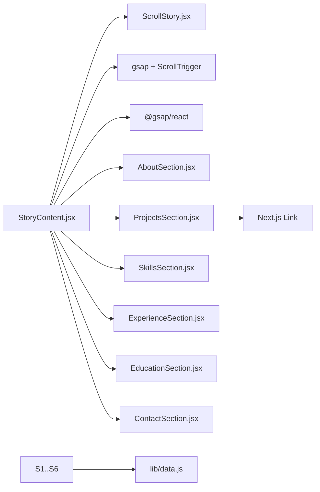

# StoryContent Component

<cite>
**Referenced Files in This Document**
- [StoryContent.jsx](file://components/StoryContent.jsx)
- [ScrollStory.jsx](file://components/ScrollStory.jsx)
- [AboutSection.jsx](file://components/sections/AboutSection.jsx)
- [ProjectsSection.jsx](file://components/sections/ProjectsSection.jsx)
- [SkillsSection.jsx](file://components/sections/SkillsSection.jsx)
- [ExperienceSection.jsx](file://components/sections/ExperienceSection.jsx)
- [EducationSection.jsx](file://components/sections/EducationSection.jsx)
- [ContactSection.jsx](file://components/sections/ContactSection.jsx)
- [globals.css](file://app/globals.css)
</cite>

## Table of Contents
1. Introduction
2. Project Structure
3. Core Components
4. Architecture Overview
5. Detailed Component Analysis
6. Dependency Analysis
7. Performance Considerations
8. Troubleshooting Guide
9. Conclusion

## Introduction
This document explains the StoryContent component that manages the panel display system for portfolio sections. It covers how panels are rendered, how scroll-triggered animations control visibility and transitions, and how state is managed through GSAP ScrollTrigger rather than React state. It also documents the PANELS array structure, integration of individual section components, fade-in/out animation behavior, positioning logic, responsive styling, props interface (notably storyRef), and how to add new content sections to the narrative.

## Project Structure
The StoryContent component sits within a scroll-driven story orchestrated by ScrollStory. Panels are stacked absolutely and animated based on scroll progress. Each panel is a dedicated section component under components/sections. Styling is centralized in globals.css with responsive rules.

**Diagram sources**
- [ScrollStory.jsx:13-66](file://components/ScrollStory.jsx#L13-L66)
- [StoryContent.jsx:17-89](file://components/StoryContent.jsx#L17-L89)
- [AboutSection.jsx:5-29](file://components/sections/AboutSection.jsx#L5-L29)
- [ProjectsSection.jsx:6-42](file://components/sections/ProjectsSection.jsx#L6-L42)
- [SkillsSection.jsx:5-41](file://components/sections/SkillsSection.jsx#L5-L41)
- [ExperienceSection.jsx:5-35](file://components/sections/ExperienceSection.jsx#L5-L35)
- [EducationSection.jsx:5-41](file://components/sections/EducationSection.jsx#L5-L41)
- [ContactSection.jsx:5-59](file://components/sections/ContactSection.jsx#L5-L59)
- [globals.css:2030-2229](file://app/globals.css#L2030-L2229)

**Section sources**
- [ScrollStory.jsx:13-66](file://components/ScrollStory.jsx#L13-L66)
- [StoryContent.jsx:17-89](file://components/StoryContent.jsx#L17-L89)
- [globals.css:2030-2229](file://app/globals.css#L2030-L2229)

## Core Components
- StoryContent: Renders all panels, registers GSAP ScrollTrigger animations bound to scroll progress via storyRef, and provides refs for each panel wrapper.
- Section components: About, Projects, Skills, Experience, Education, Contact — each renders its own panel UI and reads data from lib/data.js.
- ScrollStory: Owns the scroll container ref and passes it down to StoryContent; also animates the intro text.

Key responsibilities:
- Panel rendering: Maps over PANELS to render each section inside an absolutely positioned wrapper.
- Animation orchestration: For each panel, creates a fade-in (from) and fade-out (to) tween driven by ScrollTrigger ranges tied to start/end values.
- State management: Uses GSAP’s internal state via ScrollTrigger scrubbing; no React state is used for active panel tracking.

**Section sources**
- [StoryContent.jsx:17-89](file://components/StoryContent.jsx#L17-L89)
- [ScrollStory.jsx:13-66](file://components/ScrollStory.jsx#L13-L66)

## Architecture Overview
The scroll story uses a single scrollable container. As the user scrolls, GSAP evaluates the trigger positions relative to the container and animates each panel’s opacity, vertical translation, and scale. Panels overlap due to absolute positioning and are layered via CSS z-index. The storyRef ensures triggers are scoped to the correct scroll context.

**Diagram sources**
- [ScrollStory.jsx:13-66](file://components/ScrollStory.jsx#L13-L66)
- [StoryContent.jsx:30-75](file://components/StoryContent.jsx#L30-L75)

## Detailed Component Analysis

### StoryContent: Panel Rendering and Animation Logic
- PANELS array: Defines ordered sections with id, Component reference, and numeric start/end thresholds (0–1). These values define when each panel becomes visible and when it fades out relative to the scroll container.
- Refs:
  - containerRef scopes GSAP animations to this element.
  - panelRefs stores DOM nodes for each panel wrapper to animate them directly.
- useGSAP lifecycle:
  - Registers ScrollTrigger once.
  - For each panel:
    - Fade-in tween: from opacity 0, y: 80, scale: 0.96 to fully visible at the configured start range.
    - Fade-out tween: to opacity 0, y: -60, scale: 0.98 at the configured end range.
  - Both tweens use scrub: 1 for smooth, scroll-linked animation.
- Positioning:
  - Each panel wrapper is absolutely positioned to fill the container and centered via flexbox.
  - The layer is above other layers via z-index so panels overlay the 3D scene.

Props interface:
- storyRef: Required ref to the scroll container provided by ScrollStory. Used as the trigger element for ScrollTrigger so animations are bound to the correct scroll context.

Adding a new section:
1. Create a new section component under components/sections.
2. Add an entry to PANELS with:
   - id: unique string
   - Component: your new section component
   - start: number between 0 and 1 where the panel begins to appear
   - end: number after start where the panel finishes fading out
3. Ensure the new start/end values do not conflict with adjacent panels’ ranges.

**Diagram sources**
- [StoryContent.jsx:17-89](file://components/StoryContent.jsx#L17-L89)

**Section sources**
- [StoryContent.jsx:17-89](file://components/StoryContent.jsx#L17-L89)

### ScrollStory: Scroll Context and Intro Animation
- Creates storyRef and passes it to StoryContent so ScrollTrigger can bind to the correct scroll container.
- Animates the intro text using the same storyRef as the trigger, ensuring consistent scroll-based choreography across the story.

**Section sources**
- [ScrollStory.jsx:13-66](file://components/ScrollStory.jsx#L13-L66)

### Section Components: Content and Data Integration
Each section component renders a styled panel and consumes data from lib/data.js. They follow a consistent structure:
- Label, title, body text
- Domain-specific content (projects grid, skills garden, experience timeline, education cards, contact actions)
- No props or state; purely presentational

Examples:
- AboutSection: Displays profile.about and role tags.
- ProjectsSection: Renders project cards linking to /project/[slug].
- SkillsSection: Visualizes technical and soft skills.
- ExperienceSection: Shows recent roles with highlights.
- EducationSection: Lists degrees and certifications.
- ContactSection: Provides email, LinkedIn, GitHub, and resume links.

**Section sources**
- [AboutSection.jsx:5-29](file://components/sections/AboutSection.jsx#L5-L29)
- [ProjectsSection.jsx:6-42](file://components/sections/ProjectsSection.jsx#L6-L42)
- [SkillsSection.jsx:5-41](file://components/sections/SkillsSection.jsx#L5-L41)
- [ExperienceSection.jsx:5-35](file://components/sections/ExperienceSection.jsx#L5-L35)
- [EducationSection.jsx:5-41](file://components/sections/EducationSection.jsx#L5-L41)
- [ContactSection.jsx:5-59](file://components/sections/ContactSection.jsx#L5-L59)

### Styling and Responsive Behavior
- Layering and stacking:
  - .story-content-layer overlays the 3D scene with pointer-events disabled so interactions pass through to underlying elements.
  - .story-panel-wrapper centers content and remains invisible until animated by GSAP.
- Panel appearance:
  - .story-panel uses glassmorphism-like background with backdrop blur, rounded corners, and subtle borders/shadows.
  - Typography scales responsively using clamp() for fluid sizing.
- Interactivity:
  - Inner children of .story-panel-wrapper have pointer-events auto to allow interactive elements (links, buttons) to be clickable even though the wrapper is non-interactive.
- Responsive breakpoints:
  - Adjustments for smaller screens reduce padding, font sizes, and switch grids to single-column layouts for better readability.

**Section sources**
- [globals.css:2030-2229](file://app/globals.css#L2030-L2229)
- [globals.css:2940-3007](file://app/globals.css#L2940-L3007)

## Dependency Analysis
- StoryContent depends on:
  - GSAP and ScrollTrigger for animation and scroll binding
  - @gsap/react hook for declarative setup
  - Individual section components for content
  - storyRef from ScrollStory for trigger scoping
- ScrollStory depends on:
  - ThreeWorkspace and StoryContent
  - GSAP and ScrollTrigger for intro animation
- Sections depend on:
  - lib/data.js for content
  - Next.js Link for navigation in ProjectsSection

**Diagram sources**
- [StoryContent.jsx:1-15](file://components/StoryContent.jsx#L1-L15)
- [ScrollStory.jsx:1-11](file://components/ScrollStory.jsx#L1-L11)
- [ProjectsSection.jsx:1-5](file://components/sections/ProjectsSection.jsx#L1-L5)
- [AboutSection.jsx:1-4](file://components/sections/AboutSection.jsx#L1-L4)
- [SkillsSection.jsx:1-3](file://components/sections/SkillsSection.jsx#L1-L3)
- [ExperienceSection.jsx:1-3](file://components/sections/ExperienceSection.jsx#L1-L3)
- [EducationSection.jsx:1-3](file://components/sections/EducationSection.jsx#L1-L3)
- [ContactSection.jsx:1-3](file://components/sections/ContactSection.jsx#L1-L3)

**Section sources**
- [StoryContent.jsx:1-15](file://components/StoryContent.jsx#L1-L15)
- [ScrollStory.jsx:1-11](file://components/ScrollStory.jsx#L1-L11)
- [ProjectsSection.jsx:1-5](file://components/sections/ProjectsSection.jsx#L1-L5)

## Performance Considerations
- Use of scrub: 1 ties animations directly to scroll position, avoiding heavy timers and keeping motion smooth.
- Minimal re-renders: Panels are static components without local state; animations are handled by GSAP outside React’s render cycle.
- Pointer events strategy: Disabling pointer events on the overlay layer prevents unnecessary event handling overhead while allowing inner interactive elements to remain functional.
- Responsive typography and layout: clamp() and flexible grids reduce layout thrashing across screen sizes.

[No sources needed since this section provides general guidance]

## Troubleshooting Guide
Common issues and resolutions:
- Panels do not animate:
  - Ensure storyRef is passed correctly from ScrollStory to StoryContent and points to the scroll container.
  - Verify that gsap.registerPlugin(ScrollTrigger) is called before creating tweens.
- Animations not linked to scroll:
  - Confirm that trigger is set to storyRef.current and start/end strings use percentage top offsets derived from PANELS configuration.
- Overlapping panels interfere with clicks:
  - Check that .story-panel-wrapper has pointer-events: none and child elements have pointer-events: auto.
- Unexpected panel order or timing:
  - Review PANELS array ordering and ensure start/end values are monotonic and non-overlapping beyond intended transitions.
- Responsiveness issues:
  - Inspect media queries in globals.css for panel padding, font sizes, and grid adjustments.

**Section sources**
- [StoryContent.jsx:15-75](file://components/StoryContent.jsx#L15-L75)
- [globals.css:2030-2058](file://app/globals.css#L2030-L2058)
- [globals.css:2940-3007](file://app/globals.css#L2940-L3007)

## Conclusion
StoryContent orchestrates a scroll-driven narrative by mapping a structured PANELS array to section components and driving their visibility with GSAP ScrollTrigger. Panels fade in and out based on precise scroll ranges, while absolute positioning and z-index create a layered overlay atop the 3D scene. The component relies on a simple props interface (storyRef) and leverages CSS for responsive, accessible panel presentation. Adding new sections is straightforward: create a section component and register it in PANELS with appropriate start/end thresholds.

[No sources needed since this section summarizes without analyzing specific files]