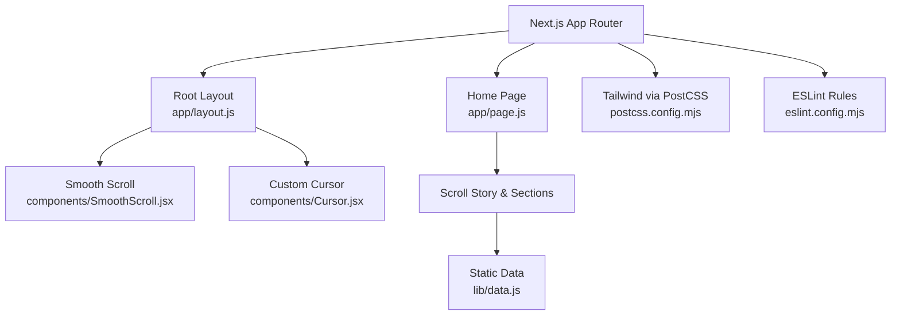
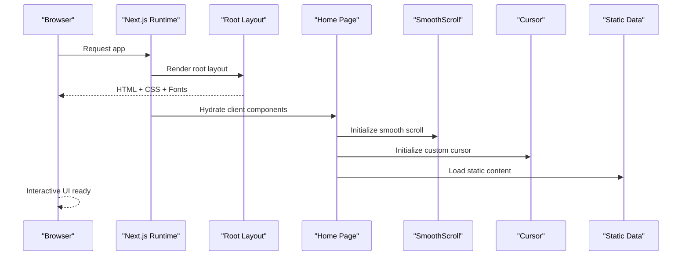
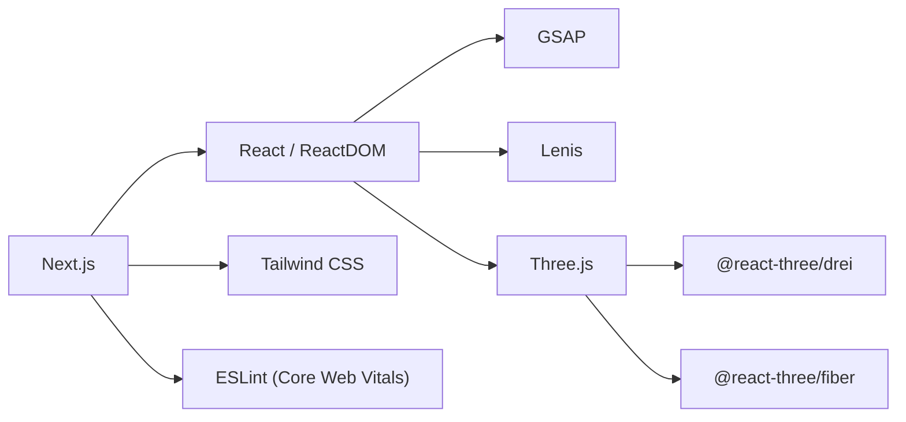

# Deployment Guide

<cite>
**Referenced Files in This Document**
- [package.json](file://package.json)
- [next.config.mjs](file://next.config.mjs)
- [postcss.config.mjs](file://postcss.config.mjs)
- [app/layout.js](file://app/layout.js)
- [app/page.js](file://app/page.js)
- [components/SmoothScroll.jsx](file://components/SmoothScroll.jsx)
- [components/Cursor.jsx](file://components/Cursor.jsx)
- [lib/data.js](file://lib/data.js)
- [eslint.config.mjs](file://eslint.config.mjs)
- [jsconfig.json](file://jsconfig.json)
- [.gitignore](file://.gitignore)
- [README.md](file://README.md)
</cite>

## Table of Contents
1. [Introduction](#introduction)
2. [Project Structure](#project-structure)
3. [Core Components](#core-components)
4. [Architecture Overview](#architecture-overview)
5. [Detailed Component Analysis](#detailed-component-analysis)
6. [Dependency Analysis](#dependency-analysis)
7. [Performance Considerations](#performance-considerations)
8. [Troubleshooting Guide](#troubleshooting-guide)
9. [Conclusion](#conclusion)
10. [Appendices](#appendices)

## Introduction
This guide provides deployment instructions for the Emaan Portfolio application, a Next.js-based portfolio with interactive 3D elements and smooth scrolling. It covers build configuration using Next.js, environment variable setup, production optimization settings, and step-by-step deployment to popular hosting platforms (Vercel, Netlify, and traditional servers). It also includes CI/CD pipeline setup, domain configuration, SSL certificate management, monitoring setup, performance considerations, caching strategies, and scaling guidance for high-traffic scenarios.

## Project Structure
The project is a modern Next.js App Router application with client-side interactivity and 3D rendering components. Key aspects:
- Build system: Next.js with Tailwind CSS via PostCSS
- Client components: Smooth scrolling and custom cursor
- Data: Static data module for profile, education, experience, projects, and skills
- Fonts: Optimized font loading via next/font
- Linting: ESLint configured with Next.js Core Web Vitals rules

**Diagram sources**
- [app/layout.js:1-55](file://app/layout.js#L1-L55)
- [app/page.js:1-60](file://app/page.js#L1-L60)
- [components/SmoothScroll.jsx:1-47](file://components/SmoothScroll.jsx#L1-L47)
- [components/Cursor.jsx:1-111](file://components/Cursor.jsx#L1-L111)
- [lib/data.js:1-181](file://lib/data.js#L1-L181)
- [postcss.config.mjs:1-8](file://postcss.config.mjs#L1-L8)
- [eslint.config.mjs:1-16](file://eslint.config.mjs#L1-L16)

**Section sources**
- [package.json:1-30](file://package.json#L1-L30)
- [next.config.mjs:1-7](file://next.config.mjs#L1-L7)
- [postcss.config.mjs:1-8](file://postcss.config.mjs#L1-L8)
- [app/layout.js:1-55](file://app/layout.js#L1-L55)
- [app/page.js:1-60](file://app/page.js#L1-L60)
- [components/SmoothScroll.jsx:1-47](file://components/SmoothScroll.jsx#L1-L47)
- [components/Cursor.jsx:1-111](file://components/Cursor.jsx#L1-L111)
- [lib/data.js:1-181](file://lib/data.js#L1-L181)
- [eslint.config.mjs:1-16](file://eslint.config.mjs#L1-L16)
- [jsconfig.json:1-7](file://jsconfig.json#L1-L7)
- [.gitignore:1-41](file://.gitignore#L1-L41)
- [README.md:1-37](file://README.md#L1-L37)

## Core Components
- Root layout sets up fonts, metadata, and global wrappers for smooth scrolling and cursor behavior.
- Home page implements a loading screen and renders the scroll-driven story.
- SmoothScroll integrates Lenis and GSAP ScrollTrigger for smooth animations.
- Custom Cursor adds pointer effects and respects touch devices.
- Static data module centralizes content used across sections.

These components are client-side only where needed and rely on Next.js runtime features for optimal delivery.

**Section sources**
- [app/layout.js:1-55](file://app/layout.js#L1-L55)
- [app/page.js:1-60](file://app/page.js#L1-L60)
- [components/SmoothScroll.jsx:1-47](file://components/SmoothScroll.jsx#L1-L47)
- [components/Cursor.jsx:1-111](file://components/Cursor.jsx#L1-L111)
- [lib/data.js:1-181](file://lib/data.js#L1-L181)

## Architecture Overview
The application follows Next.js App Router conventions:
- Server-rendered root layout defines global styles, fonts, and metadata.
- Client components handle user interactions and animations.
- Static data is imported from a local module, enabling fast initial load without network calls.
- Tailwind CSS is processed through PostCSS for efficient styling.

**Diagram sources**
- [app/layout.js:1-55](file://app/layout.js#L1-L55)
- [app/page.js:1-60](file://app/page.js#L1-L60)
- [components/SmoothScroll.jsx:1-47](file://components/SmoothScroll.jsx#L1-L47)
- [components/Cursor.jsx:1-111](file://components/Cursor.jsx#L1-L111)
- [lib/data.js:1-181](file://lib/data.js#L1-L181)

## Detailed Component Analysis

### Build Configuration and Optimization
- Next.js build scripts are defined in package.json for development, building, and starting the server.
- The Next.js config file is present and can be extended for production optimizations such as image handling, headers, redirects, and experimental features.
- Tailwind CSS is integrated via PostCSS; ensure your styles are included in the root stylesheet referenced by the layout.
- ESLint enforces Core Web Vitals best practices to maintain performance and accessibility.

Recommended production enhancements to add in the Next.js config:
- Configure image optimization and remote patterns if serving images from external CDNs.
- Set security and caching headers for static assets.
- Enable compression and HTTP/2 support at the platform level.
- Use incremental static regeneration or pre-rendering for pages that benefit from it.

**Section sources**
- [package.json:1-30](file://package.json#L1-L30)
- [next.config.mjs:1-7](file://next.config.mjs#L1-L7)
- [postcss.config.mjs:1-8](file://postcss.config.mjs#L1-L8)
- [eslint.config.mjs:1-16](file://eslint.config.mjs#L1-L16)

### Environment Variables Setup
- The repository ignores .env files by default to avoid committing secrets.
- For Next.js, use environment variables prefixed appropriately per your target platform:
  - Vercel: set variables in the dashboard or via CLI; they are available at runtime.
  - Netlify: configure site environment variables in the dashboard.
  - Traditional servers: define variables in the process environment before starting the server.
- If you need API keys or service endpoints, add them to your hosting platform’s environment settings and reference them in your code using standard Next.js environment variable access patterns.

**Section sources**
- [.gitignore:1-41](file://.gitignore#L1-L41)

### Production Optimization Settings
- Fonts: The layout uses next/font to optimize font loading and reduce layout shifts.
- Client components: Smooth scrolling and cursor are client-only and initialize safely on the browser.
- Static data: All content is loaded from a local module, minimizing network requests and improving Time to First Byte.
- Linting: ESLint with Core Web Vitals rules helps catch performance regressions early.

Consider adding:
- Image optimization and lazy loading for any media assets.
- Code splitting and dynamic imports for heavy libraries if not already handled by Next.js.
- Cache-control headers for long-lived static assets.

**Section sources**
- [app/layout.js:1-55](file://app/layout.js#L1-L55)
- [components/SmoothScroll.jsx:1-47](file://components/SmoothScroll.jsx#L1-L47)
- [components/Cursor.jsx:1-111](file://components/Cursor.jsx#L1-L111)
- [lib/data.js:1-181](file://lib/data.js#L1-L181)
- [eslint.config.mjs:1-16](file://eslint.config.mjs#L1-L16)

## Dependency Analysis
The application depends on:
- Next.js runtime and framework features
- React and ReactDOM for UI
- Three.js ecosystem for 3D rendering
- GSAP and Lenis for animations and smooth scrolling
- Tailwind CSS for styling
- ESLint for code quality and performance checks

**Diagram sources**
- [package.json:11-28](file://package.json#L11-L28)
- [eslint.config.mjs:1-16](file://eslint.config.mjs#L1-L16)

**Section sources**
- [package.json:1-30](file://package.json#L1-L30)
- [eslint.config.mjs:1-16](file://eslint.config.mjs#L1-L16)

## Performance Considerations
- Font optimization: next/font reduces layout shift and improves perceived performance.
- Client-side animations: Ensure animations respect reduced motion preferences and run efficiently on mobile.
- Static data: Keeping content in a local module avoids unnecessary network overhead.
- Asset size: Monitor bundle size; consider lazy-loading heavy components or libraries when appropriate.
- Caching: Configure cache headers for static assets to improve repeat visits.
- Monitoring: Track Core Web Vitals to identify bottlenecks and measure improvements.

[No sources needed since this section provides general guidance]

## Troubleshooting Guide
Common issues and resolutions:
- Missing environment variables: Verify variables are set in your hosting platform’s environment settings and restart deployments.
- Build failures due to missing dependencies: Ensure all dependencies are installed and versions are compatible with Next.js.
- Styling not applied: Confirm Tailwind is configured via PostCSS and styles are included in the root stylesheet.
- Animations not working on mobile: Check for reduced motion preferences and touch device detection logic.
- ESLint warnings affecting builds: Address lint errors to maintain code quality and prevent build-time failures.

**Section sources**
- [postcss.config.mjs:1-8](file://postcss.config.mjs#L1-L8)
- [components/SmoothScroll.jsx:1-47](file://components/SmoothScroll.jsx#L1-L47)
- [components/Cursor.jsx:1-111](file://components/Cursor.jsx#L1-L111)
- [eslint.config.mjs:1-16](file://eslint.config.mjs#L1-L16)

## Conclusion
The Emaan Portfolio is a well-structured Next.js application optimized for performance and user experience. With proper environment configuration, production optimizations, and platform-specific deployment steps, it can be reliably deployed to Vercel, Netlify, or traditional servers. Implementing CI/CD, domain configuration, SSL, and monitoring ensures a robust, secure, and scalable production environment.

[No sources needed since this section summarizes without analyzing specific files]

## Appendices

### Step-by-Step Deployment Instructions

#### Vercel
- Connect your repository to Vercel and select the Next.js framework.
- Configure environment variables in the Vercel dashboard under project settings.
- Deploy; Vercel will automatically detect Next.js and build the app.
- Add a custom domain and enable automatic HTTPS via Vercel’s built-in SSL.
- Monitor performance using Vercel Analytics and integrate error tracking if needed.

[No sources needed since this section provides general guidance]

#### Netlify
- Connect your repository to Netlify and choose Next.js as the framework.
- Set environment variables in the Netlify dashboard under site settings.
- Deploy; Netlify will build and serve the app.
- Configure a custom domain and enable HTTPS via Netlify’s managed certificates.
- Use Netlify Analytics and third-party tools for monitoring and error reporting.

[No sources needed since this section provides general guidance]

#### Traditional Servers (Node.js)
- Install dependencies and build the app using the provided scripts.
- Start the production server using the start script.
- Place the application behind a reverse proxy (e.g., Nginx or Apache) to handle:
  - Domain routing
  - SSL termination
  - Caching headers for static assets
  - Compression and HTTP/2
- Configure environment variables in the server environment before starting the process.
- Set up monitoring and logging to track performance and errors.

[No sources needed since this section provides general guidance]

### CI/CD Pipeline Setup
- Use GitHub Actions to automate testing, linting, and building on push or pull request.
- Store secrets (environment variables) in repository settings and inject them during CI runs.
- Deploy to your chosen platform using platform-specific CLI tools or actions.
- Add notifications for build status and failures.

[No sources needed since this section provides general guidance]

### Domain Configuration and SSL Management
- Point your domain DNS records to your hosting provider’s nameservers or IP addresses.
- Enable HTTPS:
  - Vercel/Netlify: Automatic SSL provisioning for custom domains.
  - Traditional servers: Use Let’s Encrypt or your provider’s certificate manager.
- Configure redirects (HTTP to HTTPS, www to non-www) at the platform or reverse proxy level.

[No sources needed since this section provides general guidance]

### Monitoring Setup
- Integrate analytics to track traffic and user behavior.
- Set up error tracking to capture runtime exceptions and performance issues.
- Monitor Core Web Vitals and server metrics to ensure reliability and performance.
- Configure alerts for critical incidents and resource usage thresholds.

[No sources needed since this section provides general guidance]

### Caching Strategies
- Leverage CDN caching for static assets (images, fonts, styles, scripts).
- Configure cache-control headers for long-lived caching of immutable assets.
- Use platform-native caching features (e.g., Vercel Edge Network, Netlify CDN).
- For traditional servers, configure reverse proxy caching and browser caching policies.

[No sources needed since this section provides general guidance]

### Scaling Considerations for High Traffic
- Choose a platform with auto-scaling capabilities (Vercel, Netlify, cloud providers).
- Optimize asset sizes and enable compression to reduce bandwidth usage.
- Use edge caching and CDN distribution to minimize latency.
- Monitor performance and scale resources based on traffic patterns and bottlenecks.

[No sources needed since this section provides general guidance]