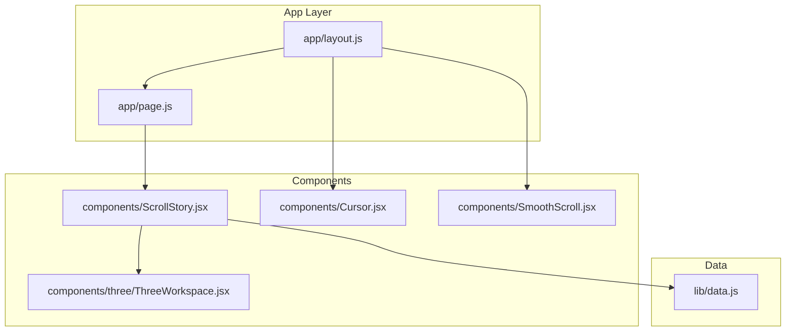

# Getting Started

<cite>
**Referenced Files in This Document**
- [README.md](file://README.md)
- [package.json](file://package.json)
- [next.config.mjs](file://next.config.mjs)
- [app/layout.js](file://app/layout.js)
- [app/page.js](file://app/page.js)
- [components/ScrollStory.jsx](file://components/ScrollStory.jsx)
- [lib/data.js](file://lib/data.js)
- [eslint.config.mjs](file://eslint.config.mjs)
</cite>

## Table of Contents
1. [Introduction](#introduction)
2. [Prerequisites](#prerequisites)
3. [Installation](#installation)
4. [Start the Development Server](#start-the-development-server)
5. [Project Structure Overview](#project-structure-overview)
6. [Development Workflow](#development-workflow)
7. [Common Issues and Troubleshooting](#common-issues-and-troubleshooting)
8. [First-Time Contributor Guide](#first-time-contributor-guide)
9. [Conclusion](#conclusion)

## Introduction
This guide helps you set up and run the Emaan Portfolio project locally, understand its structure, and begin contributing. The project is a Next.js application with interactive 3D elements and scroll-driven storytelling.

## Prerequisites
- Node.js (LTS recommended)
- npm or yarn (or pnpm/bun as supported by scripts)
- Basic familiarity with React and JavaScript
- A modern browser for viewing the app

Notes:
- The project uses Next.js and React dependencies defined in the package manifest.
- Scripts support multiple package managers; choose one consistently during development.

**Section sources**
- [package.json:1-29](file://package.json#L1-L29)
- [README.md:3-17](file://README.md#L3-L17)

## Installation
Follow these steps to install and prepare the project:

1. Clone the repository to your local machine.
2. Open a terminal in the project root.
3. Install dependencies using your preferred package manager:
   - npm: npm install
   - yarn: yarn install
   - pnpm: pnpm install
   - bun: bun install
4. Verify installation completed without errors.

What happens during install:
- All runtime and development dependencies are installed based on the project’s manifest.
- Next.js tooling and UI libraries are prepared for development.

**Section sources**
- [package.json:5-29](file://package.json#L5-L29)

## Start the Development Server
After installing dependencies:

1. Start the development server:
   - npm run dev
   - yarn dev
   - pnpm dev
   - bun dev
2. Open http://localhost:3000 in your browser to view the portfolio.
3. Edit files to see changes reflected automatically via hot reloading.

Additional notes:
- The root layout configures fonts and global wrappers around the page content.
- The home page includes a loading screen that transitions into the main interactive experience.

**Section sources**
- [README.md:3-17](file://README.md#L3-L17)
- [app/layout.js:1-55](file://app/layout.js#L1-L55)
- [app/page.js:1-60](file://app/page.js#L1-L60)

## Project Structure Overview
Key directories and their roles:

- app: Next.js App Router pages and layouts
  - layout.js: Root layout, metadata, and global wrappers
  - page.js: Home page entry with loading state and main content
- components: Reusable UI and feature modules
  - ScrollStory.jsx: Scroll-driven story container integrating GSAP and 3D workspace
  - three/*: 3D scene components powered by Three.js and React Three Fiber
  - Cursor.jsx, SmoothScroll.jsx: UX enhancements
- lib: Centralized data and utilities
  - data.js: Profile, education, experience, projects, skills
- public: Static assets served at the root path
- Configuration files:
  - next.config.mjs: Next.js configuration
  - eslint.config.mjs: Linting rules and ignores
  - postcss.config.mjs: PostCSS configuration (Tailwind integration)

How it fits together:
- The root layout sets up fonts and wraps children with smooth scrolling and cursor effects.
- The home page renders a brief loading screen before showing the scroll story.
- The scroll story composes text overlays and a 3D workspace, driven by GSAP animations.
- Data for sections is centralized in lib/data.js and consumed by components.

**Diagram sources**
- [app/layout.js:1-55](file://app/layout.js#L1-L55)
- [app/page.js:1-60](file://app/page.js#L1-L60)
- [components/ScrollStory.jsx:1-70](file://components/ScrollStory.jsx#L1-L70)
- [lib/data.js:1-181](file://lib/data.js#L1-L181)

**Section sources**
- [app/layout.js:1-55](file://app/layout.js#L1-L55)
- [app/page.js:1-60](file://app/page.js#L1-L60)
- [components/ScrollStory.jsx:1-70](file://components/ScrollStory.jsx#L1-L70)
- [lib/data.js:1-181](file://lib/data.js#L1-L181)

## Development Workflow
Recommended workflow for contributors:

- Run the dev server to iterate quickly.
- Edit components under components/ to update UI and interactions.
- Update content in lib/data.js to change profile, education, experience, projects, and skills.
- Use Tailwind CSS classes for styling; global styles live in app/globals.css.
- Configure Next.js behavior in next.config.mjs if needed.
- Lint code using the configured ESLint setup.

Typical tasks:
- Add a new section: create a component under components/sections/, then include it in the scroll story or relevant page.
- Update portfolio data: edit entries in lib/data.js.
- Adjust visuals: modify styles in app/globals.css or add Tailwind utility classes.

**Section sources**
- [package.json:5-10](file://package.json#L5-L10)
- [eslint.config.mjs:1-17](file://eslint.config.mjs#L1-L17)
- [lib/data.js:1-181](file://lib/data.js#L1-L181)
- [components/ScrollStory.jsx:1-70](file://components/ScrollStory.jsx#L1-L70)

## Common Issues and Troubleshooting
- Port already in use (3000):
  - Stop other processes using port 3000 or start the dev server on a different port by configuring environment variables as per Next.js docs.
- Dependencies not installed:
  - Ensure you ran the install command for your chosen package manager and that it completed successfully.
- Node version mismatch:
  - Use a Node.js LTS version compatible with the project’s dependencies.
- Build or lint errors:
  - Run the linter to identify issues and fix them before committing.
- Fonts or styles not loading:
  - Confirm the root layout imports global styles and font variables are applied.

If problems persist, check the terminal output for specific error messages and verify file paths and imports.

[No sources needed since this section provides general guidance]

## First-Time Contributor Guide
Before you start:
- Read through the project structure overview to locate where features live.
- Familiarize yourself with how data is organized in lib/data.js.

Suggested first tasks:
- Update profile information or social links in lib/data.js.
- Tweak copy or labels in the scroll story or home page.
- Improve accessibility or performance of existing components.

Workflow tips:
- Keep changes small and focused.
- Test locally by running the dev server after each change.
- Follow the existing code style and rely on Tailwind classes for styling.

[No sources needed since this section doesn't analyze specific files]

## Conclusion
You now have everything needed to install, run, and contribute to the Emaan Portfolio. Start by cloning the repo, installing dependencies, and launching the development server. Explore the components and data files to make meaningful updates, and use the troubleshooting tips to resolve common setup issues.

[No sources needed since this section summarizes without analyzing specific files]