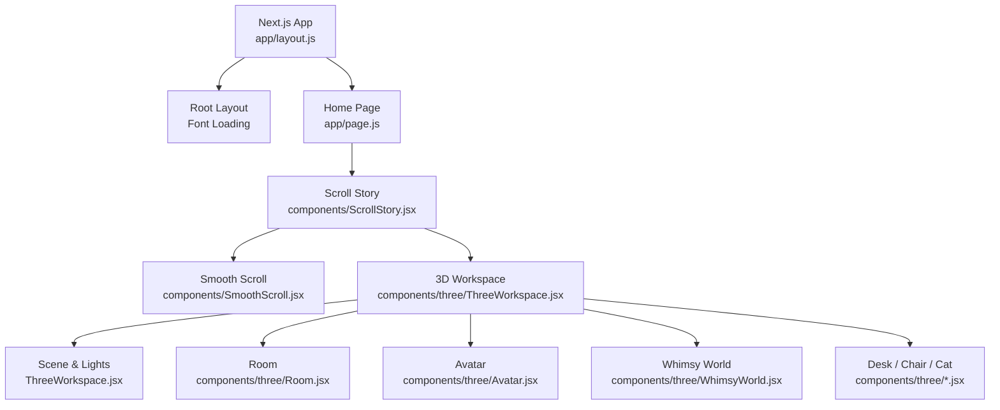
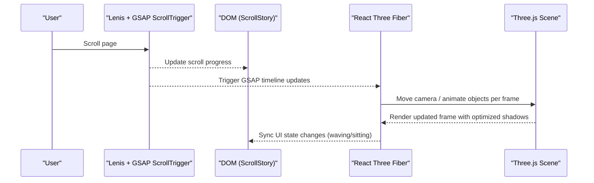
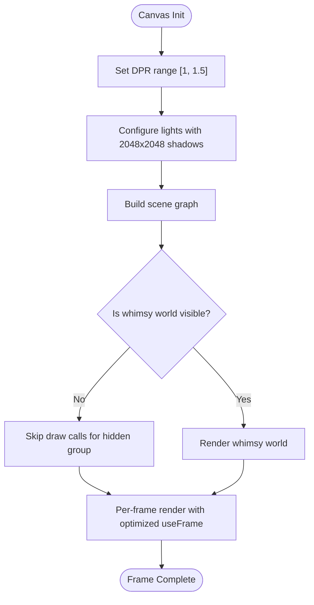
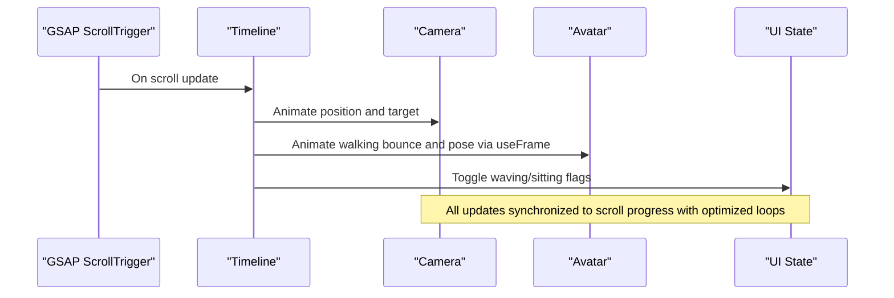
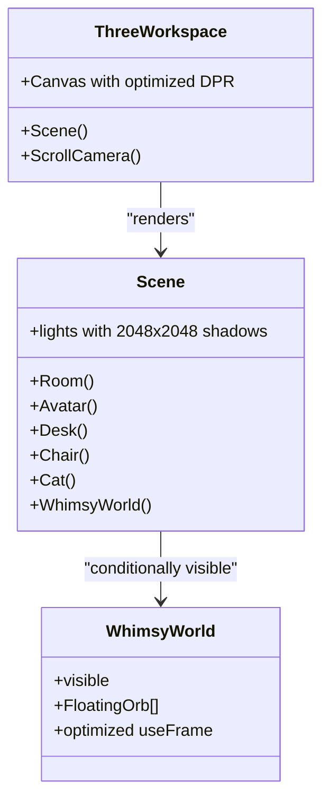
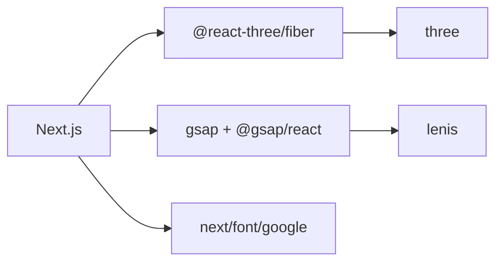

# Performance Optimization

<cite>
**Referenced Files in This Document**
- [ThreeWorkspace.jsx](file://components/three/ThreeWorkspace.jsx)
- [WhimsyWorld.jsx](file://components/three/WhimsyWorld.jsx)
- [Avatar.jsx](file://components/three/Avatar.jsx)
- [Room.jsx](file://components/three/Room.jsx)
- [Cat.jsx](file://components/three/Cat.jsx)
- [Desk.jsx](file://components/three/Desk.jsx)
- [SmoothScroll.jsx](file://components/SmoothScroll.jsx)
- [ScrollStory.jsx](file://components/ScrollStory.jsx)
- [layout.js](file://app/layout.js)
- [page.js](file://app/page.js)
- [package.json](file://package.json)
</cite>

## Update Summary
**Changes Made**
- Updated Three.js rendering optimizations with enhanced shadow mapping (2048x2048)
- Revised device pixel ratio configuration for improved performance
- Enhanced animation loop efficiency using optimized useFrame hooks
- Improved scroll-triggered animation performance with better GSAP integration
- Updated memory management strategies for 3D objects

## Table of Contents
1. Introduction
2. Project Structure
3. Core Components
4. Architecture Overview
5. Detailed Component Analysis
6. Dependency Analysis
7. Performance Considerations
8. Troubleshooting Guide
9. Conclusion
10. Appendices

## Introduction
This document explains the performance optimization strategies used throughout the portfolio application, focusing on 3D rendering with Three.js and React Three Fiber, animation performance with GSAP, memory management for 3D objects, bundle size considerations, and Next.js-specific optimizations such as code splitting, image optimization, and font loading. It also provides monitoring techniques, profiling tools, and best practices to maintain smooth performance across devices and browsers.

## Project Structure
The project is a Next.js application that renders a scroll-driven 3D scene using React Three Fiber and integrates GSAP animations for camera movement and UI transitions. Key areas impacting performance include:
- The 3D canvas configuration and scene composition
- Animation hooks and scroll-triggered updates
- Smooth scrolling integration
- Font loading via Next.js fonts
- Client-only components and lazy initialization patterns

**Diagram sources**
- [layout.js:1-55](file://app/layout.js#L1-L55)
- [page.js:1-66](file://app/page.js#L1-L66)
- [ScrollStory.jsx:1-70](file://components/ScrollStory.jsx#L1-L70)
- [SmoothScroll.jsx:1-47](file://components/SmoothScroll.jsx#L1-L47)
- [ThreeWorkspace.jsx:1-175](file://components/three/ThreeWorkspace.jsx#L1-L175)
- [Room.jsx:1-154](file://components/three/Room.jsx#L1-L154)
- [Avatar.jsx:1-223](file://components/three/Avatar.jsx#L1-L223)
- [WhimsyWorld.jsx:1-76](file://components/three/WhimsyWorld.jsx#L1-L76)
- [Desk.jsx:1-129](file://components/three/Desk.jsx#L1-L129)
- [Cat.jsx:1-59](file://components/three/Cat.jsx#L1-L59)

**Section sources**
- [layout.js:1-55](file://app/layout.js#L1-L55)
- [page.js:1-66](file://app/page.js#L1-L66)
- [ScrollStory.jsx:1-70](file://components/ScrollStory.jsx#L1-L70)
- [SmoothScroll.jsx:1-47](file://components/SmoothScroll.jsx#L1-L47)
- [ThreeWorkspace.jsx:1-175](file://components/three/ThreeWorkspace.jsx#L1-L175)

## Core Components
- **Enhanced Three.js Canvas and DPR**: The canvas uses an optimized device pixel ratio range of [1, 1.5] to balance visual quality and GPU load, reducing unnecessary pixel density on high-DPI screens.
- **Optimized Shadow Mapping**: Directional light shadows are configured with 2048x2048 resolution and precise camera bounds to avoid over-rendering while maintaining quality.
- **Selective Scene Updates**: Animations are driven by GSAP ScrollTrigger and efficient useFrame hooks only when needed; some groups are hidden until visible.
- **Efficient Geometry**: Simple box and plane geometries are reused via small helper components to reduce overhead.
- **Lightweight Materials**: Standard materials with minimal properties; basic materials used where shading is unnecessary.
- **Smooth Scrolling Integration**: Lenis is initialized once and tied to GSAP ticker for consistent frame pacing.
- **Font Loading**: Google Fonts loaded via Next.js fonts with subsets to minimize payload.

**Updated** Enhanced DPR settings and shadow mapping for improved performance

**Section sources**
- [ThreeWorkspace.jsx:157-175](file://components/three/ThreeWorkspace.jsx#L157-L175)
- [ThreeWorkspace.jsx:119-129](file://components/three/ThreeWorkspace.jsx#L119-L129)
- [WhimsyWorld.jsx:34-76](file://components/three/WhimsyWorld.jsx#L34-L76)
- [Room.jsx:1-154](file://components/three/Room.jsx#L1-L154)
- [Avatar.jsx:1-223](file://components/three/Avatar.jsx#L1-L223)
- [SmoothScroll.jsx:1-47](file://components/SmoothScroll.jsx#L1-L47)
- [layout.js:1-55](file://app/layout.js#L1-L55)

## Architecture Overview
The runtime flow combines scroll-driven UI animations with a 3D scene whose camera and objects move in sync. GSAP orchestrates both DOM and 3D transforms through ScrollTrigger, while React Three Fiber manages the render loop and scene graph with optimized animation loops.

**Diagram sources**
- [ScrollStory.jsx:13-34](file://components/ScrollStory.jsx#L13-L34)
- [ThreeWorkspace.jsx:23-98](file://components/three/ThreeWorkspace.jsx#L23-L98)
- [SmoothScroll.jsx:13-43](file://components/SmoothScroll.jsx#L13-L43)

## Detailed Component Analysis

### Enhanced 3D Rendering Optimizations
- **Optimized Device Pixel Ratio (DPR)**: The canvas uses a capped DPR range of [1, 1.5] to prevent excessive pixel density on high-DPI screens, significantly reducing GPU workload while maintaining acceptable sharpness.
- **Enhanced Shadow Configuration**: Shadows are enabled with optimized 2048x2048 shadow map size and precise camera bounds (-10 to 10) to avoid over-rendering while maintaining shadow quality.
- **Selective Visibility**: The whimsical world group becomes visible only after a scroll threshold, preventing unnecessary draw calls early in the experience.
- **Minimal Geometry**: Scenes rely on simple primitives (boxes, planes, circles) which are cheap to render and easy to batch.
- **Material Choices**: Basic materials are used for non-shaded elements; standard materials are limited to necessary meshes.

**Updated** Enhanced shadow mapping and reduced DPR settings for better performance

**Diagram sources**
- [ThreeWorkspace.jsx:157-175](file://components/three/ThreeWorkspace.jsx#L157-L175)
- [ThreeWorkspace.jsx:119-129](file://components/three/ThreeWorkspace.jsx#L119-L129)
- [WhimsyWorld.jsx:34-76](file://components/three/WhimsyWorld.jsx#L34-L76)

**Section sources**
- [ThreeWorkspace.jsx:119-175](file://components/three/ThreeWorkspace.jsx#L119-L175)
- [WhimsyWorld.jsx:1-76](file://components/three/WhimsyWorld.jsx#L1-L76)
- [Room.jsx:1-154](file://components/three/Room.jsx#L1-L154)

### Optimized Animation Performance Tuning with GSAP
- **Scroll-driven Timeline**: Camera and avatar movements are bound to scroll progress using ScrollTrigger with scrubbing for smooth, frame-synced motion.
- **State-driven Animations**: Avatar states (waving, sitting) are toggled based on scroll progress, minimizing per-frame logic.
- **Efficient useFrame Hooks**: All animated components use optimized useFrame hooks with delta time calculations for consistent performance across devices.
- **Ticker Integration**: Smooth scrolling uses GSAP's ticker to drive Lenis, ensuring consistent timing and reduced jank.
- **Reduced Motion Respect**: Smooth scroll duration adapts to user preferences for reduced motion.

**Updated** Enhanced animation loops with efficient useFrame hooks and better GSAP integration

**Diagram sources**
- [ThreeWorkspace.jsx:23-98](file://components/three/ThreeWorkspace.jsx#L23-L98)
- [ThreeWorkspace.jsx:102-113](file://components/three/ThreeWorkspace.jsx#L102-L113)
- [SmoothScroll.jsx:13-43](file://components/SmoothScroll.jsx#L13-L43)

**Section sources**
- [ThreeWorkspace.jsx:23-98](file://components/three/ThreeWorkspace.jsx#L23-L98)
- [ThreeWorkspace.jsx:102-113](file://components/three/ThreeWorkspace.jsx#L102-L113)
- [SmoothScroll.jsx:13-43](file://components/SmoothScroll.jsx#L13-L43)

### Enhanced Memory Management for 3D Objects
- **Reusable Helpers**: Small Box helpers encapsulate geometry and material creation to keep component trees lean.
- **Refs for Animated Parts**: Only animated subparts hold refs, avoiding unnecessary re-renders of entire hierarchies.
- **Conditional Rendering**: Groups like WhimsyWorld are hidden until needed, freeing resources during early scroll phases.
- **Cleanup**: Smooth scroll initializes once and cleans up event listeners and tickers on unmount.
- **Optimized Animation Loops**: useFrame hooks are efficiently implemented with proper delta time handling and conditional updates.

**Updated** Enhanced memory management with optimized animation loops and better resource cleanup

**Diagram sources**
- [ThreeWorkspace.jsx:98-175](file://components/three/ThreeWorkspace.jsx#L98-L175)
- [WhimsyWorld.jsx:34-76](file://components/three/WhimsyWorld.jsx#L34-L76)

**Section sources**
- [ThreeWorkspace.jsx:98-175](file://components/three/ThreeWorkspace.jsx#L98-L175)
- [WhimsyWorld.jsx:1-76](file://components/three/WhimsyWorld.jsx#L1-L76)
- [SmoothScroll.jsx:13-43](file://components/SmoothScroll.jsx#L13-L43)

### Bundle Size Optimization
- **Client Components**: 3D and animation-heavy components are marked as client components, enabling Next.js to split server and client bundles appropriately.
- **Library Usage**: Dependencies include GSAP, React Three Fiber, Drei, and Three.js; ensure only required features are imported to keep bundles lean.
- **No heavy textures or models**: The scene uses procedural geometry and colors, avoiding large asset downloads.

**Section sources**
- [ThreeWorkspace.jsx:1-175](file://components/three/ThreeWorkspace.jsx#L1-L175)
- [package.json:11-22](file://package.json#L11-L22)

### Next.js Specific Optimizations
- **Code Splitting**: Using "use client" directives ensures heavy interactive modules are split into client bundles.
- **Image Optimization**: While no images are currently used in the 3D scene, Next.js image optimization can be leveraged for any future assets via optimized imports.
- **Font Loading Strategies**: Google Fonts are loaded via Next.js fonts with subsets to reduce payload and improve first paint.

**Section sources**
- [layout.js:1-55](file://app/layout.js#L1-L55)
- [page.js:1-66](file://app/page.js#L1-L66)

## Dependency Analysis
Key runtime dependencies influencing performance:
- @react-three/fiber and three: Provide the 3D rendering pipeline and scene graph.
- gsap and @gsap/react: Drive scroll-based timelines and ticker integration.
- lenis: Provides smooth scrolling with efficient requestAnimationFrame usage.
- next: Framework-level code splitting and build-time optimizations.

**Diagram sources**
- [package.json:11-22](file://package.json#L11-L22)
- [layout.js:1-55](file://app/layout.js#L1-L55)

**Section sources**
- [package.json:11-22](file://package.json#L11-L22)
- [layout.js:1-55](file://app/layout.js#L1-L55)

## Performance Considerations
- **Optimized DPR Range**: Keep DPR capped at [1, 1.5] to avoid overdraw on high-DPI displays while maintaining visual quality.
- **Enhanced Shadow Costs**: Use moderate 2048x2048 shadow map sizes and limit shadow-casting to essential objects with precise camera bounds.
- **Visible-Only Rendering**: Hide offscreen or not-yet-needed groups to reduce draw calls.
- **Animation Efficiency**: Prefer GSAP ScrollTrigger scrubbing for deterministic updates; use efficient useFrame hooks with delta time calculations.
- **Smooth Scroll**: Respect prefers-reduced-motion and clean up tickers on unmount.
- **Fonts**: Load only needed subsets and variables to speed up initial paint.
- **Assets**: Prefer procedural geometry and small textures; defer heavy model loads until needed.
- **Code Splitting**: Mark heavy interactive sections as client components to isolate bundles.
- **Monitoring**: Use browser DevTools Performance panel and WebGL renderer stats to identify bottlenecks.

**Updated** Enhanced performance guidelines with specific DPR and shadow mapping recommendations

## Troubleshooting Guide
- **Stuttering on Scroll**: Ensure GSAP ScrollTrigger is updating correctly and Lenis ticker is active; verify scrub values are appropriate.
- **High GPU Usage**: Reduce DPR upper bound, lower shadow resolution, or hide complex scenes earlier.
- **Memory Leaks**: Confirm cleanup of Lenis instance and GSAP tickers on component unmount.
- **Slow Initial Load**: Audit client bundles; remove unused GSAP plugins or Three.js addons if present.
- **Font Flash**: Ensure Next.js font variables are applied to html/body classes to prevent layout shifts.
- **Shadow Performance Issues**: Verify shadow map size (2048x2048) is appropriate for target devices and adjust camera bounds as needed.

**Updated** Added troubleshooting guidance for enhanced shadow mapping performance

**Section sources**
- [SmoothScroll.jsx:13-43](file://components/SmoothScroll.jsx#L13-L43)
- [ThreeWorkspace.jsx:157-175](file://components/three/ThreeWorkspace.jsx#L157-L175)
- [ThreeWorkspace.jsx:119-129](file://components/three/ThreeWorkspace.jsx#L119-L129)

## Conclusion
The portfolio achieves smooth performance by combining conservative 3D settings (capped DPR [1, 1.5], enhanced 2048x2048 shadows), selective rendering (visibility toggles), efficient animations (GSAP ScrollTrigger with optimized useFrame hooks), and Next.js optimizations (client components, font loading). These strategies collectively reduce GPU load, minimize bundle size, and deliver responsive interactions across devices.

**Updated** Enhanced conclusion reflecting the latest performance optimizations

## Appendices

### Recommended Monitoring and Profiling
- Browser Performance Panel: Record interactions to spot long tasks and layout thrashing.
- WebGL Renderer Stats: Add a stats overlay to monitor FPS, draw calls, and triangle counts.
- Lighthouse: Evaluate performance budgets and opportunities for further optimization.
- Network Tab: Verify font and asset payloads; ensure proper caching headers.