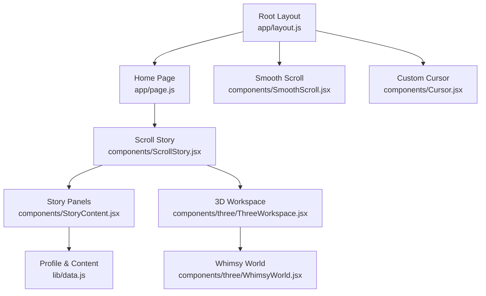
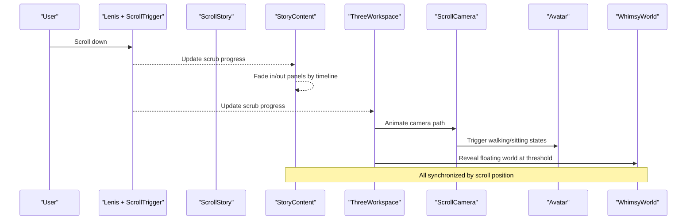
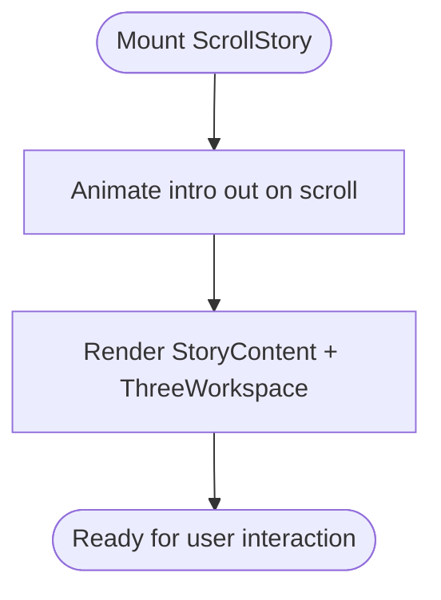
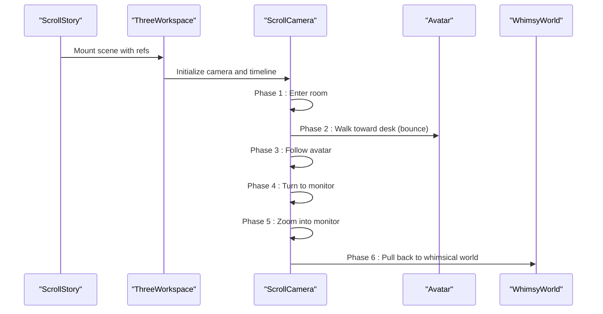
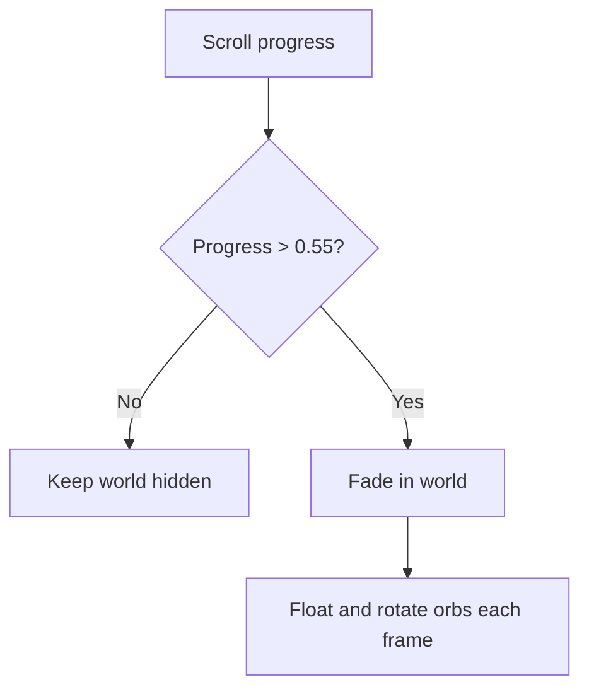
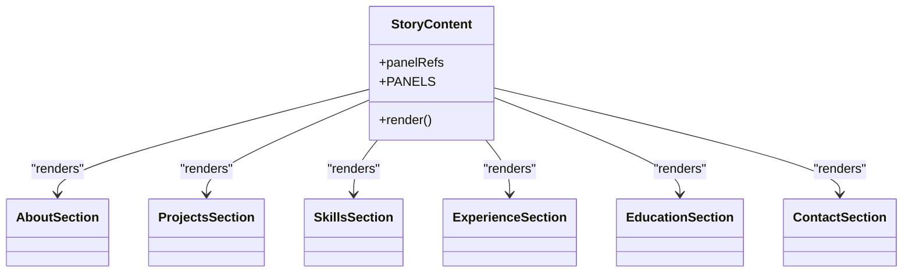
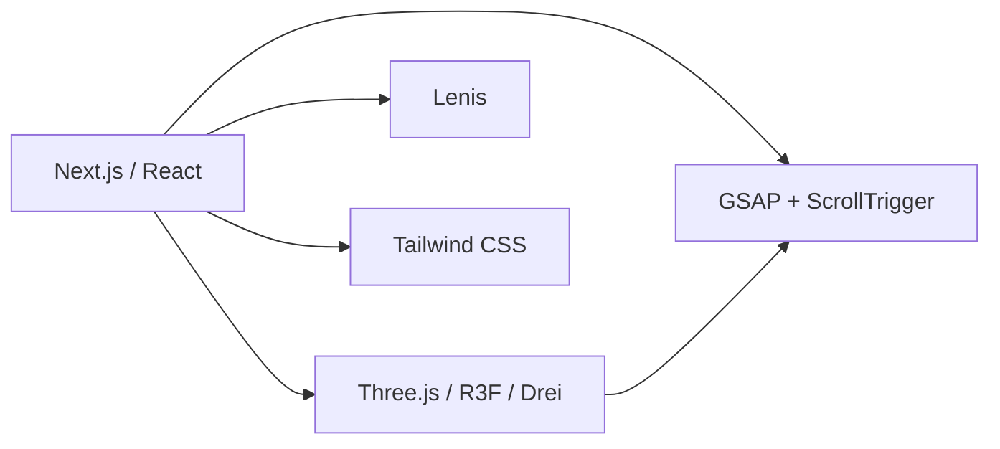

# Project Overview

<cite>
**Referenced Files in This Document**
- [README.md](file://README.md)
- [package.json](file://package.json)
- [app/layout.js](file://app/layout.js)
- [app/page.js](file://app/page.js)
- [app/globals.css](file://app/globals.css)
- [lib/data.js](file://lib/data.js)
- [components/ScrollStory.jsx](file://components/ScrollStory.jsx)
- [components/StoryContent.jsx](file://components/StoryContent.jsx)
- [components/three/ThreeWorkspace.jsx](file://components/three/ThreeWorkspace.jsx)
- [components/three/WhimsyWorld.jsx](file://components/three/WhimsyWorld.jsx)
- [components/Cursor.jsx](file://components/Cursor.jsx)
- [components/SmoothScroll.jsx](file://components/SmoothScroll.jsx)
- [components/sections/AboutSection.jsx](file://components/sections/AboutSection.jsx)
- [components/sections/ProjectsSection.jsx](file://components/sections/ProjectsSection.jsx)
</cite>

## Table of Contents
1. Introduction
2. Project Structure
3. Core Components
4. Architecture Overview
5. Detailed Component Analysis
6. Dependency Analysis
7. Performance Considerations
8. Troubleshooting Guide
9. Conclusion

## Introduction
Emaan Portfolio is an interactive, scroll-driven 3D portfolio website that tells a story through immersive environments and animated interactions. Built with Next.js and React, it uses Three.js for 3D rendering and GSAP ScrollTrigger to choreograph camera movement, character actions, and content reveals as users scroll. The experience showcases software engineering skills by combining modern web technologies into a cohesive narrative: a whimsical workspace where an avatar greets visitors, walks to a desk, focuses on a monitor, and then transitions into a colorful, floating world that frames the portfolio content.

The project targets recruiters, collaborators, clients, and anyone interested in Emaan’s work. It demonstrates practical abilities in frontend architecture, 3D scene composition, animation orchestration, responsive design, and data-driven content management.

## Project Structure
At a high level, the application follows a Next.js App Router layout with client components handling interactivity and animations. The root layout sets up fonts, metadata, smooth scrolling, and a custom cursor. The home page renders a loading screen followed by the main scroll story. A central scroll orchestrator composes 3D scenes and layered content panels that animate in sync with scroll position.

**Diagram sources**
- [app/layout.js:1-55](file://app/layout.js#L1-L55)
- [app/page.js:1-60](file://app/page.js#L1-L60)
- [components/ScrollStory.jsx:1-70](file://components/ScrollStory.jsx#L1-L70)
- [components/StoryContent.jsx:1-91](file://components/StoryContent.jsx#L1-L91)
- [components/three/ThreeWorkspace.jsx:1-186](file://components/three/ThreeWorkspace.jsx#L1-L186)
- [components/three/WhimsyWorld.jsx:1-76](file://components/three/WhimsyWorld.jsx#L1-L76)
- [components/SmoothScroll.jsx:1-47](file://components/SmoothScroll.jsx#L1-L47)
- [components/Cursor.jsx:1-111](file://components/Cursor.jsx#L1-L111)
- [lib/data.js:1-181](file://lib/data.js#L1-L181)

**Section sources**
- [app/layout.js:1-55](file://app/layout.js#L1-L55)
- [app/page.js:1-60](file://app/page.js#L1-L60)
- [components/ScrollStory.jsx:1-70](file://components/ScrollStory.jsx#L1-L70)
- [components/StoryContent.jsx:1-91](file://components/StoryContent.jsx#L1-L91)
- [components/three/ThreeWorkspace.jsx:1-186](file://components/three/ThreeWorkspace.jsx#L1-L186)
- [components/three/WhimsyWorld.jsx:1-76](file://components/three/WhimsyWorld.jsx#L1-L76)
- [components/SmoothScroll.jsx:1-47](file://components/SmoothScroll.jsx#L1-L47)
- [components/Cursor.jsx:1-111](file://components/Cursor.jsx#L1-L111)
- [lib/data.js:1-181](file://lib/data.js#L1-L181)

## Core Components
- Root layout: Configures global fonts, SEO metadata, smooth scrolling via Lenis, and a custom cursor overlay.
- Home page: Displays a themed loading screen with progress animation, then mounts the scroll story once loaded.
- Scroll story: Coordinates the hero intro fade-out and composes the 3D canvas and content overlays.
- 3D workspace: Renders a room, furniture, an avatar, and a whimsical background; animates camera and avatar based on scroll.
- Whimsy world: Adds floating platforms and orbs that appear during later stages of the scroll journey.
- Story panels: Overlay sections (About, Projects, Skills, Experience, Education, Contact) that fade in/out with scroll-triggered GSAP animations.
- Smooth scroll: Integrates Lenis with GSAP ScrollTrigger for buttery scrolling and consistent scrubbing behavior.
- Custom cursor: Provides a dot-and-ring pointer with hover states and touch-device detection.

Key features enabled by these components:
- Immersive 3D environment with lighting, shadows, and dynamic camera motion.
- Scroll-driven narrative that guides viewers through phases: enter room, walk to desk, focus on monitor, transition to whimsical world.
- Animated character interactions: avatar waves initially and sits later in the journey.
- Responsive content display: panels scale and reflow using Tailwind CSS utilities and responsive typography.

**Section sources**
- [app/layout.js:17-55](file://app/layout.js#L17-L55)
- [app/page.js:6-60](file://app/page.js#L6-L60)
- [components/ScrollStory.jsx:13-69](file://components/ScrollStory.jsx#L13-L69)
- [components/three/ThreeWorkspace.jsx:23-186](file://components/three/ThreeWorkspace.jsx#L23-L186)
- [components/three/WhimsyWorld.jsx:34-76](file://components/three/WhimsyWorld.jsx#L34-L76)
- [components/StoryContent.jsx:17-91](file://components/StoryContent.jsx#L17-L91)
- [components/SmoothScroll.jsx:10-47](file://components/SmoothScroll.jsx#L10-L47)
- [components/Cursor.jsx:20-111](file://components/Cursor.jsx#L20-L111)

## Architecture Overview
The application layers UI over a persistent Three.js canvas. Scroll events drive both 2D panel animations and 3D camera/avatar movements. Data is centralized in a single module and consumed by section components.

**Diagram sources**
- [components/ScrollStory.jsx:17-69](file://components/ScrollStory.jsx#L17-L69)
- [components/StoryContent.jsx:30-75](file://components/StoryContent.jsx#L30-L75)
- [components/three/ThreeWorkspace.jsx:23-98](file://components/three/ThreeWorkspace.jsx#L23-L98)
- [components/three/ThreeWorkspace.jsx:104-162](file://components/three/ThreeWorkspace.jsx#L104-L162)
- [components/three/WhimsyWorld.jsx:34-76](file://components/three/WhimsyWorld.jsx#L34-L76)
- [components/SmoothScroll.jsx:13-43](file://components/SmoothScroll.jsx#L13-L43)

## Detailed Component Analysis

### Scroll Story Orchestration
- Manages the hero intro fade-out and coordinates the 3D canvas and content overlays.
- Uses GSAP ScrollTrigger to animate the intro element as the user scrolls.

**Diagram sources**
- [components/ScrollStory.jsx:17-69](file://components/ScrollStory.jsx#L17-L69)

**Section sources**
- [components/ScrollStory.jsx:1-70](file://components/ScrollStory.jsx#L1-L70)

### 3D Workspace and Camera Choreography
- Sets up a Three.js Canvas with lighting, room, furniture, and avatar.
- Implements a ScrollCamera that moves the camera along a multi-phase path tied to scroll progress.
- Controls avatar state (waving, sitting) based on scroll thresholds.
- Reveals the whimsical world when the user reaches a specific scroll point.

**Diagram sources**
- [components/three/ThreeWorkspace.jsx:23-98](file://components/three/ThreeWorkspace.jsx#L23-L98)
- [components/three/ThreeWorkspace.jsx:104-162](file://components/three/ThreeWorkspace.jsx#L104-L162)

**Section sources**
- [components/three/ThreeWorkspace.jsx:1-186](file://components/three/ThreeWorkspace.jsx#L1-L186)

### Whimsical Background
- Adds floating platforms and animated orbs that become visible after a scroll threshold.
- Uses per-frame updates to rotate and float elements for a lively atmosphere.

**Diagram sources**
- [components/three/WhimsyWorld.jsx:34-76](file://components/three/WhimsyWorld.jsx#L34-L76)

**Section sources**
- [components/three/WhimsyWorld.jsx:1-76](file://components/three/WhimsyWorld.jsx#L1-L76)

### Story Panels and Content Sections
- Defines ordered panels (About, Projects, Skills, Experience, Education, Contact) with start/end scroll ranges.
- Animates each panel in and out using GSAP ScrollTrigger with opacity, translation, and scale.
- Sections consume shared data from a central module to render profile, projects, skills, and more.

**Diagram sources**
- [components/StoryContent.jsx:17-91](file://components/StoryContent.jsx#L17-L91)
- [components/sections/AboutSection.jsx:1-30](file://components/sections/AboutSection.jsx#L1-L30)
- [components/sections/ProjectsSection.jsx:1-43](file://components/sections/ProjectsSection.jsx#L1-L43)

**Section sources**
- [components/StoryContent.jsx:1-91](file://components/StoryContent.jsx#L1-L91)
- [components/sections/AboutSection.jsx:1-30](file://components/sections/AboutSection.jsx#L1-L30)
- [components/sections/ProjectsSection.jsx:1-43](file://components/sections/ProjectsSection.jsx#L1-L43)
- [lib/data.js:1-181](file://lib/data.js#L1-L181)

### Smooth Scrolling and Custom Cursor
- SmoothScroll integrates Lenis with GSAP ScrollTrigger to ensure consistent scrubbing across devices and respects reduced-motion preferences.
- Cursor provides a minimal dot and ring that reacts to hoverable elements and disables itself on touch devices.

**Section sources**
- [components/SmoothScroll.jsx:1-47](file://components/SmoothScroll.jsx#L1-L47)
- [components/Cursor.jsx:1-111](file://components/Cursor.jsx#L1-L111)

## Dependency Analysis
The project relies on a focused set of libraries to deliver its experience:
- Next.js and React for routing and component-based UI.
- Three.js with React Three Fiber/Drei for 3D rendering and helpers.
- GSAP and ScrollTrigger for timeline-based animations and scroll synchronization.
- Lenis for smooth scrolling.
- Framer Motion available in dependencies (not used in analyzed files).
- Tailwind CSS for styling.

**Diagram sources**
- [package.json:11-28](file://package.json#L11-L28)

**Section sources**
- [package.json:1-30](file://package.json#L1-L30)

## Performance Considerations
- Rendering budget: The 3D scene includes multiple lights and shadow maps. Adjusting DPR and shadow resolution can improve performance on lower-end devices.
- Animation efficiency: GSAP timelines are driven by scroll scrubbing; keep animations lightweight and avoid heavy per-frame computations.
- Scroll integration: Lenis reduces jank and improves perceived smoothness; ensure ScrollTrigger updates are bound to Lenis’ scroll events.
- Content visibility: Panels and the whimsical world are conditionally shown based on scroll thresholds to minimize unnecessary DOM and 3D updates.
- Accessibility: Respect prefers-reduced-motion to limit motion effects for users who prefer reduced motion.

[No sources needed since this section provides general guidance]

## Troubleshooting Guide
- Loading screen does not dismiss: Verify the timeout logic in the home page and ensure no unhandled errors prevent state updates.
- 3D scene not visible: Confirm the Canvas is mounted and that ScrollTrigger has access to the story container ref. Check browser console for WebGL errors.
- Camera or avatar not moving: Ensure the story ref is passed correctly to the 3D workspace and that ScrollTrigger is registered. Validate that the scroll container is the one triggering updates.
- Panels not animating: Confirm panel refs are populated and that ScrollTrigger scopes are correct. Check that the story container height allows enough scroll distance for the defined ranges.
- Smooth scroll conflicts: If native scroll interferes, verify Lenis initialization and that ScrollTrigger.update is called on Lenis’ scroll event.
- Cursor issues on mobile: The custom cursor is intentionally disabled on touch devices; rely on native pointers instead.

**Section sources**
- [app/page.js:6-60](file://app/page.js#L6-L60)
- [components/ScrollStory.jsx:13-69](file://components/ScrollStory.jsx#L13-L69)
- [components/three/ThreeWorkspace.jsx:23-98](file://components/three/ThreeWorkspace.jsx#L23-L98)
- [components/StoryContent.jsx:30-75](file://components/StoryContent.jsx#L30-L75)
- [components/SmoothScroll.jsx:13-43](file://components/SmoothScroll.jsx#L13-L43)
- [components/Cursor.jsx:20-72](file://components/Cursor.jsx#L20-L72)

## Conclusion
Emaan Portfolio combines a compelling narrative with modern web technologies to create an engaging, memorable showcase of software engineering capabilities. The scroll-driven 3D journey, animated character interactions, and responsive content panels demonstrate proficiency in React, Three.js, GSAP, and Tailwind CSS. This approach is well-suited for recruiters, collaborators, and clients seeking a distinctive way to explore skills, projects, and professional background.

[No sources needed since this section summarizes without analyzing specific files]