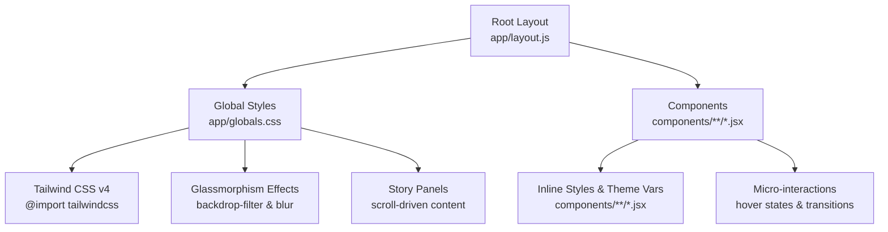
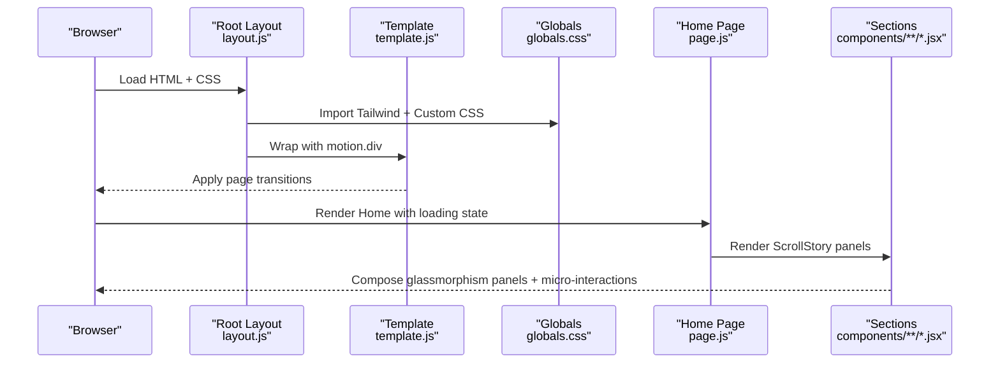
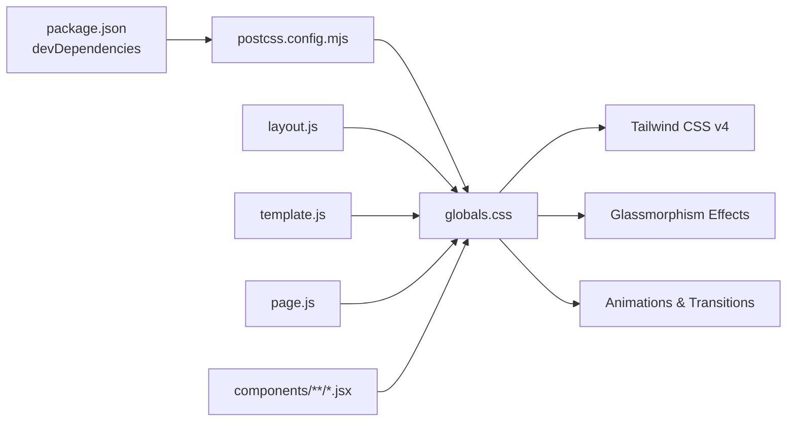

# Styling and Theming

<cite>
**Referenced Files in This Document**
- [globals.css](file://app/globals.css)
- [postcss.config.mjs](file://postcss.config.mjs)
- [package.json](file://package.json)
- [layout.js](file://app/layout.js)
- [page.js](file://app/page.js)
- [template.js](file://app/template.js)
- [AboutSection.jsx](file://components/sections/AboutSection.jsx)
- [ProjectsSection.jsx](file://components/sections/ProjectsSection.jsx)
- [SkillsSection.jsx](file://components/sections/SkillsSection.jsx)
- [Cursor.jsx](file://components/Cursor.jsx)
</cite>

## Update Summary
**Changes Made**
- Updated Global Styles Configuration section to reflect comprehensive glassmorphism effects and modern CSS features
- Enhanced Responsive Design Approaches section with detailed mobile breakpoint implementations
- Added new Story Panel Styling section documenting the extensive panel system
- Expanded Micro-Interactions section covering advanced animations and hover effects
- Updated Architecture Overview to include the new scroll-driven 3D story system
- Enhanced Performance Considerations with glassmorphism optimization guidelines

## Table of Contents
1. Introduction
2. Project Structure
3. Core Components
4. Architecture Overview
5. Detailed Component Analysis
6. Dependency Analysis
7. Performance Considerations
8. Troubleshooting Guide
9. Conclusion

## Introduction
This document explains the comprehensive styling system for the portfolio application, which combines Tailwind CSS v4 with an extensive custom stylesheet featuring over 800 lines of advanced CSS. The system includes sophisticated glassmorphism effects, responsive layouts, micro-interactions, story panel styling, and mobile-responsive breakpoints. It covers global styles configuration, utility class usage patterns, responsive design approaches, theme customization options, PostCSS processing, CSS-in-JS integration points within React components, and guidelines for maintaining consistency, creating reusable patterns, and optimizing bundle size.

## Project Structure
The styling system is centered around a comprehensive global stylesheet that imports Tailwind CSS v4 and defines the application's design tokens, animations, glassmorphism effects, and component-specific styles. The root layout injects fonts and applies base classes to html and body. Components use semantic class names for structure and inline styles for dynamic values like colors and positioning.

**Diagram sources**
- [layout.js:1-55](file://app/layout.js#L1-L55)
- [globals.css:1-28](file://app/globals.css#L1-L28)
- [globals.css:2064-2080](file://app/globals.css#L2064-L2080)

**Section sources**
- [layout.js:1-55](file://app/layout.js#L1-L55)
- [globals.css:1-28](file://app/globals.css#L1-L28)

## Core Components
- **Global stylesheet**: Defines CSS custom properties for colors and typography, comprehensive resets, glassmorphism effects, extensive UI styles including loading screen, hero sections, workspace scene, story panels, cards, and advanced animations.
- **Root layout**: Imports fonts via Next.js font loader and applies base classes to html/body; ensures full-height layout and antialiased text.
- **Page entry**: Renders a sophisticated loading screen using global classes and transitions to the main scroll-driven experience.
- **Template**: Implements Framer Motion animations for smooth page transitions.
- **Sections**: Use consistent panel classes and typography utilities to maintain visual coherence across About, Projects, Skills, etc.
- **Cursor**: Implements a custom tech confetti cursor with canvas-based particle effects and conditional rendering based on device capabilities.

Key responsibilities:
- Centralize design tokens in :root variables for consistent theming.
- Provide reusable panel and typography classes for content sections.
- Handle responsive behavior through media queries and clamp-based fluid typography.
- Implement glassmorphism effects with backdrop-filter for modern UI aesthetics.
- Integrate Tailwind CSS v4 via PostCSS for utility-first enhancements where needed.

**Section sources**
- [globals.css:1-28](file://app/globals.css#L1-L28)
- [globals.css:30-472](file://app/globals.css#L30-L472)
- [globals.css:2064-2080](file://app/globals.css#L2064-L2080)
- [globals.css:2886-2927](file://app/globals.css#L2886-L2927)
- [layout.js:1-55](file://app/layout.js#L1-L55)
- [page.js:1-66](file://app/page.js#L1-L66)
- [template.js:1-20](file://app/template.js#L1-L20)
- [AboutSection.jsx:1-30](file://components/sections/AboutSection.jsx#L1-L30)
- [ProjectsSection.jsx:1-43](file://components/sections/ProjectsSection.jsx#L1-L43)
- [SkillsSection.jsx:1-42](file://components/sections/SkillsSection.jsx#L1-L42)
- [Cursor.jsx:1-129](file://components/Cursor.jsx#L1-L129)

## Architecture Overview
The styling architecture blends utility-first and component-centric CSS with modern web technologies:
- Tailwind CSS v4 is imported at the top of globals.css, enabling utilities and modern features.
- Custom CSS provides domain-specific components, glassmorphism effects, animations, and responsive layouts.
- CSS variables act as the single source of truth for colors and fonts, allowing easy theme changes.
- Components compose semantic classes and inline styles for dynamic values.
- Scroll-driven storytelling system with sticky positioning and layered content.
- Canvas-based micro-interactions for enhanced user engagement.

**Diagram sources**
- [layout.js:1-55](file://app/layout.js#L1-L55)
- [template.js:1-20](file://app/template.js#L1-L20)
- [globals.css:1-28](file://app/globals.css#L1-L28)
- [page.js:1-66](file://app/page.js#L1-L66)
- [AboutSection.jsx:1-30](file://components/sections/AboutSection.jsx#L1-L30)
- [ProjectsSection.jsx:1-43](file://components/sections/ProjectsSection.jsx#L1-L43)
- [SkillsSection.jsx:1-42](file://components/sections/SkillsSection.jsx#L1-L42)

## Detailed Component Analysis

### Global Styles Configuration
- Design tokens are defined in :root for colors (blue, pink, orange, gold, lime), background (cream), and text color. Fonts are referenced via CSS variables injected by Next.js fonts.
- Base resets ensure consistent box-sizing and remove default margins/padding. Body uses cream background and text color from variables.
- Extensive animation keyframes define loading progress, sun float, pulse glow, sparkle, blink, grow stem/leaf, hero enter, terminal blink, and workspace arrow animations.
- Glassmorphism effects implemented with backdrop-filter blur and semi-transparent backgrounds for modern UI aesthetics.
- Responsive adjustments are applied via media queries for mobile scaling and typography.

Guidelines:
- Keep all brand colors in :root variables to simplify theme updates.
- Prefer clamp() for fluid typography to avoid excessive breakpoints.
- Group related animations and keep them scoped to specific components.
- Use backdrop-filter for glassmorphism effects with proper fallbacks.

**Section sources**
- [globals.css:1-28](file://app/globals.css#L1-L28)
- [globals.css:30-472](file://app/globals.css#L30-L472)
- [globals.css:2064-2080](file://app/globals.css#L2064-L2080)
- [globals.css:2886-2927](file://app/globals.css#L2886-L2927)

### Story Panel Styling System
The application features a comprehensive story panel system built with glassmorphism effects:
- **Panel Base**: Uses backdrop-filter blur with semi-transparent backgrounds and subtle borders for modern glass-like appearance.
- **Content Layers**: Implements sticky positioning for scroll-driven storytelling with layered content approach.
- **Typography**: Fluid typography using clamp() for responsive headings and body text.
- **Interactive Elements**: Hover effects with transform transitions and shadow enhancements.

Key panel components:
- `.story-panel`: Main container with glassmorphism styling
- `.panel-label`, `.panel-title`, `.panel-body`: Hierarchical typography system
- `.role-tags`, `.project-card`, `.skill-bloom`: Interactive element variants
- Grid layouts for projects and education sections

**Section sources**
- [globals.css:2064-2080](file://app/globals.css#L2064-L2080)
- [globals.css:2175-2284](file://app/globals.css#L2175-L2284)
- [globals.css:2289-2360](file://app/globals.css#L2289-L2360)
- [AboutSection.jsx:7-27](file://components/sections/AboutSection.jsx#L7-L27)
- [ProjectsSection.jsx:8-39](file://components/sections/ProjectsSection.jsx#L8-L39)
- [SkillsSection.jsx:7-38](file://components/sections/SkillsSection.jsx#L7-L38)

### Micro-Interactions and Animations
Advanced micro-interactions enhance user experience throughout the application:
- **Loading Screen**: Animated progress bar with gradient colors, floating sun with glow effects, and sprouting plant animations.
- **Hover Effects**: Project cards lift with enhanced shadows, skill blooms scale slightly, contact buttons elevate with shadow transitions.
- **Scroll Indicators**: Animated arrows with bounce effects guiding users through content.
- **Custom Cursor**: Tech confetti particle system using canvas with gravity physics and rotation effects.
- **Terminal Effects**: Blinking cursor and monospace typography for developer-focused aesthetics.

Animation categories:
- Entry animations: Hero enter, loading exit, fade-in effects
- Continuous animations: Sun float, sparkle twinkle, scroll bounce indicators
- Interactive animations: Hover lifts, scale transforms, shadow transitions
- Particle systems: Confetti cursor with physics simulation

**Section sources**
- [globals.css:34-472](file://app/globals.css#L34-L472)
- [globals.css:1112-1121](file://app/globals.css#L1112-L1121)
- [globals.css:1920-1935](file://app/globals.css#L1920-L1935)
- [globals.css:2871-2880](file://app/globals.css#L2871-L2880)
- [Cursor.jsx:53-104](file://components/Cursor.jsx#L53-L104)

### Responsive Design Approaches
Comprehensive responsive design implementation with multiple breakpoint strategies:
- **Fluid Typography**: Uses clamp() function for scalable headings and body text across all viewports.
- **Mobile-First Adjustments**: Media queries at 900px, 768px, and 480px breakpoints for progressive enhancement.
- **Touch Device Detection**: Disables custom cursor on coarse pointers and optimizes touch interactions.
- **Reduced Motion Support**: Respects prefers-reduced-motion for accessibility compliance.

Breakpoint behaviors:
- **900px**: Story intro repositioning, workspace scaling, avatar adjustments
- **768px**: Three.js intro optimization, panel width adjustments, grid layouts collapse
- **480px**: Compact panel padding, reduced tag sizes, optimized spacing

Accessibility features:
- Reduced motion preferences respected globally
- Touch device detection prevents unnecessary animations
- Semantic HTML structure supports screen readers

**Section sources**
- [globals.css:1127-1151](file://app/globals.css#L1127-L1151)
- [globals.css:1941-1977](file://app/globals.css#L1941-L1977)
- [globals.css:2964-3038](file://app/globals.css#L2964-L3038)
- [globals.css:2939-2958](file://app/globals.css#L2939-L2958)
- [Cursor.jsx:8-21](file://components/Cursor.jsx#L8-L21)

### Theme Customization Options
Extensive theme customization through CSS custom properties:
- **Color System**: Modify :root variables to update accent colors globally (--blue, --pink, --orange, --gold, --lime).
- **Background Management**: Change --cream to switch base backgrounds; extend with additional tokens for gradients.
- **Typography Control**: Adjust font variables set by Next.js fonts in layout.js to change typefaces site-wide.
- **Glassmorphism Parameters**: Customize backdrop-filter blur amounts and opacity levels for different themes.

Example patterns:
- Replace --pink with a different hue to shift emphasis across titles and accents.
- Add new variables like --accent-secondary and apply them in relevant components.
- Create dark mode by inverting --cream and adjusting text colors.
- Implement seasonal themes by swapping color palettes dynamically.

**Section sources**
- [globals.css:1-28](file://app/globals.css#L1-L28)
- [layout.js:7-15](file://app/layout.js#L7-L15)

### PostCSS Configuration for Processing Styles
Streamlined PostCSS configuration focused on Tailwind CSS v4 processing:
- **Plugin Setup**: @tailwindcss/postcss plugin configured for modern Tailwind features.
- **Minimal Pipeline**: No additional plugins present, keeping the build process fast and efficient.
- **Future-Ready**: Easy to extend with additional plugins like autoprefixer if needed.

Build implications:
- Tailwind utilities processed without separate config file requirements.
- Modern CSS features like backdrop-filter supported with appropriate browser targets.
- Optimized CSS output with unused style removal during build process.

**Section sources**
- [postcss.config.mjs:1-8](file://postcss.config.mjs#L1-L8)
- [package.json:23-28](file://package.json#L23-L28)

### CSS-in-JS Patterns Where Applicable
Strategic use of inline styles for dynamic values while maintaining separation of concerns:
- **Dynamic Colors**: Per-skill bloom colors passed as CSS custom properties for flexible theming.
- **Runtime Positioning**: Cursor canvas positioned absolutely with fixed viewport coverage.
- **Conditional Styling**: Touch device detection controls cursor visibility and behavior.
- **Performance Optimization**: Canvas-based animations bypass DOM manipulation for better performance.

Best practices demonstrated:
- Keep inline styles minimal and data-driven for maximum flexibility.
- Prefer CSS variables for theming over hard-coded inline values.
- Use CSS custom properties for runtime value injection when necessary.
- Leverage canvas for complex animations requiring high performance.

**Section sources**
- [SkillsSection.jsx:18-25](file://components/sections/SkillsSection.jsx#L18-L25)
- [Cursor.jsx:115-127](file://components/Cursor.jsx#L115-L127)

### Integration with React Components
Seamless integration between styling system and React component architecture:
- **Root Layout**: Sets up fonts and base classes, ensuring consistent typography and layout foundation.
- **Page Component**: Manages loading states with animated transitions and switches to main experience after initialization.
- **Template Layer**: Wraps content with Framer Motion for smooth page transitions and entrance animations.
- **Section Components**: Compose semantic classes to build panels, grids, and tags consistently across the application.

Component interaction flow:
- Layout loads fonts and wraps children with SmoothScroll and Cursor components.
- Page shows animated loading screen then mounts ScrollStory with progress indicator.
- Sections render content with consistent panel styles and interactive elements.
- Template provides motion-aware wrapper for route transitions.

**Section sources**
- [layout.js:40-55](file://app/layout.js#L40-L55)
- [page.js:7-66](file://app/page.js#L7-L66)
- [template.js:5-19](file://app/template.js#L5-L19)
- [AboutSection.jsx:5-28](file://components/sections/AboutSection.jsx#L5-L28)
- [ProjectsSection.jsx:6-40](file://components/sections/ProjectsSection.jsx#L6-L40)
- [SkillsSection.jsx:5-39](file://components/sections/SkillsSection.jsx#L5-L39)

## Dependency Analysis
Styling dependencies flow from configuration to runtime with clear separation of concerns:
- **Package Dependencies**: Tailwind CSS v4 and its PostCSS plugin declared in package.json.
- **Build Configuration**: postcss.config.mjs wires the plugin into the Next.js build pipeline.
- **Global Styles**: globals.css imports Tailwind and defines comprehensive custom styles.
- **Layout Integration**: layout.js imports globals.css and applies fonts and base classes.
- **Component Usage**: Components consume semantic classes and inline styles for dynamic behavior.

**Diagram sources**
- [package.json:23-28](file://package.json#L23-L28)
- [postcss.config.mjs:1-8](file://postcss.config.mjs#L1-L8)
- [globals.css:1-28](file://app/globals.css#L1-L28)
- [layout.js:1-55](file://app/layout.js#L1-L55)
- [template.js:1-20](file://app/template.js#L1-L20)
- [page.js:1-66](file://app/page.js#L1-L66)
- [AboutSection.jsx:1-30](file://components/sections/AboutSection.jsx#L1-L30)
- [ProjectsSection.jsx:1-43](file://components/sections/ProjectsSection.jsx#L1-L43)
- [SkillsSection.jsx:1-42](file://components/sections/SkillsSection.jsx#L1-L42)

**Section sources**
- [package.json:23-28](file://package.json#L23-L28)
- [postcss.config.mjs:1-8](file://postcss.config.mjs#L1-L8)
- [globals.css:1-28](file://app/globals.css#L1-L28)
- [layout.js:1-55](file://app/layout.js#L1-L55)

## Performance Considerations
Optimized performance strategies for the comprehensive styling system:
- **CSS Optimization**: Rely on Tailwind's purge/build-time optimization to include only used utilities and minimize bundle size.
- **Animation Efficiency**: Respect prefers-reduced-motion to reduce workload on low-power devices and improve battery life.
- **Glassmorphism Performance**: Use backdrop-filter judiciously as it can be computationally expensive; provide fallbacks for older browsers.
- **Canvas Optimization**: Efficient particle system with requestAnimationFrame and proper cleanup to prevent memory leaks.
- **Responsive Images**: Optimize images for different screen sizes and densities.
- **Bundle Splitting**: Separate critical styles for above-the-fold content and defer non-essential animations.

Additional optimizations:
- Use CSS variables for theming to prevent duplication and enable efficient updates.
- Prefer semantic classes to reduce reliance on large inline style objects.
- Keep global stylesheet organized and modularized by feature areas to aid maintenance.
- Implement lazy loading for heavy animations and off-screen content.
- Monitor performance metrics and optimize bottlenecks proactively.

## Troubleshooting Guide
Common issues and their resolutions for the advanced styling system:
- **Glassmorphism Not Working**: Ensure backdrop-filter is supported in target browsers and provide appropriate fallbacks. Check that parent containers have proper stacking contexts.
- **Animations Not Respecting Reduced Motion**: Verify media query targets all animated elements and overrides durations appropriately.
- **Custom Cursor Issues**: Confirm pointer detection logic works correctly and canvas cleanup occurs on component unmount.
- **Theme Colors Not Updating**: Ensure CSS variables are correctly referenced and not overridden by local styles or specificity conflicts.
- **Tailwind Utilities Not Applying**: Check PostCSS configuration and ensure the import is present in globals.css.
- **Mobile Responsiveness Problems**: Verify media query breakpoints align with design requirements and test on actual devices.
- **Performance Issues**: Monitor animation performance and consider reducing complexity or using will-change sparingly.

Debugging tips:
- Use browser dev tools to inspect computed styles and identify specificity conflicts.
- Test animations with reduced motion preferences enabled for accessibility compliance.
- Profile canvas animations to identify performance bottlenecks.
- Validate CSS custom property usage across different browsers for compatibility.

**Section sources**
- [globals.css:2939-2958](file://app/globals.css#L2939-L2958)
- [globals.css:2918-2933](file://app/globals.css#L2918-L2933)
- [Cursor.jsx:8-21](file://components/Cursor.jsx#L8-L21)
- [globals.css:1-28](file://app/globals.css#L1-L28)
- [postcss.config.mjs:1-8](file://postcss.config.mjs#L1-L8)

## Conclusion
The styling system combines Tailwind CSS v4 with an extensive custom stylesheet featuring glassmorphism effects, responsive layouts, micro-interactions, and scroll-driven storytelling to deliver a cohesive, accessible, and performant user interface. By centralizing design tokens, using semantic classes, leveraging modern CSS features, and implementing comprehensive responsive strategies, the application maintains consistency while supporting dynamic interactions and enhanced user experiences. Following the guidelines outlined here will help you extend the theme, create reusable patterns, optimize performance, and maintain the high-quality user interface as the project evolves.

The system demonstrates best practices in modern CSS architecture, including proper separation of concerns, performance optimization, accessibility considerations, and cross-browser compatibility strategies. The combination of utility-first and component-centric approaches provides both flexibility and maintainability for future development.