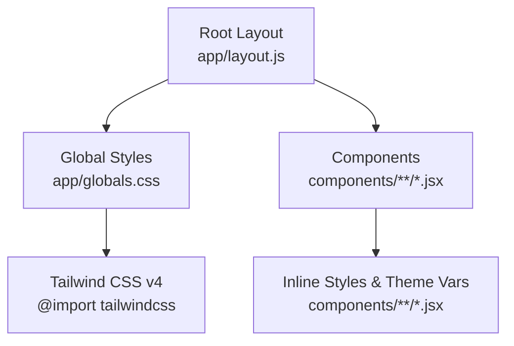
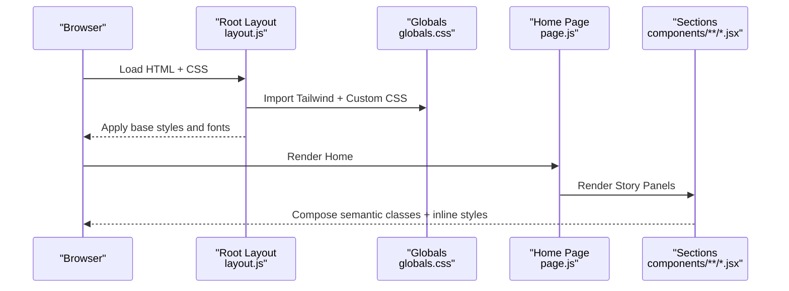
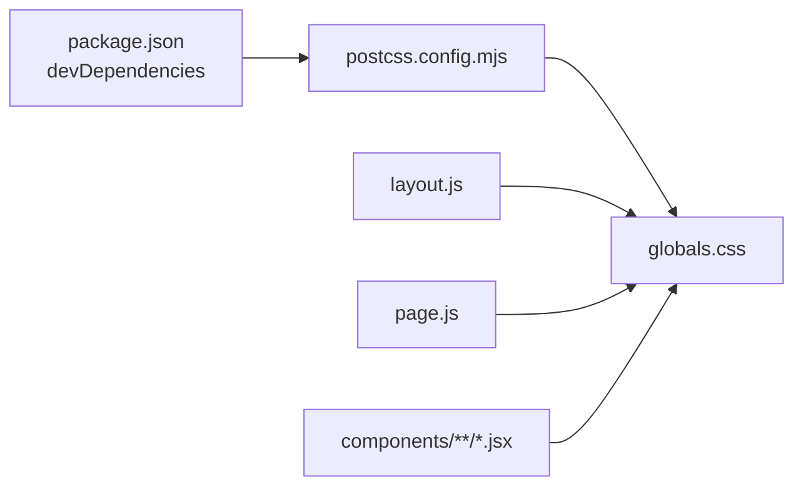

# Styling and Theming

<cite>
**Referenced Files in This Document**
- [globals.css](file://app/globals.css)
- [postcss.config.mjs](file://postcss.config.mjs)
- [package.json](file://package.json)
- [layout.js](file://app/layout.js)
- [page.js](file://app/page.js)
- [AboutSection.jsx](file://components/sections/AboutSection.jsx)
- [ProjectsSection.jsx](file://components/sections/ProjectsSection.jsx)
- [SkillsSection.jsx](file://components/sections/SkillsSection.jsx)
- [Cursor.jsx](file://components/Cursor.jsx)
</cite>

## Table of Contents
1. Introduction
2. Project Structure
3. Core Components
4. Architecture Overview
5. Detailed Component Analysis
6. Dependency Analysis
7. Performance Considerations
8. Troubleshooting Guide
9. Conclusion

## Introduction
This document explains the styling system for the portfolio application, which combines Tailwind CSS v4 with a comprehensive custom stylesheet. It covers global styles configuration, utility class usage patterns, responsive design approaches, theme customization options, PostCSS processing, CSS-in-JS integration points within React components, and guidelines for maintaining consistency, creating reusable patterns, and optimizing bundle size. It also includes practical examples such as custom themes, dark mode implementation strategies, and responsive breakpoints used across the project.

## Project Structure
The styling system is centered around a single global stylesheet that imports Tailwind CSS v4 and defines the application’s design tokens, animations, and component-specific styles. The root layout injects fonts and applies base classes to html and body. Components use a mix of semantic class names (e.g., story-panel, panel-title) and inline styles for dynamic values like colors.

**Diagram sources**
- [layout.js:1-55](file://app/layout.js#L1-L55)
- [globals.css:1-28](file://app/globals.css#L1-L28)

**Section sources**
- [layout.js:1-55](file://app/layout.js#L1-L55)
- [globals.css:1-28](file://app/globals.css#L1-L28)

## Core Components
- Global stylesheet: Defines CSS custom properties for colors and typography, resets, and extensive UI styles including loading screen, hero sections, workspace scene, panels, cards, and animations.
- Root layout: Imports fonts via Next.js font loader and applies base classes to html/body; ensures full-height layout and antialiased text.
- Page entry: Renders a loading screen using global classes and transitions to the main scroll-driven experience.
- Sections: Use consistent panel classes and typography utilities to maintain visual coherence across About, Projects, Skills, etc.
- Cursor: Implements a custom cursor with inline styles and conditional class toggles based on hover state.

Key responsibilities:
- Centralize design tokens in :root variables for consistent theming.
- Provide reusable panel and typography classes for content sections.
- Handle responsive behavior through media queries and clamp-based fluid typography.
- Integrate Tailwind CSS v4 via PostCSS for utility-first enhancements where needed.

**Section sources**
- [globals.css:1-28](file://app/globals.css#L1-L28)
- [globals.css:30-472](file://app/globals.css#L30-L472)
- [globals.css:473-1151](file://app/globals.css#L473-L1151)
- [globals.css:1152-1977](file://app/globals.css#L1152-L1977)
- [globals.css:1978-2200](file://app/globals.css#L1978-L2200)
- [globals.css:2845-2927](file://app/globals.css#L2845-L2927)
- [layout.js:1-55](file://app/layout.js#L1-L55)
- [page.js:1-60](file://app/page.js#L1-L60)
- [AboutSection.jsx:1-30](file://components/sections/AboutSection.jsx#L1-L30)
- [ProjectsSection.jsx:1-43](file://components/sections/ProjectsSection.jsx#L1-L43)
- [SkillsSection.jsx:1-42](file://components/sections/SkillsSection.jsx#L1-L42)
- [Cursor.jsx:1-111](file://components/Cursor.jsx#L1-L111)

## Architecture Overview
The styling architecture blends utility-first and component-centric CSS:
- Tailwind CSS v4 is imported at the top of globals.css, enabling utilities and modern features.
- Custom CSS provides domain-specific components, animations, and responsive layouts.
- CSS variables act as the single source of truth for colors and fonts, allowing easy theme changes.
- Components compose semantic classes and inline styles for dynamic values.

**Diagram sources**
- [layout.js:1-55](file://app/layout.js#L1-L55)
- [globals.css:1-28](file://app/globals.css#L1-L28)
- [page.js:1-60](file://app/page.js#L1-L60)
- [AboutSection.jsx:1-30](file://components/sections/AboutSection.jsx#L1-L30)
- [ProjectsSection.jsx:1-43](file://components/sections/ProjectsSection.jsx#L1-L43)
- [SkillsSection.jsx:1-42](file://components/sections/SkillsSection.jsx#L1-L42)

## Detailed Component Analysis

### Global Styles Configuration
- Design tokens are defined in :root for colors (blue, pink, orange, gold, lime), background (cream), and text color. Fonts are referenced via CSS variables injected by Next.js fonts.
- Base resets ensure consistent box-sizing and remove default margins/padding. Body uses cream background and text color from variables.
- Extensive animation keyframes define loading progress, sun float, pulse glow, sparkle, blink, grow stem/leaf, hero enter, and more.
- Responsive adjustments are applied via media queries for mobile scaling and typography.

Guidelines:
- Keep all brand colors in :root variables to simplify theme updates.
- Prefer clamp() for fluid typography to avoid excessive breakpoints.
- Group related animations and keep them scoped to specific components.

**Section sources**
- [globals.css:1-28](file://app/globals.css#L1-L28)
- [globals.css:30-472](file://app/globals.css#L30-L472)
- [globals.css:1127-1151](file://app/globals.css#L1127-L1151)
- [globals.css:1941-1977](file://app/globals.css#L1941-L1977)

### Utility Class Usage Patterns
- Components primarily use semantic class names (e.g., story-panel, panel-title, panel-body) for structure and readability.
- Inline styles are used for dynamic values such as per-skill colors or runtime positioning.
- Tailwind utilities can be leveraged alongside semantic classes when appropriate, but the project emphasizes cohesive, named classes for complex UI elements.

Recommendations:
- Favor semantic classes for reusable UI blocks.
- Use inline styles sparingly for data-driven values (e.g., skill colors).
- When adding new utilities, consider extracting them into named classes if they represent recurring patterns.

**Section sources**
- [AboutSection.jsx:1-30](file://components/sections/AboutSection.jsx#L1-L30)
- [ProjectsSection.jsx:1-43](file://components/sections/ProjectsSection.jsx#L1-L43)
- [SkillsSection.jsx:1-42](file://components/sections/SkillsSection.jsx#L1-L42)
- [Cursor.jsx:1-111](file://components/Cursor.jsx#L1-L111)

### Responsive Design Approaches
- Fluid typography via clamp() ensures scalable headings and body text across viewports.
- Media queries adjust layout and scale factors for smaller screens (e.g., scaling workspace elements, repositioning intro text).
- Touch detection disables custom cursor on coarse pointers to improve UX.

Breakpoints and behaviors:
- Mobile adjustments at max-width: 900px for story and workspace scenes.
- Reduced motion support via prefers-reduced-motion to disable animations for accessibility.

**Section sources**
- [globals.css:1127-1151](file://app/globals.css#L1127-L1151)
- [globals.css:1941-1977](file://app/globals.css#L1941-L1977)
- [globals.css:2886-2927](file://app/globals.css#L2886-L2927)
- [Cursor.jsx:5-18](file://components/Cursor.jsx#L5-L18)

### Theme Customization Options
- Colors: Modify :root variables to update accent colors globally (e.g., --pink, --blue, --gold).
- Typography: Adjust font variables set by Next.js fonts in layout.js to change typefaces site-wide.
- Backgrounds: Change --cream to switch base backgrounds; extend with additional tokens for gradients.

Example patterns:
- Replace --pink with a different hue to shift emphasis across titles and accents.
- Add a new variable like --accent-secondary and apply it in relevant components.

**Section sources**
- [globals.css:1-28](file://app/globals.css#L1-L28)
- [layout.js:1-15](file://app/layout.js#L1-L15)

### PostCSS Configuration for Processing Styles
- PostCSS plugin @tailwindcss/postcss is configured to process Tailwind CSS v4.
- No additional plugins are present, keeping the pipeline minimal and fast.

Implications:
- Tailwind utilities are available without a separate config file.
- Future extensions can add plugins (e.g., autoprefixer) if needed.

**Section sources**
- [postcss.config.mjs:1-8](file://postcss.config.mjs#L1-L8)
- [package.json:23-28](file://package.json#L23-L28)

### CSS-in-JS Patterns Where Applicable
- Inline styles are used for dynamic values like per-skill bloom colors and runtime cursor positioning.
- Conditional class toggles (e.g., cursor-ring--pointer) reflect interactive states.

Best practices:
- Keep inline styles minimal and data-driven.
- Prefer CSS variables for theming over hard-coded inline values.

**Section sources**
- [SkillsSection.jsx:16-26](file://components/sections/SkillsSection.jsx#L16-L26)
- [Cursor.jsx:74-108](file://components/Cursor.jsx#L74-L108)

### Integration with React Components
- Root layout sets up fonts and base classes, ensuring consistent typography and layout.
- Page component renders a loading screen using global classes and switches to the main experience after a timeout.
- Sections compose semantic classes to build panels, grids, and tags consistently.

Flow overview:
- Layout loads fonts and wraps children with SmoothScroll and Cursor.
- Page shows loading screen then mounts ScrollStory.
- Sections render content with consistent panel styles.

**Section sources**
- [layout.js:40-55](file://app/layout.js#L40-L55)
- [page.js:6-59](file://app/page.js#L6-L59)
- [AboutSection.jsx:5-28](file://components/sections/AboutSection.jsx#L5-L28)
- [ProjectsSection.jsx:6-40](file://components/sections/ProjectsSection.jsx#L6-L40)
- [SkillsSection.jsx:5-39](file://components/sections/SkillsSection.jsx#L5-L39)

## Dependency Analysis
Styling dependencies flow from configuration to runtime:
- package.json declares Tailwind CSS v4 and its PostCSS plugin.
- postcss.config.mjs wires the plugin into the build pipeline.
- globals.css imports Tailwind and defines custom styles.
- layout.js imports globals.css and applies fonts.
- Components consume semantic classes and inline styles.

**Diagram sources**
- [package.json:23-28](file://package.json#L23-L28)
- [postcss.config.mjs:1-8](file://postcss.config.mjs#L1-L8)
- [globals.css:1-28](file://app/globals.css#L1-L28)
- [layout.js:1-55](file://app/layout.js#L1-L55)
- [page.js:1-60](file://app/page.js#L1-L60)
- [AboutSection.jsx:1-30](file://components/sections/AboutSection.jsx#L1-L30)
- [ProjectsSection.jsx:1-43](file://components/sections/ProjectsSection.jsx#L1-L43)
- [SkillsSection.jsx:1-42](file://components/sections/SkillsSection.jsx#L1-L42)

**Section sources**
- [package.json:23-28](file://package.json#L23-L28)
- [postcss.config.mjs:1-8](file://postcss.config.mjs#L1-L8)
- [globals.css:1-28](file://app/globals.css#L1-L28)
- [layout.js:1-55](file://app/layout.js#L1-L55)

## Performance Considerations
- Minimize unused CSS: Rely on Tailwind’s purge/build-time optimization to include only used utilities.
- Avoid heavy animations on low-power devices: Respect prefers-reduced-motion to reduce workload.
- Use CSS variables for theming to prevent duplication and enable efficient updates.
- Prefer semantic classes to reduce reliance on large inline style objects.
- Keep global stylesheet organized and modularized by feature areas to aid maintenance and potential code splitting.

[No sources needed since this section provides general guidance]

## Troubleshooting Guide
Common issues and resolutions:
- Animations not respecting reduced motion: Ensure media query targets all animated elements and overrides durations.
- Custom cursor not hiding on touch devices: Verify pointer detection and conditional rendering logic.
- Theme colors not updating: Confirm CSS variables are correctly referenced and not overridden by local styles.
- Tailwind utilities not applying: Check PostCSS configuration and ensure the import is present in globals.css.

**Section sources**
- [globals.css:2886-2927](file://app/globals.css#L2886-L2927)
- [Cursor.jsx:5-18](file://components/Cursor.jsx#L5-L18)
- [globals.css:1-28](file://app/globals.css#L1-L28)
- [postcss.config.mjs:1-8](file://postcss.config.mjs#L1-L8)

## Conclusion
The styling system combines Tailwind CSS v4 with a robust custom stylesheet to deliver a cohesive, accessible, and performant user interface. By centralizing design tokens, using semantic classes, and leveraging responsive techniques, the application maintains consistency while supporting dynamic interactions. Following the guidelines outlined here will help you extend the theme, create reusable patterns, and optimize performance as the project evolves.

[No sources needed since this section summarizes without analyzing specific files]